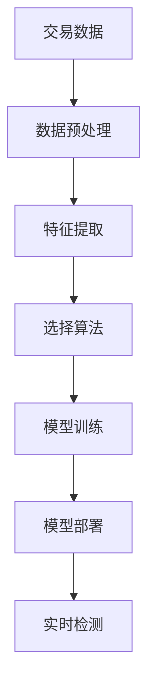

                 


# 构建智能企业风控系统：实时交易监控与欺诈检测

## 关键词：智能风控系统、实时交易监控、欺诈检测、监督学习、无监督学习、时间序列分析

## 摘要：
随着企业数字化转型的深入，智能风控系统在实时交易监控和欺诈检测中的应用变得至关重要。本文将详细探讨智能企业风控系统的构建过程，包括实时交易监控和欺诈检测的核心概念、算法原理、系统架构设计以及项目实战。通过结合监督学习、无监督学习和时间序列分析等算法，本文将为企业提供一套高效、可靠的风控解决方案。

---

## 第一章: 智能企业风控系统背景与概述

### 1.1 企业风控系统的重要性
- **1.1.1 企业风控的核心概念**  
  - 定义：企业风控系统通过分析交易数据，识别潜在风险并采取措施以降低损失。
  - 目标：保护企业资产、维护客户信任、确保合规性。

- **1.1.2 传统风控与智能风控的对比**  
  - 传统风控：依赖规则和人工审核，效率低、覆盖面有限。
  - 智能风控：利用机器学习和大数据技术，实现自动化、实时化和精准化。

- **1.1.3 智能风控对企业价值的提升**  
  - 提高风险识别能力。
  - 优化业务流程，降低运营成本。
  - 增强客户信任，提升企业声誉。

### 1.2 实时交易监控与欺诈检测的必要性
- **1.2.1 实时交易监控的定义与目标**  
  - 定义：实时监控交易活动，识别异常行为。
  - 目标：快速响应风险，防止损失扩大。

- **1.2.2 欺诈检测的定义与挑战**  
  - 定义：通过分析交易数据，识别欺诈行为。
  - 挑战：数据多样性、攻击者不断变化的手段。

- **1.2.3 智能风控系统的应用场景**  
  - 金融行业：信用卡欺诈、交易洗钱。
  - 零售行业：在线支付欺诈、退货欺诈。
  - 企业内部：员工滥用系统、数据泄露。

### 1.3 智能风控系统的边界与外延
- **1.3.1 系统的边界定义**  
  - 输入：交易数据、用户行为数据。
  - 输出：风险评估结果、欺诈标记。

- **1.3.2 系统的外延范围**  
  - 数据来源：日志文件、数据库、API调用。
  - 数据处理：清洗、转换、特征提取。

- **1.3.3 系统的核心要素组成**  
  - 数据采集模块：实时获取交易数据。
  - 数据处理模块：清洗和预处理数据。
  - 模型训练模块：训练监督学习和无监督学习模型。
  - 实时监控模块：部署模型，实时检测风险。

### 1.4 本章小结
本章介绍了智能企业风控系统的背景、重要性以及其实时交易监控和欺诈检测的核心概念。通过对比传统风控与智能风控，强调了智能风控在企业中的价值和应用场景。

---

## 第二章: 实时交易监控与欺诈检测的核心概念

### 2.1 实时交易监控的原理与实现
- **2.1.1 实时交易监控的定义**  
  - 实时交易监控是指在交易发生时，立即分析交易数据，识别潜在风险。

- **2.1.2 监控的主要指标与维度**  
  - 指标：交易金额、频率、地点、设备信息。
  - 维度：时间、用户行为、交易类型。

- **2.1.3 监控数据的采集与处理**  
  - 数据采集：日志文件、数据库、API接口。
  - 数据处理：清洗、转换、特征提取。

### 2.2 欺诈检测的原理与实现
- **2.2.1 欺诈检测的定义**  
  - 欺诈检测是通过分析交易数据，识别欺诈行为的过程。

- **2.2.2 常见的欺诈类型与特征**  
  - 欺诈类型：信用卡欺诈、交易洗钱、虚假交易。
  - 欺诈特征：高交易频率、异常金额、非正常时间交易。

- **2.2.3 欺诈检测的流程与方法**  
  - 数据预处理：清洗、标准化。
  - 特征工程：提取关键特征。
  - 模型选择：监督学习（如逻辑回归、随机森林）、无监督学习（如聚类、异常检测）。

### 2.3 实时交易监控与欺诈检测的关系
- **2.3.1 两者的协同作用**  
  - 实时监控为欺诈检测提供实时数据。
  - 欺诈检测为监控提供风险评估结果。

- **2.3.2 数据共享与整合**  
  - 数据共享：实时监控模块和欺诈检测模块共用数据。
  - 数据整合：特征提取和模型训练需要结合多维度数据。

- **2.3.3 系统设计的统一性与差异性**  
  - 统一性：两者都基于交易数据进行分析。
  - 差异性：实时监控注重实时性，欺诈检测注重准确性。

### 2.4 核心概念的ER实体关系图
```mermaid
er
actor: User
actor: Transaction
actor: FraudPattern
actor: MonitoringRule
```

### 2.5 本章小结
本章详细探讨了实时交易监控和欺诈检测的核心概念，分析了它们的原理、实现方法和相互关系。通过ER图展示了系统的核心实体关系。

---

## 第三章: 智能企业风控系统的算法原理

### 3.1 监督学习在风控中的应用
- **3.1.1 分类算法（如逻辑回归、随机森林）**  
  - 逻辑回归：用于分类，输出概率。
  - 随机森林：用于特征重要性分析和分类。

- **3.1.2 回归算法（如线性回归）**  
  - 用于预测连续值，如交易金额预测。

- **3.1.3 支持向量机（SVM）在风控中的应用**  
  - 用于分类，尤其适用于高维数据。

### 3.2 无监督学习在风控中的应用
- **3.2.1 聚类算法（如K-means）**  
  - 用于将交易分为正常和异常类别。

- **3.2.2 异常检测算法（如Isolation Forest）**  
  - 用于检测异常交易，无须标签数据。

- **3.2.3 邻近传播算法（LoF）**  
  - 用于密度异常点检测。

### 3.3 时间序列分析在实时监控中的应用
- **3.3.1 ARIMA模型**  
  - 用于预测未来交易行为。

- **3.3.2 LST**  
  - 长短期记忆网络，用于处理序列数据。

### 3.4 算法流程图


### 3.5 本章小结
本章介绍了监督学习、无监督学习和时间序列分析在风控中的应用，分析了各种算法的优缺点，并给出了算法流程图。

---

## 第四章: 智能企业风控系统的系统架构设计

### 4.1 问题场景介绍
- **交易监控与欺诈检测的场景**  
  - 实时监控交易，识别欺诈行为，防止损失。

### 4.2 项目介绍
- **项目目标**  
  - 构建一个实时交易监控和欺诈检测系统。

### 4.3 系统功能设计
- **领域模型（类图）**  
  ```mermaid
  classDiagram
  class Transaction {
    id: string
    amount: number
    time: datetime
    user_id: string
  }
  class User {
    id: string
    name: string
    role: string
  }
  class FraudPattern {
    pattern_id: string
    description: string
    threshold: number
  }
  class MonitoringRule {
    rule_id: string
    condition: string
    action: string
  }
  ```

### 4.4 系统架构设计
- **架构图**  
  ```mermaid
  box{
    系统架构设计
    API Gateway --> 数据库
    数据采集模块 --> 数据处理模块
    数据处理模块 --> 模型训练模块
    模型训练模块 --> 实时监控模块
  }
  ```

### 4.5 系统接口设计
- **接口设计**  
  - 数据接口：REST API。
  - 监控接口：WebSocket实时推送。

### 4.6 系统交互设计
- **交互序列图**  
  ```mermaid
  sequenceDiagram
  用户 --> 数据采集模块: 发起交易
  数据采集模块 --> 数据处理模块: 传输交易数据
  数据处理模块 --> 模型训练模块: 提交数据
  模型训练模块 --> 实时监控模块: 返回风险评估结果
  实时监控模块 --> 用户: 返回欺诈标记
  ```

### 4.7 本章小结
本章通过系统架构设计、接口设计和交互设计，展示了智能企业风控系统的整体架构和实现过程。

---

## 第五章: 项目实战

### 5.1 环境安装
- **安装Python和相关库**  
  - 安装：`pip install numpy pandas scikit-learn`

### 5.2 核心代码实现
- **监督学习模型实现（逻辑回归）**  
  ```python
  from sklearn.linear_model import LogisticRegression
  model = LogisticRegression()
  model.fit(X_train, y_train)
  ```

- **无监督学习模型实现（Isolation Forest）**  
  ```python
  from sklearn.ensemble import IsolationForest
  model = IsolationForest(n_estimators=100)
  model.fit(X_train)
  ```

### 5.3 案例分析
- **欺诈交易检测案例**  
  - 数据集：信用卡交易数据。
  - 模型训练：使用逻辑回归和Isolation Forest进行训练。
  - 检测结果：标记欺诈交易。

### 5.4 本章小结
本章通过实际案例展示了智能企业风控系统的实现过程，包括环境安装、代码实现和案例分析。

---

## 第六章: 最佳实践与注意事项

### 6.1 最佳实践
- **数据质量**  
  - 确保数据的完整性和准确性。

- **模型调优**  
  - 使用交叉验证优化模型参数。

### 6.2 注意事项
- **模型解释性**  
  - 确保模型可解释，便于排查问题。

- **实时性与延迟**  
  - 优化系统性能，降低延迟。

### 6.3 拓展阅读
- **推荐书籍**  
  - 《机器学习实战》
  - 《数据挖掘导论》

### 6.4 本章小结
本章总结了智能企业风控系统在实际应用中的最佳实践和注意事项，并给出了拓展阅读的建议。

---

## 结语
通过本文的详细讲解，读者可以全面了解智能企业风控系统的构建过程，包括实时交易监控和欺诈检测的核心概念、算法原理、系统架构设计以及项目实战。希望本文能为企业的风控体系建设提供有价值的参考和指导。

