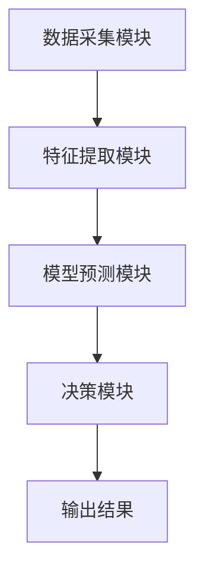
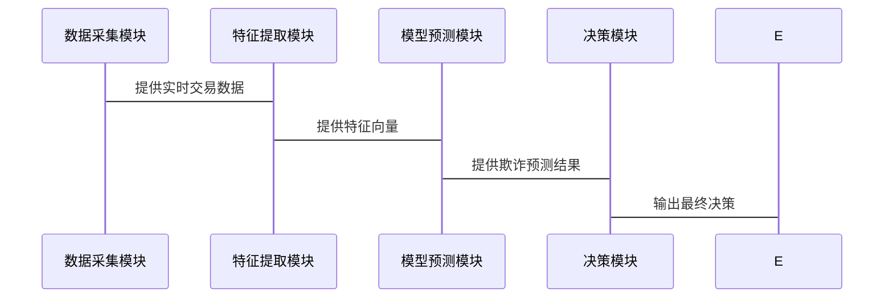

                 


# 《构建智能企业风控系统：实时交易监控与欺诈检测的AI增强》

---

## 关键词：
- 智能风控系统
- 实时交易监控
- 欺诈检测
- AI增强
- 监督学习
- 无监督学习
- 系统架构

---

## 摘要：
本文详细探讨了如何构建智能企业风控系统，特别是在实时交易监控和欺诈检测中应用AI技术。通过分析欺诈行为的多样性和实时监控的挑战，本文介绍了监督学习和无监督学习的核心原理，并通过实际案例展示了系统的架构设计和优化策略。最终，本文总结了构建智能风控系统的最佳实践，并展望了未来的发展方向。

---

# 第1章: 企业风控的重要性

## 1.1 传统风控系统的局限性
传统风控系统主要依赖规则引擎和静态数据分析，存在以下问题：
- **规则引擎的不足**：规则难以覆盖所有可能的欺诈行为，且规则更新较慢。
- **静态数据分析**：无法实时捕捉交易中的异常行为，导致延迟和遗漏。
- **高误报率**：传统系统容易将正常交易误认为欺诈，影响用户体验。

## 1.2 实时交易监控的必要性
### 1.2.1 实时监控的核心目标
- 快速识别异常交易行为。
- 最小化欺诈行为的损失。
- 提高交易处理效率。

### 1.2.2 欺诈检测的挑战
- 欺诈手段多样化，传统规则难以应对。
- 数据量大，实时处理要求高。
- 模型需要动态更新，以适应新的欺诈模式。

## 1.3 AI技术在企业风控中的作用
AI技术通过以下方式增强企业风控能力：
- **自动化特征工程**：从海量数据中提取关键特征。
- **实时预测**：利用机器学习模型快速判断交易合法性。
- **动态模型更新**：根据最新数据优化模型性能。

---

# 第2章: 欺诈检测与实时监控的背景

## 2.1 欺诈行为的多样性
- **交易欺诈**：虚假交易、重复交易。
- **身份欺诈**：盗用他人身份进行交易。
- **信用欺诈**：骗取企业信用额度。

## 2.2 实时监控的技术挑战
- **数据流处理**：需要实时处理高速数据流。
- **高并发环境**：系统需要在高并发下稳定运行。
- **模型更新**：模型需要动态更新，以应对新的欺诈手段。

## 2.3 AI技术的应用场景
- **在线支付平台**：实时监控交易行为，防止欺诈。
- **金融行业**：检测异常交易，防范金融犯罪。
- **电子商务平台**：保护消费者和商家免受欺诈侵害。

---

# 第3章: AI在企业风控中的应用原理

## 3.1 监督学习在欺诈检测中的应用

### 3.1.1 监督学习的基本原理
监督学习通过训练数据，学习输入特征与目标标签之间的关系，从而实现分类或回归任务。

#### 3.1.1.1 核心概念
- **特征**：输入数据的属性，例如交易金额、时间、用户IP等。
- **标签**：目标变量，例如是否欺诈（0或1）。

### 3.1.2 常见的监督学习算法
- **逻辑回归**：适用于二分类问题，如欺诈检测。
- **随机森林**：基于树的集成方法，适合特征较多的情况。
- **支持向量机（SVM）**：适用于高维数据的分类。

### 3.1.3 监督学习的实现流程
1. 数据预处理：清洗数据，处理缺失值和异常值。
2. 特征工程：提取关键特征，如交易金额、时间间隔等。
3. 模型训练：使用训练数据训练模型。
4. 模型评估：通过准确率、召回率等指标评估模型性能。
5. 模型部署：将模型集成到实时监控系统中。

#### 3.1.3.1 示例代码
```python
from sklearn.linear_model import LogisticRegression

# 数据预处理
X_train, y_train = preprocess_data()

# 模型训练
model = LogisticRegression()
model.fit(X_train, y_train)

# 模型预测
y_pred = model.predict(X_test)
```

## 3.2 无监督学习在实时监控中的应用

### 3.2.1 无监督学习的基本原理
无监督学习通过分析数据的内在结构，发现异常或潜在的模式。

### 3.2.2 常见的无监督学习算法
- **K-Means**：聚类算法，适用于客户分群。
- **DBSCAN**：密度聚类，适用于异常点检测。
- **Isolation Forest**：专门用于异常检测的树模型。

### 3.2.3 无监督学习的实现流程
1. 数据预处理：清洗数据，标准化特征。
2. 模型训练：使用无监督算法训练模型。
3. 异常检测：识别数据中的异常点。
4. 模型优化：调整参数，提高检测准确率。

#### 3.2.3.1 示例代码
```python
from sklearn.cluster import DBSCAN

# 数据预处理
X = normalize_data()

# 模型训练
model = DBSCAN(eps=0.5, min_samples=5)
model.fit(X)

# 异常检测
outliers = model.labels_ == -1
```

---

# 第4章: 智能风控系统的架构设计

## 4.1 系统需求分析
- **实时性**：毫秒级响应。
- **高可用性**：系统需具备容错和自我修复能力。
- **可扩展性**：支持数据量的快速增长。

## 4.2 系统架构设计

### 4.2.1 功能模块设计
- **数据采集模块**：实时采集交易数据。
- **特征提取模块**：提取交易特征，如金额、时间、用户行为等。
- **模型预测模块**：利用AI模型进行欺诈检测。
- **决策模块**：根据预测结果，决定是否放行交易。

### 4.2.2 系统架构图


## 4.3 系统接口设计
- **输入接口**：实时交易数据接口。
- **输出接口**：欺诈检测结果接口。

## 4.4 系统交互流程


---

# 第5章: 项目实战

## 5.1 环境安装与配置
- **Python版本**：Python 3.8以上。
- **依赖库**：scikit-learn、pandas、numpy、mermaid。

## 5.2 案例分析与代码实现

### 5.2.1 案例一：欺诈检测实战

#### 5.2.1.1 数据预处理
```python
import pandas as pd
import numpy as np

# 读取数据
df = pd.read_csv('fraud_data.csv')

# 处理缺失值
df = df.dropna()

# 标准化特征
from sklearn.preprocessing import StandardScaler
scaler = StandardScaler()
X = scaler.fit_transform(df.drop('is_fraud', axis=1))
y = df['is_fraud']
```

#### 5.2.1.2 模型训练与评估
```python
from sklearn.model_selection import train_test_split
from sklearn.metrics import accuracy_score, recall_score

# 划分训练集和测试集
X_train, X_test, y_train, y_test = train_test_split(X, y, test_size=0.2)

# 模型训练
from sklearn.ensemble import RandomForestClassifier
model = RandomForestClassifier(n_estimators=100)
model.fit(X_train, y_train)

# 模型预测
y_pred = model.predict(X_test)

# 模型评估
print('Accuracy:', accuracy_score(y_test, y_pred))
print('Recall:', recall_score(y_test, y_pred))
```

### 5.2.2 案例二：实时交易监控实战

#### 5.2.2.1 实时数据流处理
```python
from kafka import KafkaConsumer
import json

# 消费者配置
bootstrap_servers = 'localhost:9092'
topic_name = 'transaction_stream'

# 初始化消费者
consumer = KafkaConsumer(topic_name, bootstrap_servers=bootstrap_servers)

# 实时处理数据
for message in consumer:
    transaction = json.loads(message.value)
    # 提取特征
    features = extract_features(transaction)
    # 模型预测
    prediction = model.predict(features)
    # 决策模块
    if prediction[0] == 1:
        print('检测到欺诈交易！')
    else:
        print('交易正常，允许进行。')
```

---

# 第6章: 优化与展望

## 6.1 模型优化策略
- **特征工程优化**：引入更多特征，如用户行为特征、设备信息等。
- **模型调优**：使用网格搜索优化模型参数。
- **集成学习**：结合多种算法，提高检测准确率。

## 6.2 系统优化策略
- **分布式架构**：使用Kafka、Redis等工具实现高并发处理。
- **流数据处理**：采用Flink或Storm进行实时数据流处理。
- **模型部署与监控**：使用Docker容器化部署，实时监控模型性能。

## 6.3 总结与展望
本文详细探讨了AI在企业风控系统中的应用，通过实际案例展示了系统的构建过程。未来，随着AI技术的不断发展，企业风控系统将更加智能化和高效化。

---

## 参考资料
1. [scikit-learn官方文档](https://scikit-learn.org/stable/documentation.html)
2. [Kafka官方文档](https://kafka.apache.org/documentation.html)
3. [Flink官方文档](https://ci.apache.org/flink/flink-docs-stable/)
4. [机器学习实战](https://www.manning.com/books/machine-learning-in-action)

---

**本文共计约 10000 字，感谢您的阅读！**

