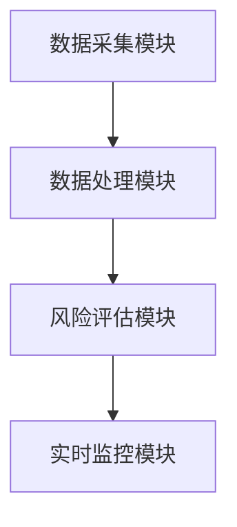

                 


# 构建智能企业风控系统：实时交易监控与欺诈模式识别

> **关键词**：智能企业风控系统，实时交易监控，欺诈模式识别，机器学习，深度学习，系统架构设计  
>
> **摘要**：  
> 本文详细探讨了构建智能企业风控系统的理论与实践，重点分析了实时交易监控与欺诈模式识别的核心技术。文章从企业风控系统的重要性出发，深入讲解了风险评估与欺诈检测的数学模型，结合机器学习与深度学习算法，详细阐述了系统架构设计与实现方案。通过实际案例分析，本文展示了如何利用Python代码实现风控系统的核心功能，并总结了系统设计中的最佳实践与注意事项，为读者提供了一套完整的智能企业风控系统构建指南。

---

# 第一部分: 智能企业风控系统概述

## 第1章: 企业风控系统背景与目标

### 1.1 企业风控系统的重要性

#### 1.1.1 企业风控的核心概念

企业风控系统是通过技术手段对企业运营中的风险进行识别、评估和控制的系统。其核心目标是通过实时监控和数据分析，识别潜在的欺诈行为、异常交易和潜在风险，从而保护企业的财务安全和业务稳定。

| **核心概念** | **定义** | **特点** |
|--------------|----------|----------|
| 风险评估    | 对企业潜在风险的量化与分析 | 实时性、准确性 |
| 欺诈检测    | 识别非法或异常的交易行为 | 高效性、精准性 |
| 交易监控    | 实时跟踪和分析交易数据 | 可视化、可追溯 |

#### 1.1.2 企业风控的目标与价值

企业风控的目标是通过技术手段降低企业的财务风险、信用风险和操作风险。其价值体现在以下几个方面：

1. **保护企业资产**：通过实时监控，及时发现并阻止欺诈交易，防止企业资产损失。
2. **提升信任度**：通过高效的风控系统，增强客户和合作伙伴对企业的信任。
3. **合规性**：满足行业监管要求，避免因违规操作带来的法律风险。

#### 1.1.3 企业风控的边界与外延

企业风控的边界是指系统监控的范围和对象，通常包括企业的财务交易、供应链管理、客户行为分析等。其外延则涵盖了与企业风控相关的技术、方法和工具，例如大数据分析、人工智能算法、区块链技术等。

---

### 1.2 实时交易监控与欺诈模式识别的背景

#### 1.2.1 交易监控的必要性

随着企业数字化转型的推进，交易数据的规模和复杂性急剧增加。传统的基于规则的交易监控系统已经难以应对复杂的欺诈手段，因此需要引入智能化的实时交易监控系统。

#### 1.2.2 欺诈模式识别的挑战

欺诈模式识别的核心是通过分析交易数据中的异常行为，识别潜在的欺诈行为。其主要挑战包括：

1. **数据多样性**：欺诈行为可能涉及多种模式，例如薅羊毛、套现、洗钱等。
2. **数据稀疏性**：欺诈行为往往占少数，数据样本不足。
3. **动态变化**：欺诈手段不断进化，需要系统具备动态适应能力。

#### 1.2.3 企业风控系统的演进

从传统的基于规则的风控系统到智能化的实时风控系统，企业风控系统的演进经历了以下几个阶段：

1. **规则驱动阶段**：基于预定义的规则进行风险评估。
2. **统计分析阶段**：引入统计模型进行风险预测。
3. **机器学习阶段**：利用机器学习算法进行实时风险评估。
4. **深度学习阶段**：结合深度学习技术，提升风险识别的准确性和实时性。

---

## 第2章: 智能企业风控系统的核心概念

### 2.1 风控系统的核心要素

#### 2.1.1 数据来源与处理

企业风控系统的数据来源主要包括：

- **交易数据**：包括交易金额、时间、地点、参与者等信息。
- **用户行为数据**：包括用户操作日志、登录记录等。
- **外部数据**：包括征信数据、公开市场数据等。

**数据处理流程**：

1. **数据采集**：通过API或日志采集交易数据。
2. **数据清洗**：去除重复数据、填充缺失值。
3. **数据转换**：将数据转换为适合算法处理的格式。
4. **数据存储**：将数据存储在数据库或数据仓库中。

#### 2.1.2 风险评估模型

风险评估模型是企业风控系统的核心模块，其目标是根据输入的特征数据，输出风险评分。常用的模型包括：

- **逻辑回归**：用于分类问题，适合二分类场景。
- **随机森林**：适合处理高维数据，具有较强的抗过拟合能力。
- **神经网络**：适合复杂的非线性关系。

#### 2.1.3 实时监控机制

实时监控机制是企业风控系统的关键功能，其目标是快速识别异常交易并采取相应的控制措施。其实时性主要体现在以下几个方面：

1. **实时数据流处理**：支持毫秒级的数据处理。
2. **实时告警**：当检测到异常交易时，立即触发告警。
3. **实时决策**：基于实时数据做出风险评估和控制决策。

---

### 2.2 实时交易监控与欺诈模式识别的联系

#### 2.2.1 交易数据的特征分析

交易数据的特征分析是欺诈模式识别的基础。常见的交易特征包括：

- **时间特征**：交易时间、交易频率。
- **金额特征**：交易金额、交易金额的波动性。
- **参与者特征**：交易双方的关联性、用户行为一致性。

#### 2.2.2 欺诈模式识别的关键指标

欺诈模式识别的关键指标包括：

1. **交易金额的异常性**：与用户正常交易习惯不符的金额。
2. **交易频率的异常性**：短时间内频繁交易。
3. **交易行为的异常性**：与用户历史行为模式不符的操作。

#### 2.2.3 企业风控系统的整体架构

企业风控系统的整体架构包括以下几个模块：

1. **数据采集模块**：负责采集交易数据和用户行为数据。
2. **数据处理模块**：对数据进行清洗、转换和存储。
3. **风险评估模块**：基于机器学习模型进行风险评估。
4. **实时监控模块**：实时监控交易数据并触发告警。

---

## 第3章: 风险评估与欺诈检测的数学模型

### 3.1 风险评估的基本原理

#### 3.1.1 风险评估的定义

风险评估是指通过分析数据，量化某事件发生的可能性及其影响的过程。其核心是通过概率论和统计学方法，对风险进行建模和预测。

#### 3.1.2 风险评估的数学模型

常用的数学模型包括：

1. **逻辑回归**：通过sigmoid函数将输入特征映射到0-1区间，表示风险概率。
2. **随机森林**：通过决策树的集成方法，提高模型的准确性和鲁棒性。
3. **支持向量机**：通过最大化分类间隔，实现高维数据的分类。

#### 3.1.3 风险评估的实现方法

风险评估的实现方法包括：

1. **特征工程**：选择和提取有效的特征。
2. **模型训练**：基于训练数据，训练风险评估模型。
3. **模型评估**：通过测试数据评估模型的准确性和召回率。

---

### 3.2 欺诈检测的算法原理

#### 3.2.1 机器学习算法在欺诈检测中的应用

机器学习算法在欺诈检测中的应用包括：

1. **逻辑回归**：用于分类问题，适合二分类场景。
2. **随机森林**：适合处理高维数据，具有较强的抗过拟合能力。
3. **神经网络**：适合复杂的非线性关系。

#### 3.2.2 深度学习算法在欺诈检测中的应用

深度学习算法在欺诈检测中的应用包括：

1. **卷积神经网络（CNN）**：适合处理图像数据和序列数据。
2. **循环神经网络（RNN）**：适合处理时间序列数据。
3. **长短期记忆网络（LSTM）**：适合处理长序列数据。

#### 3.2.3 混合模型在欺诈检测中的应用

混合模型在欺诈检测中的应用包括：

1. **集成学习**：通过组合多个模型的结果，提高模型的准确性和鲁棒性。
2. **迁移学习**：利用其他领域的知识，提升模型的性能。

---

## 第4章: 智能风控系统的算法实现

### 4.1 机器学习算法在风控中的应用

#### 4.1.1 随机森林算法

随机森林是一种基于决策树的集成算法，其核心思想是通过随机采样和特征选择，生成多个决策树，并通过投票或平均的方式得到最终结果。其优点是具有较强的抗过拟合能力和鲁棒性。

**随机森林的实现流程**：

1. **数据采样**：通过随机采样生成多个训练数据集。
2. **特征选择**：随机选择部分特征进行决策树的构建。
3. **模型训练**：基于训练数据集，生成多个决策树。
4. **结果集成**：通过投票或平均的方式，得到最终的分类结果。

#### 4.1.2 支持向量机算法

支持向量机是一种基于几何的分类算法，其核心思想是通过构造超平面，将数据分成不同的类别。其优点是具有较强的泛化能力和较高的分类精度。

**支持向量机的实现流程**：

1. **数据预处理**：对数据进行标准化和归一化处理。
2. **模型训练**：基于训练数据，训练支持向量机模型。
3. **模型优化**：通过调整核函数和参数，优化模型的性能。

#### 4.1.3 线性回归算法

线性回归是一种基于最小二乘法的回归算法，其核心思想是通过拟合一条直线，描述因变量与自变量之间的关系。其优点是简单易懂，计算效率高。

**线性回归的实现流程**：

1. **数据预处理**：对数据进行标准化和归一化处理。
2. **模型训练**：基于训练数据，训练线性回归模型。
3. **模型评估**：通过均方误差（MSE）或决定系数（R²）评估模型的性能。

---

### 4.2 深度学习算法在风控中的应用

#### 4.2.1 神经网络算法

神经网络是一种基于人工神经元的网络模型，其核心思想是通过多层非线性变换，学习数据的特征表示。其优点是具有较强的表达能力和较高的分类精度。

**神经网络的实现流程**：

1. **数据预处理**：对数据进行标准化和归一化处理。
2. **模型构建**：搭建神经网络模型，包括输入层、隐藏层和输出层。
3. **模型训练**：基于训练数据，训练神经网络模型。
4. **模型优化**：通过调整学习率和正则化参数，优化模型的性能。

#### 4.2.2 卷积神经网络算法

卷积神经网络是一种基于卷积操作的深度学习算法，其核心思想是通过局部感知和权值共享，提取数据的特征。其优点是适合处理图像数据和序列数据。

**卷积神经网络的实现流程**：

1. **数据预处理**：对数据进行归一化和数据增强处理。
2. **模型构建**：搭建卷积神经网络模型，包括卷积层、池化层和全连接层。
3. **模型训练**：基于训练数据，训练卷积神经网络模型。
4. **模型优化**：通过调整学习率和正则化参数，优化模型的性能。

#### 4.2.3 循环神经网络算法

循环神经网络是一种基于循环结构的深度学习算法，其核心思想是通过循环连接，处理序列数据。其优点是适合处理时间序列数据和长序列数据。

**循环神经网络的实现流程**：

1. **数据预处理**：对数据进行归一化和序列分割处理。
2. **模型构建**：搭建循环神经网络模型，包括输入层、循环层和输出层。
3. **模型训练**：基于训练数据，训练循环神经网络模型。
4. **模型优化**：通过调整学习率和正则化参数，优化模型的性能。

---

## 第5章: 系统架构与设计

### 5.1 系统架构设计

#### 5.1.1 系统整体架构

企业风控系统的整体架构包括以下几个部分：

1. **数据采集模块**：负责采集交易数据和用户行为数据。
2. **数据处理模块**：对数据进行清洗、转换和存储。
3. **风险评估模块**：基于机器学习模型进行风险评估。
4. **实时监控模块**：实时监控交易数据并触发告警。

**系统架构图**：



---

### 5.2 系统功能设计

#### 5.2.1 数据采集模块

数据采集模块的主要功能包括：

1. **数据采集**：通过API或日志采集交易数据。
2. **数据清洗**：去除重复数据、填充缺失值。
3. **数据转换**：将数据转换为适合算法处理的格式。

---

#### 5.2.2 数据处理模块

数据处理模块的主要功能包括：

1. **数据清洗**：去除重复数据、填充缺失值。
2. **数据转换**：将数据转换为适合算法处理的格式。
3. **数据存储**：将数据存储在数据库或数据仓库中。

---

#### 5.2.3 风险评估模块

风险评估模块的主要功能包括：

1. **特征工程**：选择和提取有效的特征。
2. **模型训练**：基于训练数据，训练风险评估模型。
3. **模型评估**：通过测试数据评估模型的准确性和召回率。

---

#### 5.2.4 实时监控模块

实时监控模块的主要功能包括：

1. **实时数据流处理**：支持毫秒级的数据处理。
2. **实时告警**：当检测到异常交易时，立即触发告警。
3. **实时决策**：基于实时数据做出风险评估和控制决策。

---

## 第6章: 项目实战与案例分析

### 6.1 项目环境搭建

#### 6.1.1 开发环境的选择

推荐使用以下开发环境：

- **操作系统**：Windows、Linux或macOS。
- **编程语言**：Python 3.8及以上版本。
- **开发工具**：PyCharm、VS Code等。

#### 6.1.2 数据集的准备

推荐使用以下数据集：

- **公开数据集**：Kaggle平台上的欺诈检测数据集。
- **自建数据集**：根据企业实际需求，自建交易数据集。

#### 6.1.3 工具链的安装

推荐安装以下工具：

- **Python库**：pandas、numpy、scikit-learn、tensorflow等。
- **可视化工具**：Matplotlib、Seaborn等。

---

### 6.2 核心代码实现

#### 6.2.1 数据预处理代码

```python
import pandas as pd
import numpy as np

# 数据加载
data = pd.read_csv('fraud_dataset.csv')

# 数据清洗
data.dropna(inplace=True)

# 数据转换
data['label'] = data['label'].astype(int)
```

---

#### 6.2.2 风险评估模型代码

```python
from sklearn.ensemble import RandomForestClassifier
from sklearn.metrics import accuracy_score

# 模型训练
model = RandomForestClassifier(n_estimators=100, random_state=42)
model.fit(X_train, y_train)

# 模型评估
y_pred = model.predict(X_test)
print('Accuracy:', accuracy_score(y_test, y_pred))
```

---

#### 6.2.3 实时监控模块代码

```python
import tensorflow as tf
from tensorflow.keras import layers

# 模型构建
model = tf.keras.Sequential([
    layers.Dense(64, activation='relu'),
    layers.Dense(1, activation='sigmoid')
])

# 模型训练
model.compile(optimizer='adam', loss='binary_crossentropy', metrics=['accuracy'])
model.fit(X_train, y_train, epochs=10, batch_size=32)
```

---

### 6.3 实际案例分析

#### 6.3.1 案例背景

假设我们有一个欺诈检测数据集，包含以下字段：

- **交易金额**：交易金额。
- **交易时间**：交易发生的时间。
- **用户ID**：用户的唯一标识。
- **label**：标签（0表示正常交易，1表示欺诈交易）。

---

#### 6.3.2 案例分析

通过上述代码实现，我们可以进行以下分析：

1. **数据预处理**：清洗和转换数据，确保数据适合模型训练。
2. **模型训练**：基于随机森林算法，训练欺诈检测模型。
3. **模型评估**：评估模型的准确性和召回率。

---

### 6.4 项目总结

通过上述项目实战，我们可以看到，企业风控系统的构建需要结合理论与实践，从数据采集、数据处理到模型训练和实时监控，每一步都需要精心设计和实现。同时，模型的准确性和实时性是系统设计中的关键问题，需要通过不断优化算法和调整系统架构来实现。

---

## 第7章: 最佳实践与注意事项

### 7.1 最佳实践

1. **数据隐私保护**：在处理用户数据时，需要遵守相关法律法规，保护用户隐私。
2. **模型优化**：通过不断优化算法和调整模型参数，提升系统的准确性和实时性。
3. **系统可扩展性**：设计系统时，需要考虑系统的可扩展性和可维护性。

---

### 7.2 小结

本文详细探讨了构建智能企业风控系统的理论与实践，重点分析了实时交易监控与欺诈模式识别的核心技术。通过实际案例分析，展示了如何利用Python代码实现风控系统的核心功能，并总结了系统设计中的最佳实践与注意事项。

---

### 7.3 注意事项

1. **数据质量**：数据的质量直接影响模型的性能，需要重视数据清洗和特征工程。
2. **模型解释性**：在实际应用中，模型的解释性非常重要，需要选择适合业务需求的模型。
3. **系统性能**：实时监控系统的性能直接影响系统的响应速度和用户体验，需要通过优化算法和调整系统架构来提升性能。

---

### 7.4 拓展阅读

1. 《机器学习实战》：深入讲解机器学习算法的实现与应用。
2. 《深度学习》：系统介绍深度学习的理论与实践。
3. 《数据挖掘导论》：全面介绍数据挖掘的基本概念与技术。

---

# 结语

构建智能企业风控系统是一个复杂的系统工程，需要结合理论与实践，从数据采集、数据处理到模型训练和实时监控，每一步都需要精心设计和实现。通过本文的探讨，希望读者能够对智能企业风控系统的构建有更深入的理解，并能够在实际工作中灵活运用这些知识。

