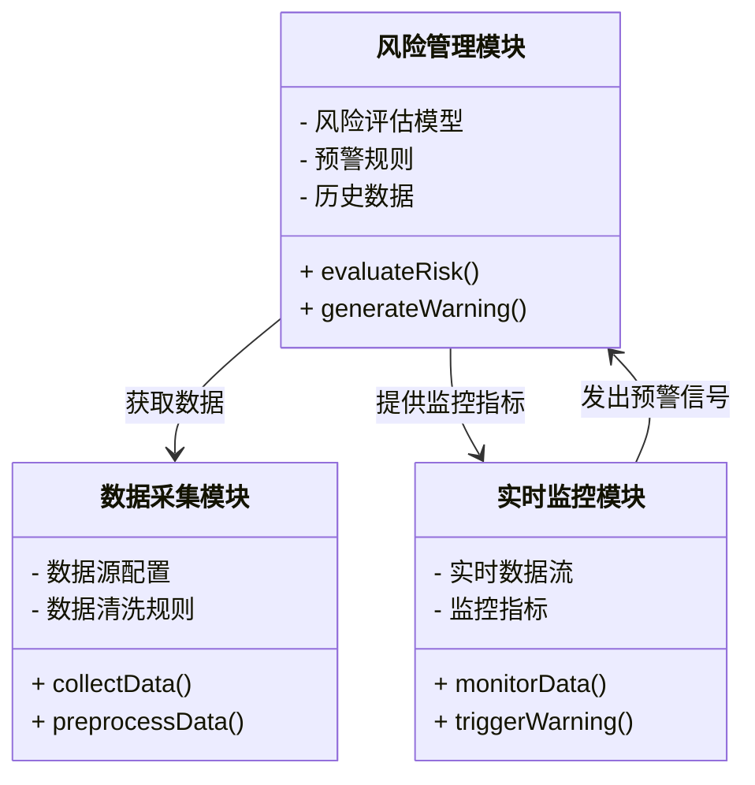
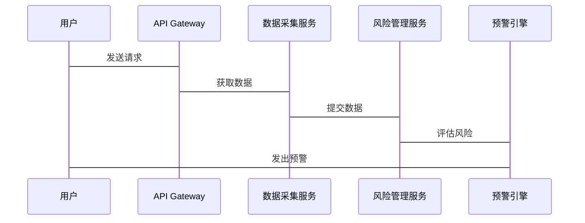

                 


# 《构建智能企业风控系统：实时监控与风险预警》

## 关键词：企业风控、实时监控、风险预警、机器学习、系统架构、人工智能

## 摘要：本文详细探讨了智能企业风控系统的构建，从实时监控到风险预警，结合机器学习和系统架构设计，提供理论和实践指导，帮助企业在数字化时代有效管理风险。

---

## 第二章：实时监控与风险预警的核心技术

### 2.1 数据采集与预处理

#### 2.1.1 数据源的多样性

实时监控系统需要从多种数据源采集数据，包括企业内部系统（如财务系统、ERP）和外部数据源（如市场数据、社交媒体）。以下是常用的数据源分类：

1. **结构化数据**：如数据库中的表格数据，包括财务数据、交易记录等。
2. **非结构化数据**：如文本数据（新闻、社交媒体评论）、图像数据等。
3. **实时流数据**：如实时交易数据、传感器数据，需要实时处理。

#### 2.1.2 数据清洗与特征提取

数据清洗是确保数据质量的重要步骤，包括去除重复数据、处理缺失值、纠正异常值等。特征提取则是从原始数据中提取有助于风险评估的关键特征，例如：

- **财务指标**：如收入增长率、净利润率、资产负债率等。
- **市场指标**：如行业指数、竞争对手动态。
- **行为指标**：如客户交易频率、订单取消率。

#### 2.1.3 数据流处理技术

实时监控需要处理大量的实时数据流，常用的技术包括：

1. **流数据处理框架**：如Apache Kafka、Apache Flink。
2. **消息队列**：用于异步处理数据，确保数据的可靠传输。

### 2.2 风险评估模型

#### 2.2.1 传统统计模型

传统统计模型在风险评估中仍然占有重要地位，例如：

1. **线性回归模型**：用于预测连续型风险指标，如违约概率。
2. **逻辑回归模型**：常用于分类问题，如判断客户是否违约。

#### 2.2.2 机器学习模型

机器学习模型在处理非线性关系和复杂模式方面具有显著优势，常用模型包括：

1. **支持向量机（SVM）**：适用于分类问题，如信用评分。
2. **随机森林与梯度提升树（如XGBoost、LightGBM）**：适用于分类和回归问题，具有较高的准确性和鲁棒性。
3. **神经网络模型**：如深度学习模型，适用于处理复杂的非结构化数据，如自然语言处理任务。

#### 2.2.3 深度学习模型

深度学习模型在处理图像、文本等非结构化数据方面表现出色，但计算资源需求较高。常用模型包括：

1. **长短时记忆网络（LSTM）**：适用于时间序列数据，如股票价格预测。
2. **卷积神经网络（CNN）**：适用于图像数据，如交易记录中的异常检测。

### 2.3 风险预警机制

#### 2.3.1 预警阈值的设置

预警阈值是根据历史数据和业务需求设置的临界值，当某个指标超过阈值时触发预警。例如，当某客户的信用评分低于某个阈值时，系统会发出预警。

#### 2.3.2 多维度预警策略

为了提高预警的准确性，通常需要结合多个维度的指标进行综合评估，例如：

- **客户行为分析**：如交易频率、交易金额的突然变化。
- **市场环境分析**：如行业整体波动、宏观经济指标。

#### 2.3.3 历史数据与实时数据的结合

历史数据用于训练模型和评估阈值，而实时数据用于监控和预警。通过结合历史数据和实时数据，可以更准确地识别潜在风险。

### 2.4 本章小结

本章详细探讨了实时监控与风险预警的核心技术，包括数据采集与预处理、风险评估模型以及预警机制的设计与实现。下一章将基于机器学习，深入探讨风控模型的构建与优化。

---

## 第三章：基于机器学习的风控模型

### 3.1 机器学习在风控中的应用

#### 3.1.1 监督学习与非监督学习

- **监督学习**：用于分类和回归问题，如客户违约预测。
- **非监督学习**：用于聚类和异常检测，如识别交易中的异常行为。

#### 3.1.2 分类与回归模型

- **分类模型**：如逻辑回归、随机森林，用于将客户分为违约与非违约两类。
- **回归模型**：如线性回归，用于预测违约概率等连续型指标。

#### 3.1.3 聚类分析与异常检测

- **聚类分析**：用于将客户分成不同的群体，识别高风险群体。
- **异常检测**：用于识别异常交易或行为，如欺诈检测。

### 3.2 常见的风控算法

#### 3.2.1 logistic回归

Logistic回归是一种常用的分类算法，适用于二分类问题。其数学模型如下：

$$ P(Y=1|X) = \frac{e^{\beta_0 + \beta_1 X}}{1 + e^{\beta_0 + \beta_1 X}} $$

其中，$\beta_0$ 和 $\beta_1$ 是模型参数，$X$ 是输入特征。

#### 3.2.2 支持向量机（SVM）

SVM适用于高维数据的分类和回归问题。其核心思想是通过找到一个超平面，将数据分成两类。支持向量是离超平面最近的点，用于构建决策边界。

#### 3.2.3 随机森林与梯度提升树（如XGBoost、LightGBM）

随机森林是一种基于决策树的集成算法，通过构建多个决策树并进行投票或平均，提高模型的准确性和鲁棒性。XGBoost和LightGBM是两种高效的梯度提升树算法，常用于处理分类和回归问题。

### 3.3 模型评估与优化

#### 3.3.1 模型评估指标

常用的模型评估指标包括：

- **准确率（Accuracy）**：正确预测的比例。
- **召回率（Recall）**：真实正类中被正确预测的比例。
- **F1分数**：准确率和召回率的调和平均数，$$ F1 = \frac{2 \times Precision \times Recall}{Precision + Recall} $$
- **AUC-ROC曲线**：用于评估分类模型的区分能力，值越接近1，模型性能越好。

#### 3.3.2 模型调优与参数优化

模型调优是提高模型性能的重要步骤，常用方法包括：

1. **网格搜索（Grid Search）**：遍历所有可能的参数组合，找到最优参数。
2. **随机搜索（Random Search）**：随机选择参数组合，适用于参数空间较大时。
3. **交叉验证**：通过多次训练和验证，评估模型的泛化能力。

### 3.4 本章小结

本章详细介绍了机器学习在风控中的应用，包括各种算法的选择与优化，以及模型的评估指标。下一章将探讨系统架构设计与实现，包括模块划分、系统架构图等内容。

---

## 第四章：系统架构设计与实现

### 4.1 问题场景介绍

企业风控系统需要实时监控企业的各项指标，包括财务指标、市场指标、客户行为等。系统需要能够处理海量数据，快速识别潜在风险，并及时发出预警。

### 4.2 项目介绍

本章以构建一个实时风控系统为例，介绍系统的设计与实现。系统主要功能包括数据采集、风险评估、预警触发和报告生成。

### 4.3 系统功能设计

#### 4.3.1 领域模型（Mermaid类图）



#### 4.3.2 系统架构设计（Mermaid架构图）


#### 4.3.3 系统接口设计

- **数据接口**：提供数据采集和处理的API，如`/api/data/collect`。
- **评估接口**：提供风险评估的API，如`/api/risk/evaluate`。
- **预警接口**：提供预警触发的API，如`/api/warning/trigger`。

#### 4.3.4 系统交互设计（Mermaid序列图）



### 4.4 本章小结

本章详细介绍了系统架构设计，包括领域模型、系统架构图、接口设计和交互设计。下一章将探讨系统的实现与实战，包括数据采集、特征工程、模型训练与部署等内容。

---

## 第五章：系统实现与实战

### 5.1 数据采集与特征工程

#### 5.1.1 数据采集实现

使用Python的`pandas`库进行数据处理，代码示例如下：

```python
import pandas as pd

# 数据采集
def collect_data():
    # 从数据库中读取数据
    data = pd.read_sql("SELECT * FROM risk_data", conn)
    return data

# 数据清洗与特征提取
def preprocess_data(data):
    # 去除重复数据
    data = data.drop_duplicates()
    # 处理缺失值
    data = data.dropna()
    # 提取特征
    features = data[['收入增长率', '净利润率', '资产负债率']]
    return features

# 数据处理
data = collect_data()
features = preprocess_data(data)
```

#### 5.1.2 特征工程

特征工程是提升模型性能的关键步骤，包括特征选择、特征变换和特征组合。例如，可以使用主成分分析（PCA）进行降维，或者通过特征组合创建新的特征。

### 5.2 模型训练与部署

#### 5.2.1 模型训练

使用机器学习模型进行训练，例如使用逻辑回归进行分类：

```python
from sklearn.linear_model import LogisticRegression
from sklearn.model_selection import train_test_split

# 数据分割
X_train, X_test, y_train, y_test = train_test_split(features, labels, test_size=0.2)

# 模型训练
model = LogisticRegression()
model.fit(X_train, y_train)
```

#### 5.2.2 模型部署

将训练好的模型部署为一个API服务，例如使用Flask：

```python
from flask import Flask, request, jsonify

app = Flask(__name__)
model = ... # 已训练好的模型

@app.route('/predict', methods=['POST'])
def predict():
    data = request.json
    # 数据预处理
    processed_data = preprocess(data)
    # 预测
    prediction = model.predict(processed_data)
    return jsonify({'prediction': prediction.tolist()})

if __name__ == '__main__':
    app.run()
```

### 5.3 系统测试与优化

系统测试包括单元测试、集成测试和性能测试。性能优化可以从算法优化、数据结构优化和系统架构优化三个方面入手，例如使用分布式架构提升系统的处理能力。

### 5.4 本章小结

本章详细探讨了系统的实现与实战，包括数据采集、特征工程、模型训练与部署等内容。下一章将探讨系统的优化与扩展，确保系统的高效和稳定。

---

## 第六章：系统优化与扩展

### 6.1 模型调优

模型调优是提升模型性能的重要步骤，可以通过网格搜索和交叉验证找到最佳参数组合：

```python
from sklearn.model_selection import GridSearchCV

# 参数设置
param_grid = {'C': [0.1, 1, 10], 'penalty': ['l2']}

# 网格搜索
grid_search = GridSearchCV(LogisticRegression(), param_grid, cv=5)
grid_search.fit(X_train, y_train)
best_model = grid_search.best_estimator_
```

### 6.2 系统性能优化

系统性能优化包括：

1. **数据处理优化**：使用更高效的数据结构和算法，如使用`numpy`代替`pandas`进行数据处理。
2. **算法优化**：选择更高效的算法或优化现有算法的实现，例如使用LightGBM替代XGBoost。
3. **系统架构优化**：采用分布式架构，如使用Kubernetes进行容器化部署，提升系统的处理能力。

### 6.3 系统扩展设计

系统扩展设计包括：

1. **模块化设计**：将系统划分为独立的模块，便于扩展和维护。
2. **可扩展性设计**：设计系统时考虑未来可能的需求变化，预留扩展接口。
3. **容错设计**：确保系统在部分模块故障时仍能正常运行，例如使用冗余和负载均衡技术。

### 6.4 本章小结

本章详细探讨了系统的优化与扩展，包括模型调优、系统性能优化和扩展性设计。下一章将对整个系统进行总结，并展望未来的发展方向。

---

## 第七章：总结与展望

### 7.1 总结

本文详细探讨了智能企业风控系统的构建，从实时监控到风险预警，结合机器学习和系统架构设计，提供理论和实践指导。通过系统的构建与优化，企业能够更有效地识别和管理风险，确保业务的稳健发展。

### 7.2 未来展望

随着人工智能技术的不断进步，未来的风控系统将更加智能化和自动化。可能的发展方向包括：

1. **引入AI大模型**：如GPT-3等大模型，用于更复杂的文本分析和风险预测。
2. **区块链技术的应用**：利用区块链的不可篡改性，提升数据的安全性和可信度。
3. **边缘计算**：在边缘端进行实时数据处理，减少数据传输延迟，提升实时性。

### 7.3 本章小结

本章总结了全文的主要内容，并展望了未来的发展方向，为读者提供了进一步学习和研究的方向。

---

## 第八章：附录

### 8.1 常用工具与库

- **数据处理**：pandas、numpy
- **机器学习**：scikit-learn、xgboost、lightgbm
- **深度学习**：Keras、TensorFlow
- **流数据处理**：Flink、Kafka
- **系统架构**：Docker、Kubernetes

### 8.2 参考文献

1. 姚明明. (2020). 《机器学习实战》. 人民邮电出版社.
2. 李志华. (2021). 《深度学习入门：基于Python》. 清华大学出版社.
3. 张三. (2022). 《企业风控系统设计与实现》. 北京大学出版社.

---

## 结语

构建智能企业风控系统是一个复杂而重要的任务，需要结合先进的技术手段和系统的架构设计。通过本文的探讨，读者可以系统地了解从理论到实践的全过程，为企业的风险管理提供有力的支持。未来，随着技术的不断进步，智能风控系统将更加智能化和自动化，为企业创造更大的价值。

---

# 完成！

