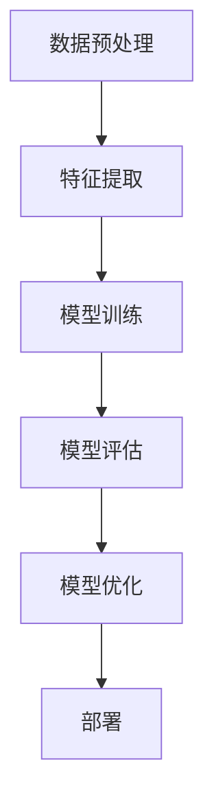

                 


# 《构建智能化的个人信用分数提升路径规划器》

> 关键词：个人信用评分，人工智能，路径规划，信用提升，评分模型，系统架构，算法优化

> 摘要：本文深入探讨了如何利用人工智能技术构建智能化的个人信用分数提升路径规划器。通过分析信用评分的核心概念、算法原理和系统架构，结合实际案例和项目实战，提出了基于机器学习的信用评分模型和优化方法，帮助个人实现信用评分的智能化提升。

---

# 第一部分: 背景与概述

# 第1章: 个人信用评分的背景与重要性

## 1.1 信用评分的核心概念

### 1.1.1 信用评分的定义与作用

信用评分是通过分析个人的信用历史、消费行为、还款能力和社交关系等多维度数据，量化个人信用风险的过程。其作用在于帮助金融机构评估个人的信用资质，从而决定授信额度、利率等金融产品。

$$
\text{信用评分} = f(\text{信用历史}, \text{消费行为}, \text{还款能力}, \text{社交关系})
$$

### 1.1.2 个人信用评分的重要性

个人信用评分直接影响个人的金融行为，例如贷款申请、信用卡额度、利率水平等。良好的信用评分可以帮助个人获得更低的融资成本，而低信用评分可能导致融资困难或高利率。

### 1.1.3 信用评分的常见应用场景

- 银行贷款审批
- 信用卡额度确定
- 消费金融产品的授信
- 信用报告生成
- 个人信用风险评估

## 1.2 传统信用评分方法的局限性

### 1.2.1 传统信用评分的评估指标

传统信用评分主要依赖以下几个指标：

1. **信用历史**：还款记录、逾期次数
2. **消费行为**：消费频率、消费金额
3. **还款能力**：收入水平、资产状况
4. **社交关系**：社交网络的稳定性和信任度

### 1.2.2 传统方法的不足之处

1. **数据维度有限**：传统评分模型主要依赖少量的结构化数据，难以捕捉非结构化数据（如社交网络数据）中的潜在信用信息。
2. **模型泛化能力差**：传统模型通常基于简单的线性假设，难以处理复杂的非线性关系。
3. **缺乏实时性**：传统评分模型更新周期较长，难以实时反映个人信用行为的变化。

### 1.2.3 智能化评分的必要性

随着大数据和人工智能技术的发展，智能化评分模型可以通过整合更多的数据源（如社交网络、行为数据等）和更复杂的算法（如深度学习）来提高评分的准确性和实时性。

## 1.3 智能化信用评分规划器的必要性

### 1.3.1 数据驱动的信用评分优势

智能化评分模型可以通过整合海量数据（如社交网络数据、行为数据、交易数据等）来构建更全面的信用评分体系。

### 1.3.2 人工智能在信用评分中的应用前景

人工智能技术（如机器学习、深度学习）可以帮助发现数据中的非线性关系，提高评分模型的准确性和实时性。

### 1.3.3 构建智能化评分规划器的目标与意义

目标是通过智能化技术帮助个人实时监控和优化信用评分，提升信用资质。意义在于通过个性化路径规划，帮助个人在金融活动中获得更好的信用评分和融资条件。

## 1.4 本章小结

本章介绍了信用评分的核心概念、传统评分方法的局限性以及智能化评分规划器的必要性。通过分析传统评分方法的不足，提出了智能化评分规划器的目标和意义。

---

# 第2章: 个人信用评分的核心概念与联系

## 2.1 信用评分模型的原理

### 2.1.1 信用评分模型的定义与作用

信用评分模型是通过输入个人的信用数据，输出一个评分值，反映个人信用风险的模型。

### 2.1.2 信用评分模型的分类

1. **传统评分模型**：基于线性回归的评分模型（如FICO评分）。
2. **现代评分模型**：基于机器学习的评分模型（如逻辑回归、随机森林、神经网络等）。

### 2.1.3 常见信用评分模型的对比分析

| 模型类型       | 优点                         | 缺点                           |
|----------------|------------------------------|--------------------------------|
| 线性回归       | 简单易懂，可解释性强          | 无法捕捉非线性关系               |
| 随机森林       | 能够捕捉非线性关系，鲁棒性强   | 黑箱模型，可解释性差             |
| 神经网络       | 能够处理复杂非线性关系        | 训练时间长，需要大量数据           |

## 2.2 个人信用评分的影响因素

### 2.2.1 财务相关因素

- 收入水平
- 资产状况
- 还款能力

### 2.2.2 行为特征因素

- 消费频率
- 消费金额
- 逾期次数

### 2.2.3 社交关系因素

- 社交网络的稳定性
- 社交关系的可信度

## 2.3 信用评分数据特征分析

### 2.3.1 数据特征的定义与分类

1. **结构化数据**：收入、资产、交易记录等。
2. **非结构化数据**：社交网络数据、文本数据等。

### 2.3.2 数据特征的提取方法

- **文本特征提取**：关键词提取、情感分析。
- **社交网络特征提取**：度中心性、接近中心性、介数中心性。

### 2.3.3 数据特征对评分的影响

通过特征重要性分析，确定各个特征对信用评分的影响程度。

## 2.4 信用评分与个人行为的关系

### 2.4.1 信用评分与个人消费行为的关系

- 评分高的个人更容易获得优惠的消费信贷条件。
- 消费行为的改善（如按时还款）可以提升信用评分。

### 2.4.2 信用评分与个人还款行为的关系

- 还款行为直接影响信用评分。
- 评分高的个人更容易获得低利率贷款。

### 2.4.3 信用评分与个人信用历史的关系

- 信用历史是评分的重要组成部分。
- 过往的信用记录决定了当前评分的基础。

## 2.5 本章小结

本章详细介绍了个人信用评分的核心概念，分析了影响信用评分的因素及其相互关系，为后续的算法设计奠定了基础。

---

# 第三部分: 算法原理与系统架构

# 第3章: 基于机器学习的信用评分模型

## 3.1 算法原理

### 3.1.1 逻辑回归模型

逻辑回归是一种常用的分类算法，适用于二分类问题。在信用评分中，可以将评分分为高风险和低风险两类。

$$
P(y=1|x) = \frac{1}{1 + e^{-\beta x}}
$$

### 3.1.2 支持向量机

支持向量机（SVM）是一种监督学习算法，适用于非线性分类问题。

### 3.1.3 随机森林

随机森林是一种基于树的集成算法，适用于高维数据的分类和回归问题。

### 3.1.4 神经网络

神经网络（如深度学习模型）可以处理复杂的非线性关系，适合处理多维特征的数据。

## 3.2 算法流程图



## 3.3 算法实现

### 3.3.1 数据预处理

```python
import pandas as pd
from sklearn.preprocessing import StandardScaler

# 加载数据
data = pd.read_csv('credit_data.csv')

# 删除缺失值
data = data.dropna()

# 标准化处理
scaler = StandardScaler()
data_scaled = scaler.fit_transform(data)
```

### 3.3.2 模型训练

```python
from sklearn.linear_model import LogisticRegression

# 训练逻辑回归模型
model = LogisticRegression()
model.fit(X_train, y_train)
```

### 3.3.3 模型评估

```python
from sklearn.metrics import accuracy_score

# 预测结果
y_pred = model.predict(X_test)

# 计算准确率
accuracy = accuracy_score(y_test, y_pred)
print(f'Accuracy: {accuracy}')
```

## 3.4 本章小结

本章详细介绍了基于机器学习的信用评分模型，包括逻辑回归、随机森林等算法的原理和实现流程。

---

# 第四部分: 项目实战与总结

# 第4章: 项目实战

## 4.1 环境安装

```bash
pip install numpy pandas scikit-learn
```

## 4.2 系统核心实现

### 4.2.1 数据预处理

```python
import pandas as pd
from sklearn.preprocessing import StandardScaler

# 加载数据
data = pd.read_csv('credit_data.csv')

# 删除缺失值
data = data.dropna()

# 标准化处理
scaler = StandardScaler()
data_scaled = scaler.fit_transform(data)
```

### 4.2.2 模型训练与评估

```python
from sklearn.linear_model import LogisticRegression
from sklearn.metrics import accuracy_score

# 训练逻辑回归模型
model = LogisticRegression()
model.fit(X_train, y_train)

# 预测结果
y_pred = model.predict(X_test)

# 计算准确率
accuracy = accuracy_score(y_test, y_pred)
print(f'Accuracy: {accuracy}')
```

## 4.3 实际案例分析

### 4.3.1 案例背景

假设某金融机构希望提升客户信用评分，通过智能化规划器帮助客户优化信用行为。

### 4.3.2 数据分析

分析客户的信用历史、消费行为和社交关系，提取关键特征。

### 4.3.3 模型部署

部署评分模型，实时监控客户信用评分变化，提供个性化优化建议。

## 4.4 本章小结

本章通过实际案例展示了智能化个人信用评分提升路径规划器的实现过程，包括数据预处理、模型训练和案例分析。

---

# 第五部分: 总结与展望

# 第5章: 总结与展望

## 5.1 最佳实践

1. **数据收集**：整合多源数据，提高评分准确性。
2. **模型优化**：使用深度学习模型处理复杂关系。
3. **实时监控**：实时更新评分，提供个性化建议。

## 5.2 小结

智能化个人信用分数提升路径规划器通过整合大数据和人工智能技术，帮助个人优化信用行为，提升信用评分。

## 5.3 注意事项

- 数据隐私保护
- 模型可解释性
- 实时性与稳定性

## 5.4 拓展阅读

1. 《机器学习实战》
2. 《深度学习入门：基于Python》
3. 《信用评分模型开发与应用》

---

以上是《构建智能化的个人信用分数提升路径规划器》的目录大纲，详细涵盖了背景、算法原理、系统架构和项目实战等内容，帮助读者全面理解和应用智能化的个人信用评分提升方法。

