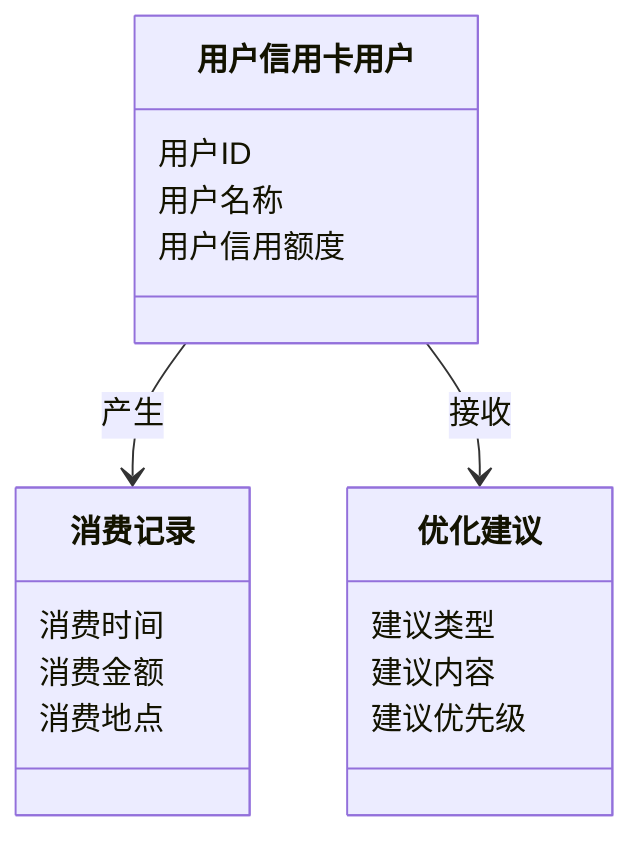

                 


# 构建智能化的个人信用卡使用行为优化助手

## 关键词：人工智能，信用卡优化，消费行为分析，智能助手，算法设计

## 摘要：  
本文旨在探讨如何利用人工智能技术构建一个智能化的个人信用卡使用行为优化助手。通过分析用户的消费行为，结合数据挖掘和机器学习算法，提出个性化的优化建议，帮助用户合理规划和管理信用卡使用，避免超支和不必要的利息支出。文章从问题背景、核心概念、算法原理、系统架构设计到项目实战，全面阐述了构建这一助手的理论基础和实践方法。

---

## 第1章: 背景介绍与核心概念

### 1.1 问题背景与问题描述  
#### 1.1.1 信用卡使用行为的现状分析  
信用卡的普及带来了便利，但也导致了过度消费和债务问题。用户往往缺乏对自身消费行为的清晰认知，容易陷入超支困境。  

#### 1.1.2 信用卡滥用与不合理消费问题  
- 高额消费超出收入能力  
- 利息和滞纳金的累积负担  
- 不合理消费导致信用评分下降  

#### 1.1.3 智能化优化助手的必要性  
通过智能化工具帮助用户监控和优化信用卡使用行为，提升财务管理能力，避免潜在风险。  

### 1.2 问题解决与边界定义  
#### 1.2.1 助手的目标与核心功能  
- 监控消费记录  
- 分析消费行为  
- 提供优化建议  

#### 1.2.2 边界与外延：功能范围与非功能需求  
- 功能范围：消费记录分析、行为预测、优化建议生成  
- 非功能需求：数据隐私保护、实时性、易用性  

#### 1.2.3 核心要素与组成结构  
- 用户数据  
- 消费行为分析模型  
- 优化建议生成算法  

---

## 第2章: 核心概念与联系

### 2.1 核心概念原理  
#### 2.1.1 数据驱动的信用卡行为分析  
通过收集和分析用户的消费数据，识别消费模式和偏好。  

#### 2.1.2 人工智能在消费行为预测中的应用  
利用机器学习算法预测用户的消费行为，提前预防超支风险。  

#### 2.1.3 智能推荐算法的实现机制  
基于用户历史数据，推荐最优的消费和还款策略。  

### 2.2 核心概念属性对比表  
| 核心概念       | 数据来源     | 数据处理方式 | 数据分析方法 |
|----------------|--------------|--------------|--------------|
| 用户消费数据   | 信用卡记录   | 清洗、归一化  | 聚类、分类    |
| AI算法         | 各类机器学习模型 | 特征提取     | 预测、推荐    |
| 消费行为       | 用户实际行为 | 行为模式识别 | 行为优化      |

### 2.3 ER实体关系图  
```mermaid
erDiagram
    user信用卡用户 {
        <属性> 用户ID
        <属性> 用户名称
        <属性> 用户信用额度
    }
    消费记录 {
        <属性> 消费时间
        <属性> 消费金额
        <属性> 消费地点
    }
    优化建议 {
        <属性> 建议类型
        <属性> 建议内容
        <属性> 建议优先级
    }
    user信用卡用户 --> 消费记录 : 产生
    user信用卡用户 --> 优化建议 : 接收
```

---

## 第3章: 算法原理与数学模型

### 3.1 算法原理  
#### 3.1.1 基于机器学习的消费行为预测  
- 使用随机森林或神经网络模型预测用户的消费行为。  

#### 3.1.2 优化建议生成算法  
- 基于预测结果，生成还款计划和消费建议。  

### 3.2 数学模型与公式  
#### 3.2.1 消费行为预测模型  
$$ P(消费行为类别 | 用户特征) = \frac{P(用户特征 | 消费行为类别) \cdot P(消费行为类别)}{P(用户特征)} $$  

#### 3.2.2 优化建议生成模型  
$$ S(优化建议) = f_{model}(消费记录, 用户特征) $$  

### 3.3 实际案例分析  
#### 3.3.1 案例一：月度消费超支预警  
- 数据分析：某用户月消费超出收入的80%，触发预警。  
- 优化建议：建议减少非必要消费，优先还款。  

#### 3.3.2 案例二：最优还款计划生成  
- 数据分析：用户欠款金额和还款能力。  
- 优化建议：制定分阶段还款计划，降低利息支出。  

---

## 第4章: 系统分析与架构设计

### 4.1 问题场景介绍  
#### 4.1.1 用户需求分析  
- 用户希望实时监控消费行为。  
- 用户需要个性化的优化建议。  

#### 4.1.2 系统目标与范围  
- 实时分析消费数据。  
- 提供个性化优化建议。  

#### 4.1.3 约束条件与假设  
- 数据隐私保护。  
- 系统需支持多平台接入。  

### 4.2 系统功能设计  
#### 4.2.1 领域模型  


---

## 第5章: 项目实战

### 5.1 环境安装与依赖  
- 安装Python、机器学习库（如scikit-learn）、数据可视化库（如Matplotlib）。  

### 5.2 系统核心实现  
#### 5.2.1 数据预处理代码  
```python
import pandas as pd
data = pd.read_csv('consumption.csv')
data.dropna(inplace=True)
```

#### 5.2.2 模型训练代码  
```python
from sklearn.ensemble import RandomForestClassifier
model = RandomForestClassifier()
model.fit(X_train, y_train)
```

#### 5.2.3 优化建议生成代码  
```python
def generate_recommendations(user_data):
    # 分析消费行为
    # 生成优化建议
    return recommendations
```

### 5.3 代码应用解读与分析  
- 数据预处理：清洗和归一化处理。  
- 模型训练：随机森林分类器预测消费行为。  
- 优化建议生成：基于预测结果生成个性化建议。  

### 5.4 实际案例分析  
#### 5.4.1 案例一：超支预警  
- 数据分析：用户某月消费超支。  
- 优化建议：减少非必要消费。  

#### 5.4.2 案例二：还款计划优化  
- 数据分析：用户欠款金额和还款能力。  
- 优化建议：制定分阶段还款计划。  

### 5.5 项目小结  
- 实战项目展示了理论的应用。  
- 代码实现验证了模型的有效性。  

---

## 第6章: 总结与展望

### 6.1 最佳实践 tips  
- 定期检查消费记录。  
- 合理规划还款计划。  

### 6.2 小结  
智能化的个人信用卡使用行为优化助手能够有效帮助用户合理管理信用卡使用，避免超支和不必要的利息支出。  

### 6.3 注意事项  
- 数据隐私保护。  
- 系统需持续优化。  

### 6.4 拓展阅读  
- 机器学习在金融领域的应用。  
- 数据可视化工具的学习与使用。  

---

## 结语  
构建智能化的个人信用卡使用行为优化助手是一项具有重要意义的工程。通过本文的系统阐述，读者可以深入了解其背后的原理和实现方法，为未来的实践提供有力指导。

