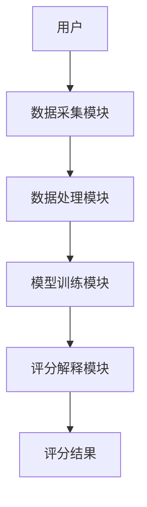
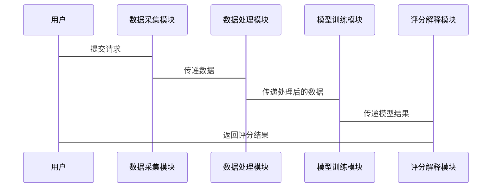

                 


# 构建智能化的个人信用评分解释系统

## 关键词：个人信用评分，人工智能，可解释性，机器学习，系统架构

## 摘要：本文将详细介绍如何构建一个智能化的个人信用评分解释系统。从系统背景到核心概念，从算法原理到系统架构设计，再到项目实战，我们将全面解析该系统的构建过程。通过本文，读者将深入了解如何利用人工智能技术提升信用评分系统的智能化水平，同时确保系统的可解释性和实用性。

---

# 第一章：智能化个人信用评分解释系统概述

## 1.1 个人信用评分的重要性

### 1.1.1 信用评分的定义与作用

信用评分是衡量个人信用状况的重要指标，广泛应用于金融信贷、消费借贷等领域。它通过量化分析个人的信用历史、还款能力、行为特征等信息，帮助机构评估个人的信用风险。

### 1.1.2 传统信用评分的局限性

传统信用评分系统主要依赖简单的规则和统计模型，存在以下问题：
- **黑箱问题**：评分结果缺乏透明性，难以解释。
- **特征单一**：难以捕捉复杂的信用行为。
- **模型稳定性差**：难以适应数据分布的变化。

### 1.1.3 智能化信用评分的优势

智能化信用评分系统通过引入机器学习和大数据技术，能够更好地处理复杂数据，提高评分的准确性和可解释性。

---

## 1.2 智能化信用评分系统的背景与技术背景

### 1.2.1 人工智能与大数据时代的到来

随着人工智能和大数据技术的快速发展，信用评分系统需要更加智能化和个性化。

### 1.2.2 信用评分行业的智能化转型需求

传统评分系统难以满足现代金融行业对高效、精准、可解释的评分需求。

### 1.2.3 个人信用评分系统的核心目标

通过智能化技术，构建一个高效、准确、可解释的个人信用评分系统。

---

## 1.3 智能化信用评分系统的应用场景

### 1.3.1 金融信贷领域的应用

银行、信用卡机构等金融机构可以通过智能化评分系统快速评估客户的信用风险。

### 1.3.2 零售与消费领域的应用

电商平台可以通过评分系统评估用户的信用风险，优化赊购服务。

### 1.3.3 政府与公共服务领域的应用

政府可以通过评分系统评估个人信用状况，优化公共服务资源分配。

---

## 1.4 智能化信用评分系统的挑战与意义

### 1.4.1 系统构建的难点

- 数据隐私与安全问题
- 模型的可解释性要求
- 系统的实时性与高效性

### 1.4.2 系统智能化的意义

- 提高信用评分的准确性和效率
- 提供更个性化的信用评估服务
- 降低金融风险

### 1.4.3 系统未来的发展方向

- 引入更先进的机器学习技术
- 提升系统的可解释性和透明度
- 扩展更多的应用场景

---

# 第二章：个人信用评分系统的核心概念

## 2.1 个人信用评分系统的定义与组成部分

### 2.1.1 系统的定义

个人信用评分系统是一种基于大数据和人工智能技术的智能化评分系统，用于评估个人的信用风险。

### 2.1.2 系统的核心组成部分

- 数据采集模块：收集个人信用相关数据。
- 特征工程模块：对数据进行处理和特征提取。
- 模型训练模块：构建评分模型。
- 评分解释模块：对评分结果进行解释。

### 2.1.3 系统的主要特征

- **高效性**：快速计算信用评分。
- **准确性**：评分结果准确可靠。
- **可解释性**：评分结果可解释。

---

## 2.2 个人信用评分系统与其他系统的对比

### 2.2.1 与传统信用评分系统的对比

| 对比维度       | 传统信用评分系统                     | 智能化信用评分系统                   |
|----------------|--------------------------------------|--------------------------------------|
| 数据来源       | 主要依赖结构化数据                   | 结构化数据 + 非结构化数据           |
| 模型复杂度     | 简单线性模型                         | 复杂非线性模型                       |
| 可解释性       | 较高                                 | 较低（取决于模型类型）               |
| 处理效率       | 较低                                 | 较高                                 |

### 2.2.2 与企业信用评分系统的对比

- **数据范围**：个人系统主要关注个人信用，企业系统关注企业信用。
- **应用场景**：个人系统主要用于消费信贷，企业系统主要用于企业贷款。

### 2.2.3 与个人征信系统的对比

个人征信系统侧重于数据收集和存储，而智能化信用评分系统侧重于数据分析和评分。

---

## 2.3 个人信用评分系统的ER实体关系图

```mermaid
er
  actor: 用户
  entity: 个人信用评分
  entity: 评分模型
  entity: 数据源
  entity: 评分结果
  entity: 解释报告
  entity: 用户反馈
  entity: 系统日志
  entity: 系统配置
  entity: 模型训练数据
```

---

# 第三章：智能化个人信用评分解释系统的算法原理

## 3.1 线性回归模型

### 3.1.1 线性回归的原理

线性回归是一种简单的回归模型，适用于线性关系的场景。

$$ y = \beta_0 + \beta_1 x_1 + \beta_2 x_2 + ... + \beta_n x_n $$

### 3.1.2 线性回归的实现步骤

1. 数据预处理：标准化或归一化。
2. 模型训练：最小二乘法求解系数。
3. 模型评估：计算均方误差（MSE）。

### 3.1.3 线性回归的优缺点

- 优点：简单易懂，计算效率高。
- 缺点：只能处理线性关系，无法捕捉复杂特征。

## 3.2 随机森林模型

### 3.2.1 随机森林的原理

随机森林是一种基于决策树的集成学习算法，具有较强的抗过拟合能力。

### 3.2.2 随机森林的实现步骤

1. 生成多个决策树。
2. 对每个样本进行投票或平均预测。

### 3.2.3 随机森林的优缺点

- 优点：高精度，较强的特征重要性分析能力。
- 缺点：模型解释性较差。

## 3.3 神经网络模型

### 3.3.1 神经网络的原理

神经网络是一种模仿人脑结构的深度学习模型，适用于复杂非线性关系。

### 3.3.2 神经网络的实现步骤

1. 网络结构设计：确定输入层、隐藏层、输出层。
2. 模型训练：使用反向传播算法更新权重。

### 3.3.3 神经网络的优缺点

- 优点：强大的非线性拟合能力。
- 缺点：计算复杂，解释性差。

---

## 3.4 模型的可解释性分析

### 3.4.1 特征重要性排序

通过特征重要性排序，可以理解每个特征对评分结果的影响程度。

### 3.4.2 SHAP值解释

SHAP（Shapley Additive exPlanations）值是一种常用的模型解释方法，可以直观地显示每个特征对评分结果的贡献。

---

# 第四章：系统分析与架构设计方案

## 4.1 问题场景介绍

### 4.1.1 项目背景

构建一个智能化的个人信用评分系统，帮助金融机构快速评估客户信用风险。

### 4.1.2 项目目标

实现一个高效、准确、可解释的个人信用评分系统。

## 4.2 系统功能设计

### 4.2.1 领域模型设计


### 4.2.2 系统架构设计



### 4.2.3 系统接口设计

- **数据接口**：数据采集模块与数据源的接口。
- **模型接口**：模型训练模块与评分解释模块的接口。
- **用户接口**：用户与系统的交互接口。

### 4.2.4 系统交互设计



---

# 第五章：项目实战

## 5.1 环境安装

### 5.1.1 安装Python环境

使用Anaconda安装Python 3.8及以上版本。

### 5.1.2 安装相关库

安装numpy、pandas、scikit-learn、xgboost等库。

## 5.2 系统核心实现源代码

### 5.2.1 数据预处理代码

```python
import pandas as pd
from sklearn.preprocessing import StandardScaler

# 加载数据
data = pd.read_csv('credit_data.csv')

# 数据清洗
data = data.dropna()

# 标准化处理
scaler = StandardScaler()
data_scaled = scaler.fit_transform(data)
```

### 5.2.2 模型训练代码

```python
from sklearn.ensemble import RandomForestClassifier
from sklearn.metrics import accuracy_score

# 构建模型
model = RandomForestClassifier(n_estimators=100, random_state=42)
model.fit(data_scaled, labels)

# 模型评估
print(accuracy_score(y_true, y_pred))
```

### 5.2.3 评分解释代码

```python
from interpretability import SHAP

# 使用SHAP解释模型
explainer = SHAP(model, data_scaled)
shap_values = explainer.shap_values(data_scaled)
```

## 5.3 代码应用解读与分析

### 5.3.1 数据预处理

标准化处理确保不同特征的尺度一致，有助于模型训练。

### 5.3.2 模型训练

随机森林模型能够较好地处理非线性关系，且具有较强的特征重要性分析能力。

### 5.3.3 模型解释

SHAP值能够直观地展示每个特征对评分结果的贡献，提高系统的可解释性。

## 5.4 实际案例分析

### 5.4.1 案例背景

某银行客户申请贷款，需要评估其信用风险。

### 5.4.2 数据分析

客户信用历史良好，但收入水平较低。

### 5.4.3 模型评分

评分结果为75分，属于中等风险。

### 5.4.4 评分解释

主要影响因素包括信用历史和收入水平。

## 5.5 项目小结

通过本项目，我们成功构建了一个智能化的个人信用评分系统，能够高效、准确地评估个人信用风险，并提供可解释的评分结果。

---

# 第六章：总结与展望

## 6.1 小结

本文详细介绍了智能化个人信用评分解释系统的构建过程，从系统背景到算法原理，再到系统架构设计和项目实战，全面解析了该系统的实现方法。

## 6.2 注意事项

- 数据隐私和安全问题需要特别注意。
- 模型的可解释性是系统设计的重点。

## 6.3 未来展望

未来，智能化个人信用评分系统将朝着更高效、更准确、更可解释的方向发展，同时扩展更多的应用场景。

---

通过本文的讲解，读者可以深入了解如何构建一个智能化的个人信用评分解释系统，并能够将其应用到实际的金融场景中。

