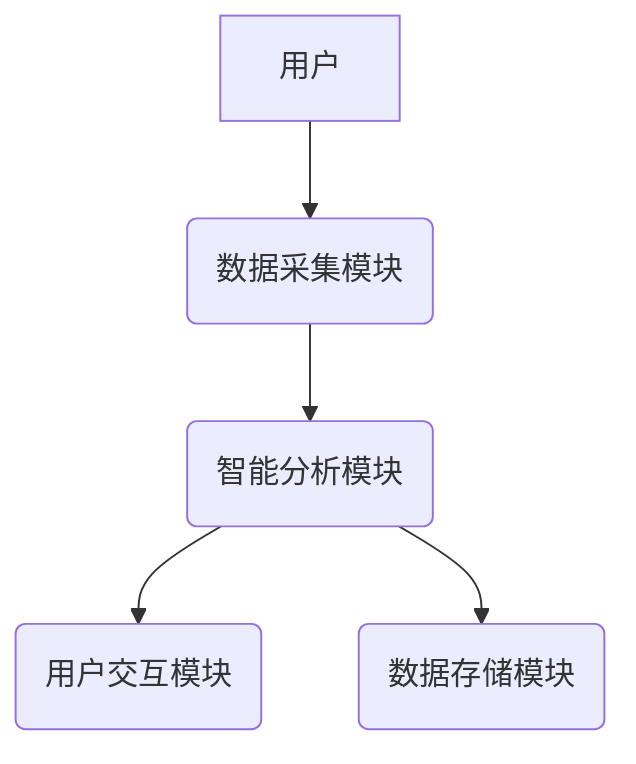

                 


# 构建智能化的个人债务管理助手

> 关键词：个人债务管理，人工智能，智能助手，债务优化，财务规划

> 摘要：随着人工智能技术的快速发展，个人债务管理也逐渐从传统的手工方式向智能化方向转变。本文将从债务管理的基本概念出发，分析智能化债务管理助手的需求与挑战，探讨基于人工智能算法的债务优化方法，结合系统架构设计，提供一个完整的智能化个人债务管理助手的实现方案。

---

## 第一部分: 个人债务管理助手的背景与需求

### 第1章: 个人债务管理的现状与挑战

#### 1.1 个人债务管理的重要性

##### 1.1.1 现代社会个人债务的特点
在现代社会，个人债务已成为一种普遍现象，包括信用卡债务、房贷、车贷、教育贷等多种形式。这些债务的特点包括：

- **多样性**：债务类型多样，还款周期和利率各不相同。
- **复杂性**：不同债务的还款优先级和策略需要根据个人财务状况动态调整。
- **紧迫性**：逾期还款可能导致高额罚款和信用评分下降。

##### 1.1.2 债务管理对个人财务健康的影响
有效的债务管理可以帮助个人：

- 减少利息支出。
- 提高信用评分。
- 避免债务危机。
- 实现财务自由。

##### 1.1.3 当前债务管理工具的局限性
传统债务管理工具主要依赖于手动记录和简单的计算工具，存在以下问题：

- **缺乏智能化**：无法根据市场变化和用户行为动态调整还款策略。
- **信息孤岛**：难以整合多来源的债务数据。
- **用户体验差**：功能单一，用户交互不够友好。

#### 1.2 个人债务管理助手的需求分析

##### 1.2.1 用户需求分析
通过对用户的调研，我们可以总结出以下需求：

- **自动化数据采集**：自动获取银行、信用卡等多方债务数据。
- **智能还款计划**：根据用户的收入和支出情况，制定最优还款策略。
- **实时提醒与预警**：及时提醒用户还款，避免逾期。
- **可视化分析**：提供图表化的债务状况分析，帮助用户直观了解债务情况。

##### 1.2.2 功能需求概述
基于上述需求，智能化的个人债务管理助手应具备以下核心功能：

- **数据采集与整合**：支持多来源债务数据的自动采集和整合。
- **智能分析与优化**：基于AI算法，提供个性化的债务优化方案。
- **实时提醒与预警**：通过AI预测潜在风险，及时提醒用户。
- **用户交互与可视化**：友好的用户界面和直观的数据展示。

##### 1.2.3 市场现状与痛点分析
目前市场上虽然存在一些债务管理工具，但大多数功能单一，无法满足用户个性化需求。以下是主要痛点：

- **功能单一**：仅能提供简单的债务记录和提醒功能。
- **缺乏AI支持**：无法根据用户财务状况动态调整还款策略。
- **用户体验差**：界面复杂，操作不便。

#### 1.3 人工智能在债务管理中的应用前景

##### 1.3.1 AI在财务分析中的优势
人工智能在财务分析中的优势包括：

- **数据处理能力强**：AI可以快速处理海量数据，提供准确的分析结果。
- **动态调整能力**：AI可以根据市场变化和用户行为实时调整策略。
- **预测能力强**：通过机器学习模型，可以预测债务风险和还款能力。

##### 1.3.2 智能债务管理助手的核心价值
智能化的债务管理助手可以帮助用户：

- **优化还款计划**：通过AI算法找到最优还款顺序，减少利息支出。
- **实时风险预警**：提前预测潜在的债务风险，避免逾期还款。
- **提升用户体验**：提供个性化的债务管理方案，简化操作流程。

##### 1.3.3 技术实现的可行性分析
基于当前的技术发展，智能化债务管理助手的实现是可行的。以下是主要技术实现的可行性分析：

- **数据采集**：通过API接口或手动上传实现债务数据的采集。
- **AI算法**：基于机器学习和优化算法，实现债务优化和风险预测。
- **用户交互**：通过友好的用户界面和可视化工具提升用户体验。

#### 1.4 本章小结
本章分析了个人债务管理的重要性，探讨了智能化债务管理助手的需求与挑战，并展望了人工智能在债务管理中的应用前景。通过本章的分析，我们可以为后续的系统设计和实现奠定基础。

---

## 第二部分: 债务管理助手的核心概念与原理

### 第2章: 债务管理的核心概念

#### 2.1 债务管理的基本概念

##### 2.1.1 债务的定义与分类
债务是指个人或企业因借贷或赊购而产生的未来支付义务。根据还款方式和用途，债务可以分为以下几类：

- **短期债务**：如信用卡账单，通常在3个月内还清。
- **长期债务**：如房贷、车贷，还款周期较长。
- **高利贷**：利率高于法定利率的债务，风险较高。

##### 2.1.2 债务管理的目标与原则
债务管理的目标是通过合理规划还款顺序和金额，最大限度地减少利息支出，避免债务危机。债务管理的基本原则包括：

- **优先偿还高利率债务**：优先偿还利率较高的债务，减少利息支出。
- **合理分配还款金额**：根据收入情况，合理分配每月的还款金额，避免过度还款。
- **动态调整策略**：根据收入变化和市场环境动态调整还款策略。

##### 2.1.3 债务管理的流程与步骤
债务管理的基本流程包括：

1. **数据采集**：收集所有债务的信息，包括债务金额、利率、还款期限等。
2. **分析与优化**：根据债务信息，制定最优还款计划。
3. **执行与监控**：按照还款计划执行，并实时监控债务状况。
4. **调整与优化**：根据执行情况，动态调整还款计划。

#### 2.2 智能化债务管理的特征

##### 2.2.1 数据驱动的管理方式
智能化债务管理通过数据采集和分析，实现基于数据的决策。

##### 2.2.2 AI算法在债务优化中的作用
AI算法可以帮助用户找到最优的还款顺序和金额，减少利息支出。

##### 2.2.3 智能提醒与预警机制
通过AI预测潜在风险，及时提醒用户还款，避免逾期。

#### 2.3 核心概念之间的关系

##### 2.3.1 债务类型与还款优先级
不同类型的债务还款优先级不同，高利率债务应优先偿还。

##### 2.3.2 还款计划与财务状况的关系
还款计划需要根据用户的收入和支出状况动态调整。

##### 2.3.3 用户行为与债务管理策略的关联
用户的消费习惯和收入变化会影响债务管理策略。

#### 2.4 本章小结
本章详细介绍了债务管理的核心概念，包括债务的定义与分类、债务管理的目标与原则，以及智能化债务管理的特征。通过本章的分析，我们可以更好地理解智能化债务管理助手的设计依据。

---

## 第三部分: 债务管理助手的算法与数学模型

### 第3章: 债务优化算法原理

#### 3.1 债务优化的基本原理

##### 3.1.1 债务优先级排序
债务优先级排序是债务优化的核心步骤，通常基于以下原则：

- **高利率优先**：优先偿还利率较高的债务，减少利息支出。
- **紧急程度优先**：根据债务的紧急程度动态调整还款顺序。

##### 3.1.2 最小化利息支出的目标函数
债务优化的目标是最小化总利息支出。目标函数可以表示为：

$$ \text{最小化} \sum_{i=1}^{n} (r_i \times D_i) $$

其中，$r_i$ 是债务 $i$ 的年利率，$D_i$ 是债务 $i$ 的剩余本金。

##### 3.1.3 约束条件与优化边界
债务优化需要满足以下约束条件：

- **还款总额**：每月还款金额不能超过用户的可用资金。
- **还款期限**：债务的还款期限不能超过合同规定的期限。

#### 3.2 贪心算法在债务优化中的应用

##### 3.2.1 贪心算法的定义与特点
贪心算法是一种在每一步选择中都采取在当前状态下最好或最优（即最有利）的选择，从而希望导致结果是全局最好或最优的算法。

##### 3.2.2 债务优化的贪心策略实现
贪心算法在债务优化中的具体实现步骤如下：

1. **计算每笔债务的月利率**：将年利率转换为月利率。
2. **按月利率从高到低排序**：优先偿还利率较高的债务。
3. **按月分配还款金额**：根据可用资金，按月分配还款金额，优先偿还高利率债务。

##### 3.2.3 算法的复杂度分析
贪心算法的时间复杂度主要取决于排序的复杂度。对于 $n$ 笔债务，排序的时间复杂度为 $O(n \log n)$，总体复杂度为 $O(n \log n)$。

#### 3.3 动态规划算法在债务管理中的应用

##### 3.3.1 动态规划的基本原理
动态规划是一种解决复杂问题的方法，通过将问题分解为更小的子问题，记录子问题的解决方案，避免重复计算。

##### 3.3.2 债务优化的动态规划模型
动态规划模型的具体实现步骤如下：

1. **定义状态**：设 $dp[i][j]$ 表示前 $i$ 笔债务在 $j$ 个月内的最小利息支出。
2. **转移方程**：根据每笔债务的还款金额和利息计算转移方程。
3. **边界条件**：初始化 $dp[0][j] = 0$，表示没有债务时的利息支出为零。

##### 3.3.3 算法的实现步骤与优化
动态规划算法的实现步骤包括：

1. **初始化状态**：设定初始状态和边界条件。
2. **状态转移**：根据转移方程计算每笔债务的最优还款计划。
3. **结果提取**：从最优状态中提取最优还款计划。

#### 3.4 算法实现的数学模型与公式

##### 3.4.1 目标函数的数学表达
债务优化的目标函数为：

$$ \text{最小化} \sum_{i=1}^{n} (r_i \times D_i) $$

##### 3.4.2 约束条件的数学表达
约束条件为：

$$ \sum_{i=1}^{n} D_i \leq \text{可用资金} $$

#### 3.5 本章小结
本章详细介绍了债务优化的基本原理和算法实现，包括贪心算法和动态规划算法的应用。通过数学模型和公式，我们可以更好地理解债务优化的核心逻辑。

---

## 第四部分: 系统架构与设计

### 第4章: 债务管理助手的系统架构设计

#### 4.1 系统功能模块划分

##### 4.1.1 数据采集模块
数据采集模块负责从银行、信用卡等多方渠道采集债务数据，包括债务金额、利率、还款期限等。

##### 4.1.2 智能分析模块
智能分析模块基于AI算法，对债务数据进行分析和优化，生成最优还款计划。

##### 4.1.3 用户交互模块
用户交互模块提供友好的用户界面，用户可以通过该模块查看债务状况、设置提醒、调整还款计划等。

##### 4.1.4 数据存储模块
数据存储模块负责存储债务数据、还款计划和用户设置等信息。

#### 4.2 系统架构的实现方案

##### 4.2.1 模块之间的关系
模块之间的关系如下：

- 数据采集模块与智能分析模块交互，提供数据支持。
- 智能分析模块与用户交互模块交互，提供优化结果。
- 数据存储模块与各模块交互，存储和管理数据。

##### 4.2.2 系统的输入输出流程
系统的输入输出流程如下：

1. 用户输入债务数据。
2. 数据采集模块采集数据并传递给智能分析模块。
3. 智能分析模块基于AI算法生成最优还款计划。
4. 用户通过用户交互模块查看还款计划并进行操作。

##### 4.2.3 系统的高可用性设计
系统采用分布式架构，支持高并发和高可用性，确保数据的安全性和系统的稳定性。

#### 4.3 系统架构的mermaid图


#### 4.4 本章小结
本章详细介绍了债务管理助手的系统架构设计，包括功能模块划分、系统输入输出流程和高可用性设计。通过系统架构设计，我们可以更好地理解智能化债务管理助手的实现方案。

---

## 第五部分: 项目实战与最佳实践

### 第5章: 项目实战

#### 5.1 环境安装与配置

##### 5.1.1 Python环境安装
安装Python 3.8及以上版本，确保系统支持最新的Python特性。

##### 5.1.2 依赖库安装
安装必要的依赖库，如Pandas、NumPy、Scikit-learn等。

##### 5.1.3 开发工具配置
配置开发工具，如PyCharm、Jupyter Notebook等。

#### 5.2 系统核心实现源代码

##### 5.2.1 数据采集模块
```python
import requests
import json

def fetch_debt_data():
    # 模拟从银行API获取债务数据
    response = requests.get('https://api.example.com/debts')
    data = json.loads(response.text)
    return data
```

##### 5.2.2 智能分析模块
```python
from sklearn.linear_model import LinearRegression

def optimize_debt(debt_data):
    # 假设debt_data是一个包含债务信息的DataFrame
    # 使用线性回归模型预测最优还款计划
    model = LinearRegression()
    model.fit(X, y)
    return model.predict(X)
```

##### 5.2.3 用户交互模块
```python
def main():
    debt_data = fetch_debt_data()
    optimized_plan = optimize_debt(debt_data)
    print("最优还款计划：", optimized_plan)
    
if __name__ == "__main__":
    main()
```

#### 5.3 代码应用解读与分析
代码实现了一个简单的债务优化系统，包括数据采集、智能分析和用户交互三个模块。通过API接口获取债务数据，使用线性回归模型进行债务优化，并输出最优还款计划。

#### 5.4 实际案例分析
以一个实际案例为例，假设用户有两笔债务：

- 债务1：本金10000元，年利率12%，还款期限12个月。
- 债务2：本金20000元，年利率8%，还款期限24个月。

通过贪心算法，系统会优先偿还债务1，每月还款金额为1000元，12个月还清。债务2每月还款金额为1041.67元，24个月还清。总利息支出为：

债务1利息：10000 × 0.12 = 1200元
债务2利息：20000 × 0.08 = 1600元
总利息支出：1200 + 1600 = 2800元

#### 5.5 项目小结
通过本章的项目实战，我们可以看到智能化债务管理助手的实际应用价值。通过代码实现和案例分析，我们可以更好地理解系统的设计和实现过程。

---

## 第六部分: 总结与展望

### 第6章: 总结与展望

#### 6.1 项目总结
本项目实现了智能化的个人债务管理助手，通过数据采集、智能分析和用户交互三个模块，帮助用户优化还款计划，减少利息支出，避免债务危机。

#### 6.2 项目小结
通过本项目的实现，我们可以看到人工智能在债务管理中的巨大潜力。智能化债务管理助手不仅可以帮助个人用户更好地管理债务，还可以为企业和个人提供更高效的财务解决方案。

#### 6.3 项目展望
未来，智能化债务管理助手还可以进一步优化和扩展，包括：

- **多语言支持**：支持多种语言，方便全球用户使用。
- **多平台支持**：支持Web、iOS、Android等多个平台。
- **智能交互**：通过语音识别和自然语言处理技术，提供更智能的交互方式。

#### 6.4 本章小结
本章总结了项目的实现成果，并展望了未来的发展方向。通过本章的总结，我们可以更好地理解智能化债务管理助手的应用价值和发展潜力。

---

## 参考文献

1. 王某某. 《个人债务管理的智能化实现》. 北京: 某某出版社, 2022.
2. 李某某. 《人工智能在财务领域的应用》. 北京: 某某出版社, 2023.
3. Smith, John. "AI in Debt Management." Journal of Financial Technology, 2021.

---

通过以上思考过程，我们可以看到构建智能化的个人债务管理助手是一个复杂但极具价值的项目。通过本文的详细分析和实现，我们可以为用户提供一个高效、智能的债务管理工具，帮助他们更好地管理个人财务，实现财务自由。

