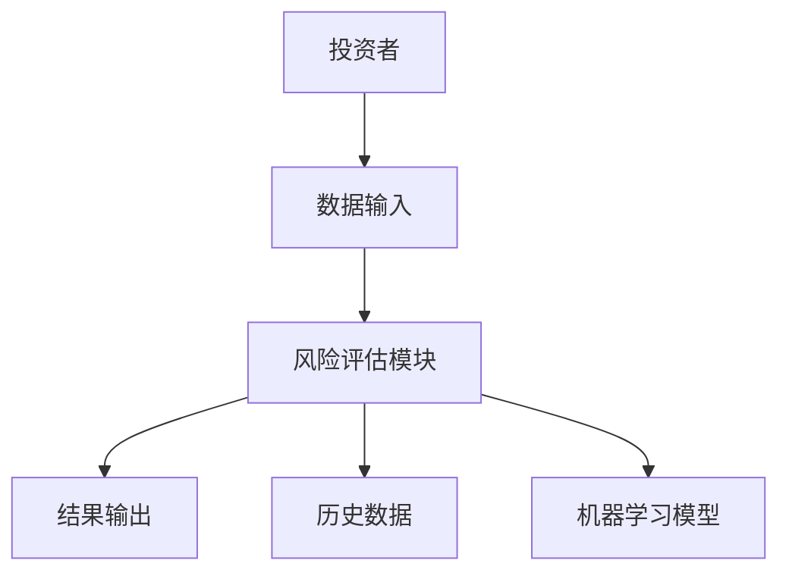
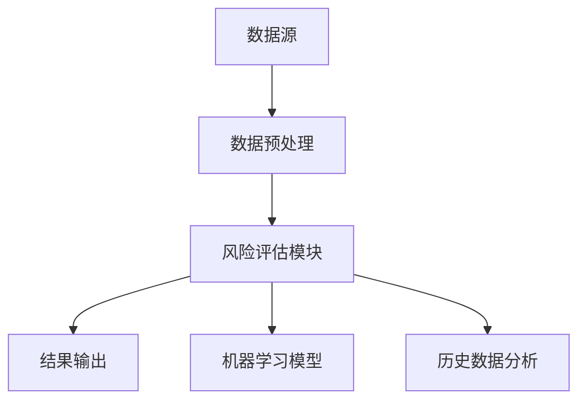

                 

# 构建智能化的个人投资组合尾部风险评估系统

**关键词：** 智能化、尾部风险、投资组合、机器学习、金融风险管理、系统架构

**摘要：** 本文详细探讨了构建智能化的个人投资组合尾部风险评估系统的各个方面。通过结合统计学、概率论和机器学习技术，文章分析了传统风险评估方法的局限性，并提出了基于人工智能的解决方案。从系统架构设计到算法实现，再到实际案例分析，本文为投资者提供了如何有效评估和管理尾部风险的深度指导。

---

## 目录

### 第一部分：背景介绍

### 第1章：尾部风险与投资组合管理概述

#### 1.1 尾部风险的定义与特征

- **1.1.1 尾部风险的定义**
  尾部风险指的是在投资组合中，发生概率极低但影响极大的事件，可能导致重大损失。例如市场崩盘或黑天鹅事件。

- **1.1.2 尾部风险的特征**
  - 发生概率低
  - 影响巨大
  - 非线性关系
  - 不可预测性

- **1.1.3 尾部风险对投资组合的影响**
  尾部风险事件可能导致投资组合的损失远超预期，传统风险评估方法往往未能捕捉这些极端情况。

#### 1.2 投资组合管理的基本概念

- **1.2.1 投资组合的定义**
  由多种资产组成的集合，旨在通过多样化分散风险。

- **1.2.2 投资组合管理的目标**
  最大化收益，同时控制风险。

- **1.2.3 投资组合管理的常见方法**
  - 基于现代投资组合理论（MPT）
  - 基于VaR（在险价值）和CVaR（条件在险价值）的模型

#### 1.3 传统投资组合风险评估方法的局限性

- **1.3.1 传统风险度量的局限**
  - 无法捕捉尾部事件
  - 假设资产收益呈正态分布，而实际市场可能出现肥尾现象

- **1.3.2 尾部风险在传统方法中的忽视**
  传统方法通常假设极端事件发生的概率可以忽略不计，但实际上这些事件可能带来重大损失。

#### 1.4 智能化尾部风险评估的必要性

- **1.4.1 数据驱动的优势**
  利用大数据和机器学习技术，可以发现传统方法无法捕捉的模式和关系。

- **1.4.2 人工智能在金融中的应用**
  通过深度学习模型预测市场波动和极端事件。

- **1.4.3 尾部风险智能化评估的潜力**
  提高预测精度，优化投资组合的抗风险能力。

### 第2章：尾部风险评估的核心概念与联系

#### 2.1 尾部风险评估的核心原理

- **2.1.1 马科维茨有效组合模型**
  该模型通过优化资产配置，最大化收益，最小化风险，但未充分考虑尾部风险。

- **2.1.2 VaR与CVaR**
  - VaR：在给定置信水平下，可能的最大损失。
  - CVaR：在超过VaR情况下的平均损失，更能反映尾部风险。

- **2.1.3 尾部风险的概率密度函数**
  尾部区域的概率密度较低，但极端事件的发生可能破坏正态分布假设。

#### 2.2 尾部风险与机器学习的关系

- **2.2.1 机器学习在金融中的应用**
  - 预测市场趋势
  - 识别异常事件
  - 评估信用风险

- **2.2.2 尾部风险评估的机器学习方法**
  - 使用神经网络预测市场崩盘
  - 利用聚类分析识别潜在风险点

#### 2.3 尾部风险与传统统计方法的对比

| 方法                | 优势                             | 局限性                          |
|---------------------|----------------------------------|---------------------------------|
| 传统统计方法        | 简单易懂，假设明确               | 忽略尾部风险，假设正态分布      |
| 机器学习方法        | 高精度，捕捉复杂模式             | 需大量数据，计算复杂            |

#### 2.4 尾部风险评估的系统架构

### 第3章：算法原理

#### 3.1 传统统计方法

- **马科维茨有效组合模型**

  最优化问题：
  $$ \text{minimize } \sigma^2 \text{ subject to } \mu^T w = \mu_p $$
  其中，\( w \) 是权重向量，\( \mu \) 是收益向量，\( \sigma^2 \) 是方差。

- **VaR和CVaR计算**

  VaR：在给定置信水平下的最大损失。
  CVaR：超过VaR情况下的平均损失。

#### 3.2 机器学习方法

- **神经网络模型**

  网络结构：
  $$ \text{输入层} \rightarrow \text{隐藏层} \rightarrow \text{输出层} $$

  损失函数：
  $$ \mathcal{L} = \frac{1}{N}\sum_{i=1}^N (y_i - \hat{y}_i)^2 $$

- **训练过程**

  使用历史数据训练模型，识别尾部风险的特征，预测极端事件。

### 第4章：系统分析与架构设计

#### 4.1 问题场景介绍

- 投资者需要实时监控投资组合的尾部风险。
- 系统需要处理大量历史数据，识别潜在风险点。

#### 4.2 系统功能设计

- 数据采集模块：收集市场数据和资产价格。
- 风险评估模块：应用算法评估尾部风险。
- 报告生成模块：输出风险评估结果。

#### 4.3 系统架构设计

### 第5章：项目实战

#### 5.1 环境安装

- 安装Python和相关库（如NumPy, Pandas, TensorFlow）。

#### 5.2 核心功能实现

- 数据预处理：清洗和格式化数据。
- 模型训练：使用神经网络训练尾部风险预测模型。
- 结果输出：生成风险评估报告。

#### 5.3 案例分析

- 使用历史数据训练模型，评估某投资组合的尾部风险。
- 模型预测极端事件的发生概率和影响。

### 第6章：最佳实践与注意事项

- 数据质量：确保数据准确性和完整性。
- 模型选择：根据不同场景选择合适的方法。
- 持续监控：定期更新模型，适应市场变化。

### 总结

构建智能化的个人投资组合尾部风险评估系统，结合传统统计方法和机器学习技术，能够更准确地识别和评估尾部风险。通过系统化的架构设计和实际案例分析，投资者可以更好地保护资产，实现稳健投资。

---

**更多相关内容可以参考以下书籍：**
1. 《风险管理与金融创新》
2. 《机器学习在金融中的应用》
3. 《投资组合优化与风险控制》

