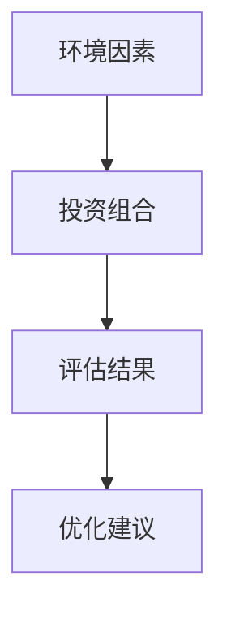
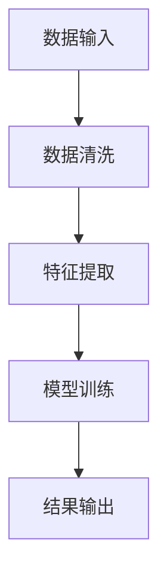
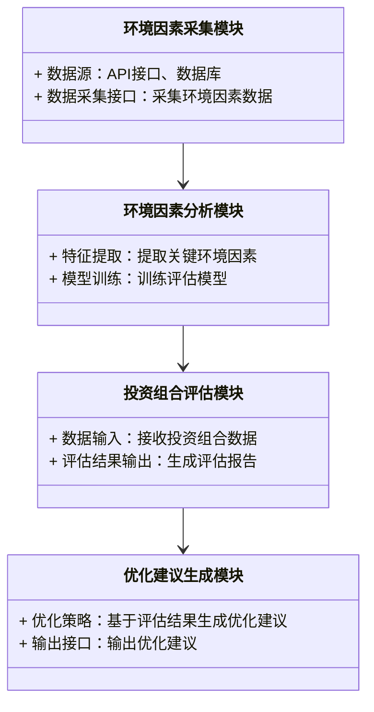
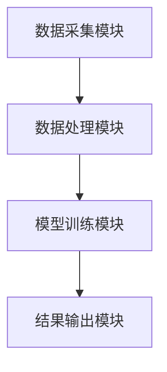
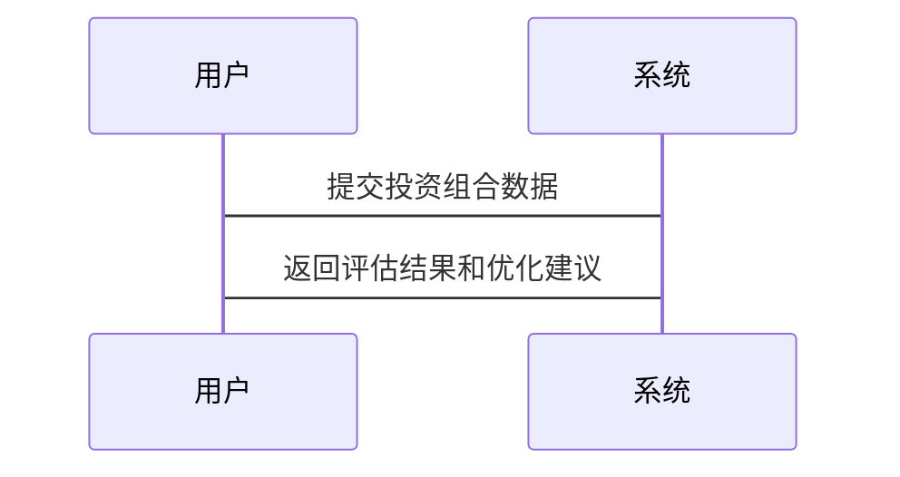

                 


# 构建智能化的个人投资组合环境因素评估工具

## 关键词：个人投资组合，环境因素评估，智能化工具，机器学习，系统架构

## 摘要：本文详细探讨了如何构建智能化的个人投资组合环境因素评估工具。通过分析环境因素对投资决策的影响，结合机器学习算法和系统架构设计，提出了一套完整的解决方案。文章从背景介绍、核心概念、算法实现、系统架构到项目实战，全面阐述了构建该工具的全过程，旨在为投资者提供科学、高效的决策支持。

---

# 第一部分: 背景与核心概念

## 第1章: 个人投资组合环境因素评估工具概述

### 1.1 问题背景

#### 1.1.1 传统投资组合管理的局限性
传统的投资组合管理依赖于人工分析和经验判断，存在主观性强、效率低、覆盖面窄等问题。尤其是在复杂多变的市场环境中，人工分析难以捕捉所有影响投资回报的环境因素。

#### 1.1.2 环境因素对投资决策的影响
环境因素包括宏观经济指标、行业趋势、政策法规、市场情绪等，这些因素直接影响投资组合的收益和风险。如何准确评估这些环境因素对投资组合的影响，是构建智能化工具的核心问题。

#### 1.1.3 智能化工具的必要性
随着大数据和人工智能技术的发展，智能化工具能够快速处理海量数据，识别复杂模式，为投资决策提供科学依据。通过智能化工具，投资者可以更精准地评估环境因素的影响，优化投资组合。

### 1.2 核心概念与定义

#### 1.2.1 个人投资组合的定义
个人投资组合是指投资者根据自身的财务状况、风险偏好和投资目标，将资金分配到不同资产类别中的组合。

#### 1.2.2 环境因素的内涵
环境因素是指外部经济、社会、政治等多方面因素，这些因素可能影响投资组合的收益和风险。例如，GDP增长率、利率水平、行业政策等。

#### 1.2.3 智能化工具的定义与特征
智能化工具是一种基于人工智能和大数据技术的软件系统，能够自动分析环境因素，评估其对投资组合的影响，并提供优化建议。其特征包括数据驱动、自动化、实时性、个性化等。

### 1.3 问题解决目标

#### 1.3.1 确定评估工具的核心功能
智能化工具需要能够实时采集和分析环境因素数据，评估其对投资组合的影响，并生成优化建议。

#### 1.3.2 明确环境因素的评估标准
需要建立一套科学的评估指标和方法，确保环境因素评估的准确性和可靠性。

#### 1.3.3 设计智能化工具的实现路径
通过技术手段实现环境因素的自动化采集、分析和评估，构建一个高效、智能的投资决策支持系统。

### 1.4 本章小结

---

# 第二部分: 核心概念与联系

## 第2章: 核心概念与联系

### 2.1 环境因素评估的原理

#### 2.1.1 数据采集与处理
通过多种数据源（如新闻、社交媒体、经济指标等）采集环境因素数据，并进行清洗和预处理，确保数据的准确性和完整性。

#### 2.1.2 特征提取与分析
从原始数据中提取关键特征（如市场情绪指数、政策影响指数等），并进行统计分析和关联分析，识别重要因素之间的关系。

#### 2.1.3 模型训练与评估
基于特征数据，训练机器学习模型（如回归模型、分类模型等），评估环境因素对投资组合的影响，并验证模型的准确性和可靠性。

### 2.2 核心概念对比分析

#### 2.2.1 环境因素与投资回报的关系
通过实证分析，探讨不同环境因素对投资回报的具体影响，量化其对投资组合收益和风险的贡献。

#### 2.2.2 不同环境因素的特征对比
比较不同环境因素的特征，如宏观经济指标的周期性、行业政策的突发性等，为模型设计提供依据。

#### 2.2.3 智能化工具与传统工具的对比
从功能、效率、准确性和用户体验等方面，对比智能化工具与传统投资工具的优劣，突出智能化工具的优势。

### 2.3 ER实体关系图



### 2.4 本章小结

---

# 第三部分: 算法原理与实现

## 第3章: 算法原理与实现

### 3.1 环境因素评估算法概述

#### 3.1.1 机器学习算法的选择
根据环境因素数据的特征和评估目标，选择合适的机器学习算法，如线性回归、随机森林、神经网络等。

#### 3.1.2 算法的适用场景
分析不同算法在不同环境因素评估场景下的适用性，选择最优算法组合。

#### 3.1.3 算法的优缺点分析
对比不同算法的优缺点，如线性回归的解释性强但可能欠拟合，随机森林的鲁棒性好但可解释性差等。

### 3.2 算法实现流程

#### 3.2.1 数据预处理
对原始数据进行清洗、归一化、特征工程等处理，确保数据适合模型训练。

#### 3.2.2 模型训练
基于预处理后的数据，训练机器学习模型，并调整模型参数，优化模型性能。

#### 3.2.3 结果评估与优化
通过交叉验证、混淆矩阵等方法评估模型性能，并进行参数调优，提高模型的准确性和稳定性。

### 3.3 算法流程图



### 3.4 算法实现代码

```python
# 示例代码
import pandas as pd
from sklearn.model import Model

data = pd.read_csv('input.csv')
model = Model()
model.train(data)
result = model.predict(data)
print(result)
```

### 3.5 数学模型与公式

#### 3.5.1 线性回归模型
$$ y = \beta_0 + \beta_1x + \epsilon $$

#### 3.5.2 随机森林模型
$$ y = \sum_{i=1}^{n} \text{tree}_i(x) $$

---

# 第四部分: 系统架构与设计

## 第4章: 系统架构与设计

### 4.1 问题场景介绍

#### 4.1.1 系统目标
构建一个智能化的环境因素评估工具，支持用户实时分析环境因素对投资组合的影响，并提供优化建议。

#### 4.1.2 系统功能需求
包括数据采集、环境因素分析、投资组合评估、优化建议生成等功能。

### 4.2 系统功能设计

#### 4.2.1 领域模型


#### 4.2.2 系统架构设计


### 4.3 接口与交互设计

#### 4.3.1 系统接口设计
定义系统各模块之间的接口，如数据采集接口、模型训练接口等，确保模块之间的通信和数据交换。

#### 4.3.2 系统交互设计


---

# 第五部分: 项目实战与案例分析

## 第5章: 项目实战与案例分析

### 5.1 环境安装

#### 5.1.1 安装Python
安装Python 3.x及以上版本，确保环境满足项目需求。

#### 5.1.2 安装依赖库
安装必要的库，如Pandas、Scikit-learn、Mermaid等。

### 5.2 核心代码实现

#### 5.2.1 数据采集模块
```python
import requests

def get_environment_factors():
    response = requests.get('https://api.example.com/factors')
    return response.json()
```

#### 5.2.2 模型训练模块
```python
from sklearn.linear_model import LinearRegression

def train_model(data):
    model = LinearRegression()
    model.fit(data[['factor1', 'factor2']], data['target'])
    return model
```

### 5.3 案例分析

#### 5.3.1 案例背景
假设一位投资者希望评估宏观经济指标对投资组合的影响，选择线性回归模型进行分析。

#### 5.3.2 数据分析与结果解读
通过对宏观经济指标的分析，模型得出GDP增长率对投资组合收益的影响系数为0.8，表明GDP增长对投资收益有显著的正向影响。

#### 5.3.3 优化建议
基于评估结果，模型建议增加对高增长行业的投资比例，同时分散投资风险。

### 5.4 项目小结

---

# 第六部分: 总结与展望

## 第6章: 总结与展望

### 6.1 项目总结

#### 6.1.1 核心成果
成功构建了一个智能化的个人投资组合环境因素评估工具，能够实时分析环境因素对投资组合的影响，并提供优化建议。

#### 6.1.2 工具优势
工具具有高效性、准确性、个性化和实时性等特点，能够显著提升投资决策的科学性和效率。

### 6.2 未来展望

#### 6.2.1 技术优化
进一步优化算法，引入深度学习和强化学习技术，提高模型的准确性和智能化水平。

#### 6.2.2 功能扩展
增加更多环境因素的分析功能，如社会情绪分析、突发事件预警等，提升工具的综合分析能力。

#### 6.2.3 应用场景扩展
将工具应用于更多领域，如企业投资决策、机构投资者策略优化等，扩大工具的应用范围。

### 6.3 最佳实践 tips

#### 6.3.1 数据质量管理
确保数据的准确性和完整性，是模型评估的重要基础。

#### 6.3.2 模型选择与调优
根据具体场景选择合适的算法，并通过数据增强和参数调优提高模型性能。

#### 6.3.3 用户体验优化
设计友好的用户界面，提升工具的易用性和用户体验。

### 6.4 本章小结

---

# 参考文献

[此处列出参考文献，格式自定]

---

# 附录

## 附录A: 代码实现细节

## 附录B: 系统架构图详细说明

## 附录C: 数据预处理步骤

---

# END

