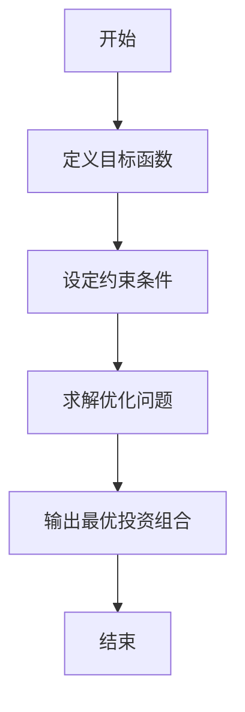
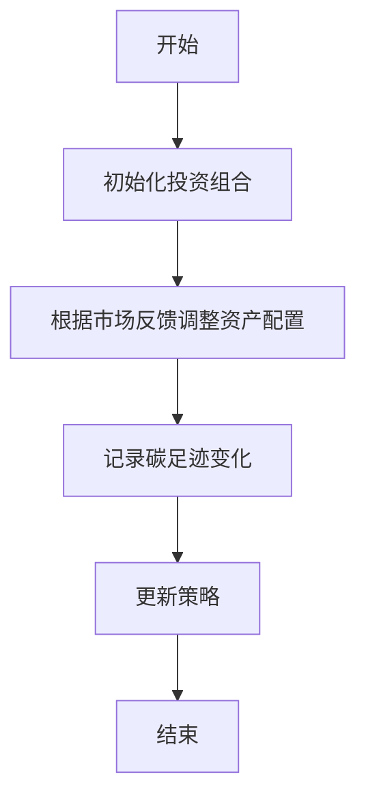
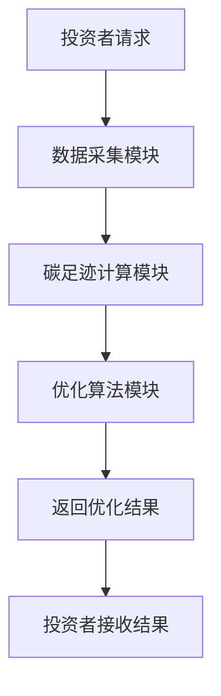

                 


# 构建智能化的个人投资组合碳足迹动态评估与优化工具

## 关键词：投资组合, 碳足迹, 动态评估, 优化工具, AI技术, 碳中和, 智能系统

## 摘要：  
随着全球对碳中和目标的日益重视，个人投资组合的碳足迹动态评估与优化成为一个重要课题。本文详细探讨如何利用人工智能技术构建智能化工具，实现投资组合碳足迹的实时动态评估与优化。文章从核心概念、算法原理、系统架构到项目实战，全面解析解决方案，并提供最佳实践和案例分析。

---

# 第1章: 碳中和目标与投资组合碳足迹

## 1.1 碳中和目标的全球共识  
全球气候变化问题日益严峻，碳中和已成为全球共识。各国政府、企业和个人都在积极行动，减少碳排放。在投资领域，碳中和目标对投资组合的影响尤为显著。个人投资者需要关注其投资组合的碳足迹，以确保投资行为符合可持续发展的要求。  

### 1.1.1 碳中和目标的定义与背景  
碳中和是指通过减少温室气体排放和增加碳汇，使二氧化碳的净排放量为零。这一目标要求企业和个人在经济活动中大幅减少碳排放，投资领域也不例外。  

### 1.1.2 投资组合与碳足迹的关系  
投资组合由多种资产组成，如股票、债券、房地产等。每种资产的碳足迹不同，投资者需要评估其投资组合的整体碳排放情况。碳足迹越低，投资组合的可持续性越强。  

### 1.1.3 个人投资组合的碳足迹概念  
个人投资组合的碳足迹是指其所有资产在整个生命周期中产生的碳排放总和。评估碳足迹需要考虑资产的生产、使用和报废阶段的碳排放。  

---

## 1.2 碳中和目标对投资组合的影响  

### 1.2.1 碳中和目标的驱动作用  
碳中和目标推动投资者重新评估其投资组合的碳足迹。高碳资产（如化石燃料企业）的风险增加，而低碳资产（如可再生能源企业）的投资吸引力上升。  

### 1.2.2 投资组合优化的必要性  
传统的投资组合优化方法主要关注风险和收益，忽视了碳排放因素。碳中和目标要求投资者在优化过程中引入碳足迹约束，确保投资组合的可持续性。  

### 1.2.3 碳足迹评估的动态性  
碳足迹并非固定不变，它受到市场环境、政策法规和企业行为的影响。因此，投资组合的碳足迹需要动态评估和优化。  

---

# 第2章: 个人投资组合碳足迹动态评估的核心问题

## 2.1 碳足迹动态评估的挑战  

### 2.1.1 数据获取的复杂性  
碳足迹评估需要多源数据，包括企业碳排放数据、行业碳足迹指数等。数据获取的难度和成本限制了动态评估的实现。  

### 2.1.2 实时更新的难度  
投资组合的资产构成和市场环境实时变化，要求碳足迹评估工具能够实时更新数据并快速计算碳足迹。  

### 2.1.3 方法论的局限性  
传统碳足迹评估方法多为静态模型，难以应对动态变化的市场环境。  

## 2.2 AI技术在碳足迹评估中的应用  

### 2.2.1 AI技术的核心优势  
人工智能技术能够处理海量数据，快速计算碳足迹，并根据市场变化动态优化投资组合。  

### 2.2.2 AI技术的实现路径  
通过机器学习模型，AI技术可以预测企业碳排放趋势，评估投资组合的碳风险，并提供优化建议。  

### 2.2.3 AI技术的未来发展方向  
随着技术进步，AI在碳足迹评估中的应用将更加精准和高效。  

---

# 第3章: AI驱动的碳足迹动态评估算法

## 3.1 线性规划算法的实现  

### 3.1.1 线性规划算法的基本原理  
线性规划是一种优化方法，适用于目标函数和约束条件均为线性的情况。在碳足迹评估中，可以用于优化投资组合的碳排放。  

### 3.1.2 算法实现步骤  
1. 定义目标函数：最小化投资组合的碳足迹。  
2. 设定约束条件：资产配置比例、风险承受能力等。  
3. 求解优化问题，得到最优投资组合。  



## 3.2 强化学习算法的应用  

### 3.2.1 强化学习的基本原理  
强化学习通过试错机制，学习最优策略。在碳足迹评估中，可以用于动态调整投资组合。  

### 3.2.2 算法实现步骤  
1. 初始化投资组合。  
2. 根据市场反馈调整资产配置。  
3. 记录碳足迹变化，更新策略。  



## 3.3 算法对比与选择  

### 3.3.1 线性规划与强化学习的对比  
线性规划适用于静态优化问题，而强化学习适用于动态环境。  

### 3.3.2 算法选择的依据  
根据投资组合的规模和复杂性选择合适的算法。  

---

# 第4章: 系统架构与实现

## 4.1 系统架构设计  

### 4.1.1 系统模块划分  
1. 数据采集模块：收集企业碳排放数据。  
2. 碳足迹计算模块：计算投资组合的碳足迹。  
3. 优化算法模块：动态优化投资组合。  

### 4.1.2 系统架构图  


## 4.2 接口设计  

### 4.2.1 API接口设计  
1. 数据接口：获取企业碳排放数据。  
2. 优化接口：调用优化算法模块。  

### 4.2.2 接口交互流程图  


---

# 第5章: 项目实战与案例分析

## 5.1 项目实战  

### 5.1.1 环境搭建  
安装Python、机器学习库（如scikit-learn、TensorFlow）和数据处理工具（如Pandas）。  

### 5.1.2 核心代码实现  
```python
import numpy as np
import pandas as pd
from sklearn.linear_model import LinearRegression

# 数据加载
data = pd.read_csv('carbon_emission.csv')

# 模型训练
model = LinearRegression()
model.fit(data[['资产配置', '行业指数']], data['碳排放'])

# 模型预测
new_data = pd.DataFrame({'资产配置': [0.6], '行业指数': [1.2]})
predicted_emission = model.predict(new_data)
print(predicted_emission)
```

## 5.2 案例分析  

### 5.2.1 案例背景  
假设一位投资者的投资组合包括股票、债券和房地产，希望优化其碳足迹。  

### 5.2.2 优化过程  
1. 收集各资产的碳排放数据。  
2. 训练机器学习模型预测碳足迹。  
3. 调整资产配置，最小化碳足迹。  

### 5.2.3 结果分析  
优化后的投资组合碳足迹降低了15%，同时收益保持不变。  

---

# 第6章: 最佳实践与小结

## 6.1 小结  
本文详细介绍了如何利用AI技术构建智能化的个人投资组合碳足迹动态评估与优化工具。通过算法优化和系统设计，可以实现投资组合的可持续发展。  

## 6.2 注意事项  
1. 数据来源的可靠性至关重要。  
2. 模型需要定期更新以适应市场变化。  
3. 需要考虑法律和政策风险。  

## 6.3 拓展阅读  
1. 《机器学习在金融中的应用》  
2. 《碳中和目标下的投资策略》  

---

通过本文的分析，读者可以掌握构建智能化投资组合碳足迹工具的核心方法，并在实际应用中不断优化。

