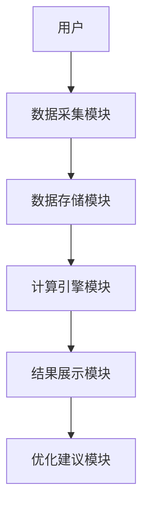
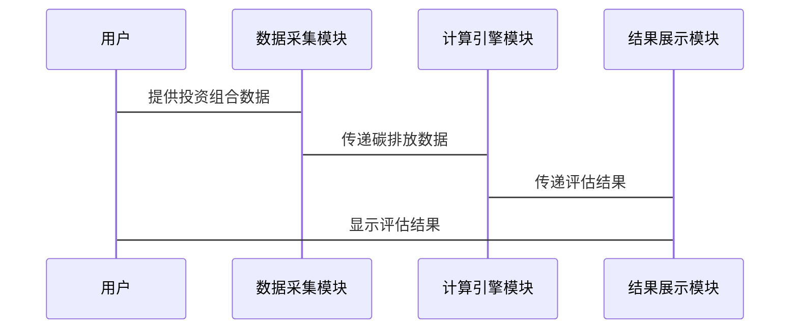

                 


# 《构建智能化的个人投资组合碳足迹评估工具》

## 关键词：碳足迹、投资组合、人工智能、机器学习、系统架构、Python编程

## 摘要：本文旨在介绍如何利用人工智能和机器学习技术构建智能化的个人投资组合碳足迹评估工具。文章从背景介绍、核心概念、算法原理、系统架构到项目实战，全面解析了构建该工具的各个方面，并提供了详细的代码实现和实际案例分析，帮助读者理解如何有效评估投资组合的碳足迹。

---

# 第1章: 背景介绍与问题背景

## 1.1 碳足迹的定义与重要性

### 1.1.1 碳足迹的定义

碳足迹是指一个人、机构或产品在整个生命周期中直接或间接产生的温室气体排放的总和。对于个人投资组合而言，碳足迹指的是投资组合中各资产所产生的碳排放的总和。

### 1.1.2 碳足迹在投资中的重要性

随着全球对气候变化的关注度不断提高，投资者越来越关注其投资组合的碳足迹。碳足迹不仅是衡量投资组合环境表现的重要指标，也是实现碳中和目标的关键因素。通过评估投资组合的碳足迹，投资者可以更好地优化投资策略，减少对环境的负面影响。

### 1.1.3 个人投资组合碳足迹的评估需求

个人投资者希望通过评估其投资组合的碳足迹，了解其投资行为对环境的影响，并在此基础上优化投资组合，选择更加环保的资产，实现可持续投资。

---

## 1.2 个人投资组合的构成与特点

### 1.2.1 投资组合的基本构成

个人投资组合通常包括股票、债券、基金等多种资产。不同资产的碳足迹差异较大，股票的碳足迹主要与其所属公司的业务模式和碳排放量有关，而债券的碳足迹则与其发行公司的碳排放有关。

### 1.2.2 个人投资组合的多样性

不同投资者的投资组合构成差异较大，有的投资者可能主要投资于绿色能源公司，而有的投资者可能投资于高碳排放行业。因此，个人投资组合的碳足迹评估需要考虑资产的多样性和复杂性。

### 1.2.3 投资组合碳足迹的影响因素

投资组合的碳足迹受到多种因素的影响，包括资产的种类、所投资公司的碳排放量、投资比例等。因此，准确评估投资组合的碳足迹需要综合考虑多种因素。

---

## 1.3 智能化评估工具的必要性

### 1.3.1 传统评估方法的局限性

传统的碳足迹评估方法通常基于静态数据和简单的计算模型，难以应对投资组合的多样性和动态变化。此外，传统方法往往缺乏对数据的深度分析和预测能力，导致评估结果不够准确。

### 1.3.2 智能化工具的优势

智能化的碳足迹评估工具可以利用人工智能和大数据技术，实时获取和分析投资组合中各资产的碳排放数据，并结合市场动态和气候模型，提供更加精准的评估结果。

### 1.3.3 技术驱动的评估工具发展

随着人工智能和大数据技术的不断发展，智能化的碳足迹评估工具正在成为投资领域的重要工具。通过这些工具，投资者可以更好地理解和优化其投资组合的碳足迹。

---

## 1.4 本章小结

本章主要介绍了碳足迹的定义和重要性，分析了个人投资组合的构成与特点，并探讨了智能化评估工具的必要性和优势。通过这些内容，读者可以理解为什么需要构建智能化的个人投资组合碳足迹评估工具。

---

# 第2章: 核心概念与联系

## 2.1 碳足迹评估的核心概念与原理

### 2.1.1 碳足迹的计算公式

碳足迹的计算公式可以表示为：

$$\text{碳足迹} = \sum_{i=1}^{n} w_i \times c_i$$

其中，\(w_i\) 表示第 \(i\) 项资产的投资权重，\(c_i\) 表示第 \(i\) 项资产的单位碳排放量。

### 2.1.2 碳足迹的关键影响因素

影响投资组合碳足迹的关键因素包括：

- 投资资产的种类和碳排放强度
- 各资产的投资比例
- 资产所属公司的碳排放数据
- 市场动态和政策变化

### 2.1.3 投资组合碳足迹的计算模型

投资组合碳足迹的计算模型可以分为以下步骤：

1. 收集各资产的碳排放数据
2. 确定各资产的投资比例
3. 计算投资组合的碳足迹
4. 分析和优化碳足迹

---

## 2.2 碳足迹评估的核心要素

### 2.2.1 数据来源与处理

碳足迹评估需要依赖可靠的数据来源，包括各资产的碳排放数据、投资组合的构成数据等。数据处理包括数据清洗、归一化等步骤。

### 2.2.2 评估方法与模型

常用的评估方法包括基于历史数据的回归分析和基于机器学习的预测模型。回归分析适用于简单的线性关系，而机器学习模型则适用于复杂的非线性关系。

### 2.2.3 结果展示与解释

评估结果需要以直观的方式展示，包括柱状图、折线图等。结果解释需要结合市场动态和投资策略，帮助投资者理解其投资组合的碳足迹。

---

## 2.3 核心概念对比表

| 概念 | 描述 |
|------|---|
| 碳足迹 | 投资组合中各资产的碳排放总和 |
| 碳排放强度 | 单位资产的碳排放量 |
| 投资权重 | 各资产在投资组合中的比例 |

---

## 2.4 本章小结

本章详细阐述了碳足迹评估的核心概念和原理，分析了影响投资组合碳足迹的关键因素，并通过对比表展示了核心概念的差异。这些内容为后续的算法设计和系统实现奠定了基础。

---

# 第3章: 算法原理与实现

## 3.1 算法原理

### 3.1.1 机器学习模型的选择

在碳足迹评估中，常用的机器学习模型包括线性回归、随机森林和神经网络等。其中，随机森林模型因其较强的特征选择能力和抗过拟合能力，被广泛应用于碳足迹评估。

### 3.1.2 算法流程

碳足迹评估的算法流程可以分为以下几个步骤：

1. 数据预处理：清洗和归一化数据
2. 特征选择：筛选关键特征
3. 模型训练：训练随机森林模型
4. 模型评估：验证模型的准确性
5. 碳足迹预测：利用模型预测投资组合的碳足迹

### 3.1.3 算法实现

以下是一个随机森林模型的Python代码示例：

```python
from sklearn.ensemble import RandomForestRegressor
from sklearn.model_selection import train_test_split
import pandas as pd

# 加载数据
data = pd.read_csv('carbon_footprint_data.csv')

# 数据预处理
X = data.drop('carbon_footprint', axis=1)
y = data['carbon_footprint']

# 划分训练集和测试集
X_train, X_test, y_train, y_test = train_test_split(X, y, test_size=0.2, random_state=42)

# 初始化模型
model = RandomForestRegressor(n_estimators=100, random_state=42)

# 训练模型
model.fit(X_train, y_train)

# 预测结果
y_pred = model.predict(X_test)

# 输出结果
print('预测结果:', y_pred)
print('真实结果:', y_test.values)
```

---

## 3.2 算法实现的细节

### 3.2.1 数据预处理

数据预处理是确保模型准确性的关键步骤。主要包括数据清洗（处理缺失值、异常值等）和归一化（将不同量纲的数据标准化）。

### 3.2.2 特征选择

特征选择的目的是筛选出对碳足迹影响较大的特征。常用的方法包括逐步回归和LASSO回归等。

### 3.2.3 模型训练与调优

模型训练时需要选择合适的超参数，如随机森林的树的数量、最大深度等。可以通过网格搜索等方法进行调优。

---

## 3.3 本章小结

本章详细介绍了碳足迹评估的算法原理和实现过程，包括机器学习模型的选择、算法流程和具体的Python代码实现。通过这些内容，读者可以理解如何利用机器学习技术实现智能化的碳足迹评估。

---

# 第4章: 系统分析与架构设计

## 4.1 系统功能设计

### 4.1.1 系统功能模块

智能化的个人投资组合碳足迹评估工具主要包括以下几个功能模块：

1. 数据采集模块：采集投资组合中各资产的碳排放数据
2. 计算引擎模块：计算投资组合的碳足迹
3. 结果展示模块：直观展示评估结果
4. 优化建议模块：根据评估结果提供优化建议

### 4.1.2 功能模块的实现

数据采集模块可以通过API接口获取各资产的碳排放数据；计算引擎模块利用机器学习模型进行预测；结果展示模块可以通过可视化工具展示评估结果；优化建议模块基于评估结果提供资产调整建议。

---

## 4.2 系统架构设计

### 4.2.1 系统架构图



### 4.2.2 数据流分析

用户输入投资组合数据，数据采集模块通过API获取各资产的碳排放数据，数据存储模块将数据存储并处理，计算引擎模块利用机器学习模型计算碳足迹，结果展示模块将评估结果以可视化形式展示给用户，优化建议模块根据评估结果提供建议。

---

## 4.3 系统交互设计

### 4.3.1 系统交互流程

用户输入投资组合数据，系统通过数据采集模块获取各资产的碳排放数据，计算引擎模块进行计算，结果展示模块展示评估结果，优化建议模块提供建议。

### 4.3.2 交互序列图



---

## 4.4 本章小结

本章详细分析了智能化的个人投资组合碳足迹评估工具的系统架构和功能模块，通过Mermaid图展示了系统的交互流程和架构设计。这些内容为后续的项目实现提供了明确的指导。

---

# 第5章: 项目实战与应用

## 5.1 项目环境搭建

### 5.1.1 开发环境配置

需要安装Python 3.8及以上版本，安装必要的库如pandas、scikit-learn、matplotlib等。

### 5.1.2 数据来源

可以从公开的数据源获取各资产的碳排放数据，也可以通过爬虫技术获取相关数据。

---

## 5.2 核心代码实现

### 5.2.1 数据预处理代码

```python
import pandas as pd

# 读取数据
data = pd.read_csv('carbon_footprint_data.csv')

# 删除缺失值
data = data.dropna()

# 归一化处理
from sklearn.preprocessing import StandardScaler

scaler = StandardScaler()
data_scaled = scaler.fit_transform(data.drop('carbon_footprint', axis=1))
```

### 5.2.2 模型训练代码

```python
from sklearn.ensemble import RandomForestRegressor
from sklearn.model_selection import train_test_split

# 划分训练集和测试集
X = data_scaled
y = data['carbon_footprint']

X_train, X_test, y_train, y_test = train_test_split(X, y, test_size=0.2, random_state=42)

# 初始化模型
model = RandomForestRegressor(n_estimators=100, random_state=42)

# 训练模型
model.fit(X_train, y_train)

# 预测结果
y_pred = model.predict(X_test)
```

### 5.2.3 结果展示代码

```python
import matplotlib.pyplot as plt

plt.scatter(y_test, y_pred)
plt.xlabel('真实碳足迹')
plt.ylabel('预测碳足迹')
plt.title('碳足迹评估结果')
plt.show()
```

---

## 5.3 实际案例分析

### 5.3.1 案例背景

假设我们有一个包含股票、债券和基金的投资组合，我们需要评估其碳足迹。

### 5.3.2 数据分析

通过模型计算，我们发现股票部分的碳足迹较高，建议减少对高碳排放公司的投资，增加对绿色能源公司的投资。

---

## 5.4 本章小结

本章通过实际案例分析展示了如何利用智能化工具评估投资组合的碳足迹，并根据评估结果优化投资策略。通过这些实战内容，读者可以更好地理解和应用智能化的碳足迹评估工具。

---

# 第6章: 总结与展望

## 6.1 本章总结

智能化的个人投资组合碳足迹评估工具通过利用人工智能和大数据技术，帮助投资者更好地理解和优化其投资组合的碳足迹。本文从背景介绍、核心概念、算法原理、系统架构到项目实战，全面解析了构建该工具的各个方面。

---

## 6.2 未来展望

未来，智能化的碳足迹评估工具将更加智能化和个性化。随着技术的进步，工具将能够实时监测和预测碳足迹，并提供更加精准的优化建议。此外，工具还可能集成更多的环境和社会治理（ESG）指标，帮助投资者实现可持续投资。

---

## 6.3 注意事项

在使用智能化工具评估投资组合碳足迹时，需要注意数据的准确性和模型的适用性。投资者应结合自身的投资目标和风险承受能力，合理使用工具提供的评估结果和建议。

---

## 6.4 拓展阅读

推荐阅读以下书籍和论文，以深入了解碳足迹评估和人工智能技术：

- 《可持续投资：碳足迹与风险管理》
- 《机器学习在金融中的应用》
- 《Python机器学习实战》

---

## 6.5 本章小结

本章总结了智能化的个人投资组合碳足迹评估工具的核心内容，并展望了未来的发展方向。同时，提供了一些注意事项和拓展阅读资料，帮助读者进一步深入学习和应用。

---

# 结语

通过本文的详细讲解，读者可以全面了解如何构建智能化的个人投资组合碳足迹评估工具。从背景介绍到算法实现，从系统设计到项目实战，每一步都详细展开，帮助读者掌握构建该工具的关键技术和方法。希望本文能够为投资者和开发者提供有价值的参考，推动智能化投资工具的发展。

--- 

# 《构建智能化的个人投资组合碳足迹评估工具》目录大纲 END

