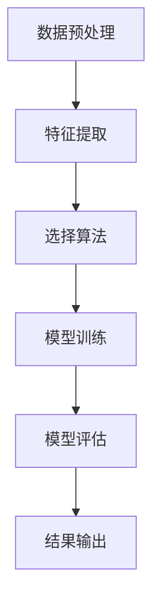

                 


# 构建智能化的个人投资风格漂移检测系统

**关键词：** 投资风格漂移、智能化检测、机器学习、系统架构、风险控制

**摘要：**  
本文旨在探讨如何构建一个智能化的个人投资风格漂移检测系统。通过对投资风格漂移的背景、核心概念、算法原理、系统架构和项目实战的详细分析，本文为投资者提供了一种高效的方法来检测和管理投资风格的漂移现象。结合实际案例分析和数学模型，本文深入剖析了投资风格漂移的检测过程，并提出了基于机器学习的解决方案。通过本文的系统设计和实现，投资者可以更好地理解投资行为的变化，并采取相应的风险管理策略。

---

# 第1章: 投资风格漂移的背景与问题描述

## 1.1 投资风格漂移的定义与背景

### 1.1.1 投资风格的基本概念
投资风格（Investment Style）是指投资者在进行资产配置和投资决策时所遵循的一套特定的原则、策略和行为模式。它反映了投资者对市场的理解和对风险收益的偏好。

### 1.1.2 投资风格漂移的定义
投资风格漂移（Investment Style Drift）是指投资者在实际投资过程中，由于市场环境的变化、个人认知的偏差或外部干扰等因素，导致其实际投资行为偏离既定的投资风格的现象。

### 1.1.3 投资风格漂移的背景与重要性
随着金融市场日益复杂化，投资者的行为受到多种因素的影响，包括市场波动、情绪变化和信息过载等。投资风格漂移不仅会影响投资组合的表现，还可能导致投资者偏离长期目标，增加投资风险。

---

## 1.2 个人投资风格的构成与影响

### 1.2.1 投资风格的构成要素
投资风格的构成要素主要包括以下几个方面：
1. **资产配置**：投资者在不同资产类别上的分配比例。
2. **风险偏好**：投资者对风险的承受能力。
3. **市场观点**：投资者对市场走势的判断。
4. **交易频率**：投资者进行交易的频率。

### 1.2.2 个人投资行为的特征
个人投资行为通常表现出以下特征：
1. **情绪化**：投资者容易受到市场情绪的影响。
2. **认知偏差**：投资者可能存在过度自信或从众心理。
3. **外部干扰**：外部市场信息和媒体舆论可能影响投资者决策。

### 1.2.3 投资风格漂移对投资效果的影响
投资风格漂移可能导致以下问题：
1. **投资目标偏离**：投资者偏离既定的投资目标。
2. **风险失控**：投资组合的风险敞口可能超出预期。
3. **收益不稳定**：投资风格的不稳定性可能导致收益波动。

---

## 1.3 智能化检测的必要性与挑战

### 1.3.1 传统投资风格分析的局限性
传统的投资风格分析方法通常依赖于主观判断和经验分析，存在以下局限性：
1. **效率低下**：传统方法需要大量人工分析，效率较低。
2. **主观性强**：分析结果受到分析师主观判断的影响。
3. **难以量化**：难以对投资风格的变化进行量化分析。

### 1.3.2 智能化检测的优势
智能化检测方法具有以下优势：
1. **高效性**：通过机器学习算法，可以快速分析大量数据。
2. **客观性**：基于数据的分析方法更加客观。
3. **精准性**：智能化方法能够量化投资风格的变化，并提供精确的检测结果。

### 1.3.3 智能化检测的主要挑战
智能化检测面临以下挑战：
1. **数据质量**：需要高质量的历史数据支持分析。
2. **算法选择**：需要选择适合的机器学习算法。
3. **模型解释性**：模型的可解释性可能影响实际应用。

---

## 1.4 本章小结

本章详细介绍了投资风格漂移的背景、定义和构成要素，并分析了投资风格漂移对投资效果的影响。同时，本文还探讨了智能化检测的必要性与挑战，为后续章节的分析奠定了基础。

---

# 第2章: 投资风格漂移的核心概念与联系

## 2.1 投资风格漂移的核心概念

### 2.1.1 投资风格漂移的分类
投资风格漂移可以根据不同的标准进行分类：
1. **按时间维度**：短期漂移和长期漂移。
2. **按原因**：由市场环境变化引起或由投资者行为变化引起。

### 2.1.2 漂移检测的关键指标
漂移检测的关键指标包括：
1. **偏离程度**：实际投资行为与预期风格的偏离程度。
2. **时间跨度**：漂移现象的时间范围。
3. **风险指标**：漂移对投资组合风险的影响。

### 2.1.3 漂移检测的数学模型
漂移检测的数学模型通常基于统计学方法，例如：

$$ \text{偏离程度} = \sqrt{\sum_{i=1}^{n} (x_i - \mu_i)^2} $$

其中，$x_i$ 表示实际投资行为，$\mu_i$ 表示预期风格。

---

## 2.2 核心概念之间的关系

### 2.2.1 投资风格与市场环境的关系
投资风格与市场环境密切相关。例如，在市场下跌时，投资者可能会调整资产配置以降低风险。

### 2.2.2 漂移检测与投资策略的关系
漂移检测可以帮助投资者优化投资策略，例如通过调整资产配置来减少漂移带来的风险。

### 2.2.3 漂移检测与风险管理的关系
漂移检测是风险管理的重要组成部分，可以帮助投资者及时发现和应对投资风格的变化。

---

## 2.3 概念属性对比与ER实体关系图

### 2.3.1 概念属性对比表

| 概念      | 属性1 | 属性2 | 属性3 |
|-----------|-------|-------|-------|
| 投资风格  | 类型  | 配置比例 | 风险偏好 |
| 漂移检测  | 方法 | 指标 | 时间跨度 |

### 2.3.2 ER实体关系图（使用 Mermaid）

```mermaid
erDiagram
    investor {
        id
        investment_style
        drift_score
    }
    market {
        id
        time_period
        market_conditions
    }
    drift_detection {
        id
        investor_id
        market_id
        drift_level
    }
    investor <--- drift_detection
    market <--- drift_detection
```

---

## 2.4 本章小结

本章从核心概念的角度分析了投资风格漂移的定义、分类和关键指标，并通过对比表和ER图展示了各概念之间的关系。

---

# 第3章: 投资风格漂移检测的算法原理

## 3.1 基于机器学习的检测方法

### 3.1.1 监督学习方法
监督学习方法适用于有标签的数据集，例如：

1. **线性回归**：用于预测投资风格的偏离程度。
2. **随机森林**：用于分类和回归分析。

### 3.1.2 非监督学习方法
非监督学习方法适用于无标签的数据集，例如：

1. **聚类分析**：用于发现投资风格的潜在模式。
2. **主成分分析（PCA）**：用于降维和特征提取。

### 3.1.3 半监督学习方法
半监督学习方法结合了监督和非监督学习的优点，适用于部分标签的数据集。

---

## 3.2 常见算法的原理与流程

### 3.2.1 K-近邻算法（KNN）

KNN 算法的基本步骤如下：

1. **数据预处理**：标准化特征数据。
2. **选择 K 值**：确定最近邻的数量。
3. **计算距离**：使用欧氏距离或曼哈顿距离。
4. **投票分类**：根据多数邻居的类别进行分类。

KNN 算法的数学公式如下：

$$ d(x, y) = \sqrt{\sum_{i=1}^{n} (x_i - y_i)^2} $$

---

## 3.3 算法流程图（使用 Mermaid）



---

## 3.4 算法实现的数学模型

### 3.4.1 KNN 算法的数学模型
KNN 算法的数学模型主要涉及距离计算和投票机制。

### 3.4.2 SVM 算法的数学模型
支持向量机（SVM）的目标是最小化 hinge loss：

$$ \text{Loss} = \sum_{i=1}^{n} \max(0, 1 - y_i(w \cdot x_i + b)) $$

---

## 3.5 本章小结

本章详细介绍了基于机器学习的检测方法，包括监督学习、非监督学习和半监督学习的原理与流程，并通过流程图和数学公式展示了算法的实现过程。

---

# 第4章: 投资风格漂移检测的系统架构与设计

## 4.1 系统功能设计

### 4.1.1 数据采集模块
数据采集模块负责从数据库中获取投资者的历史交易数据。

### 4.1.2 特征提取模块
特征提取模块从交易数据中提取特征，例如资产配置比例和交易频率。

### 4.1.3 模型训练模块
模型训练模块基于提取的特征训练机器学习模型。

### 4.1.4 结果展示模块
结果展示模块将检测结果以可视化形式呈现给投资者。

---

## 4.2 系统架构设计

### 4.2.1 分层架构设计


---

## 4.3 本章小结

本章从系统架构的角度分析了投资风格漂移检测系统的功能设计和分层架构，并通过类图展示了各模块之间的交互关系。

---

# 第5章: 项目实战与案例分析

## 5.1 项目实战

### 5.1.1 环境安装
需要安装以下工具和库：
1. Python
2. Scikit-learn
3. Pandas
4. Matplotlib

### 5.1.2 系统核心实现源代码

```python
import pandas as pd
from sklearn.neighbors import KNeighborsClassifier
from sklearn.metrics import accuracy_score

# 数据加载
data = pd.read_csv('investment_data.csv')

# 特征提取
X = data.drop('drift', axis=1)
y = data['drift']

# 模型训练
model = KNeighborsClassifier(n_neighbors=3)
model.fit(X, y)

# 模型预测
y_pred = model.predict(X)

# 模型评估
print("准确率:", accuracy_score(y, y_pred))
```

---

## 5.2 案例分析

### 5.2.1 实际案例分析
假设一位投资者的投资风格发生了漂移，通过系统检测可以及时发现并调整投资策略。

### 5.2.2 案例分析与解读
通过案例分析，可以验证系统的有效性和准确性。

---

## 5.3 本章小结

本章通过实际案例分析，展示了投资风格漂移检测系统的实现过程和应用价值。

---

# 第6章: 总结与最佳实践

## 6.1 总结

本文详细介绍了投资风格漂移的背景、核心概念、算法原理和系统架构，并通过实际案例分析展示了系统的实现过程。通过智能化的检测方法，投资者可以更好地理解和管理投资风格的变化。

---

## 6.2 最佳实践 tips

1. **数据质量**：确保数据的完整性和准确性。
2. **算法选择**：根据具体场景选择合适的算法。
3. **模型解释性**：注重模型的可解释性。
4. **风险管理**：结合风险管理策略优化投资行为。

---

## 6.3 本章小结

本文总结了投资风格漂移检测的重要性和实现方法，并给出了实际应用中的最佳实践建议。

---

# 结语

通过本文的系统设计和实现，投资者可以更好地理解投资风格漂移的检测过程，并采取相应的风险管理策略。未来，随着人工智能技术的不断发展，投资风格漂移检测系统将更加智能化和精准化。

