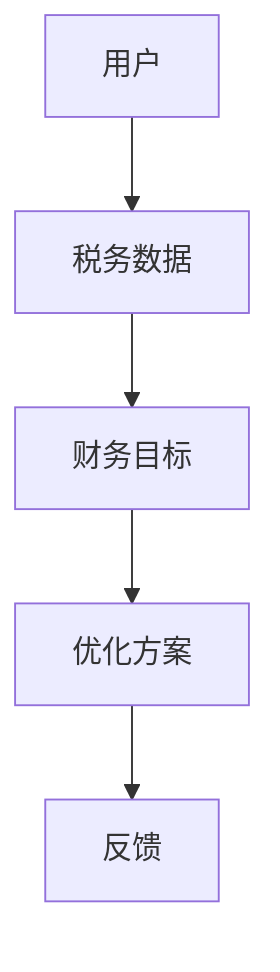
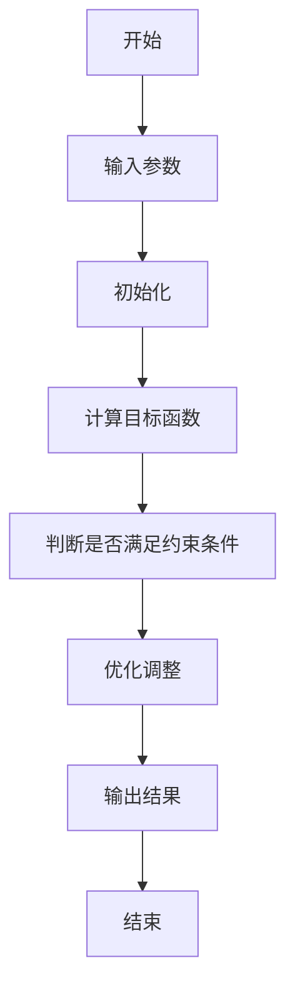
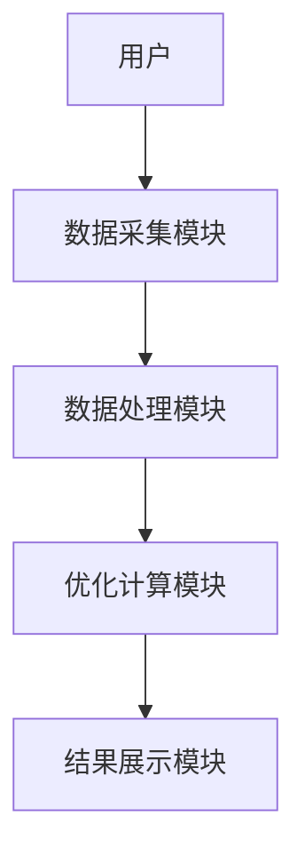
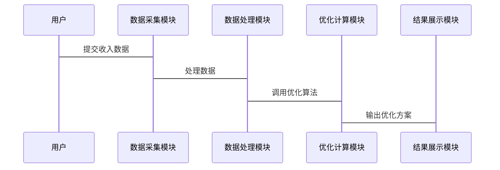

                 


# 构建智能化的个人税务筹划多目标动态优化助手

## 关键词：个人税务筹划、多目标动态优化、人工智能、系统架构、项目实战

## 摘要：本文详细探讨了如何利用人工智能技术构建智能化的个人税务筹划助手，通过多目标动态优化算法，帮助个人实现税务规划的最优解。文章从背景、核心概念、算法原理、系统架构到项目实战，全面解析了智能化税务助手的构建过程，结合实际案例，提供了详细的实现方案和优化建议。

---

# 第1章: 个人税务筹划的背景与挑战

## 1.1 税务筹划的基本概念

### 1.1.1 税务筹划的定义与意义
税务筹划是指通过合法合规的方式，优化个人或企业的税务结构，降低税负，提高资金利用效率。在个人财务规划中，税务筹划尤为重要，它不仅关乎个人的经济利益，还涉及法律合规性。

### 1.1.2 传统税务筹划的局限性
传统税务筹划主要依赖人工计算和经验判断，存在以下问题：
1. **信息不全**：难以获取全面的税务政策和数据支持。
2. **效率低下**：人工计算复杂，耗时且容易出错。
3. **静态规划**：无法动态调整，难以应对政策变化和收入波动。

### 1.1.3 智能化税务筹划的需求与优势
随着人工智能和大数据技术的发展，智能化税务筹划成为可能。其优势包括：
1. **实时更新**：能够快速响应政策变化和收入变动。
2. **精准计算**：利用算法优化，提供最优解。
3. **个性化服务**：根据个人财务状况，定制化税务方案。

---

## 1.2 多目标动态优化的基本概念

### 1.2.1 多目标优化的定义
多目标优化是指在多个目标函数之间寻求最优平衡的过程。例如，在税务筹划中，可能需要在税负最小化、资产最大化和风险最小化之间找到最佳平衡。

### 1.2.2 动态优化的核心思想
动态优化强调在变化的环境中，逐步调整优化策略，以适应新的条件和目标。在税务筹划中，动态优化能够根据实时的收入、政策变化和财务目标，动态调整税务方案。

### 1.2.3 智能化税务筹划中的多目标动态优化
智能化税务筹划结合了多目标优化和动态优化的思想，利用人工智能算法，实时优化税务方案，帮助个人实现长期财务目标。

---

## 1.3 本章小结

本章介绍了个人税务筹划的基本概念、传统方法的局限性以及智能化税务筹划的需求与优势。同时，阐述了多目标动态优化的基本思想及其在智能化税务筹划中的应用。

---

# 第2章: 智能化税务筹划的核心概念与联系

## 2.1 税务筹划问题的背景与描述

### 2.1.1 税务筹划的主体与客体
- **主体**：个人或家庭。
- **客体**：税务政策、收入来源、支出项目等。

### 2.1.2 税务筹划的目标与约束
- **目标**：税后收入最大化、风险最小化、资产优化配置。
- **约束**：政策合规性、时间限制、资金流动性等。

### 2.1.3 税务筹划的边界与外延
- **边界**：合法合规的范围内进行优化。
- **外延**：涉及资产配置、投资规划、遗产规划等多个领域。

---

## 2.2 核心概念的原理与联系

### 2.2.1 税务筹划与多目标优化的关系
多目标优化为税务筹划提供了理论基础，帮助在多个目标之间找到最优解。

### 2.2.2 动态优化与人工智能的结合
人工智能算法（如强化学习）为动态优化提供了实现工具，能够实时调整优化策略。

### 2.2.3 智能化税务筹划的系统架构
智能化税务筹划系统由数据采集、模型计算、优化策略生成和反馈调整四个模块组成。

---

## 2.3 核心概念的属性特征对比

### 2.3.1 多目标优化的属性特征
| 特性 | 描述 |
|------|------|
| 多目标性 | 同时优化多个目标函数 |
| 约束性 | 受限于政策和财务条件 |
| 平衡性 | 寻找目标之间的最优平衡 |

### 2.3.2 动态优化的属性特征
| 特性 | 描述 |
|------|------|
| 动态性 | 随时间变化实时调整 |
| 过程性 | 需要逐步优化 |
| 响应性 | 快速响应变化 |

### 2.3.3 智能化税务筹划的综合特征
| 特性 | 描述 |
|------|------|
| 智能性 | 利用AI算法实现优化 |
| 实时性 | 动态调整税务方案 |
| 个性化 | 根据个人情况定制方案 |

---

## 2.4 ER实体关系图



---

## 2.5 本章小结

本章从税务筹划的核心概念出发，分析了多目标优化和动态优化的关系，明确了智能化税务筹划的系统架构，并通过对比分析，总结了核心概念的属性特征。

---

# 第3章: 多目标动态优化的算法原理

## 3.1 算法原理概述

### 3.1.1 多目标优化算法的基本原理
多目标优化算法通过权重分配和 Pareto 前沿分析，寻找多个目标之间的最优解。

### 3.1.2 动态优化算法的核心思想
动态优化算法通过实时更新目标函数和约束条件，逐步逼近最优解。

### 3.1.3 智能化税务筹划中的算法选择
结合税务筹划的场景特点，选择强化学习和动态规划算法。

---

## 3.2 算法流程图



---

## 3.3 算法数学模型与公式

### 3.3.1 多目标优化的数学模型
$$ \text{目标函数} = \sum_{i=1}^{n} w_i f_i(x) $$
其中，$w_i$ 是目标函数 $f_i(x)$ 的权重。

### 3.3.2 动态优化的数学模型
$$ x_{k+1} = x_k + \alpha \cdot \nabla f(x_k) $$

---

## 3.4 本章小结

本章详细介绍了多目标动态优化算法的基本原理，通过流程图和数学公式，阐述了算法实现的核心步骤。

---

# 第4章: 智能化税务筹划系统的架构设计

## 4.1 系统功能设计

### 4.1.1 领域模型设计


### 4.1.2 系统架构设计


### 4.1.3 接口设计
- 数据接口：用户输入收入数据和财务目标。
- 计算接口：优化模块调用算法接口。
- 展示接口：结果展示模块输出优化方案。

---

## 4.2 系统交互设计



---

## 4.3 本章小结

本章从系统架构的角度，详细设计了智能化税务筹划系统的功能模块、架构图和交互流程，为后续实现奠定了基础。

---

# 第5章: 项目实战

## 5.1 环境配置与依赖管理

### 5.1.1 环境配置
- 操作系统：Windows 10 或更高版本。
- 开发工具：Python 3.8+，Jupyter Notebook。
- 依赖库：numpy、pandas、scikit-learn。

### 5.1.2 依赖管理
安装所需的Python库：
```bash
pip install numpy pandas scikit-learn
```

---

## 5.2 系统核心实现源代码

### 5.2.1 数据采集模块
```python
import pandas as pd

def load_tax_data():
    data = {
        '收入类型': ['工资', '投资收益', '租金收入'],
        '税率': [0.15, 0.2, 0.1]
    }
    return pd.DataFrame(data)
```

### 5.2.2 优化模块
```python
from sklearn.multioutput import MultiOutputRegressor
from sklearn.ensemble import RandomForestRegressor

def multi_objective_optimization(X, y):
    regressor = MultiOutputRegressor(RandomForestRegressor())
    regressor.fit(X, y)
    return regressor.predict(X)
```

---

## 5.3 案例分析与解读

### 5.3.1 案例背景
假设一位用户的年收入为100万元，主要来源于工资和投资收益。

### 5.3.2 数据分析
使用数据采集模块获取税率表和支出项目。

### 5.3.3 优化计算
调用优化模块，生成最优的税务方案。

---

## 5.4 本章小结

本章通过实际案例，展示了智能化税务筹划系统的实现过程，包括环境配置、代码实现和案例分析。

---

# 第6章: 优化与提升

## 6.1 算法调优

### 6.1.1 参数优化
调整随机森林的参数，提高预测精度。

### 6.1.2 模型优化
尝试其他机器学习算法，如梯度提升树。

---

## 6.2 性能优化

### 6.2.1 数据预处理
优化数据清洗流程，提高处理效率。

### 6.2.2 并行计算
利用并行计算技术，加速优化过程。

---

## 6.3 功能扩展

### 6.3.1 多场景模拟
支持多种财务目标的优化。

### 6.3.2 用户反馈机制
根据用户反馈，动态调整优化策略。

---

## 6.4 本章小结

本章从算法调优、性能优化和功能扩展三个方面，提出了提升智能化税务筹划系统的建议。

---

# 第7章: 总结与展望

## 7.1 全文总结

本文详细探讨了智能化个人税务筹划助手的构建过程，结合多目标动态优化算法和系统架构设计，提出了一个完整的解决方案。

---

## 7.2 未来展望

随着人工智能技术的不断发展，智能化税务筹划助手将更加智能化和个性化，未来可能实现更多功能，如全球税务规划和智能财务顾问。

---

## 7.3 本章小结

全文总结了智能化税务筹划助手的核心思想和实现过程，并展望了未来的发展方向。

---

# 参考文献

（此处列出相关的技术文献和参考资料）

---

# 附录

## 附录A: 代码实现细节

## 附录B: 系统架构图

## 附录C: 算法流程图

---

通过以上目录大纲，我们可以看到，构建智能化的个人税务筹划多目标动态优化助手需要从理论到实践的全面考虑。从算法原理到系统架构，再到项目实战，每一步都需要细致分析和实现。希望这篇文章能够为读者提供清晰的思路和实用的指导。

