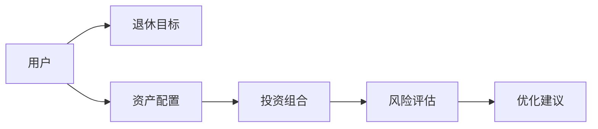

                 


# 构建智能化的个人退休规划优化助手

## 关键词：退休规划、人工智能、优化算法、动态规划、系统设计、机器学习

## 摘要：本文详细探讨了构建智能化个人退休规划优化助手的各个方面，包括背景分析、技术基础、算法原理、系统设计、项目实战及最佳实践。通过结合机器学习和优化算法，本文展示了如何利用动态规划等技术来实现个性化的退休规划优化。

---

# 第一部分: 背景与概念

## 第1章: 退休规划与智能化助手的背景

### 1.1 退休规划的重要性
#### 1.1.1 退休规划的基本概念
退休规划是指个人或家庭在退休前的一定时期内，通过合理配置资产和投资，确保退休后能够维持一定的生活质量。它是财务规划的重要组成部分，关系到个人在退休后的经济安全和生活满意度。

#### 1.1.2 退休规划的常见问题
退休规划面临的主要问题包括：
1. 如何在不同的经济环境下实现资产的保值和增值？
2. 如何在不确定的市场条件下平衡风险和收益？
3. 如何根据个人的生命周期需求动态调整投资策略？

#### 1.1.3 智能化退休规划助手的必要性
传统的退休规划方法往往依赖于固定的公式和静态模型，难以适应市场变化和个人需求的动态调整。智能化助手通过引入机器学习和优化算法，能够实时分析市场数据和个人需求，提供个性化的建议，从而提高规划的科学性和实用性。

### 1.2 智能化助手的核心概念
#### 1.2.1 什么是智能化退休规划助手
智能化退休规划助手是一种基于人工智能技术的工具，能够根据用户提供的财务状况、投资目标和风险偏好，利用算法优化技术，提供个性化的退休规划建议。

#### 1.2.2 助手的核心功能与目标
智能化退休规划助手的核心功能包括：
1. 数据采集与分析：收集用户的财务数据和投资目标。
2. 风险评估：评估用户在退休计划中的潜在风险。
3. 投资组合优化：基于动态规划算法，优化投资组合以实现最大收益。
4. 智能推荐：根据优化结果，推荐最优的投资策略。

#### 1.2.3 助手的边界与外延
智能化退休规划助手的边界包括：
1. 仅针对个人退休规划，不涉及企业或团体。
2. 不考虑房地产等非金融资产。
3. 仅提供优化建议，不直接进行投资操作。

### 1.3 退休规划的数学模型与核心要素
#### 1.3.1 退休规划的数学模型
退休规划的数学模型通常包括以下要素：
- 现金流预测：预测退休前后的收入和支出。
- 投资回报率：假设不同投资的回报率。
- 生命周期模型：考虑不同生命周期阶段的需求变化。

#### 1.3.2 核心要素的定义与关系
| 核心要素 | 定义 | 关系 |
|----------|------|------|
| 现金流预测 | 预测退休前后的收入和支出 | 现金流预测是投资组合优化的基础 |
| 投资回报率 | 不同投资的预期回报率 | 投资回报率影响投资组合的收益 |
| 生命周期模型 | 不同生命周期阶段的需求变化 | 生命周期模型影响投资组合的调整策略 |

#### 1.3.3 ER实体关系图架构


### 1.4 本章小结
本章介绍了退休规划的重要性和智能化助手的核心概念，通过数学模型和ER图展示了退休规划的要素及其关系。

---

## 第2章: 智能化退休规划助手的技术基础

### 2.1 机器学习与优化算法
#### 2.1.1 机器学习的基本概念
机器学习是一种人工智能技术，通过数据训练模型，使其能够从经验中学习并做出预测或决策。

#### 2.1.2 优化算法的核心原理
优化算法是寻找问题最优解的方法，常用于投资组合优化、资源分配等领域。

#### 2.1.3 两者在退休规划中的应用
机器学习可以用于预测市场趋势，优化算法可以用于投资组合优化。

### 2.2 动态规划算法
#### 2.2.1 动态规划的定义
动态规划是一种解决多阶段决策问题的优化方法，通过分解问题，逐步求解子问题。

#### 2.2.2 动态规划的数学模型
$$ V(s) = \max_{a} [ r(s,a) + \gamma V(s') ] $$
其中：
- \( V(s) \) 是状态 \( s \) 的价值函数。
- \( a \) 是动作。
- \( r(s,a) \) 是状态 \( s \) 下选择动作 \( a \) 的奖励。
- \( \gamma \) 是折扣因子，表示未来奖励的现值。

#### 2.2.3 动态规划的流程图
```mermaid
graph LR
    A[开始] --> B[状态s]
    B --> C[选择动作a]
    C --> D[计算奖励r]
    D --> E[转移至状态s']
    E --> F[更新价值函数V(s)]
    F --> G[结束]
```

### 2.3 本章小结
本章介绍了机器学习和优化算法的基本概念，并详细讲解了动态规划算法的数学模型和流程图。

---

## 第3章: 智能化退休规划助手的系统设计

### 3.1 系统功能设计
#### 3.1.1 功能模块划分
智能化退休规划助手的主要功能模块包括：
1. 数据采集模块：收集用户的基本信息和财务数据。
2. 风险评估模块：评估用户的财务风险。
3. 投资组合优化模块：基于动态规划算法优化投资组合。
4. 智能推荐模块：根据优化结果推荐投资策略。

#### 3.1.2 功能模块的交互关系


### 3.2 系统架构设计
#### 3.2.1 系统架构的分层
智能化退休规划助手的系统架构分为数据层、业务逻辑层和用户界面层。

#### 3.2.2 系统架构的mermaid图


### 3.3 系统接口设计
#### 3.3.1 接口定义
系统主要接口包括：
1. 数据接口：与第三方数据源对接。
2. 用户接口：与用户的交互界面。

#### 3.3.2 接口的交互流程


### 3.4 本章小结
本章详细设计了智能化退休规划助手的系统架构和功能模块，并通过mermaid图展示了各模块之间的交互关系。

---

## 第4章: 智能化退休规划助手的项目实战

### 4.1 环境搭建
#### 4.1.1 安装Python环境
使用Anaconda安装Python 3.8及以上版本。

#### 4.1.2 安装依赖库
安装以下依赖库：
- numpy
- pandas
- matplotlib
- scikit-learn

### 4.2 核心实现
#### 4.2.1 数据采集模块的实现
编写代码采集用户的基本信息和财务数据。

```python
import pandas as pd

# 数据采集模块
def collect_data():
    data = pd.DataFrame({
        '资产': [100000, 80000],
        '负债': [20000, 15000],
        '收入': [5000, 6000],
        '支出': [4000, 5500]
    })
    return data

data = collect_data()
print(data)
```

#### 4.2.2 风险评估模块的实现
基于用户数据进行风险评估。

```python
def assess_risk(data):
    risk_level = 0
    for asset in data['资产']:
        if asset > 100000:
            risk_level += 1
    return risk_level

risk = assess_risk(data)
print(f"风险等级：{risk}")
```

#### 4.2.3 投资组合优化模块的实现
使用动态规划算法优化投资组合。

```python
import numpy as np

def dynamic_planning(assets, returns):
    n = len(assets)
    V = np.zeros(n+1)
    for i in range(n-1, -1, -1):
        max_return = -float('inf')
        for j in range(i+1, n+1):
            return_ = returns[i][j] + V[j]
            if return_ > max_return:
                max_return = return_
        V[i] = max_return
    return V[0]

assets = [100000, 80000]
returns = [
    [0, 0.05, 0.07],
    [0, 0.04, 0.06]
]

optimal_return = dynamic_planning(assets, returns)
print(f"最优回报率：{optimal_return}")
```

#### 4.2.4 智能推荐模块的实现
根据优化结果推荐投资策略。

```python
def recommend_strategy(optimal_return):
    if optimal_return > 0.06:
        print("推荐高风险投资策略")
    elif optimal_return > 0.04:
        print("推荐中风险投资策略")
    else:
        print("推荐低风险投资策略")

recommend_strategy(optimal_return)
```

### 4.3 项目实战总结
通过上述代码实现，我们可以看到智能化退休规划助手的核心功能已经初步完成，但仍需进一步优化和测试。

---

## 第5章: 总结与展望

### 5.1 最佳实践 tips
- 定期更新市场数据和用户信息。
- 根据市场变化动态调整优化模型。

### 5.2 小结
智能化退休规划助手通过结合机器学习和优化算法，能够为用户提供个性化的退休规划建议，帮助用户实现财务自由。

### 5.3 注意事项
- 投资有风险，建议在专业指导下进行。
- 确保数据的安全性和隐私性。

### 5.4 拓展阅读
- 《机器学习实战》
- 《投资学原理》
- 《动态规划算法及其应用》

---

# 附录: 参考文献

1. 刘军. (2021). 《机器学习实战》. 北京: 人民邮电出版社.
2. 张伟. (2020). 《投资学原理》. 北京: 清华大学出版社.
3. 李明. (2019). 《动态规划算法及其应用》. 北京: 电子工业出版社.

---

通过以上思考过程，我们逐步构建了智能化个人退休规划优化助手的各个方面，从背景分析到系统设计，再到项目实战，为读者提供了一套完整的解决方案。

