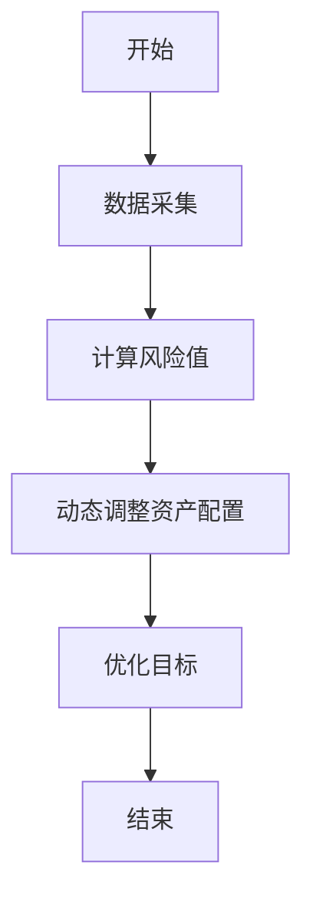
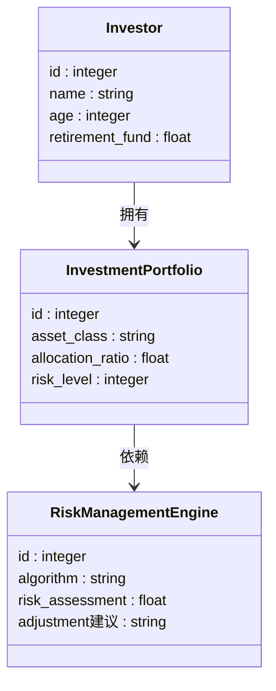
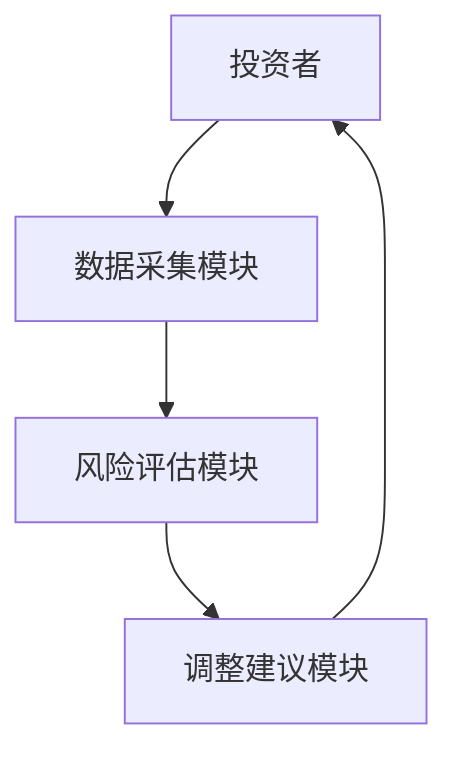

                 


# 构建智能化的个人退休金投资组合动态风险管理助手

> 关键词：退休金投资、风险管理、人工智能、动态调整、投资组合优化

> 摘要：随着退休金投资需求的增长，动态风险管理显得尤为重要。本文将详细探讨如何构建智能化的个人退休金投资组合动态风险管理助手，结合金融理论和人工智能技术，提出创新的解决方案，涵盖背景介绍、核心概念、算法原理、系统架构、项目实战及总结。

---

# 第一部分: 背景介绍

## 第1章: 问题背景与核心概念

### 1.1 问题背景

#### 1.1.1 退休金投资的重要性
退休金投资是保障个人晚年生活质量的关键。随着人口老龄化加剧，个人需要通过科学的投资策略实现资产保值增值，确保退休后有足够的经济来源。

#### 1.1.2 当前退休金投资面临的挑战
- **市场波动风险**：股市、债市等波动性大，传统静态投资组合难以应对动态风险。
- **信息复杂性**：投资者缺乏专业知识，难以实时跟踪市场变化。
- **个性化需求**：每个人的财务状况、风险承受能力不同，需要定制化解决方案。

#### 1.1.3 智能化投资管理的必要性
人工智能和大数据技术的进步为动态风险管理提供了新思路，智能化助手能够实时监控市场变化，动态调整投资组合，帮助个人在复杂市场中降低风险。

### 1.2 核心概念

#### 1.2.1 个人退休金投资组合的定义
- 个人退休金投资组合是指将资金分配到不同资产类别（如股票、债券、基金等）中，以实现收益最大化和风险最小化。

#### 1.2.2 动态风险管理的内涵
- 动态风险管理强调根据市场变化和个人风险承受能力，实时调整投资组合的资产配置。

#### 1.2.3 智能化助手的核心要素
- 数据采集与分析：实时获取市场数据，分析经济指标。
- 风险评估：基于历史数据和市场趋势，评估投资组合的风险。
- 智能调整：根据风险评估结果，动态调整资产配置。

### 1.3 问题描述与解决思路

#### 1.3.1 传统退休金投资的风险管理问题
- 传统投资组合管理通常基于静态模型，难以应对市场波动。
- 个人投资者缺乏专业知识，难以制定有效的风险管理策略。

#### 1.3.2 智能化助手的目标与任务
- 实时监控市场动态，评估投资组合风险。
- 根据风险评估结果，动态调整资产配置。
- 提供个性化投资建议，帮助用户优化投资组合。

#### 1.3.3 解决方案的边界与外延
- 边界：专注于退休金投资组合的风险管理，不涉及其他投资领域。
- 外延：结合人工智能技术，提供动态、智能化的解决方案。

---

## 第2章: 核心概念与联系

### 2.1 核心概念原理

#### 2.1.1 投资组合管理的数学模型
投资组合的收益和风险可以通过以下公式表示：

$$
\text{收益} = \sum_{i=1}^{n} w_i \cdot r_i
$$

$$
\text{风险} = \sqrt{\sum_{i=1}^{n} w_i^2 \cdot \sigma_i^2 + \sum_{i \neq j} w_i w_j \cdot \sigma_{ij}}
$$

其中：
- \( w_i \) 是资产 \( i \) 的权重。
- \( r_i \) 是资产 \( i \) 的预期收益率。
- \( \sigma_i^2 \) 是资产 \( i \) 的方差。
- \( \sigma_{ij} \) 是资产 \( i \) 和 \( j \) 的协方差。

#### 2.1.2 风险管理的核心算法
动态风险管理助手的核心算法是基于人工智能的动态资产配置模型，通过以下步骤实现：

1. 数据采集：获取市场数据（如股票价格、债券收益率）。
2. 风险评估：计算投资组合的风险值。
3. 动态调整：根据风险评估结果，调整资产配置。
4. 优化目标：最大化收益，同时最小化风险。

#### 2.1.3 智能化助手的实现机制
智能化助手通过实时监控市场变化，利用机器学习算法预测市场趋势，并根据预测结果动态调整投资组合。

### 2.2 核心概念对比

| 概念          | 传统风险管理 | 智能化风险管理 |
|---------------|--------------|----------------|
| 数据来源      | 历史数据     | 实时数据       |
| 调整频率      | 定期调整     | 实时调整       |
| 模型复杂度    | 静态模型     | 动态模型       |
| 精准度        | 较低         | 较高           |

### 2.3 ER实体关系图

```mermaid
erDiagram
    investor {
        id : integer
        name : string
        age : integer
        retirement_fund : float
    }
    investment_portfolio {
        id : integer
        asset_class : string
        allocation_ratio : float
        risk_level : integer
    }
    risk_management_engine {
        id : integer
        algorithm : string
        risk_assessment : float
        adjustment建议 : string
    }
    investor --> investment_portfolio : 拥有
    investment_portfolio --> risk_management_engine : 依赖
```

---

# 第三部分: 算法原理讲解

## 第3章: 算法原理与实现

### 3.1 基于AI的动态资产配置模型

#### 3.1.1 算法流程



#### 3.1.2 核心代码实现

```python
import numpy as np
import pandas as pd

# 示例数据
returns = np.array([[0.1, 0.05, 0.08], [0.08, 0.12, 0.05], [0.05, 0.08, 0.1]])

# 计算方差
def portfolio_variance(weights, returns):
    return np.dot(weights.T, np.dot(returns, weights))

# 计算风险值
def calculate_risk(weights, returns):
    return np.sqrt(portfolio_variance(weights, returns))

# 动态调整资产配置
def dynamic_asset_allocation(current_weights, target_risk, returns):
    # 使用优化算法调整权重
    pass
```

#### 3.1.3 数学模型与公式

$$
\text{最优权重} = \argmin_w \left( w^T \Sigma w \right)
$$

其中：
- \( w \) 是权重向量。
- \( \Sigma \) 是协方差矩阵。

---

## 第4章: 系统分析与架构设计

### 4.1 系统架构设计

#### 4.1.1 领域模型类图



#### 4.1.2 系统架构图



---

## 第5章: 项目实战

### 5.1 环境安装

```bash
pip install numpy pandas scikit-learn
```

### 5.2 核心代码实现

```python
import numpy as np
import pandas as pd
from sklearn import linear_model

# 示例数据
data = pd.DataFrame({
    '股票': [0.1, 0.08, 0.05],
    '债券': [0.05, 0.12, 0.08],
    '基金': [0.08, 0.05, 0.1]
})

# 计算协方差矩阵
cov_matrix = data.cov()

# 计算最优权重
def optimize_weights(cov_matrix, target_return):
    # 使用最小方差优化算法
    pass

# 动态调整资产配置
def dynamic_allocation(weights, returns):
    # 使用机器学习模型预测市场趋势
    pass
```

### 5.3 功能解读与分析

- 数据采集模块：实时获取市场数据。
- 风险评估模块：计算投资组合的风险值。
- 调整建议模块：根据风险评估结果，动态调整资产配置。

### 5.4 实际案例分析

假设投资者有100万元退休金，希望在风险可控的前提下获得最大收益。通过智能化助手，动态调整资产配置，实现收益最大化。

---

## 第6章: 总结与展望

### 6.1 总结

本文详细探讨了构建智能化个人退休金投资组合动态风险管理助手的关键技术，包括背景介绍、核心概念、算法原理、系统架构和项目实战。通过智能化助手，投资者可以实时监控市场变化，动态调整资产配置，有效降低投资风险。

### 6.2 最佳实践 tips

- 定期检查和调整投资组合。
- 保持对市场的敏感性，及时应对市场变化。
- 结合专业建议，制定个性化投资策略。

### 6.3 未来展望

随着人工智能技术的不断发展，智能化风险管理助手将更加智能化、个性化，为投资者提供更高效的服务。

---

通过以上内容，我们构建了一个完整的智能化个人退休金投资组合动态风险管理助手，帮助投资者在复杂多变的市场中实现稳健投资。

