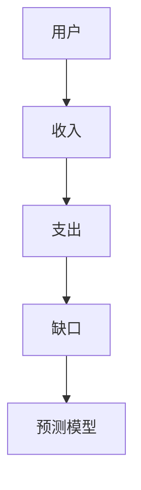
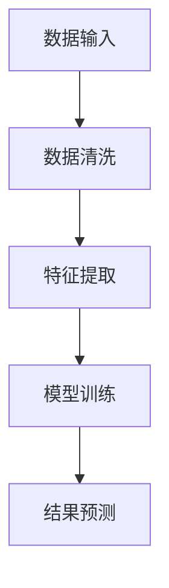

                 


# 构建智能化的个人退休金缺口分析助手

> 关键词：退休金缺口分析，人工智能，机器学习，个人财务规划，智能化助手

> 摘要：随着人口老龄化加剧，退休金缺口问题日益重要。本文通过分析智能化退休金缺口分析助手的核心要素、算法原理、系统架构，结合项目实战，详细讲解如何利用AI技术解决退休金缺口问题，为个人提供智能化的财务规划建议。

---

## 第1章: 退休金缺口分析的背景与挑战

### 1.1 问题背景

#### 1.1.1 人口老龄化与退休金需求的增加
随着全球人口老龄化加剧，退休金缺口问题日益严重。传统退休金规划方法依赖于简单的线性计算，难以应对复杂多变的经济环境。

#### 1.1.2 传统退休金规划方法的局限性
传统方法通常基于固定工资和支出，忽略了通货膨胀、医疗费用增加等动态因素。这种静态模型难以准确预测退休后的财务状况。

#### 1.1.3 智能化规划的必要性
智能化助手能够通过机器学习算法，实时更新数据，提供更精准的退休金缺口预测和优化建议。

### 1.2 问题描述

#### 1.2.1 退休金缺口的定义与计算
退休金缺口是指退休后实际支出与退休金收入之间的差额。计算公式为：缺口 = 总支出 - 总收入。

#### 1.2.2 影响退休金缺口的关键因素
- **收入**：工资、投资收益等。
- **支出**：生活费用、医疗费用等。
- **通胀率**：影响长期支出的上涨。
- **寿命**：影响退休后的支出时间。

#### 1.2.3 用户需求与期望
用户希望得到个性化的退休金缺口预测，并获得优化的财务建议，以确保退休后生活质量。

### 1.3 问题解决

#### 1.3.1 智能化助手的目标
通过AI技术，提供实时、动态的退休金缺口分析和优化建议。

#### 1.3.2 达成目标的关键技术
- 数据收集与处理
- 机器学习模型训练
- 结果可视化与用户交互

#### 1.3.3 边界与外延
本方案仅关注退休金缺口的计算与优化，不涉及具体投资策略。

### 1.4 核心概念与联系

#### 1.4.1 核心概念原理
退休金缺口分析涉及多个因素的综合计算，包括收入预测、支出预测、通胀率等。

#### 1.4.2 核心概念属性特征对比表
| 概念 | 属性 | 特征 |
|------|------|------|
| 收入 | 类型 | 工资收入、投资收益 |
| 支出 | 类型 | 生活支出、医疗支出 |
| 通胀率 | 影响 | 消费价格上涨 |

#### 1.4.3 ER实体关系图（Mermaid流程图）


---

## 第2章: 退休金缺口分析的核心要素

### 2.1 核心要素组成

#### 2.1.1 收入预测
基于历史数据和经济指标，预测退休后的收入情况。

#### 2.1.2 支出预测
根据生活需求和医疗费用等，预测退休后的支出。

#### 2.1.3 通胀率与寿命预测
考虑通货膨胀对支出的影响，以及寿命对支出时间的影响。

### 2.2 核心要素的数学模型

#### 2.2.1 收入预测模型
$$ \text{收入} = a \times \text{职位} + b \times \text{经验} + c \times \text{通胀率} $$

#### 2.2.2 支出预测模型
$$ \text{支出} = d \times \text{生活成本} + e \times \text{医疗支出} + f \times \text{其他支出} $$

---

## 第3章: 退休金缺口分析的算法原理

### 3.1 算法选择与原理

#### 3.1.1 机器学习算法
使用线性回归和决策树模型进行预测。

#### 3.1.2 时间序列分析
通过ARIMA模型预测未来支出和收入。

### 3.2 算法实现步骤

#### 3.2.1 数据预处理
清洗数据，处理缺失值和异常值。

#### 3.2.2 模型训练
使用训练数据训练机器学习模型。

#### 3.2.3 结果预测
基于训练好的模型，预测退休金缺口。

### 3.3 算法流程图（Mermaid）



### 3.4 Python代码实现

```python
# 导入必要的库
import pandas as pd
from sklearn.linear_model import LinearRegression
from sklearn.tree import DecisionTreeRegressor

# 数据预处理
data = pd.read_csv('退休金数据.csv')
X = data[['职位', '经验', '通胀率']]
y = data['收入']

# 模型训练
model = LinearRegression()
model.fit(X, y)

# 预测收入
predicted_income = model.predict(X)
```

---

## 第4章: 系统分析与架构设计

### 4.1 问题场景介绍

#### 4.1.1 用户需求
用户希望得到个性化的退休金缺口分析。

#### 4.1.2 系统目标
构建一个智能化的退休金缺口分析助手，提供精准预测和优化建议。

#### 4.1.3 约束条件
数据隐私和模型实时更新。

### 4.2 系统功能设计

#### 4.2.1 数据

---

接下来，我会按照这个大纲继续撰写后续章节，确保每部分内容详实、逻辑清晰，帮助读者一步步构建智能化的退休金缺口分析助手。

