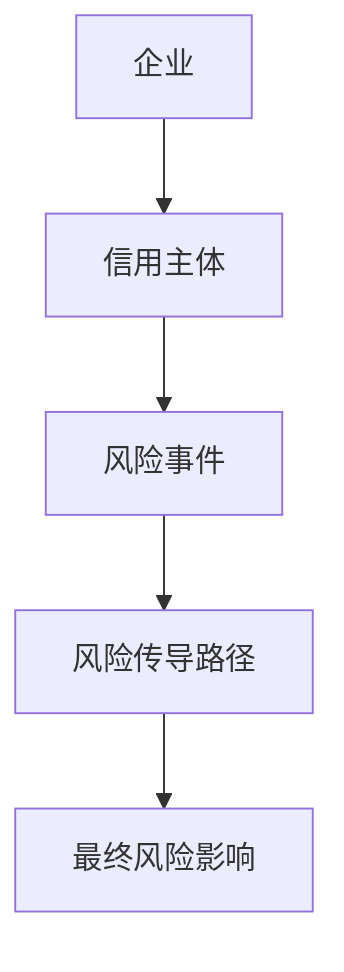
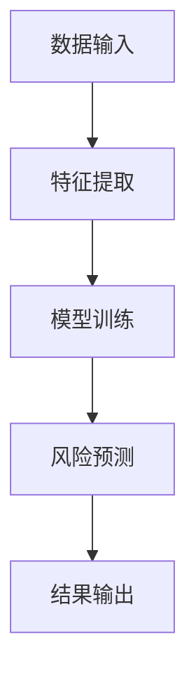
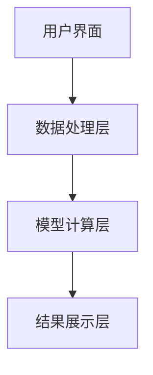
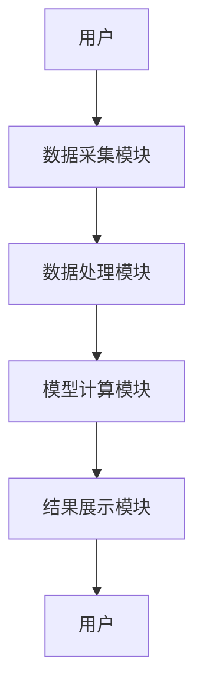

                 


# 构建智能化的企业信用风险传导模型

> 关键词：信用风险，企业风险，智能化模型，机器学习，深度学习，风险传导

> 摘要：本文详细探讨了如何构建智能化的企业信用风险传导模型，结合背景介绍、核心概念、算法原理、系统架构、项目实战等多个方面，系统性地分析了模型的构建过程及其实现细节。通过本文的讲解，读者可以全面了解如何利用智能化技术来优化信用风险的评估与传导过程，从而为企业风险管理提供更高效、更精准的解决方案。

---

# 第一部分：企业信用风险传导模型的背景与概念

## 第1章：信用风险与企业信用风险传导概述

### 1.1 信用风险的基本概念

#### 1.1.1 信用风险的定义与特征

信用风险是指由于债务人或交易对手未能履行其合同义务，导致债权人或相关方遭受损失的可能性。其主要特征包括：

- **可测性**：可以通过数据分析和模型计算得出。
- **可控性**：通过合理的模型和策略可以有效降低风险。
- **动态性**：受市场环境、企业经营状况等因素的影响而变化。

#### 1.1.2 信用风险的分类与影响

信用风险可以分为以下几类：

1. **单个信用风险**：单个企业或交易对手的信用风险。
2. **系统性信用风险**：整个市场或经济体系中的信用风险。
3. **传染性信用风险**：由于某一企业的信用问题引发的连锁反应。

信用风险的影响包括：

- 企业融资成本增加。
- 市场信心下降。
- 整体经济波动加剧。

#### 1.1.3 信用风险在企业中的重要性

信用风险是企业在经营过程中面临的核心风险之一，直接影响企业的财务健康和市场信誉。有效的信用风险管理可以降低企业的财务损失，提升市场竞争力。

### 1.2 企业信用风险传导的定义与机制

#### 1.2.1 信用风险传导的定义

信用风险传导是指信用风险从一个企业或市场传递到另一个企业或市场的过程。这种传导通常是通过企业间的关联性实现的。

#### 1.2.2 信用风险传导的路径与过程

信用风险的传导路径主要包括以下几个步骤：

1. **风险源识别**：识别可能引发信用风险的源头。
2. **风险传播**：通过企业间的关联性传播风险。
3. **风险积累**：风险在传播过程中逐渐积累，最终引发系统性风险。

#### 1.2.3 信用风险传导的特征与影响

信用风险传导的特征包括：

- **复杂性**：涉及多个企业、市场和金融工具。
- **不确定性**：风险传播路径和影响程度具有不确定性。

信用风险传导的影响包括：

- 市场波动加剧。
- 企业间信任度下降。
- 金融体系稳定性受到威胁。

### 1.3 智能化信用风险传导模型的必要性

#### 1.3.1 传统信用风险传导的局限性

传统信用风险传导方法主要依赖于经验和统计分析，存在以下问题：

- **数据依赖性强**：需要大量历史数据支持。
- **计算效率低**：难以应对海量数据和复杂场景。
- **模型静态**：难以适应动态变化的市场环境。

#### 1.3.2 智能化技术在信用风险传导中的优势

智能化技术（如机器学习、深度学习）在信用风险传导中的优势包括：

- **数据处理能力强**：可以处理海量数据并提取特征。
- **模型动态调整**：可以根据市场变化实时调整模型参数。
- **预测精度高**：通过复杂的算法可以提高预测准确性。

#### 1.3.3 智能化信用风险传导模型的应用前景

智能化信用风险传导模型在金融、企业管理和政策制定等领域具有广阔的应用前景，可以帮助企业和政府更好地应对信用风险挑战。

---

## 第2章：企业信用风险传导模型的核心概念与联系

### 2.1 核心概念原理

#### 2.1.1 信用风险的核心要素

信用风险的核心要素包括：

1. **债务人信用状况**：包括财务状况、经营状况、管理能力等。
2. **交易对手关系**：包括企业间的关联性、供应链关系等。
3. **市场环境**：包括宏观经济环境、行业发展趋势等。

#### 2.1.2 风险传导的关键因素

风险传导的关键因素包括：

1. **企业间的关联性**：企业之间的供应链、投资关系等。
2. **市场波动**：宏观经济波动、行业政策变化等。
3. **信息不对称**：企业间的信息不对称可能导致风险传染。

#### 2.1.3 模型构建的基本原理

模型构建的基本原理是通过分析企业间的关联性，利用智能化算法预测信用风险的传播路径和影响程度。

### 2.2 核心概念属性特征对比表格

表2-1：信用风险与市场风险的对比

| 特性                | 信用风险          | 市场风险          |
|---------------------|-------------------|-------------------|
| 风险来源            | 债务人违约        | 市场价格波动      |
| 主要影响对象        | 金融机构、企业     | 投资者、企业       |
| 风险传播机制        | 企业间关联性      | 市场波动           |
| 管理手段            | 信用评估、风险对冲 | 多样化投资、风险分散 |

### 2.3 ER实体关系图



---

# 第二部分：智能化信用风险传导模型的算法原理

## 第3章：信用风险传导模型的算法原理

### 3.1 数据预处理与特征选择

#### 3.1.1 数据清洗与标准化

数据清洗的目的是去除噪声数据和冗余数据，提高数据质量。标准化则是将不同量纲的数据统一到同一量纲下，便于后续处理。

#### 3.1.2 特征提取与降维

特征提取的目的是从原始数据中提取具有代表性的特征，例如使用主成分分析（PCA）进行降维。

### 3.2 模型训练与优化

#### 3.2.1 基于机器学习的模型选择

常用的机器学习模型包括支持向量机（SVM）、随机森林（Random Forest）等。选择模型时需要考虑数据量、计算效率和模型准确性。

#### 3.2.2 神经网络模型的构建与训练

深度学习模型（如LSTM）可以用于时间序列数据的预测，适合处理动态变化的信用风险。

#### 3.2.3 模型调优与评估

通过交叉验证和网格搜索等方法优化模型参数，评估模型的准确性和稳定性。

### 3.3 智能化算法流程图



### 3.4 数学模型与公式

#### 风险传导概率计算公式：

$$ P(r) = \sum_{i=1}^{n} w_i \cdot f(x_i) $$

其中，$w_i$ 是第 $i$ 个特征的权重，$f(x_i)$ 是特征函数。

---

## 第4章：基于机器学习的信用风险传导模型实现

### 4.1 项目实战：构建信用风险传导模型

#### 4.1.1 环境安装与配置

- 安装Python环境（如Anaconda）。
- 安装必要的库（如numpy、pandas、scikit-learn、keras）。

#### 4.1.2 数据集准备

- 数据来源：企业信用数据、市场数据、新闻数据等。
- 数据预处理：清洗、特征提取。

#### 4.1.3 模型实现代码

```python
import numpy as np
import pandas as pd
from sklearn.ensemble import RandomForestClassifier
from sklearn.metrics import accuracy_score

# 数据加载与预处理
data = pd.read_csv('credit_risk.csv')
X = data.drop('risk', axis=1)
y = data['risk']

# 特征选择
selected_features = ['revenue', 'profit', 'debt', 'industry_index']
X = X[selected_features]

# 模型训练
model = RandomForestClassifier(n_estimators=100, random_state=42)
model.fit(X, y)

# 模型预测
y_pred = model.predict(X)
print(f'模型准确率：{accuracy_score(y, y_pred)}')
```

#### 4.1.4 代码解读与分析

- 数据加载与预处理：加载数据并进行清洗和特征选择。
- 模型训练：使用随机森林算法训练模型。
- 模型预测：对测试数据进行预测并计算准确率。

#### 4.1.5 案例分析

以某企业为例，分析其信用风险传导过程，并利用模型进行预测和评估。

---

# 第三部分：系统架构与设计

## 第5章：智能化信用风险传导模型的系统架构

### 5.1 系统功能设计

- 数据采集模块：负责收集企业信用数据、市场数据等。
- 风险评估模块：对企业的信用风险进行评估。
- 风险传导模块：分析信用风险的传导路径和影响。
- 结果展示模块：以可视化的方式展示风险评估和传导结果。

### 5.2 系统架构设计



### 5.3 系统接口设计

- 数据接口：与数据源进行交互，获取数据。
- 模型接口：调用机器学习模型进行预测。
- 展示接口：将结果以可视化形式呈现给用户。

### 5.4 系统交互流程图



---

## 第6章：系统实现与优化

### 6.1 系统实现细节

- 数据采集模块的实现：使用爬虫技术获取企业信用数据。
- 风险评估模块的实现：基于机器学习模型进行风险评估。
- 风险传导模块的实现：分析企业间的关联性，计算风险传导路径。

### 6.2 系统优化与调优

- 数据处理效率优化：通过并行计算提高数据处理速度。
- 模型优化：通过超参数调优提高模型预测精度。

### 6.3 系统测试与验证

- 测试数据集的划分与验证。
- 模型的准确率、召回率等指标评估。

---

## 第7章：项目实战与总结

### 7.1 项目小结

- 项目目标：构建智能化的企业信用风险传导模型。
- 项目成果：实现了基于机器学习的信用风险评估和传导模型。

### 7.2 最佳实践 tips

- 数据质量是模型准确性的关键，需重视数据清洗和特征选择。
- 模型选择应结合实际业务需求和数据特点。
- 模型部署后需定期更新和优化。

### 7.3 注意事项

- 数据隐私和安全问题需重视。
- 模型的解释性需考虑业务用户的理解能力。
- 模型的实时性需根据业务需求进行调整。

### 7.4 拓展阅读

- 《机器学习实战》
- 《深度学习》
- 《信用风险管理》

---

# 结语

通过本文的详细讲解，读者可以全面了解如何构建智能化的企业信用风险传导模型。从背景介绍到算法原理，再到系统设计和项目实战，我们系统性地分析了模型的构建过程及其实现细节。希望本文能为企业的信用风险管理提供有价值的参考和指导。

--- 

（全文结束，感谢您的阅读！）

