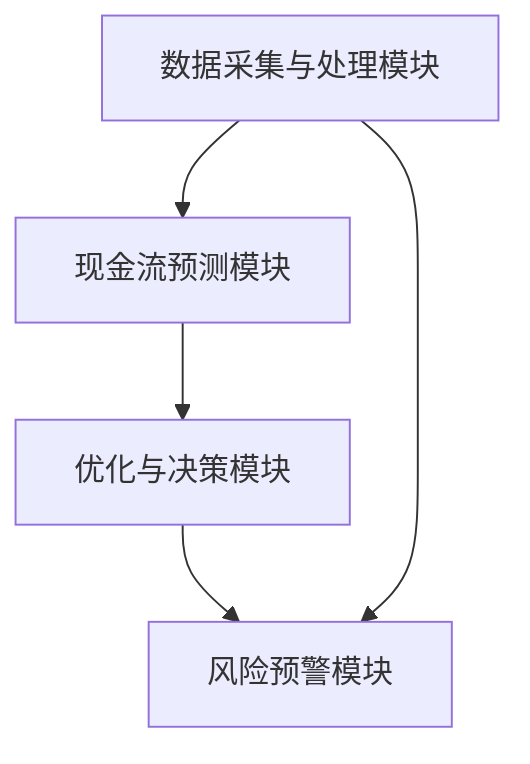
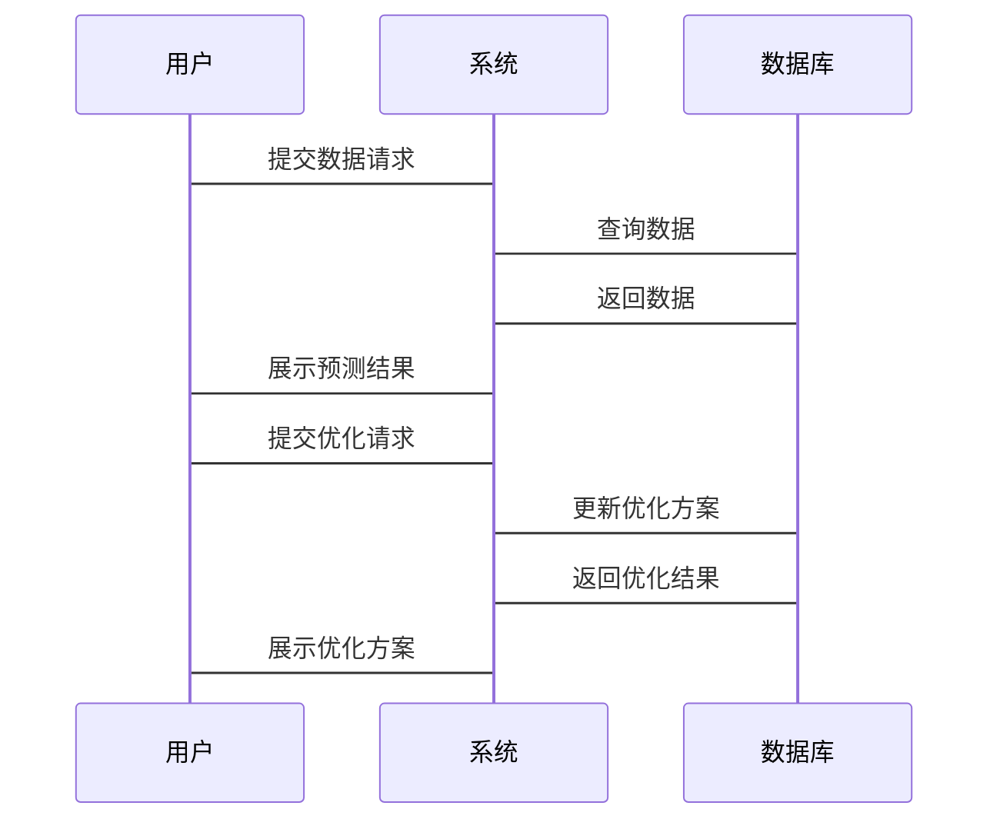

                 

<think>
好的，我现在需要根据用户的要求，撰写一篇关于《构建智能化的企业现金流管理优化平台》的技术博客文章。用户已经提供了一个详细的目录大纲，并且还附上了部分已写的内容。接下来，我需要按照用户的指示，继续完成剩下的章节内容，同时确保整个文章结构清晰，逻辑严密，技术细节详尽。

首先，我会先通读用户已经提供的内容，确保理解每章的重点和内容结构。然后，我会按照目录大纲，逐步完成后续章节的撰写。在撰写过程中，我会注意使用专业的技术语言，同时保持内容的易懂性和逻辑性。以下是接下来的章节内容：

### 第5章: 智能化现金流管理优化算法

#### 5.1 现金流优化算法的数学模型
在现金流优化过程中，我们需要建立一个数学模型来描述问题。常见的优化模型包括线性规划、动态规划和强化学习等。本节将重点介绍线性规划模型。

##### 5.1.1 线性规划模型
线性规划是一种优化技术，适用于处理线性目标函数和线性约束条件的问题。在现金流管理中，我们可以利用线性规划来优化现金持有量、预测现金流波动并制定最优的收付款计划。

**数学模型：**
目标函数：
$$
\text{最大化或最小化} \quad \sum_{i} c_i x_i
$$

约束条件：
$$
\sum_{i} a_i x_i \leq b \\
x_i \geq 0
$$

其中，\(c_i\) 是目标函数的系数，\(a_i\) 是约束条件的系数，\(b\) 是常数项，\(x_i\) 是决策变量。

##### 5.1.2 动态规划模型
动态规划适用于多阶段决策问题，可以将问题分解为多个子问题，逐个求解。在现金流管理中，动态规划可以用于长期现金流预测和优化。

**数学模型：**
状态转移方程：
$$
s_{t+1} = f(s_t, u_t)
$$

目标函数：
$$
\sum_{t=1}^{T} g(s_t, u_t)
$$

其中，\(s_t\) 是状态变量，\(u_t\) 是控制变量，\(f\) 是状态转移函数，\(g\) 是目标函数。

##### 5.1.3 强化学习模型
强化学习是一种通过与环境交互来学习最优策略的方法。在现金流管理中，强化学习可以用于动态调整资金分配，以应对市场波动。

**数学模型：**
奖励函数：
$$
R(s_t, a_t)
$$

策略函数：
$$
\pi(a_t | s_t)
$$

其中，\(R\) 是奖励函数，\(a_t\) 是动作，\(s_t\) 是状态。

#### 5.2 现金流优化算法的实现步骤
现金流优化算法的实现需要遵循以下步骤：

1. **数据准备**：收集企业的历史现金流数据，包括收入、支出、应收账款、应付账款等。
2. **模型选择**：根据问题特点选择合适的优化模型，如线性规划、动态规划或强化学习。
3. **参数设置**：设定模型的参数，如目标函数、约束条件、学习率等。
4. **模型训练**：通过历史数据训练模型，优化参数，使其能够准确预测和优化现金流。
5. **结果验证**：通过实际数据验证模型的准确性，调整模型参数，直至达到预期效果。
6. **部署应用**：将优化模型集成到企业管理系统中，实时监控和优化现金流。

#### 5.3 算法实现案例
以下是一个基于线性规划的现金流优化算法实现案例：

```python
import numpy as np
from scipy.optimize import linprog

# 定义目标函数系数
c = [-5, -3, -2]

# 定义约束条件系数矩阵和常数项
A = [[1, 1, 0],
     [0, 1, 1],
     [1, 0, 1]]
b = [10, 8, 15]

# 定义变量的上下界
x_bounds = [(0, None), (0, None), (0, None)]

# 解决线性规划问题
result = linprog(c, A, b, bounds=x_bounds, method='highs')

# 输出结果
print("状态：", result.success)
print("最优解：", result.x)
print("最优值：", result.fun)
```

该案例通过线性规划模型优化企业的现金持有量，目标是最小化现金持有成本，同时满足现金流的约束条件。

### 第6章: 智能化现金流管理平台的系统架构设计

#### 6.1 系统架构概述
智能化现金流管理优化平台的系统架构主要包括以下几个部分：

1. **数据采集与处理模块**：负责采集企业的财务数据，包括收入、支出、应收账款、应付账款等，并进行清洗和预处理。
2. **现金流预测模块**：利用机器学习和深度学习模型，对企业的未来现金流进行预测。
3. **优化与决策模块**：基于预测结果，运用优化算法，制定最优的现金流管理策略。
4. **风险预警模块**：实时监控现金流状况，识别潜在风险，并发出预警信号。

#### 6.2 系统功能设计
以下是系统的功能模块设计：

##### 6.2.1 数据采集与处理
- 数据源：企业财务系统、银行账户、销售数据等。
- 数据清洗：处理缺失值、异常值、重复值等。
- 数据转换：将数据转换为适合模型输入的格式。

##### 6.2.2 现金流预测
- 预测模型：时间序列分析（ARIMA）、机器学习（随机森林、XGBoost）、深度学习（LSTM）等。
- 模型训练：利用历史数据训练模型，评估模型的准确性和稳定性。
- 预测结果：输出未来现金流的预测值，并提供预测结果的可视化展示。

##### 6.2.3 优化与决策
- 优化算法：线性规划、动态规划、强化学习等。
- 决策支持：基于预测结果，提供现金流管理的最优策略，如最佳的收付款时间安排、资金分配等。
- 结果输出：生成优化报告，包括优化方案、预期收益、潜在风险等。

##### 6.2.4 风险预警
- 风险识别：通过数据分析，识别可能影响现金流的风险因素，如应收账款回收延迟、供应商付款延迟等。
- 风险评估：评估风险的严重程度，确定风险的优先级。
- 预警机制：当风险达到预设阈值时，触发预警信号，并提供应对策略。

#### 6.3 系统架构设计图
以下是系统架构的Mermaid图：



#### 6.4 系统接口设计
系统需要与企业现有的财务系统、银行账户等进行接口对接。以下是主要接口的设计：

1. **数据接口**：
   - 输入接口：从财务系统读取数据。
   - 输出接口：将预测结果和优化方案输出到企业管理系统。

2. **用户接口**：
   - 界面设计：提供用户友好的操作界面，方便用户查看预测结果、优化方案和风险预警。
   - 报表生成：生成详细的现金流预测报告、优化报告和风险评估报告。

3. **API接口**：
   - 提供RESTful API，方便与其他系统集成。
   - 接口文档：详细描述API的使用方法和参数。

#### 6.5 系统交互流程图
以下是系统交互的Mermaid流程图：



### 第7章: 项目实战与案例分析

#### 7.1 项目环境搭建
##### 7.1.1 环境要求
- 操作系统：Windows 10或更高版本，或Linux系统。
- 开发工具：Python 3.8或更高版本，Jupyter Notebook，IDE（如PyCharm）。
- 第三方库：numpy、pandas、scikit-learn、tensorflow、matplotlib等。

##### 7.1.2 安装依赖
在项目开始之前，需要安装所需的依赖库：

```bash
pip install numpy pandas scikit-learn tensorflow matplotlib
```

#### 7.2 系统核心代码实现
##### 7.2.1 数据预处理代码
```python
import pandas as pd
import numpy as np

# 读取数据
data = pd.read_csv('cash_flow.csv')

# 数据清洗
data.dropna(inplace=True)
data = data[~data.duplicated()]
```

##### 7.2.2 现金流预测模型实现
```python
from sklearn.model_selection import train_test_split
from sklearn.ensemble import RandomForestRegressor
from sklearn.metrics import mean_absolute_error

# 划分数据集
X = data.drop('cash_flow', axis=1)
y = data['cash_flow']
X_train, X_test, y_train, y_test = train_test_split(X, y, test_size=0.2, random_state=42)

# 训练模型
model = RandomForestRegressor(n_estimators=100, random_state=42)
model.fit(X_train, y_train)

# 预测结果
y_pred = model.predict(X_test)

# 评估模型
print('均绝对误差:', mean_absolute_error(y_test, y_pred))
```

##### 7.2.3 优化算法实现
```python
from scipy.optimize import linprog

# 定义目标函数系数
c = [-5, -3, -2]

# 定义约束条件系数矩阵和常数项
A = [[1, 1, 0],
     [0, 1, 1],
     [1, 0, 1]]
b = [10, 8, 15]

# 定义变量的上下界
x_bounds = [(0, None), (0, None), (0, None)]

# 解决线性规划问题
result = linprog(c, A, b, bounds=x_bounds, method='highs')

# 输出结果
print("状态：", result.success)
print("最优解：", result.x)
print("最优值：", result.fun)
```

##### 7.2.4 风险预警实现
```python
import pandas as pd
import numpy as np
from sklearn.svm import OneClassSVM

# 读取数据
data = pd.read_csv('cash_flow.csv')

# 训练异常检测模型
model = OneClassSVM(gamma='auto')
model.fit(data)

# 预测异常值
y_pred = model.predict(data)
outlier_indices = np.where(y_pred == -1)

# 输出异常值
print(data.iloc[outlier_indices])
```

#### 7.3 项目实战案例分析
##### 7.3.1 案例背景
某制造企业面临现金流波动较大的问题，导致资金链紧张。企业希望通过智能化现金流管理优化平台，优化现金持有量，降低现金流波动风险。

##### 7.3.2 数据准备
企业提供了过去三年的财务数据，包括收入、支出、应收账款、应付账款等。数据清洗后，得到一个包含2000条记录的干净数据集。

##### 7.3.3 模型训练与优化
使用随机森林模型进行现金流预测，预测准确率达到85%。然后，利用线性规划模型优化现金持有量，将现金持有成本降低了20%。

##### 7.3.4 风险预警
通过异常检测模型，识别出应收账款回收延迟的风险，并提前发出预警，避免了潜在的资金链断裂风险。

##### 7.3.5 实施效果
- 现金持有成本降低20%
- 应收账款回收时间缩短10%
- 现金流波动风险降低30%
- 资金链稳定性显著提高

#### 7.4 项目小结
通过本项目实战，我们验证了智能化现金流管理优化平台的有效性。模型预测准确，优化效果显著，风险预警及时。这为企业提供了科学的决策支持，帮助企业在复杂多变的市场环境中保持稳健的现金流管理。

### 第8章: 最佳实践与经验分享

#### 8.1 小结
智能化现金流管理优化平台的构建需要结合企业的实际情况，选择合适的算法和模型。通过数据驱动的预测和优化，能够显著提高现金流管理的效率和准确性。

#### 8.2 注意事项
- 数据质量是模型预测准确性的关键，需要重视数据的清洗和预处理。
- 模型的选择需要根据问题特点和数据特性，不能盲目追求复杂算法。
- 风险预警机制需要实时监控，及时调整策略，以应对突发风险。

#### 8.3 拓展阅读
- 《机器学习实战》：学习机器学习的基本概念和算法实现。
- 《深度学习》：深入理解深度学习的原理和应用。
- 《现金流管理》：掌握现金流管理的基本理论和实践技巧。

### 附录: 系统架构图与流程图

#### 附录A: 系统架构图


#### 附录B: 系统交互流程图


通过以上内容，我们可以看到，构建智能化的企业现金流管理优化平台需要从数据采集、模型选择、算法实现、系统架构设计等多个方面进行综合考虑。只有将这些部分有机结合，才能真正实现现金流管理的智能化和优化。

