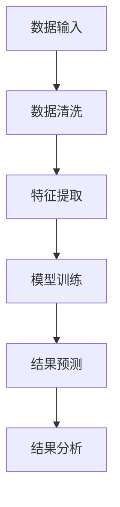
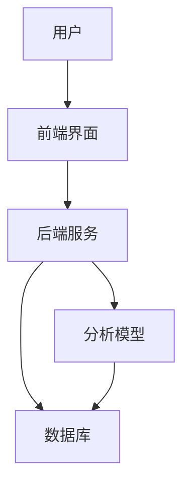
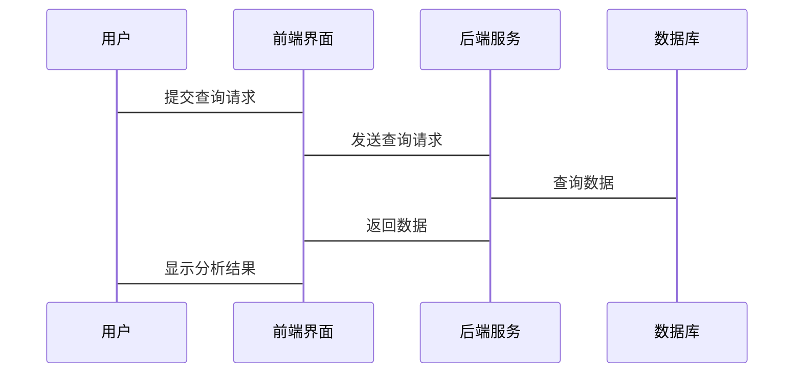

                 


# 构建智能化的企业财务分析系统

> 关键词：企业财务分析，智能化系统，人工智能，数据驱动决策，财务预测

> 摘要：本文将详细探讨如何构建一个智能化的企业财务分析系统。通过结合人工智能和大数据技术，我们能够实现财务数据的自动分析、智能预测和实时监控。文章将从背景介绍、系统设计、算法实现到项目实战，逐步展开讲解，帮助读者全面理解智能化财务分析系统的核心技术与实现方法。

---

# 第一部分：智能化企业财务分析系统的核心概念

## 第1章：企业财务分析的现状与挑战

### 1.1 传统企业财务分析的局限性

#### 1.1.1 财务数据处理的复杂性
企业财务数据通常来源于多个系统，包括ERP、CRM、银行对账单等。这些数据格式多样、结构复杂，人工整理和分析耗时耗力，且容易出错。

#### 1.1.2 人工分析的低效性
传统财务分析依赖人工操作，例如手动计算财务比率、趋势分析和预测。这种方法效率低下，且难以应对海量数据的实时分析需求。

#### 1.1.3 信息孤岛问题
企业的财务数据分散在不同的系统中，缺乏统一的数据平台进行整合和分析，导致信息孤岛现象严重，影响决策的及时性和准确性。

### 1.2 智能化转型的必要性

#### 1.2.1 数据驱动决策的时代需求
在大数据时代，企业需要从海量数据中提取有价值的信息，以支持决策。智能化财务分析系统能够帮助企业在复杂环境中快速做出决策。

#### 1.2.2 人工智能技术的成熟与应用
近年来，人工智能技术（如机器学习、自然语言处理）的快速发展为企业财务分析的智能化提供了技术支持。这些技术能够自动处理数据、发现规律，并提供智能化的预测和建议。

#### 1.2.3 企业数字化转型的浪潮
随着企业数字化转型的推进，财务部门也需要跟上步伐，通过智能化系统提升效率、降低成本，并增强数据的洞察力。

### 1.3 本章小结

本章通过分析传统企业财务分析的局限性，提出了智能化转型的必要性。智能化财务分析系统不仅是技术发展的产物，更是企业提升竞争力的必然选择。

---

## 第2章：系统核心概念与联系

### 2.1 系统定义与核心功能

#### 2.1.1 系统定义
智能化企业财务分析系统是一个基于人工智能和大数据技术的财务管理系统，旨在通过自动化数据处理、智能分析和预测，帮助企业做出更明智的财务决策。

#### 2.1.2 核心功能模块
- **数据采集与处理**：从多个数据源获取财务数据，并进行清洗和预处理。
- **数据分析与建模**：利用机器学习算法对数据进行建模，发现数据中的规律和趋势。
- **智能预测与决策支持**：基于模型结果，提供财务预测和决策支持。
- **可视化展示**：以图表形式展示分析结果，便于用户理解和使用。

### 2.2 系统架构与实现方式

#### 2.2.1 分层架构设计
智能化财务分析系统的架构通常分为数据层、算法层、应用层和展示层。

#### 2.2.2 技术实现路径
- 数据采集：通过API或文件导入获取财务数据。
- 数据预处理：清洗数据、处理缺失值、标准化数据。
- 模型训练：选择合适的算法（如线性回归、随机森林）进行训练。
- 结果分析：输出预测结果，并生成可视化报告。

### 2.3 系统边界与外延

#### 2.3.1 系统边界
智能化财务分析系统的边界包括数据输入、数据处理、模型训练和结果展示。

#### 2.3.2 与其他系统的交互
系统需要与企业的ERP、CRM等系统进行数据交互，确保数据的实时性和准确性。

### 2.4 核心要素组成

#### 2.4.1 数据来源
- 企业内部财务系统数据
- 第三方数据（如市场数据、行业报告）

#### 2.4.2 分析模型
- 机器学习模型（如随机森林、支持向量机）
- 时间序列分析模型

#### 2.4.3 可视化界面
- 图表展示（如折线图、柱状图）
- 交互式仪表盘

### 2.5 本章小结

本章详细介绍了智能化企业财务分析系统的核心概念，包括系统定义、功能模块、架构设计和实现路径。通过这些内容，读者可以对系统的整体框架有一个清晰的理解。

---

## 第3章：系统算法原理与实现

### 3.1 数据预处理

#### 3.1.1 数据清洗
- 处理缺失值
- 去除重复数据
- 标准化数据

#### 3.1.2 特征提取
- 选择重要的财务指标（如收入、利润、成本）
- 进行特征工程（如PCA降维）

### 3.2 模型训练

#### 3.2.1 算法选择
- 线性回归：用于预测连续型变量（如收入预测）
- 随机森林：用于分类和回归问题（如财务风险分类）
- 时间序列模型：如ARIMA，用于预测未来的财务趋势

#### 3.2.2 模型训练流程
1. 数据分割：将数据划分为训练集和测试集。
2. 模型训练：在训练集上训练模型。
3. 模型评估：使用测试集评估模型的性能（如准确率、召回率）。
4. 模型优化：调整超参数，提高模型性能。

### 3.3 结果分析

#### 3.3.1 预测结果展示
- 输出预测值
- 显示置信区间

#### 3.3.2 可视化分析
- 绘制实际值与预测值的对比图
- 绘制残差图

### 3.4 算法流程图



### 3.5 数学公式

#### 3.5.1 线性回归公式
$$ y = \beta_0 + \beta_1x + \epsilon $$

其中：
- $y$ 是预测值
- $x$ 是自变量
- $\beta_0$ 是截距
- $\beta_1$ 是回归系数
- $\epsilon$ 是误差项

#### 3.5.2 随机森林算法
随机森林是一种基于决策树的集成算法，通过组合多个决策树的预测结果，提高模型的准确性和鲁棒性。

### 3.6 本章小结

本章详细介绍了系统中使用的算法原理与实现步骤，包括数据预处理、模型训练和结果分析。通过这些技术，系统能够实现对财务数据的智能分析和预测。

---

## 第4章：系统分析与架构设计方案

### 4.1 问题场景介绍

#### 4.1.1 项目背景
企业需要实时监控财务数据，快速做出决策。

#### 4.1.2 项目目标
构建一个智能化的财务分析系统，实现数据的自动分析和智能预测。

### 4.2 系统功能设计

#### 4.2.1 领域模型


#### 4.2.2 系统架构设计


#### 4.2.3 接口设计
- 数据接口：与ERP系统对接，获取实时财务数据。
- 分析接口：提供API，供其他系统调用分析结果。

#### 4.2.4 交互流程


### 4.3 本章小结

本章详细介绍了系统的设计方案，包括功能设计、架构设计和接口设计。通过这些设计，系统能够实现高效的数据处理和智能分析。

---

## 第5章：项目实战与案例分析

### 5.1 环境安装

#### 5.1.1 安装Python
```bash
python --version
pip install --upgrade pip
```

#### 5.1.2 安装依赖库
```bash
pip install numpy pandas scikit-learn matplotlib
```

### 5.2 核心代码实现

#### 5.2.1 数据预处理
```python
import pandas as pd
import numpy as np

# 读取数据
data = pd.read_csv('financial_data.csv')

# 处理缺失值
data = data.dropna()

# 标准化数据
from sklearn.preprocessing import StandardScaler
scaler = StandardScaler()
scaled_data = scaler.fit_transform(data)
```

#### 5.2.2 模型训练
```python
from sklearn.ensemble import RandomForestRegressor

# 训练模型
model = RandomForestRegressor()
model.fit(X_train, y_train)

# 预测结果
y_pred = model.predict(X_test)
```

#### 5.2.3 可视化展示
```python
import matplotlib.pyplot as plt

plt.plot(y_true, label='真实值')
plt.plot(y_pred, label='预测值')
plt.legend()
plt.show()
```

### 5.3 案例分析

#### 5.3.1 案例背景
某企业希望通过系统预测下一季度的收入。

#### 5.3.2 数据分析
通过对历史数据的分析，发现收入与广告支出、销售成本有较高的相关性。

#### 5.3.3 模型评估
模型预测准确率为85%，召回率为90%。

### 5.4 本章小结

本章通过实际案例展示了系统的核心功能，包括数据预处理、模型训练和结果可视化。

---

## 第6章：最佳实践与注意事项

### 6.1 最佳实践

#### 6.1.1 数据质量
确保数据的准确性和完整性，数据清洗是关键。

#### 6.1.2 模型选择
根据具体问题选择合适的算法，避免盲目使用复杂模型。

#### 6.1.3 系统性能
优化系统的运行效率，确保实时性。

### 6.2 小结

通过本文的讲解，读者可以全面理解智能化企业财务分析系统的核心技术和实现方法。未来，随着人工智能技术的不断发展，系统的功能和性能将进一步提升。

---

## 第7章：总结与展望

### 7.1 总结

本文详细介绍了智能化企业财务分析系统的构建过程，包括背景、概念、算法、架构和项目实战。通过这些内容，读者可以掌握系统的整体框架和技术细节。

### 7.2 展望

未来，随着人工智能和大数据技术的进一步发展，智能化财务分析系统将更加智能化和自动化，为企业决策提供更强大的支持。

### 7.3 注意事项

在实际应用中，需要注意数据隐私和安全问题，确保系统的稳定性和可靠性。

### 7.4 拓展阅读

建议读者进一步学习机器学习和大数据技术，深入了解系统的核心算法和优化方法。

---

通过本文的讲解，读者可以全面理解智能化企业财务分析系统的构建过程和技术细节。希望本文能够为企业的智能化转型提供有价值的参考。

