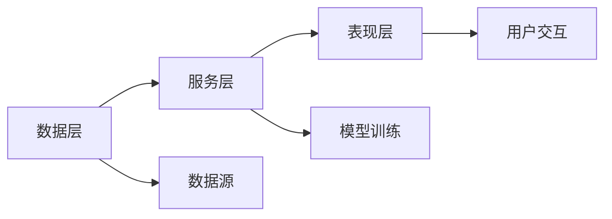

                 


# 《构建智能化的企业财务报表分析系统》

## 关键词
- 智能化财务报表分析
- 机器学习
- 大数据
- 企业财务管理
- 智能决策支持

## 摘要
本文旨在探讨如何利用人工智能和大数据技术构建智能化的企业财务报表分析系统。通过系统地分析财务数据，结合机器学习算法，实现对财务状况的智能预测、诊断和决策支持。文章从理论到实践，详细阐述了系统的构建过程，包括数据预处理、特征提取、模型训练与优化，以及系统的架构设计和实现。通过实际案例分析，展示了该系统在企业财务管理中的应用价值和优势。

---

# 第一部分: 智能化企业财务报表分析系统概述

## 第1章: 背景与问题背景

### 1.1 企业财务报表分析的智能化需求
#### 1.1.1 财务报表分析的传统方式与局限性
- 传统财务报表分析依赖人工解读，效率低下，且易受主观因素影响。
- 数据量大、维度复杂，传统方法难以全面捕捉财务信息。

#### 1.1.2 智能化分析的必要性与优势
- 利用机器学习和大数据技术，提高分析效率和准确性。
- 智能化系统能够发现隐藏的财务规律，提供深度洞察。

#### 1.1.3 企业的财务数据特征与挑战
- 数据异质性：企业财务数据来源多样，格式复杂。
- 数据稀疏性：部分数据可能存在缺失或不完整。
- 数据敏感性：财务数据涉及企业机密，需确保数据安全。

### 1.2 问题描述与目标
#### 1.2.1 财务报表分析的核心问题
- 财务健康状况评估：通过财务指标预测企业的偿债能力、盈利能力等。
- 财务异常检测：识别财务报表中的异常值或潜在风险。

#### 1.2.2 智能化分析的目标与边界
- 目标：构建一个能够自动分析财务数据、提供智能决策支持的系统。
- 边界：系统主要关注财务数据的分析，不涉及企业的业务操作。

#### 1.2.3 系统设计的外延与限制
- 外延：支持多维度的财务分析，包括趋势分析、对比分析等。
- 限制：受数据质量和数量的限制，系统性能可能受到影响。

---

## 第2章: 核心概念与联系

### 2.1 核心概念原理
#### 2.1.1 数据预处理与特征提取
- 数据清洗：处理缺失值、异常值和重复数据。
- 特征提取：从财务数据中提取有用的特征，如利润增长率、资产负债率等。

#### 2.1.2 机器学习模型的应用
- 监督学习：用于分类和回归问题，如企业信用评级、利润预测。
- 无监督学习：用于聚类分析，如客户分群、风险评估。

#### 2.1.3 智能化决策支持系统
- 系统通过分析财务数据，为企业管理者提供决策支持，如投资决策、成本控制等。

### 2.2 核心概念对比分析
#### 2.2.1 数据预处理方法对比
| 方法 | 描述 | 优缺点 |
|------|------|--------|
| 删除法 | 删除缺失值 | 简单但可能导致数据丢失 | 
| 填充法 | 使用均值或中位数填充 | 易引入偏差 | 

#### 2.2.2 不同机器学习算法的优劣势对比
| 算法 | 优势 | 劣势 |
|------|------|------|
| 决策树 | 易解释，适合分类问题 | 易过拟合 |
| 随机森林 | 抗过拟合，准确性高 | 计算复杂度高 |
| 神经网络 | 高准确性，适合复杂模式 | 需大量数据，难解释 |

#### 2.2.3 智能化系统与其他财务分析工具的对比
| 工具 | 描述 | 优缺点 |
|------|------|--------|
| Excel | 简单易用，功能强大 | 手动操作，效率低 |
| 传统财务分析系统 | 支持自动化分析 | 功能有限，难以深度挖掘 |

### 2.3 实体关系图


---

## 第3章: 算法原理与实现

### 3.1 算法原理
#### 3.1.1 决策树算法
- 基于特征的分裂，构建分类或回归树。
- 常见算法：ID3、C4.5、CART。

#### 3.1.2 随机森林算法
- 通过集成学习，构建多个决策树，提高准确性和鲁棒性。

#### 3.1.3 神经网络算法
- 使用多层感知机，通过反向传播训练网络，适用于复杂的非线性关系。

### 3.2 算法流程图


### 3.3 算法实现
#### 3.3.1 决策树实现
```python
# 决策树算法示例
from sklearn.tree import DecisionTreeClassifier
model = DecisionTreeClassifier()
model.fit(X_train, y_train)
```

#### 3.3.2 随机森林实现
```python
from sklearn.ensemble import RandomForestClassifier
model = RandomForestClassifier(n_estimators=100)
model.fit(X_train, y_train)
```

#### 3.3.3 神经网络实现
```python
from sklearn.neural_network import MLPClassifier
model = MLPClassifier(hidden_layer_sizes=(100, 50))
model.fit(X_train, y_train)
```

---

## 第4章: 系统架构与设计

### 4.1 系统架构设计
#### 4.1.1 分层架构设计
- 数据层：存储和管理财务数据。
- 服务层：处理数据预处理、模型训练等逻辑。
- 表现层：展示分析结果，提供交互界面。

#### 4.1.2 模块化设计
- 数据采集模块：从数据库中提取财务数据。
- 数据处理模块：清洗和转换数据。
- 模型训练模块：训练机器学习模型。
- 结果展示模块：可视化分析结果。

#### 4.1.3 高可用性设计
- 负载均衡：分担请求压力，提高系统可用性。
- 数据备份：防止数据丢失，确保系统稳定性。

### 4.2 系统功能设计
#### 4.2.1 数据采集模块
- 从多种数据源（如数据库、CSV文件）获取财务数据。
- 数据格式转换，确保兼容性。

#### 4.2.2 数据处理模块
- 数据清洗：处理缺失值、重复值。
- 特征提取：从财务数据中提取有用的特征。

#### 4.2.3 模型训练模块
- 选择合适的算法，训练模型。
- 调参优化，提高模型性能。

#### 4.2.4 结果展示模块
- 可视化分析结果，如图表展示。
- 提供决策建议，辅助企业决策。

### 4.3 系统架构图


---

## 第5章: 项目实战

### 5.1 环境安装
- 安装Python和必要的库（如scikit-learn、pandas、numpy）。

### 5.2 核心实现
#### 5.2.1 数据处理
```python
import pandas as pd
data = pd.read_csv('financial_data.csv')
data.dropna(inplace=True)
```

#### 5.2.2 模型训练
```python
from sklearn.model_selection import train_test_split
from sklearn.metrics import accuracy_score

X_train, X_test, y_train, y_test = train_test_split(X, y, test_size=0.2)
model.fit(X_train, y_train)
y_pred = model.predict(X_test)
print(accuracy_score(y_test, y_pred))
```

#### 5.2.3 结果展示
```python
import matplotlib.pyplot as plt
plt.plot(history.history['accuracy'], label='train')
plt.plot(history.history['val_accuracy'], label='test')
plt.legend()
plt.show()
```

### 5.3 实际案例分析
- 使用真实企业的财务数据，训练模型，分析财务状况。

---

## 第6章: 总结与展望

### 6.1 总结
- 本文详细介绍了智能化企业财务报表分析系统的构建过程。
- 系统能够高效分析财务数据，提供智能决策支持。

### 6.2 未来展望
- 数据源多样化：整合更多数据源，提高分析准确性。
- 模型优化：引入深度学习技术，提升系统性能。
- 应用场景扩展：将系统应用于更多领域，如供应链管理。

### 6.3 注意事项
- 数据隐私保护：确保财务数据的安全性。
- 系统维护：定期更新模型，适应业务变化。

### 6.4 最佳实践 Tips
- 数据预处理是关键，确保数据质量。
- 模型选择要根据具体问题，选择合适的算法。

---

通过以上目录，您可以系统地学习如何构建智能化的企业财务报表分析系统。每个章节都详细讲解了相关知识，并提供了具体的实现示例和代码，帮助您从理论到实践，逐步掌握系统构建的全过程。

