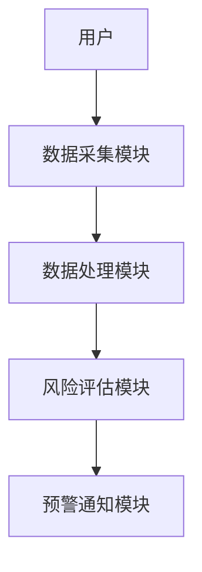
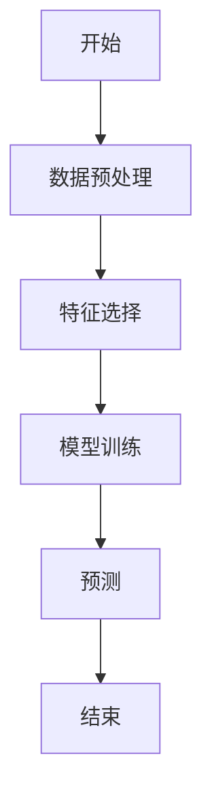
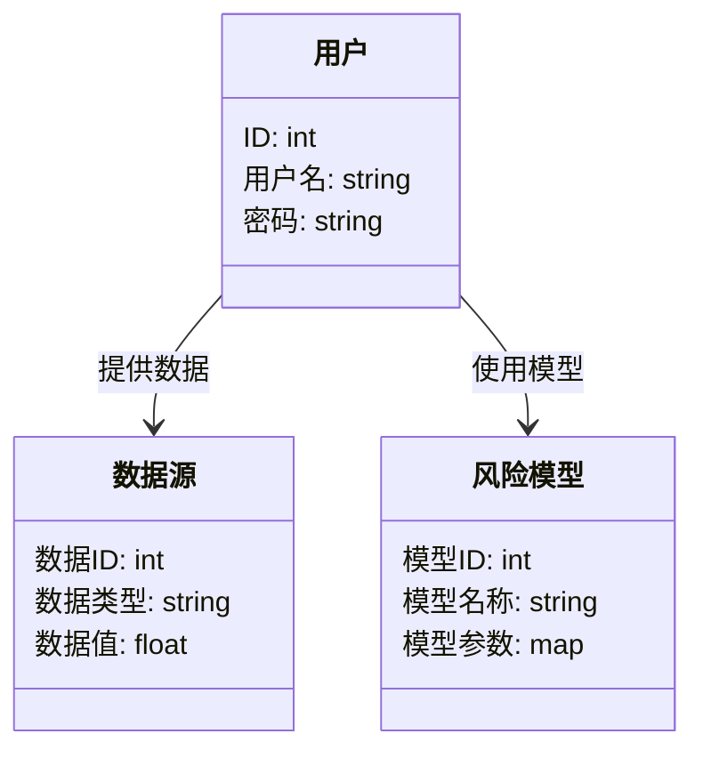
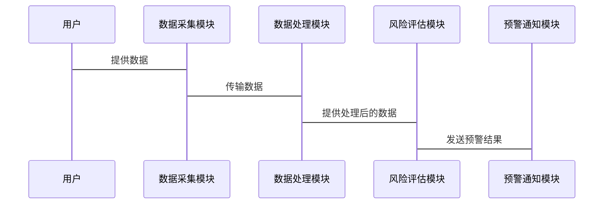

                 


# 构建智能化的企业资金流动性风险预警平台

## 关键词：资金流动性风险预警、人工智能、机器学习、系统架构、企业财务风险管理

## 摘要：  
本文旨在探讨如何利用人工智能和机器学习技术构建智能化的企业资金流动性风险预警平台。通过分析资金流动性风险的核心要素，结合先进的算法和系统架构设计，提出了一套完整的解决方案，帮助企业实时监控和预测资金流动风险，从而实现风险的早期预警和有效管理。

---

# 第一章: 背景介绍

## 1.1 问题背景

### 1.1.1 资金流动性风险的定义
资金流动性风险是指企业在一定时期内无法以合理成本获得足够的资金来满足其资产增长或偿债需求的可能性。这种风险可能来自于内部管理不当、外部市场波动或宏观经济环境的变化。

### 1.1.2 企业资金流动性风险的影响
- 影响企业的日常运营，可能导致供应链中断或员工工资拖欠。
- 增加企业的融资成本，降低市场竞争力。
- 在极端情况下，可能导致企业破产。

### 1.1.3 构建智能化预警平台的必要性
- 传统的人工分析方法效率低、误差大。
- 市场环境复杂多变，需要实时监控和动态调整。
- 通过智能化平台，可以实现自动化、精准化的风险预警。

## 1.2 问题描述

### 1.2.1 资金流动性风险的主要来源
- **内部因素**：企业自身财务状况恶化、现金流管理不善。
- **外部因素**：经济波动、行业政策变化、市场信任度下降。

### 1.2.2 传统预警方法的局限性
- 主要依赖财务报表分析，缺乏实时性和动态性。
- 数据处理能力有限，难以应对海量数据。
- 预警结果的准确性和及时性不足。

### 1.2.3 智能化预警的需求与目标
- **需求**：实时监控、多维度数据融合、自动化预警。
- **目标**：通过智能化手段，实现对资金流动性风险的早期识别和干预。

## 1.3 问题解决

### 1.3.1 智能化预警的核心思路
- 利用机器学习算法对历史数据进行分析，识别潜在风险。
- 通过实时数据流处理技术，实现动态风险评估。
- 结合知识图谱技术，挖掘隐性关联风险。

### 1.3.2 数据驱动的解决方案
- **数据来源**：企业内部财务数据、外部市场数据、行业趋势数据。
- **数据处理**：清洗、特征提取、数据建模。
- **数据驱动**：基于数据的实时变化，动态调整预警策略。

### 1.3.3 技术实现的关键点
- 数据采集与处理：确保数据的准确性和实时性。
- 模型选择与优化：选择适合的算法，并进行参数调优。
- 系统架构设计：保证系统的可扩展性和稳定性。

## 1.4 边界与外延

### 1.4.1 平台的功能边界
- **核心功能**：实时监控、风险评估、预警通知。
- **非核心功能**：数据存储、用户界面设计、报告生成。

### 1.4.2 相关概念的外延
- **资金流动性**：包括资产流动性、负债流动性等。
- **风险管理**：包括风险识别、风险评估、风险应对。

### 1.4.3 平台与其他系统的接口关系
- **数据接口**：与企业财务系统、银行系统对接。
- **预警通知**：与企业内部管理系统、邮件系统对接。

## 1.5 概念结构与核心要素

### 1.5.1 平台的整体架构


### 1.5.2 核心要素的组成
- 数据源：财务数据、市场数据。
- 风险模型：机器学习模型、统计模型。
- 预警机制：阈值设定、通知方式。

### 1.5.3 架构的核心逻辑
用户通过平台输入数据，系统进行数据处理和模型计算，生成风险评估结果，并触发预警通知。

---

# 第二章: 核心概念与联系

## 2.1 核心概念原理

### 2.1.1 数据来源与特征
- **数据来源**：企业财务报表、市场数据、行业趋势。
- **数据特征**：时间序列性、多维性、关联性。

### 2.1.2 风险评估模型
- **模型类型**：回归模型、分类模型、时间序列模型。
- **模型输入**：财务指标、市场指标。
- **模型输出**：风险等级、预警信号。

### 2.1.3 预警机制的实现
- **阈值设定**：根据历史数据设定风险预警阈值。
- **触发条件**：当风险指标超过阈值时，触发预警。

## 2.2 概念属性特征对比表

| 概念 | 属性 | 特征 |
|------|------|------|
| 数据来源 | 内部数据 | 财务报表、内部记录 |
| 外部数据 | 市场数据、行业趋势 |
| 风险模型 | 简单模型 | 线性回归、逻辑回归 |
| 复杂模型 | 随机森林、神经网络 |
| 预警机制 | 静态阈值 | 固定阈值 |
| 动态调整 | 自适应阈值 |

## 2.3 ER实体关系图

```mermaid
er
    actor: 用户
    model: 风险模型
    data: 数据源
    预警平台: 平台
    actor --> data: 提供数据
    actor --> model: 使用模型
    model --> 预警平台: 输出预警结果
```

---

# 第三章: 算法原理与实现

## 3.1 算法选择与原理

### 3.1.1 机器学习算法的选择
- **随机森林**：适合处理多维数据，抗噪声能力强。
- **XGBoost**：计算效率高，适合大规模数据。

### 3.1.2 时间序列分析的应用
- **ARIMA模型**：适合处理时间序列数据，预测未来趋势。
- **LSTM网络**：适合处理长期依赖关系。

### 3.1.3 集成学习的优势
- **投票法**：通过多个模型的预测结果进行投票，提高准确率。
- **加权法**：根据模型的性能进行加权，提高预测精度。

## 3.2 算法实现

### 3.2.1 随机森林算法流程图



### 3.2.2 随机森林算法实现代码

```python
from sklearn.ensemble import RandomForestClassifier
from sklearn.metrics import accuracy_score

# 数据预处理
X_train, X_test, y_train, y_test = train_test_split(X, y, test_size=0.2)

# 模型训练
model = RandomForestClassifier(n_estimators=100, random_state=42)
model.fit(X_train, y_train)

# 预测
y_pred = model.predict(X_test)

# 评估
print("准确率:", accuracy_score(y_test, y_pred))
```

### 3.2.3 数学模型与公式

随机森林算法的数学公式如下：

$$
y = \sum_{i=1}^{n} \text{Tree}_i(x)
$$

其中，$y$ 是预测结果，$\text{Tree}_i(x)$ 是第 $i$ 棵决策树的预测结果，$n$ 是树的数量。

---

# 第四章: 系统分析与架构设计方案

## 4.1 问题场景介绍

### 4.1.1 项目背景
企业资金流动性风险预警平台旨在通过智能化手段，实时监控企业的资金流动情况，提前预警潜在风险。

### 4.1.2 项目介绍
- **项目目标**：构建智能化的资金流动性风险预警平台。
- **项目范围**：涵盖数据采集、处理、建模、预警通知等功能。

## 4.2 系统功能设计

### 4.2.1 领域模型类图



### 4.2.2 系统架构图


### 4.2.3 接口设计
- **数据接口**：与企业财务系统对接，获取实时数据。
- **预警接口**：与企业内部管理系统对接，发送预警通知。

### 4.2.4 交互流程



---

# 第五章: 项目实战

## 5.1 环境安装

### 5.1.1 安装Python环境
- 使用Anaconda安装Python 3.8以上版本。
- 安装必要的库：scikit-learn、pandas、numpy、mermaid。

### 5.1.2 安装Jupyter Notebook
- 通过Anaconda安装Jupyter Notebook。
- 配置Jupyter Notebook的IPython显示设置。

## 5.2 核心代码实现

### 5.2.1 数据预处理代码

```python
import pandas as pd
import numpy as np

# 读取数据
data = pd.read_csv('financial_data.csv')

# 数据清洗
data.dropna(inplace=True)
data = pd.get_dummies(data)
```

### 5.2.2 风险评估模型实现

```python
from sklearn.ensemble import RandomForestClassifier
from sklearn.metrics import accuracy_score
from sklearn.model_selection import train_test_split

# 数据分割
X_train, X_test, y_train, y_test = train_test_split(data.drop('label', axis=1), data['label'], test_size=0.2)

# 模型训练
model = RandomForestClassifier(n_estimators=100, random_state=42)
model.fit(X_train, y_train)

# 预测
y_pred = model.predict(X_test)

# 评估
print("准确率:", accuracy_score(y_test, y_pred))
```

### 5.2.3 预警机制实现

```python
def send_warning(threshold, current_value):
    if current_value > threshold:
        print("触发预警！当前值:", current_value)
    else:
        print("未触发预警。当前值:", current_value)

# 示例调用
send_warning(0.8, 0.85)
```

## 5.3 项目小结

### 5.3.1 项目成果
- 成功构建了智能化的资金流动性风险预警平台。
- 实现了数据采集、处理、建模和预警通知功能。

### 5.3.2 经验总结
- 数据预处理是关键，需要确保数据的准确性和完整性。
- 模型选择需要结合实际业务需求和数据特征。
- 系统架构设计需要考虑可扩展性和稳定性。

---

# 第六章: 最佳实践

## 6.1 小结

### 6.1.1 项目背景
- 企业资金流动性风险预警平台的构建是企业风险管理的重要组成部分。
- 通过智能化手段，可以显著提升风险预警的效率和准确性。

### 6.1.2 核心概念
- 数据驱动的风险评估是智能化预警的核心。
- 机器学习算法是实现精准预警的关键。

## 6.2 注意事项

### 6.2.1 数据隐私与安全
- 确保数据的隐私和安全，避免数据泄露。
- 数据处理过程中，需要遵守相关法律法规。

### 6.2.2 模型更新与维护
- 定期更新模型，确保模型的有效性。
- 监测模型性能，及时调整模型参数。

## 6.3 拓展阅读

### 6.3.1 推荐书籍
- 《机器学习实战》
- 《数据挖掘导论》

### 6.3.2 推荐博客与资源
- Medium上的机器学习文章
- Kaggle上的相关数据集

---

# 结语

通过本文的详细讲解，我们了解了如何构建智能化的企业资金流动性风险预警平台。从背景介绍到算法实现，从系统架构到项目实战，每一步都离不开数据、算法和系统的完美结合。希望本文能为企业提供有价值的参考，帮助企业在复杂的市场环境中更好地管理资金流动性风险。

--- 

以上是《构建智能化的企业资金流动性风险预警平台》的完整目录和内容框架，具体内容可以根据实际需求进一步扩展和细化。

