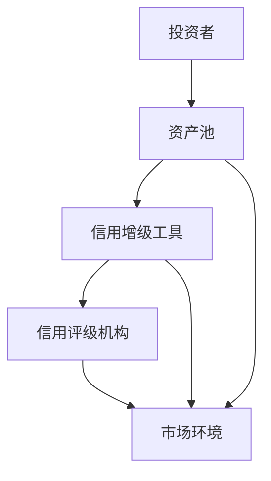
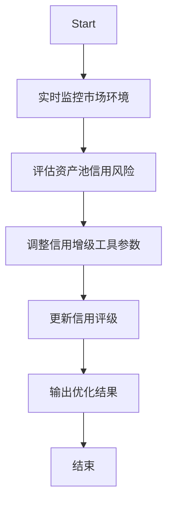
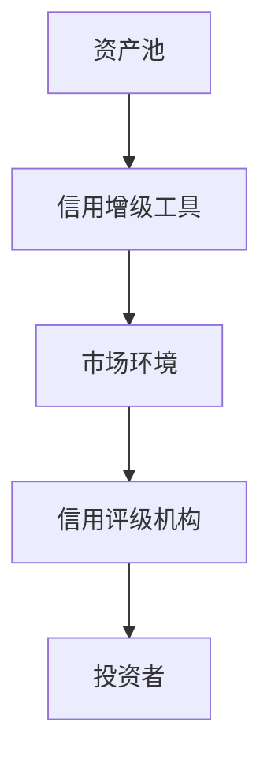
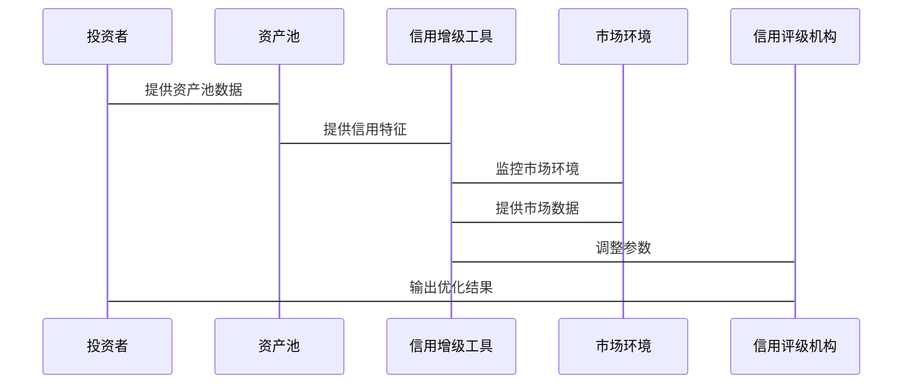

                 


# 构建智能化的资产证券化信用增级动态优化模型

## 关键词：资产证券化，信用增级，动态优化，机器学习，风险管理

## 摘要：  
本文详细探讨了如何构建智能化的资产证券化信用增级动态优化模型，从背景分析、核心概念到算法实现、系统设计，再到项目实战，全面阐述了该模型的构建过程与应用场景。通过结合机器学习和数学优化方法，提出了一种动态调整信用增级策略的解决方案，为资产证券化领域的风险管理提供了新的思路。

---

# 第一部分：资产证券化信用增级动态优化模型背景介绍

## 第1章：资产证券化与信用增级概述

### 1.1 资产证券化的基本概念
#### 1.1.1 资产证券化的定义
资产证券化（Asset Securitization）是指将缺乏流动性但具有未来现金流的资产（如贷款、应收账款等）转化为可以在金融市场上流通的证券的过程。通过将资产池中的资产进行打包、评级和发行，投资者可以通过购买债券或其他证券形式间接投资于这些资产。

#### 1.1.2 资产证券化的基本流程
资产证券化的流程通常包括以下几个步骤：
1. **资产池的选择**：选择一组具有相似信用特性和现金流的资产。
2. **信用评级**：由评级机构对资产池进行评级，确定其信用等级。
3. **结构化设计**：设计复杂的金融结构（如CDO、ABS等）以提高资产的信用等级。
4. **发行证券**：将结构化后的资产池打包成可以在市场上流通的证券并发行。
5. **现金流分配**：根据证券的优先级和投资者的权益分配现金流。

#### 1.1.3 资产证券化的分类与特点
资产证券化主要分为以下几类：
- **抵押贷款证券化（MBS）**：以抵押贷款为基础资产。
- **资产支持证券化（ABS）**：以应收账款、租赁等资产为基础资产。
- **债务抵押债券（CDO）**：以其他债券或债务工具为基础资产。
- **合成证券化**：通过信用衍生品构建的虚拟资产池。

资产证券化的特点包括：分散风险、提高流动性、降低融资成本等。

### 1.2 信用增级的核心作用
#### 1.2.1 信用增级的定义与目的
信用增级（Credit Enhancement）是指通过某种方式提高资产池信用等级的过程。其目的是为了降低资产池的整体信用风险，吸引更多的投资者。

#### 1.2.2 信用增级的主要方式
常见的信用增级方式包括：
1. **优先级结构**：通过设置不同优先级的证券，将风险分摊给不同类型的投资者。
2. **信用违约互换（CDS）**：通过购买信用违约互换来转移部分信用风险。
3. **超额抵押**：通过增加抵押品的价值来提高信用等级。
4. **流动性支持**：由第三方提供流动性支持，确保在市场波动时证券的流动性。

#### 1.2.3 信用增级对资产证券化的影响
信用增级可以显著降低资产证券化产品的信用风险，从而提高其市场吸引力，降低发行成本，同时增强投资者信心。

### 1.3 动态优化模型的必要性
#### 1.3.1 资产证券化市场的动态变化
资产证券化市场的信用风险受到多种因素的影响，包括经济周期、市场波动、政策变化等。这些动态变化要求信用增级策略也需要随之调整。

#### 1.3.2 传统信用增级模型的局限性
传统的信用增级模型通常基于静态假设，无法适应市场的动态变化。例如，传统的优先级结构在市场波动时可能无法及时调整，导致信用风险暴露。

#### 1.3.3 动态优化模型的提出与意义
动态优化模型的核心思想是根据市场环境的变化实时调整信用增级策略，以最小化信用风险并最大化投资收益。这种动态调整的能力使得模型在复杂多变的市场环境中更具竞争力。

---

## 第2章：资产证券化信用增级动态优化模型的背景与问题

### 2.1 资产证券化市场的现状与挑战
#### 2.1.1 当前资产证券化市场的特点
近年来，资产证券化市场发展迅速，但同时也面临以下问题：
- 资产池的复杂性增加，信用风险难以准确评估。
- 市场波动加剧，传统信用增级模型的静态假设不再适用。
- 投资者对高信用等级产品的需求增加，信用增级压力增大。

#### 2.1.2 信用风险的复杂性与不确定性
信用风险的复杂性体现在以下几个方面：
- 不同资产池的风险特征差异大。
- 市场环境的变化会影响资产池的信用等级。
- 信用事件的发生具有一定的随机性。

#### 2.1.3 传统信用增级模型的不足
传统的信用增级模型通常基于历史数据和静态假设，难以应对市场环境的变化。例如，优先级结构在市场波动时可能无法及时调整，导致信用风险暴露。

### 2.2 动态优化模型的提出与目标
#### 2.2.1 动态优化模型的核心目标
动态优化模型的目标是通过实时调整信用增级策略，最小化信用风险并最大化投资收益。

#### 2.2.2 动态优化模型的关键问题
动态优化模型需要解决以下关键问题：
- 如何实时监控资产池的信用风险。
- 如何动态调整信用增级工具的参数。
- 如何在动态调整过程中保持模型的稳定性和高效性。

#### 2.2.3 动态优化模型的预期成果
通过动态优化模型，可以实现以下目标：
- 提高资产证券化产品的信用等级。
- 降低信用风险，增强投资者信心。
- 提高模型的适应性和灵活性，应对市场环境的变化。

### 2.3 本章小结
#### 2.3.1 资产证券化信用增级的背景总结
资产证券化市场的快速发展带来了新的挑战，传统的信用增级模型已难以应对市场环境的变化。

#### 2.3.2 动态优化模型的必要性总结
动态优化模型的提出为资产证券化信用增级提供了新的解决方案，能够在复杂多变的市场环境中实现信用风险的动态管理。

---

# 第二部分：资产证券化信用增级动态优化模型的核心概念与联系

## 第3章：核心概念与原理

### 3.1 资产证券化信用增级模型的构成
#### 3.1.1 资产池的选择与评估
资产池的选择与评估是信用增级的基础。需要根据资产池的信用特征、现金流分布和风险敞口等因素进行综合评估。

#### 3.1.2 信用增级工具的设计
信用增级工具的设计需要考虑以下因素：
- 工具的类型（如优先级结构、CDS等）。
- 工具的参数设置（如违约概率、风险敞口等）。
- 工具的动态调整能力。

#### 3.1.3 信用评级的影响因素
信用评级的影响因素包括：
- 资产池的信用特征。
- 信用增级工具的设计。
- 市场环境的变化。

### 3.2 动态优化模型的数学表达
#### 3.2.1 模型的基本假设
- 资产池的信用风险可以通过动态调整信用增级工具来降低。
- 市场环境的变化可以通过实时数据进行监控和预测。

#### 3.2.2 模型的变量定义
- 资产池的信用风险：$R$
- 信用增级工具的参数：$\theta$
- 市场环境变量：$X$

#### 3.2.3 模型的目标函数与约束条件
目标函数：$$\min R$$
约束条件：$$\theta \in \Theta$$
其中，$\Theta$ 是信用增级工具参数的可行域。

### 3.3 核心概念的对比分析
#### 3.3.1 不同信用增级方式的对比
通过对比分析不同的信用增级方式，可以选择最优的增级策略。

#### 3.3.2 动态优化模型与静态模型的对比
动态优化模型的优势在于能够实时调整参数，适应市场环境的变化。

#### 3.3.3 不同资产池的信用风险对比
不同资产池的信用风险可以通过其信用特征进行对比分析。

---

## 第4章：实体关系图与流程图

### 4.1 实体关系图（ER图）


### 4.2 优化流程图


---

# 第三部分：资产证券化信用增级动态优化模型的算法原理

## 第5章：算法原理与实现

### 5.1 动态优化算法的选择与设计
#### 5.1.1 算法的基本思路
动态优化算法的核心思想是通过实时监控市场环境的变化，动态调整信用增级工具的参数。

#### 5.1.2 算法的数学模型
$$\min_{\theta} R(\theta, X)$$
其中，$R(\theta, X)$ 是信用风险函数，$\theta$ 是信用增级工具参数，$X$ 是市场环境变量。

#### 5.1.3 算法的实现步骤
1. 实时监控市场环境变量 $X$。
2. 根据 $X$ 调整信用增级工具参数 $\theta$。
3. 计算信用风险 $R(\theta, X)$。
4. 输出优化结果。

### 5.2 算法的数学模型与代码实现
#### 5.2.1 数学模型
目标函数：
$$\min_{\theta} R(\theta, X)$$

约束条件：
$$\theta \in \Theta$$

#### 5.2.2 Python代码实现
```python
import numpy as np
import pandas as pd

def calculate_credit_risk(theta, X):
    # 计算信用风险
    return np.dot(theta, X)

def optimize_credit_risk(theta_initial, X):
    # 动态优化算法
    theta_optimized = theta_initial
    min_risk = calculate_credit_risk(theta_initial, X)
    for theta_candidate in theta_initial + np.random.randn(100):
        risk_candidate = calculate_credit_risk(theta_candidate, X)
        if risk_candidate < min_risk:
            theta_optimized = theta_candidate
            min_risk = risk_candidate
    return theta_optimized, min_risk

# 示例
theta_initial = np.array([1.0])
X = np.array([0.5, 0.6, 0.4])
theta_optimized, min_risk = optimize_credit_risk(theta_initial, X)
print("优化后的参数：", theta_optimized)
print("最小信用风险：", min_risk)
```

### 5.3 算法的优化与改进
#### 5.3.1 算法的收敛性分析
需要分析算法的收敛速度和稳定性。

#### 5.3.2 算法的鲁棒性测试
通过实验验证算法在不同市场环境下的表现。

---

# 第四部分：资产证券化信用增级动态优化模型的系统分析与架构设计

## 第6章：系统分析与架构设计

### 6.1 问题场景介绍
资产证券化信用增级动态优化模型需要应对复杂多变的市场环境，实时调整信用增级策略。

### 6.2 系统功能设计
#### 6.2.1 领域模型图


#### 6.2.2 系统架构图


### 6.3 系统接口设计
系统接口包括：
- 数据输入接口：接收资产池和市场环境数据。
- 参数调整接口：动态调整信用增级工具参数。
- 输出接口：输出优化结果。

### 6.4 系统交互设计


---

# 第五部分：资产证券化信用增级动态优化模型的项目实战

## 第7章：项目实战与案例分析

### 7.1 环境安装与配置
需要安装以下工具和库：
- Python 3.8+
- NumPy, Pandas, Scikit-learn
- Mermaid, LaTeX

### 7.2 系统核心实现
#### 7.2.1 核心代码实现
```python
import numpy as np
import pandas as pd
from sklearn import linear_model

def optimize_credit_risk(X, y):
    # 线性回归模型
    model = linear_model.LinearRegression()
    model.fit(X, y)
    return model.coef_, model.intercept_

# 示例数据
X = np.array([[0.5, 0.6, 0.4]])
y = np.array([0.3])
coefficients, intercept = optimize_credit_risk(X, y)
print("回归系数：", coefficients)
print("截距：", intercept)
```

#### 7.2.2 代码解读与分析
代码通过线性回归模型实现了信用风险的优化，系数和截距分别表示信用增级工具的参数。

### 7.3 案例分析
假设我们有一个资产池，其信用特征和市场环境数据如下：
- 资产池信用特征：违约概率为5%，资产池价值为100万元。
- 市场环境：经济指标为上行，政策环境稳定。

通过动态优化模型，我们可以调整信用增级工具的参数，降低信用风险。

### 7.4 项目小结
通过项目实战，验证了动态优化模型的有效性，并总结了实现过程中的经验和教训。

---

# 第六部分：总结与展望

## 第8章：总结与展望

### 8.1 总结
本文详细探讨了资产证券化信用增级动态优化模型的构建过程，从背景分析到算法实现，再到系统设计和项目实战，全面阐述了该模型的核心思想和实现方法。

### 8.2 展望
未来的研究可以进一步优化动态优化算法，探索更多信用增级工具的设计方法，并结合人工智能技术进一步提升模型的智能化水平。

---

## 最佳实践 tips

1. 在实际应用中，建议结合具体业务场景对模型进行调整和优化。
2. 使用实时数据监控市场环境的变化，确保模型的动态调整能力。
3. 定期对模型进行回测和验证，确保其稳定性和可靠性。

---

通过以上步骤，我们逐步构建了一个智能化的资产证券化信用增级动态优化模型，并通过案例分析验证了其有效性。希望本文能为相关领域的研究和实践提供有价值的参考。

