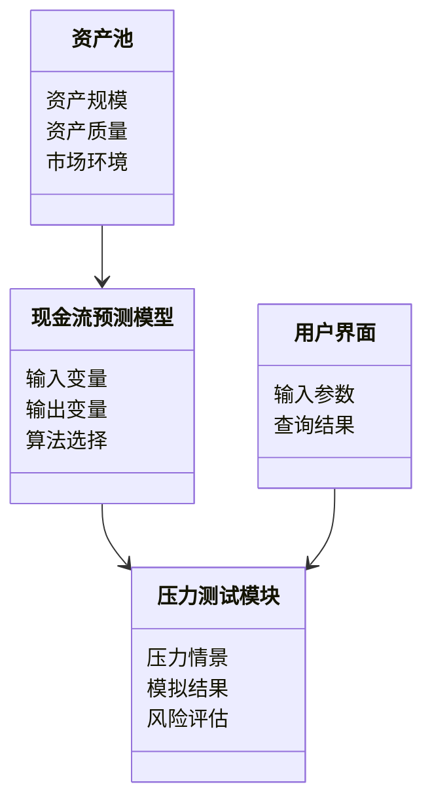

                 


# 构建智能化的资产证券化现金流压力测试模型

## 关键词：资产证券化，现金流，压力测试，智能化模型，机器学习

## 摘要：
资产证券化作为金融市场的重要工具，其现金流预测和压力测试是确保投资安全的关键环节。随着人工智能技术的发展，构建智能化的现金流压力测试模型变得尤为重要。本文将详细探讨如何利用机器学习和深度学习等技术，构建一个智能化、高精度的现金流压力测试模型，为资产证券化提供有力支持。

---

## 第1章: 资产证券化与现金流压力测试的背景

### 1.1 资产证券化的定义与特点

#### 1.1.1 资产证券化的定义
资产证券化是指将流动性较低的资产（如贷款、应收账款等）转化为可在市场上流通的证券的过程。通过将资产池中的资产打包成债券或其他金融产品，投资者可以根据自身风险偏好选择不同信用等级的证券。

#### 1.1.2 资产证券化的核心特点
- **资产隔离**：证券化资产与原始权益人其他资产隔离，确保投资者权益。
- **信用增级**：通过结构化设计提高证券信用等级，降低投资者风险。
- **流动性增强**：将原本流动性较低的资产转化为高流动性的证券，便于投资者交易。

#### 1.1.3 资产证券化与传统融资方式的区别
| 特性                | 资产证券化          | 传统融资方式       |
|---------------------|--------------------|--------------------|
| 资金来源            | 市场投资者           | 银行贷款、发行债券   |
| 风险隔离            | 资产独立，风险可控   | 风险集中于发行人     |
| 融资效率            | 快速，灵活           | 较慢，受制于发行人信用 |

### 1.2 现金流压力测试的重要性

#### 1.2.1 现金流压力测试的定义
现金流压力测试是通过模拟不同压力情景下资产池的现金流表现，评估证券在极端条件下的违约风险和偿付能力。

#### 1.2.2 现金流压力测试的目的与作用
- **风险评估**：识别资产池在不同压力情景下的现金流风险。
- **定价参考**：为证券定价提供依据，确保投资者获得合理回报。
- **监管合规**：满足监管机构对资产证券化产品的风险披露要求。

#### 1.2.3 现金流压力测试在资产证券化中的应用
- 在证券发行前，评估资产池在不同经济周期下的表现。
- 在证券存续期间，定期更新压力测试结果，监控资产池风险。

### 1.3 智能化模型的必要性

#### 1.3.1 传统现金流压力测试的局限性
- **数据依赖性强**：传统模型依赖历史数据，无法准确预测未来极端情景。
- **计算复杂**：手动计算耗时，且容易出错。
- **情景有限**：难以覆盖所有可能的压力情景。

#### 1.3.2 智能化模型的优势
- **自动化处理**：利用机器学习算法自动分析数据，提高效率。
- **情景多样性**：可以模拟多种极端情景，全面评估风险。
- **实时更新**：模型可以根据最新数据实时更新，保持风险评估的准确性。

#### 1.3.3 智能化模型在资产证券化中的应用前景
随着人工智能技术的快速发展，智能化模型在资产证券化领域的应用将越来越广泛，成为未来风险管理的重要工具。

---

## 第2章: 资产证券化现金流压力测试的核心概念

### 2.1 资产证券化现金流模型的构建要素

#### 2.1.1 资产池的定义与特征
资产池是资产证券化的核心，通常包括同质性高、期限相近的资产。例如，住宅抵押贷款支持证券（MBS）的资产池就是一组住房抵押贷款。

#### 2.1.2 现金流预测的关键因素
- **资产池规模**：资产池的总规模直接影响现金流的总量。
- **资产质量**：资产池中资产的信用状况影响违约概率。
- **市场环境**：宏观经济环境（如利率、GDP增长）影响现金流表现。

#### 2.1.3 模型的输入变量与输出变量
| 类别    | 变量描述                          |
|---------|----------------------------------|
| 输入变量 | 资产池规模、资产质量、市场环境等  |
| 输出变量 | 不同压力情景下的现金流预测结果  |

### 2.2 现金流压力测试的核心原理

#### 2.2.1 现金流压力测试的数学模型
现金流压力测试通常采用蒙特卡洛模拟方法，通过模拟不同压力情景下的现金流分布，评估资产池的风险。

#### 2.2.2 不同压力情景下的现金流模拟
- **最佳情景**：经济繁荣，资产表现优异。
- **正常情景**：经济平稳，资产表现稳定。
- **压力情景**：经济衰退，资产违约率上升。

#### 2.2.3 压力测试结果的评估标准
- **违约概率**：资产池在压力情景下的违约可能性。
- **回收率**：违约资产的回收情况，影响现金流净额。
- **净现值**：压力情景下证券的净现值，评估其市场价值。

### 2.3 智能化模型的关键技术

#### 2.3.1 机器学习在现金流预测中的应用
- **支持向量回归（SVR）**：用于预测现金流的时间序列。
- **随机森林（Random Forest）**：用于分类资产池的风险等级。

#### 2.3.2 深度学习模型的优势
- **长短期记忆网络（LSTM）**：适合处理时间序列数据，捕捉长期依赖关系。
- **卷积神经网络（CNN）**：用于特征提取，提高模型的非线性拟合能力。

#### 2.3.3 智能化模型的优化策略
- **数据预处理**：对历史数据进行清洗、归一化处理。
- **特征选择**：提取关键特征，减少模型过拟合风险。
- **模型调参**：通过交叉验证优化模型参数。

---

## 第3章: 现金流压力测试模型的算法原理

### 3.1 现金流预测的数学模型

#### 3.1.1 线性回归模型
线性回归模型用于预测现金流与相关变量之间的线性关系。例如：
$$ y = \beta_0 + \beta_1x_1 + \beta_2x_2 + \epsilon $$
其中，$y$ 是预测的现金流，$x_1, x_2$ 是影响现金流的变量，$\epsilon$ 是误差项。

#### 3.1.2 时间序列模型
时间序列模型（如ARIMA）用于预测现金流的时间依赖性。例如：
$$ ARIMA(p, d, q) $$
其中，$p$ 是自回归阶数，$d$ 是差分阶数，$q$ 是移动平均阶数。

#### 3.1.3 随机过程模型
随机过程模型（如马尔可夫链）用于模拟现金流的随机波动。

### 3.2 压力测试的模拟方法

#### 3.2.1 Monte Carlo 模拟方法
Monte Carlo 模拟通过随机抽样生成大量可能的现金流情景，评估资产池的风险。例如：
1. 生成压力情景参数（如利率、违约率）的随机数。
2. 计算每种情景下的现金流净现值。
3. 统计分析结果，评估资产池的风险。

#### 3.2.2 历史情景模拟方法
历史情景模拟方法利用历史数据生成压力情景，评估资产池在类似条件下的表现。

#### 3.2.3 结构化风险因子分析
结构化风险因子分析通过分解影响现金流的关键因素，评估其对资产池风险的贡献。

### 3.3 智能化模型的实现算法

#### 3.3.1 基于机器学习的现金流预测算法
- **支持向量回归（SVR）**：适用于小样本数据，预测精度高。
- **随机森林（Random Forest）**：适合多变量数据，具有良好的抗过拟合能力。

#### 3.3.2 基于深度学习的压力测试模型
- **LSTM网络**：适合处理时间序列数据，捕捉长期依赖关系。
- **卷积神经网络（CNN）**：用于特征提取，提高模型的非线性拟合能力。

#### 3.3.3 智能化模型的优化策略
- **数据预处理**：对历史数据进行清洗、归一化处理。
- **特征选择**：提取关键特征，减少模型过拟合风险。
- **模型调参**：通过交叉验证优化模型参数。

---

## 第4章: 系统分析与架构设计方案

### 4.1 问题场景介绍
资产证券化现金流压力测试系统需要处理大量复杂数据，包括资产池规模、市场环境、宏观经济指标等。系统需要支持多种压力情景模拟，提供实时风险评估。

### 4.2 系统功能设计

#### 4.2.1 领域模型类图


### 4.3 系统架构设计

#### 4.3.1 系统架构图


### 4.4 系统接口设计

#### 4.4.1 系统接口
- **输入接口**：接收资产池数据、市场环境指标等。
- **输出接口**：提供压力测试结果、风险评估报告等。

### 4.5 系统交互流程图

#### 4.5.1 系统交互序列图
```mermaid
sequenceDiagram
    用户 --> 系统：输入参数
    系统 --> 资产池数据层：获取数据
    资产池数据层 --> 现金流预测模型层：提供输入变量
    现金流预测模型层 --> 压力测试模块层：运行算法
    压力测试模块层 --> 用户界面：输出结果
```

---

## 第5章: 项目实战

### 5.1 环境安装
- **Python**：安装Anaconda或Miniconda。
- **机器学习库**：安装Scikit-learn、XGBoost、Keras等。
- **可视化工具**：安装Matplotlib、Seaborn。

### 5.2 核心代码实现

#### 5.2.1 现金流预测模型
```python
import numpy as np
from sklearn.svm import SVR

def predict_cash_flow(X_train, y_train, X_test):
    # 训练模型
    regressor = SVR(kernel='rbfln')
    regressor.fit(X_train, y_train)
    # 预测结果
    y_pred = regressor.predict(X_test)
    return y_pred
```

#### 5.2.2 压力测试模拟
```python
import numpy as np
import pandas as pd

def monte_carlo_simulation(n_simulations, assets, scenario):
    # 生成随机数
    np.random.seed(42)
    scenarios = []
    for _ in range(n_simulations):
        # 模拟现金流
        cash_flow = assets * np.exp(scenario)
        scenarios.append(cash_flow)
    return scenarios
```

### 5.3 实际案例分析
以某资产池为例，分析在不同压力情景下的现金流表现，评估证券的风险等级。

---

## 第6章: 最佳实践、小结、注意事项、拓展阅读

### 6.1 最佳实践
- **数据质量**：确保数据准确、完整，避免偏差。
- **模型选择**：根据具体场景选择合适的算法，避免过度依赖单一模型。
- **持续优化**：定期更新模型，适应市场变化。

### 6.2 小结
智能化的资产证券化现金流压力测试模型通过机器学习和深度学习技术，显著提高了风险评估的准确性和效率，为资产证券化提供了有力支持。

### 6.3 注意事项
- **数据隐私**：确保数据安全，遵守相关法律法规。
- **模型解释性**：选择可解释性较强的模型，便于分析和决策。
- **场景覆盖**：尽可能覆盖所有可能的压力情景，避免遗漏重大风险。

### 6.4 拓展阅读
- 《资产证券化：理论与实践》
- 《机器学习在金融中的应用》
- 《深度学习与时间序列分析》

---

## 总结
构建智能化的资产证券化现金流压力测试模型是一项复杂但极具价值的工作。通过机器学习和深度学习技术，我们可以更准确地预测现金流，评估风险，为投资者和管理者提供有力支持。未来，随着技术的不断进步，智能化模型将在资产证券化领域发挥更大的作用。

