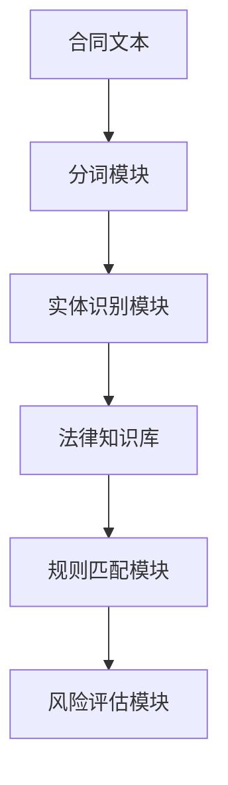
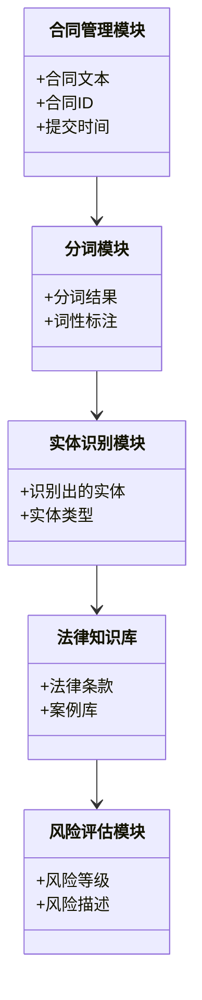
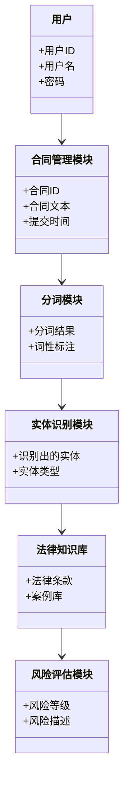
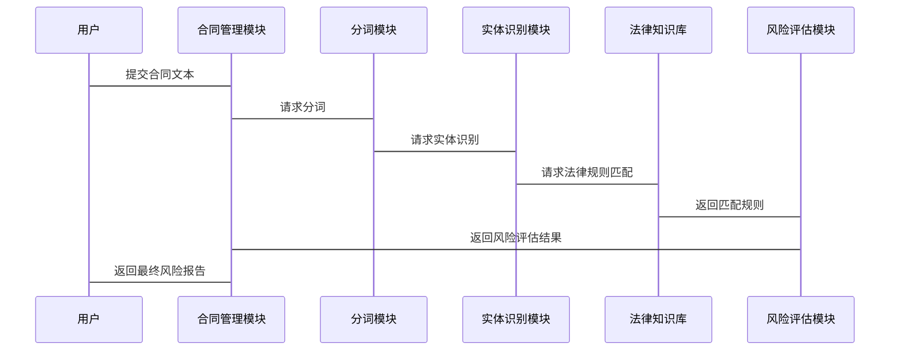

                 


# 构建智能合同分析系统：AI辅助法律风险管理

> 关键词：智能合同分析系统, AI辅助, 法律风险管理, 自然语言处理, 机器学习

> 摘要：本文介绍如何利用AI技术构建智能合同分析系统，通过自然语言处理和机器学习技术实现合同文本的自动分析和风险识别，详细介绍系统构建的背景、核心概念、算法原理、系统架构及项目实战。

---

## 第一部分: 背景与概述

### 第1章: 智能合同分析系统概述

#### 1.1 智能合同分析系统的背景与意义

##### 1.1.1 合同分析的背景与挑战
在商业活动中，合同是法律风险管理的核心工具。然而，传统的合同分析方法依赖于人工审查，效率低下且容易出错。随着企业规模的扩大，合同数量激增，人工审查的局限性愈发明显。

##### 1.1.2 AI技术在合同分析中的作用
人工智能（AI）技术，特别是自然语言处理（NLP）和机器学习（ML），为合同分析带来了革命性的变化。AI可以快速处理大量文本，识别关键信息，从而提高效率和准确性。

##### 1.1.3 智能合同分析系统的价值与意义
智能合同分析系统通过自动化处理合同文本，帮助企业快速识别潜在法律风险，优化合同管理流程，降低运营成本。

#### 1.2 法律风险管理的重要性

##### 1.2.1 法律风险管理的基本概念
法律风险管理是指通过识别、评估和应对法律风险，以减少潜在的法律纠纷。合同是企业法律风险管理的核心对象。

##### 1.2.2 合同在法律风险管理中的核心地位
合同是企业与供应商、客户之间权利和义务的法律依据。有效的合同管理可以避免因合同条款模糊或遗漏而引发的法律纠纷。

##### 1.2.3 AI在法律风险管理中的应用前景
AI技术可以帮助企业快速识别合同中的风险点，例如违约条款、责任划分等，从而提前采取应对措施。

#### 1.3 AI辅助合同分析的实现路径

##### 1.3.1 数据驱动的合同分析方法
通过收集和分析大量的合同数据，训练AI模型识别合同中的关键信息。

##### 1.3.2 自然语言处理技术在合同分析中的应用
NLP技术用于合同文本的理解和分析，例如分词、实体识别、语义理解等。

##### 1.3.3 知识图谱与法律规则的结合
构建法律知识图谱，将合同条款与法律规则相结合，帮助AI更好地理解合同内容。

---

## 第二部分: 核心概念与原理

### 第2章: 智能合同分析系统的组成与核心概念

#### 2.1 系统组成

##### 2.1.1 数据层: 合同文本与结构化数据
合同文本是系统的输入，结构化数据是通过对文本分析得到的结构化信息。

##### 2.1.2 模型层: NLP与机器学习模型
NLP模型用于文本分析，机器学习模型用于风险预测。

##### 2.1.3 知识层: 法律知识库与规则引擎
法律知识库存储法律条款和案例，规则引擎用于根据知识库制定决策规则。

#### 2.2 核心概念对比

##### 2.2.1 合同文本的特征分析
- 文本长度：合同文本通常较长且复杂。
- 术语使用：包含大量法律术语。
- 结构化程度：部分合同文本结构化，部分非结构化。

##### 2.2.2 AI模型的性能指标
- 准确率：模型正确识别合同条款的概率。
- 召回率：模型识别出所有相关条款的能力。
- F1分数：综合准确率和召回率的指标。

##### 2.2.3 法律规则的表达方式
- 条款：如“违约金不超过合同金额的10%”。
- 案例：已有的法律案例作为参考。

#### 2.3 实体关系图与系统架构

##### 2.3.1 实体关系图


##### 2.3.2 系统架构


---

## 第三部分: 算法原理与实现

### 第3章: 自然语言处理在合同分析中的应用

#### 3.1 分词与词性标注

##### 3.1.1 分词
使用分词工具（如jieba）将合同文本分割成词语。例如，将“合同签订”分割为“合同”和“签订”。

##### 3.1.2 词性标注
使用词性标注工具（如spaCy）为每个词语标注词性。例如，“合同”标注为名词，“签订”标注为动词。

#### 3.2 实体识别

##### 3.2.1 命名实体识别（NER）
识别合同中的关键实体，如人名、组织名、日期等。例如，在合同中识别出“甲乙双方”为组织名。

#### 3.3 语义理解

##### 3.3.1 使用BERT进行语义分析
使用预训练的BERT模型对合同文本进行语义理解，提取关键信息如合同条款、违约责任等。

---

## 第四部分: 系统架构与设计

### 第4章: 智能合同分析系统的架构设计

#### 4.1 系统功能设计

##### 4.1.1 领域模型


#### 4.2 系统交互

##### 4.2.1 序列图


---

## 第五部分: 项目实战

### 第5章: 实战: 构建智能合同分析系统

#### 5.1 环境搭建

##### 5.1.1 安装必要的库
```bash
pip install jieba
pip install spacy
pip install transformers
```

#### 5.2 核心代码实现

##### 5.2.1 分词模块
```python
import jieba

def segment_contract(text):
    return jieba.lcut(text)
```

##### 5.2.2 实体识别模块
```python
import spacy

nlp = spacy.load("zh_core_web_sm")

def identify_entities(text):
    doc = nlp(text)
    entities = []
    for ent in doc.ents:
        entities.append((ent.text, ent.label_))
    return entities
```

#### 5.3 实际案例分析

##### 5.3.1 案例分析
假设有一份合同文本：
```python
text = "本合同自签订之日起生效，有效期为一年。"
```

分词结果：
```python
['本', '合同', '自', '签订', '之', '起', '生效', '，', '有效', '期', '为', '一', '年', '。']
```

实体识别结果：
```python
[('合同', '合同'), ('签订', '动词'), ('生效', '动词'), ('一年', '时间')]
```

---

## 第六部分: 最佳实践与总结

### 第6章: 最佳实践与总结

#### 6.1 最佳实践

##### 6.1.1 数据质量的重要性
确保训练数据的多样性和代表性，避免数据偏见。

##### 6.1.2 模型的可解释性
确保AI决策的透明性，便于法律专业人士理解和审核。

##### 6.1.3 系统的可扩展性
设计灵活的架构，以应对未来更多的合同类型和法律规则的变化。

#### 6.2 未来展望

##### 6.2.1 更高级的NLP模型
使用更大规模的预训练模型（如GPT-3、PaLM）来提高合同分析的准确性。

##### 6.2.2 多语言支持
扩展系统支持多种语言的合同分析，满足国际化需求。

##### 6.2.3 自适应学习
引入反馈机制，使系统能够根据实际使用情况自我优化。

---

## 第七部分: 总结

智能合同分析系统通过AI技术辅助法律风险管理，显著提高了合同分析的效率和准确性。本文详细介绍了系统的构建过程，包括背景、核心概念、算法原理、系统架构及项目实战。通过实际案例分析和代码实现，展示了系统的实用性和高效性。未来，随着AI技术的不断进步，智能合同分析系统将在法律风险管理中发挥更大的作用。

---

### 感谢您的阅读！

