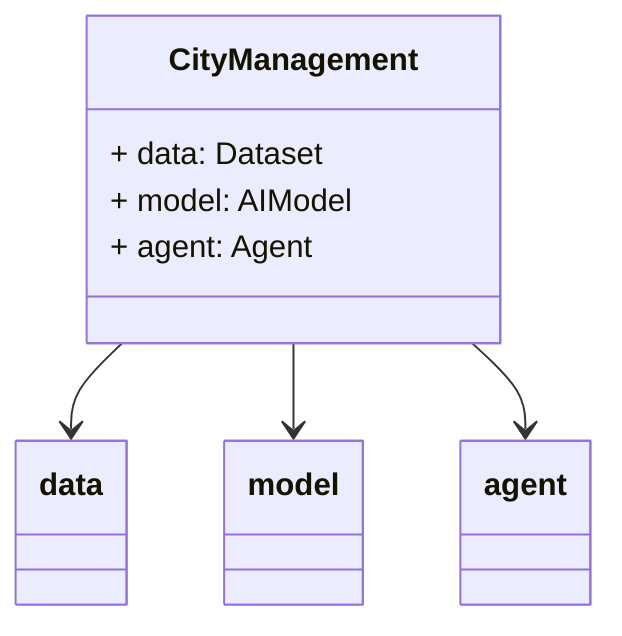
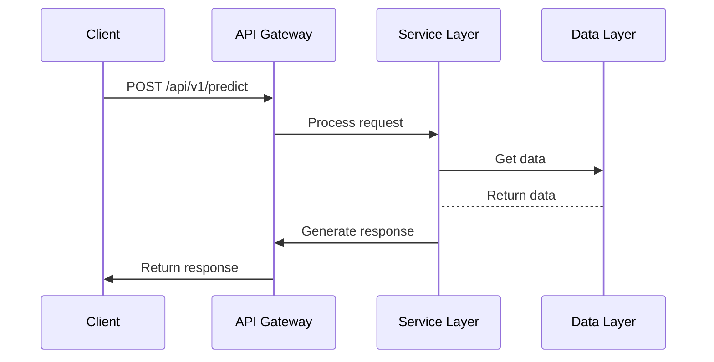

                 


# 构建智能城市管理AI Agent系统

## 关键词：智能城市、AI Agent、大模型、算法原理、系统架构、项目实战

## 摘要：  
随着城市化进程的加快和智能化技术的快速发展，AI Agent（人工智能代理）在城市管理中的应用越来越广泛。本文将详细探讨智能城市管理AI Agent系统的构建过程，从背景介绍到核心概念，再到算法原理、系统架构设计和项目实战，帮助读者全面理解如何利用AI技术提升城市管理水平。通过本文，读者可以掌握构建智能城市管理AI Agent系统的的关键技术与实现方法。

---

## 第一部分：智能城市管理AI Agent系统概述

### 第1章：智能城市与AI Agent概述

#### 1.1 智能城市的发展背景

##### 1.1.1 城市化进程与城市问题
城市化进程的加速带来了城市人口密集、资源紧张、环境污染等问题。传统的城市管理方式难以满足现代化城市的需求，因此需要引入智能化技术来优化城市运营和居民生活质量。

##### 1.1.2 智慧城市建设的目标与意义
智慧城市建设的目标是通过智能化技术提升城市管理效率、优化资源配置、改善公共服务。AI Agent作为智慧城市建设的重要组成部分，能够实现城市各 subsystem 的协同工作。

##### 1.1.3 AI技术在城市管理中的作用
AI技术可以通过数据采集、分析和决策支持，帮助城市管理者更好地应对复杂的城市问题。AI Agent能够自主感知环境、理解需求并执行任务，是实现智慧城市建设的关键技术。

#### 1.2 AI Agent的基本概念

##### 1.2.1 什么是AI Agent
AI Agent是一种智能体，能够感知环境、自主决策并执行任务。它能够通过传感器或其他输入方式获取信息，利用算法进行推理和规划，最终输出行动或结果。

##### 1.2.2 AI Agent的核心特征
- **智能性**：能够理解和处理复杂信息。
- **自主性**：能够在没有外部干预的情况下自主运行。
- **反应性**：能够实时感知环境变化并做出响应。
- **社会性**：能够与其他AI Agent或人类进行交互与协作。

##### 1.2.3 AI Agent与传统自动化的区别
传统自动化系统通常是基于规则的，而AI Agent具有学习和适应能力，能够根据环境变化调整行为。AI Agent更注重自主性和智能性，能够在复杂场景中做出决策。

#### 1.3 智能城市管理AI Agent的背景与重要性

##### 1.3.1 智能城市管理的需求分析
城市交通拥堵、环境污染、公共安全等问题需要通过智能化手段进行解决。AI Agent能够帮助城市管理者实现高效、精准的管理。

##### 1.3.2 AI Agent在城市管理中的应用价值
- **提高管理效率**：通过自动化处理和智能决策，减少人工干预。
- **优化资源配置**：AI Agent能够根据实时数据优化资源配置，提升城市运行效率。
- **改善公共服务**：通过AI Agent实现智能化服务，提升居民生活质量。

##### 1.3.3 国内外研究现状与发展趋势
目前，国内外在AI Agent领域的研究主要集中在算法优化、多 Agent 协作、复杂场景处理等方面。未来，随着大模型技术的发展，AI Agent在城市管理中的应用将更加广泛和深入。

#### 1.4 本章小结
本章介绍了智能城市的发展背景、AI Agent的基本概念及其在城市管理中的重要性。通过本章内容，读者可以理解AI Agent在智慧城市建设中的核心地位和作用。

---

## 第二部分：AI Agent的核心概念与原理

### 第2章：AI Agent的核心原理

#### 2.1 AI Agent的设计原则

##### 2.1.1 智能性原则
AI Agent需要具备强大的学习和推理能力，能够理解复杂场景并做出合理决策。

##### 2.1.2 自主性原则
AI Agent能够在没有外部干预的情况下自主运行，具备自我决策和执行能力。

##### 2.1.3 社会性原则
AI Agent需要能够与其他 Agent 或人类进行有效交互与协作，实现复杂任务的协同完成。

#### 2.2 AI Agent的实现技术

##### 2.2.1 机器学习技术
机器学习是AI Agent的核心技术之一，通过训练模型实现对数据的分析和预测。

##### 2.2.2 自然语言处理技术
自然语言处理技术使得AI Agent能够理解并生成人类语言，实现与人类的自然交互。

##### 2.2.3 规划与推理技术
规划与推理技术帮助AI Agent制定行动计划并根据环境变化调整策略。

#### 2.3 AI Agent的类型与应用场景

##### 2.3.1 知识型AI Agent
知识型AI Agent依赖于领域知识库，适用于需要专业知识的任务，如医疗诊断、法律咨询等。

##### 2.3.2 数据驱动型AI Agent
数据驱动型AI Agent通过大量数据训练模型，适用于需要处理海量数据的场景，如金融交易、广告推荐等。

##### 2.3.3 混合型AI Agent
混合型AI Agent结合知识型和数据驱动型的优势，适用于复杂场景，能够综合利用知识和数据进行决策。

#### 2.4 本章小结
本章详细介绍了AI Agent的核心原理、设计原则和实现技术，并分析了不同类型AI Agent的应用场景。通过本章内容，读者可以理解AI Agent的技术基础和实现方式。

---

## 第三部分：大模型在智能城市管理中的应用

### 第3章：大模型与智能城市管理

#### 3.1 大模型在城市管理中的应用领域

##### 3.1.1 城市交通管理
通过大模型分析交通流量、预测拥堵情况，优化交通信号灯控制，提升道路通行效率。

##### 3.1.2 城市公共安全
利用大模型进行犯罪预测、应急响应，提高城市公共安全管理水平。

##### 3.1.3 城市环境监测
通过大模型分析环境数据，预测空气污染、水质变化，帮助城市制定环保政策。

#### 3.2 大模型在AI Agent系统中的作用

##### 3.2.1 数据处理与分析
大模型能够高效处理和分析海量数据，为AI Agent提供准确的信息支持。

##### 3.2.2 智能决策支持
大模型通过深度学习和推理，帮助AI Agent做出最优决策。

##### 3.2.3 人机交互优化
大模型能够理解自然语言，提升AI Agent与人类的交互体验。

#### 3.3 大模型在城市管理中的优势

##### 3.3.1 高效性
大模型能够快速处理海量数据，提升城市管理效率。

##### 3.3.2 准确性
大模型通过深度学习和训练，能够提高决策的准确性。

##### 3.3.3 可扩展性
大模型具备强大的可扩展性，能够适应不同城市规模和复杂场景。

#### 3.4 本章小结
本章介绍了大模型在智能城市管理中的应用领域及其在AI Agent系统中的作用，分析了大模型的优势。通过本章内容，读者可以理解大模型在智能城市管理中的重要性。

---

## 第四部分：AI Agent系统的算法原理

### 第4章：AI Agent系统的算法原理

#### 4.1 基于大模型的AI Agent算法

##### 4.1.1 模型训练流程
1. 数据收集与预处理
2. 模型选择与训练
3. 模型优化与调优
4. 模型部署与应用

##### 4.1.2 模型推理机制
AI Agent通过大模型进行推理，根据输入数据生成决策结果。

##### 4.1.3 模型优化方法
通过参数调整、模型剪枝等方式优化模型性能，提升推理速度和准确性。

#### 4.2 算法实现的数学模型

##### 4.2.1 机器学习模型的数学表达
$$ y = f(x) $$
其中，$x$ 是输入数据，$y$ 是输出结果，$f$ 是模型函数。

##### 4.2.2 自然语言处理模型的数学基础
自然语言处理模型通常基于概率论和深度学习，例如：
$$ P(y|x) = \text{softmax}(Wx + b) $$
其中，$W$ 是权重矩阵，$b$ 是偏置向量，$\text{softmax}$ 是激活函数。

##### 4.2.3 规划与推理算法的数学框架
规划算法通常基于图搜索或动态规划，例如：
$$ \text{状态转移方程} = \text{argmax}_{a} Q(s, a) $$

#### 4.3 算法实现的代码示例

##### 4.3.1 机器学习模型训练代码
```python
import numpy as np

def loss(y_pred, y_true):
    return np.mean((y_pred - y_true)**2)

def train(X, y, model):
    for epoch in range(num_epochs):
        y_pred = model.predict(X)
        loss_value = loss(y_pred, y)
        model.backpropagate(X, y_pred, y)
```

##### 4.3.2 自然语言处理模型推理代码
```python
def generate_response(input_text):
    response = model.generate(input_text)
    return response
```

#### 4.4 本章小结
本章详细介绍了基于大模型的AI Agent算法，包括模型训练流程、数学模型和代码实现。通过本章内容，读者可以理解AI Agent系统的算法实现过程。

---

## 第五部分：AI Agent系统的系统架构设计

### 第5章：AI Agent系统的系统架构设计

#### 5.1 系统功能设计

##### 5.1.1 领域模型设计


##### 5.1.2 功能模块设计
- 数据采集模块
- 数据处理模块
- 模型推理模块
- 交互接口模块

#### 5.2 系统架构设计

##### 5.2.1 分层架构设计


##### 5.2.2 组件设计
- 数据采集组件
- 数据处理组件
- AI模型组件
- 交互接口组件

#### 5.3 系统接口设计

##### 5.3.1 API接口设计
```json
{
    "endpoint": "/api/v1/predict",
    "method": "POST",
    "body": {
        "input": "string"
    }
}
```

##### 5.3.2 接口交互流程


#### 5.4 本章小结
本章详细介绍了AI Agent系统的系统架构设计，包括功能模块、架构设计和接口设计。通过本章内容，读者可以理解AI Agent系统的整体架构和实现方式。

---

## 第六部分：项目实战

### 第6章：智能城市管理AI Agent系统实战

#### 6.1 项目介绍

##### 6.1.1 项目背景
本项目旨在通过构建AI Agent系统，实现城市交通管理的智能化。

##### 6.1.2 项目目标
- 实现交通流量预测
- 优化交通信号灯控制
- 提高道路通行效率

#### 6.2 项目环境配置

##### 6.2.1 系统要求
- Python 3.8+
- PyTorch 1.9+
- CUDA 11+

##### 6.2.2 安装依赖
```bash
pip install numpy torch transformers
```

#### 6.3 系统核心实现

##### 6.3.1 数据采集与预处理
```python
import numpy as np

def preprocess(data):
    # 数据预处理代码
    return processed_data
```

##### 6.3.2 AI模型训练与推理
```python
import torch

class AIModel(torch.nn.Module):
    def __init__(self):
        super().__init__()
        self.fc1 = torch.nn.Linear(10, 5)
        self.fc2 = torch.nn.Linear(5, 1)

    def forward(self, x):
        x = torch.relu(self.fc1(x))
        x = torch.sigmoid(self.fc2(x))
        return x

model = AIModel()
criterion = torch.nn.MSELoss()
optimizer = torch.optim.Adam(model.parameters(), lr=0.001)
```

##### 6.3.3 系统交互接口
```python
from flask import Flask, request, jsonify

app = Flask(__name__)

@app.route('/api/v1/predict', methods=['POST'])
def predict():
    data = request.json['input']
    # 推理代码
    return jsonify({'result': result})

if __name__ == '__main__':
    app.run(debug=True)
```

#### 6.4 项目小结
通过本章的项目实战，读者可以掌握AI Agent系统的实现过程，包括环境配置、数据处理、模型训练和系统部署。通过实际操作，读者能够更好地理解理论知识并应用于实际场景。

---

## 第七部分：总结与展望

### 第7章：总结与展望

#### 7.1 总结
本文详细介绍了智能城市管理AI Agent系统的构建过程，从背景介绍到核心概念、算法原理、系统架构设计和项目实战，全面覆盖了AI Agent系统的各个方面。通过本文，读者可以掌握构建智能城市管理AI Agent系统的关键技术与实现方法。

#### 7.2 展望
随着AI技术的不断发展，AI Agent在城市管理中的应用将更加广泛和深入。未来，随着大模型技术的成熟和硬件性能的提升，AI Agent系统将具备更强的智能性和自主性，能够更好地应对复杂的城市管理场景。

---

## 附录

### 附录A：工具安装与配置

#### A.1 安装Python环境
```bash
python --version
pip install --upgrade pip
```

#### A.2 安装PyTorch
```bash
pip install torch torchvision torchaudio
```

### 附录B：数据集介绍

#### B.1 数据集来源
- 公共交通数据
- 环境监测数据
- 交通流量数据

#### B.2 数据预处理代码
```python
import pandas as pd

def load_data(file_path):
    data = pd.read_csv(file_path)
    return data
```

---

通过以上结构，您可以开始撰写详细的博客文章。每部分内容都需要展开详细讲解，并结合实际案例和代码示例，帮助读者更好地理解和实现智能城市管理AI Agent系统。

