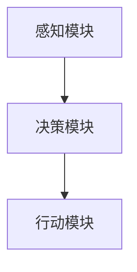

                 


# 构建符合道德准则的AI Agent

## 关键词
- AI Agent
- 道德准则
- 伦理决策
- 系统设计
- 技术实现

## 摘要
本文详细探讨了如何构建符合道德准则的AI Agent，从基本概念到系统设计，再到实际项目实现，全面分析了AI Agent的伦理问题与解决方案。通过系统架构设计、算法原理分析以及实际案例，展示了如何将道德准则融入AI Agent的设计与开发过程中。

---

# 第一章: AI Agent与道德准则的背景介绍

## 1.1 AI Agent的基本概念
### 1.1.1 什么是AI Agent
AI Agent（人工智能代理）是指能够感知环境并采取行动以实现特定目标的智能体。AI Agent可以是软件程序、机器人或其他智能系统，旨在模拟人类或其他智能生物的行为。

### 1.1.2 AI Agent的核心特征
- **自主性**：能够在没有外部干预的情况下独立运作。
- **反应性**：能够根据环境变化实时调整行为。
- **目标导向**：所有行动都以实现特定目标为导向。
- **学习能力**：能够通过经验改进性能。

### 1.1.3 AI Agent的分类与应用场景
- **基于规则的AI Agent**：根据预定义的规则进行决策，适用于规则明确的场景。
- **基于学习的AI Agent**：通过机器学习算法从数据中学习行为模式，适用于复杂场景。
- **基于推理的AI Agent**：利用逻辑推理进行决策，适用于需要复杂逻辑推理的场景。

---

## 1.2 道德准则在AI Agent中的重要性
### 1.2.1 道德准则的基本概念
道德准则是一组指导行为的原则，旨在确保行为符合社会和伦理标准。在AI Agent中，道德准则是确保其行为符合人类价值观的关键。

### 1.2.2 AI Agent与人类价值观的冲突
AI Agent的目标导向性可能导致与人类价值观的冲突。例如，一个追求效率最大化的AI Agent可能忽略环境保护或社会责任。

### 1.2.3 道德准则在AI Agent设计中的作用
通过在设计阶段引入道德准则，可以确保AI Agent的行为符合伦理标准，减少潜在的负面影响。

---

## 1.3 本章小结
本章介绍了AI Agent的基本概念、核心特征及其分类，强调了道德准则在AI Agent设计中的重要性。接下来的章节将深入探讨AI Agent的核心概念与道德框架，分析其在技术实现中的具体应用。

---

# 第二章: AI Agent的核心概念与道德框架

## 2.1 AI Agent的定义与属性
### 2.1.1 AI Agent的定义
AI Agent是一种能够感知环境、采取行动以实现目标的智能系统，具有自主性、反应性、目标导向性和学习能力。

### 2.1.2 AI Agent的核心属性
- **自主性**：无需外部干预即可运作。
- **反应性**：能够实时调整行为以应对环境变化。
- **目标导向性**：所有行动均以实现特定目标为导向。
- **学习能力**：通过经验改进性能。

### 2.1.3 AI Agent的功能模块
- **感知模块**：负责收集和处理环境信息。
- **决策模块**：根据感知信息做出决策。
- **行动模块**：执行决策的结果。

---

## 2.2 道德准则的分类与框架
### 2.2.1 道德准则的分类
- **功利主义**：以最大化整体利益为目标。
- **义务论**：基于义务和责任进行决策。
- **美德伦理**：以美德和品格为指导。

### 2.2.2 道德框架的构建
道德框架是将道德准则转化为具体规则和约束的结构化方法。通过定义明确的道德原则，可以指导AI Agent的决策过程。

### 2.2.3 道德准则与AI Agent的关联
通过将道德准则嵌入AI Agent的决策模块，可以确保其行为符合伦理标准。

---

## 2.3 本章小结
本章详细介绍了AI Agent的核心概念及其功能模块，探讨了道德准则的分类与框架。接下来的章节将分析AI Agent中的伦理问题与解决方案。

---

# 第三章: AI Agent的伦理问题与解决方案

## 3.1 AI Agent中的伦理问题
### 3.1.1 隐私与数据保护
AI Agent可能收集大量用户数据，如何保护这些数据的隐私是一个重要问题。

### 3.1.2 责任归属与可追溯性
当AI Agent的行为导致问题时，如何确定责任归属是一个复杂的伦理问题。

### 3.1.3 公平性与偏见
AI Agent的学习算法可能引入偏见，导致不公平的结果。

---

## 3.2 道德准则的实现方法
### 3.2.1 伦理决策模型
通过构建伦理决策模型，AI Agent可以在决策过程中考虑道德因素。

### 3.2.2 道德评分系统
通过定义明确的道德评分标准，可以对AI Agent的行为进行评估和优化。

### 3.2.3 伦理行为规范
制定明确的伦理行为规范，确保AI Agent的行为符合社会道德标准。

---

## 3.3 本章小结
本章分析了AI Agent中的伦理问题，并提出了解决方案。通过伦理决策模型和道德评分系统，可以有效减少伦理问题的发生。

---

# 第四章: AI Agent的算法原理与道德考量

## 4.1 AI Agent的核心算法
### 4.1.1 基于规则的AI Agent
基于规则的AI Agent通过预定义的规则进行决策，适用于规则明确的场景。

### 4.1.2 基于学习的AI Agent
基于学习的AI Agent通过机器学习算法从数据中学习行为模式，适用于复杂场景。

### 4.1.3 基于推理的AI Agent
基于推理的AI Agent利用逻辑推理进行决策，适用于需要复杂逻辑推理的场景。

---

## 4.2 道德准则在算法中的体现
### 4.2.1 算法的公平性
通过消除数据偏见，确保算法的公平性。

### 4.2.2 算法的透明性
确保算法的决策过程透明，便于理解和监督。

### 4.2.3 算法的可解释性
通过可解释的算法设计，确保AI Agent的行为可以被解释和验证。

---

## 4.3 本章小结
本章分析了AI Agent的核心算法及其在道德准则中的体现。通过确保算法的公平性、透明性和可解释性，可以有效减少伦理风险。

---

# 第五章: AI Agent的系统设计与架构

## 5.1 系统架构设计
### 5.1.1 系统功能模块
- **感知模块**：负责收集和处理环境信息。
- **决策模块**：根据感知信息做出决策。
- **行动模块**：执行决策的结果。

### 5.1.2 系统架构图


## 5.2 伦理模块的集成
### 5.2.1 伦理决策模块
通过伦理决策模块，确保AI Agent的决策符合道德准则。

### 5.2.2 伦理评分系统
通过伦理评分系统，对AI Agent的行为进行评估和优化。

---

## 5.3 本章小结
本章详细介绍了AI Agent的系统设计与架构，强调了伦理模块的重要性。通过合理的系统设计，可以确保AI Agent的行为符合道德准则。

---

# 第六章: AI Agent的项目实战

## 6.1 项目背景与目标
### 6.1.1 项目背景
通过构建一个符合道德准则的AI Agent，展示如何将道德准则融入AI Agent的设计与开发过程中。

### 6.1.2 项目目标
实现一个能够感知环境、做出符合道德准则的决策并执行行动的AI Agent。

---

## 6.2 项目环境与工具
### 6.2.1 环境搭建
- 安装Python编程语言。
- 安装必要的机器学习库（如TensorFlow、Scikit-learn）。

---

## 6.3 核心代码实现
### 6.3.1 感知模块
```python
def感知环境():
    # 收集环境信息
    return 环境信息
```

### 6.3.2 决策模块
```python
def伦理决策(环境信息):
    # 根据环境信息做出符合道德准则的决策
    return 决策结果
```

### 6.3.3 行动模块
```python
def执行行动(决策结果):
    # 执行决策结果
    return 行动结果
```

---

## 6.4 项目案例分析
通过具体的案例分析，展示如何将道德准则融入AI Agent的设计与开发过程中。

---

## 6.5 项目总结
通过本项目的实现，展示了如何将道德准则融入AI Agent的设计与开发过程中，确保其行为符合伦理标准。

---

# 第七章: 最佳实践与未来展望

## 7.1 设计指南
### 7.1.1 确定明确的道德准则
在设计AI Agent时，必须明确其道德准则。

### 7.1.2 确保算法的公平性与透明性
通过消除数据偏见和确保算法的透明性，可以减少伦理风险。

---

## 7.2 风险管理
### 7.2.1 伦理风险的识别与评估
在设计AI Agent时，必须识别和评估潜在的伦理风险。

### 7.2.2 风险的缓解策略
通过制定明确的伦理行为规范和伦理评分系统，可以有效缓解伦理风险。

---

## 7.3 未来展望
随着AI技术的不断发展，AI Agent的设计将更加复杂，道德准则的实现也将更加重要。未来的研究方向包括如何进一步提高算法的公平性、透明性和可解释性。

---

# 附录

## 附录A: 术语表
- AI Agent：人工智能代理
- 道德准则：伦理原则
- 伦理决策模型：伦理决策系统
- 系统架构图：系统结构图

---

## 附录B: 参考文献
- [1] Russell S, Norvig P. Artificial Intelligence: A Modern Approach[M]. Pearson Education, 2010.
- [2] 梁跃，王伟. 人工智能伦理[M]. 清华大学出版社, 2020.

---

## 附录C: 工具与资源
- Python编程语言：https://www.python.org/
- TensorFlow库：https://www.tensorflow.org/
- Scikit-learn库：https://scikit-learn.org/stable/

---

# 结语
通过本文的详细讲解，读者可以全面了解如何构建符合道德准则的AI Agent，从基本概念到系统设计，再到实际项目实现，确保AI Agent的行为符合伦理标准。未来，随着技术的不断发展，AI Agent的设计将更加复杂，道德准则的实现也将更加重要。

