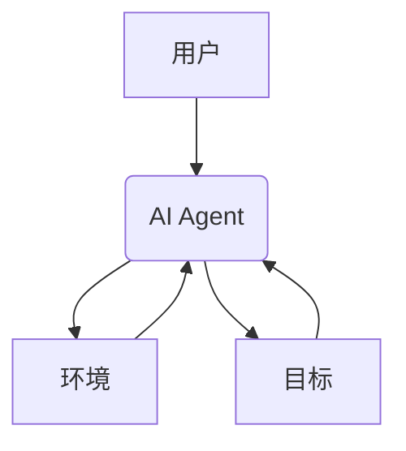
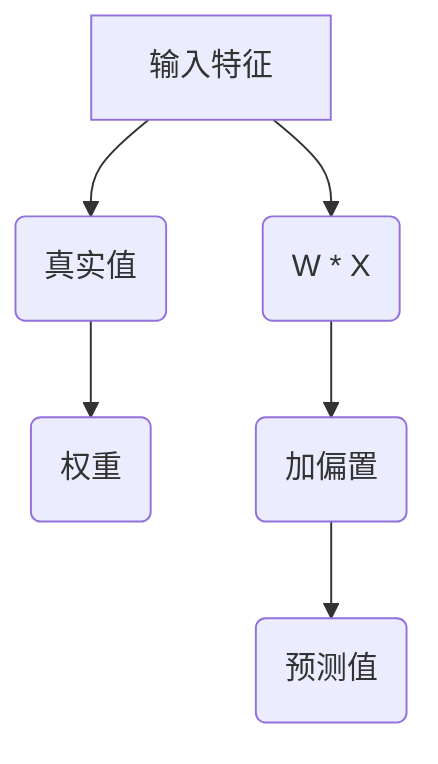
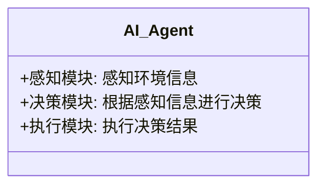
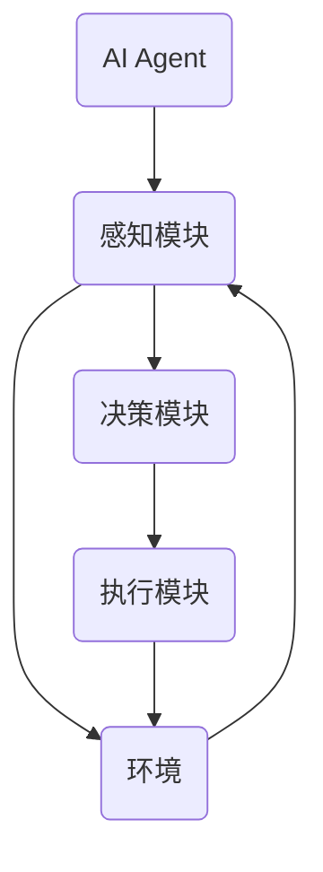
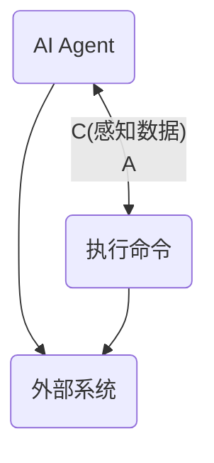
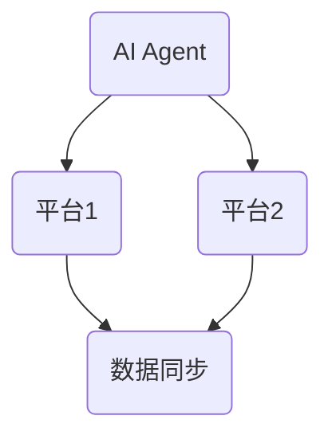
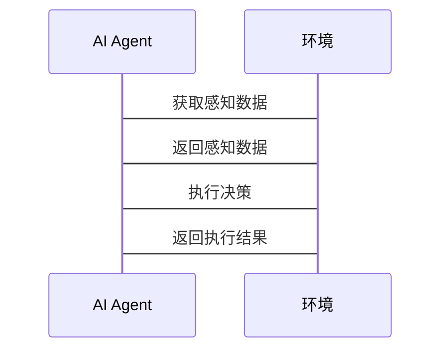

                 


# 构建跨平台AI Agent的技术挑战

> 关键词：跨平台AI Agent，AI Agent，技术挑战，算法原理，系统架构

> 摘要：本文深入探讨了构建跨平台AI Agent的技术挑战，涵盖从基本概念到系统架构的各个方面。通过分析AI Agent的核心原理、算法实现、系统架构设计以及项目实战，全面解析了跨平台AI Agent的实现难点和解决方案。

---

# 第1章: 构建跨平台AI Agent的背景与挑战

## 1.1 AI Agent的基本概念

### 1.1.1 AI Agent的定义
AI Agent（人工智能代理）是指能够感知环境、自主决策并执行任务的智能实体。AI Agent可以是软件程序、机器人或其他智能系统，旨在通过与环境交互来实现特定目标。

### 1.1.2 AI Agent的类型
AI Agent可以根据智能水平和应用场景分为以下几类：
- **基于规则的AI Agent**：通过预定义的规则进行决策和行动。
- **基于机器学习的AI Agent**：利用数据驱动的方法进行学习和优化。
- **基于强化学习的AI Agent**：通过与环境的交互学习最优策略。

### 1.1.3 AI Agent的发展历程
AI Agent的概念起源于20世纪60年代的知识推理研究。随着计算能力和数据量的增加，AI Agent从简单的规则驱动发展到复杂的深度学习模型。

---

## 1.2 跨平台AI Agent的背景

### 1.2.1 跨平台AI Agent的定义
跨平台AI Agent是指能够在多种平台和环境中运行，并根据不同的环境动态调整行为的AI代理。这种AI Agent需要具备跨平台的兼容性和灵活性。

### 1.2.2 跨平台AI Agent的应用场景
跨平台AI Agent广泛应用于多个领域，包括：
- **智能家居**：控制多种设备。
- **智能客服**：支持多种交互渠道。
- **自动驾驶**：适应不同的交通环境。

### 1.2.3 跨平台AI Agent的挑战与机遇
跨平台AI Agent的实现面临以下挑战：
- **多平台兼容性**：需要适配不同平台的API和接口。
- **环境一致性**：不同平台的环境差异可能导致AI Agent的行为不一致。
- **数据同步**：跨平台数据的实时同步和一致性维护。

---

## 1.3 当前AI Agent的技术现状

### 1.3.1 主流AI Agent技术概述
当前主流的AI Agent技术包括：
- **基于规则的AI Agent**：简单但缺乏灵活性。
- **基于机器学习的AI Agent**：通过数据学习，具备强大的泛化能力。
- **基于强化学习的AI Agent**：通过与环境交互优化策略。

### 1.3.2 跨平台AI Agent的技术难点
跨平台AI Agent的技术难点主要体现在：
- **多平台适配**：需要处理不同平台的API和协议。
- **动态环境适应**：AI Agent需要实时感知并适应环境的变化。
- **数据一致性**：跨平台数据的同步和一致性维护。

### 1.3.3 跨平台AI Agent的未来发展趋势
未来，跨平台AI Agent将朝着以下方向发展：
- **多模态交互**：支持多种交互方式，如语音、视觉和文本。
- **边缘计算**：通过边缘计算优化AI Agent的实时性和响应速度。
- **自适应学习**：AI Agent能够根据环境动态调整学习策略。

---

# 第2章: AI Agent的核心概念与联系

## 2.1 AI Agent的核心原理

### 2.1.1 感知模块
感知模块负责收集环境中的信息，通常包括：
- **数据输入**：通过传感器或API获取数据。
- **数据处理**：对数据进行预处理和特征提取。

### 2.1.2 决策模块
决策模块根据感知到的信息进行推理和决策，通常包括：
- **规则推理**：基于预定义的规则进行推理。
- **机器学习模型**：利用机器学习模型进行预测和决策。

### 2.1.3 执行模块
执行模块负责根据决策模块的指令执行具体操作，通常包括：
- **动作执行**：通过API或命令控制外部设备。
- **反馈收集**：收集执行结果的反馈信息。

## 2.2 不同类型AI Agent的对比

### 2.2.1 基于规则的AI Agent
- **优点**：简单易懂，实现成本低。
- **缺点**：缺乏灵活性，难以应对复杂场景。

### 2.2.2 基于机器学习的AI Agent
- **优点**：能够处理复杂场景，具备强大的泛化能力。
- **缺点**：需要大量数据和计算资源。

### 2.2.3 基于强化学习的AI Agent
- **优点**：能够在动态环境中自适应优化策略。
- **缺点**：训练时间长，需要复杂的环境设计。

## 2.3 AI Agent的实体关系图



---

# 第3章: AI Agent的算法原理

## 3.1 强化学习算法

### 3.1.1 强化学习的基本原理
强化学习是一种通过与环境交互来优化策略的算法。其核心是通过试错的方式，逐步逼近最优策略。

### 3.1.2 Q-Learning算法
Q-Learning是一种经典的强化学习算法，适用于离散动作空间和状态空间。

#### Q-Learning算法流程
```mermaid
graph TD
S[状态] --> A(动作) --> S'(新状态)
A --> R(奖励)
S --> Q(S, A) --> max(Q(S, A))
```

#### Python实现示例
```python
import numpy as np

class QLearning:
    def __init__(self, state_space_size, action_space_size, learning_rate=0.1, gamma=0.9):
        self.q_table = np.zeros((state_space_size, action_space_size))
        self.lr = learning_rate
        self.gamma = gamma

    def choose_action(self, state, epsilon=0.1):
        if np.random.random() < epsilon:
            return np.random.randint(0, self.q_table.shape[1])
        else:
            return np.argmax(self.q_table[state])

    def update_q_table(self, state, action, reward, next_state):
        self.q_table[state, action] = self.q_table[state, action] * self.lr + reward + self.gamma * np.max(self.q_table[next_state])
```

## 3.2 监督学习算法

### 3.2.1 监督学习的基本原理
监督学习是一种通过标注数据进行模型训练的算法。其核心是通过最小化预测值与真实值的差异来优化模型。

### 3.2.2 线性回归算法
线性回归是一种经典的监督学习算法，适用于回归任务。

#### 线性回归算法流程


#### Python实现示例
```python
import numpy as np

class LinearRegression:
    def __init__(self, lr=0.01, iterations=1000):
        self.lr = lr
        self.iterations = iterations

    def fit(self, X, y):
        self.X = X
        self.y = y
        self.theta = np.zeros(X.shape[1])
        for _ in range(self.iterations):
            y_pred = np.dot(self.X, self.theta)
            error = y_pred - self.y
            gradient = (2 * np.dot(self.X.T, error)) / len(self.X)
            self.theta -= self.lr * gradient

    def predict(self, X):
        return np.dot(X, self.theta)
```

---

# 第4章: AI Agent的系统架构设计

## 4.1 系统功能设计

### 4.1.1 领域模型
领域模型描述了AI Agent的功能模块及其之间的关系。



### 4.1.2 系统架构
系统架构描述了AI Agent的整体结构和各个模块的交互关系。



---

## 4.2 接口设计

### 4.2.1 API接口
AI Agent需要通过API接口与外部系统进行交互。



### 4.2.2 数据同步
跨平台AI Agent需要实现数据的实时同步和一致性维护。



---

## 4.3 系统交互流程

### 4.3.1 交互流程
AI Agent与环境的交互流程如下：



---

# 第5章: 跨平台AI Agent的项目实战

## 5.1 环境配置

### 5.1.1 开发环境
- **操作系统**：Windows/Mac/Linux
- **编程语言**：Python
- **框架**：TensorFlow/PyTorch
- **依赖库**：numpy, pandas, scikit-learn

### 5.1.2 安装依赖
```bash
pip install numpy pandas scikit-learn
```

---

## 5.2 核心代码实现

### 5.2.1 感知模块
```python
def get_sensor_data():
    # 获取传感器数据
    return np.random.rand(10)
```

### 5.2.2 决策模块
```python
def make_decision(data):
    # 简单的决策逻辑
    if data[0] > 0.5:
        return 'action1'
    else:
        return 'action2'
```

### 5.2.3 执行模块
```python
def execute_action(action):
    # 执行具体操作
    print(f'执行动作：{action}')
```

---

## 5.3 功能解读

### 5.3.1 功能流程
AI Agent的功能流程如下：
1. 获取环境数据。
2. 根据数据进行决策。
3. 执行决策结果。
4. 获取反馈并更新模型。

---

## 5.4 实际案例分析

### 5.4.1 案例介绍
假设我们正在开发一个智能家居AI Agent，用于控制家中的设备。

### 5.4.2 案例实现
```python
class SmartHomeAgent:
    def __init__(self):
        self.temperature = 25

    def get_sensor_data(self):
        return np.random.rand(2)  # 模拟温度和湿度数据

    def make_decision(self, data):
        if data[0] > 25:
            return '开空调'
        elif data[0] < 20:
            return '关空调'
        else:
            return '保持当前状态'

    def execute_action(self, action):
        print(f'智能家居执行动作：{action}')
```

---

## 5.5 项目小结

### 5.5.1 核心代码实现
通过上述代码，我们可以实现一个简单的智能家居AI Agent。

### 5.5.2 项目总结
该项目展示了跨平台AI Agent的基本实现方法，包括感知、决策和执行模块的实现。

---

# 第6章: 跨平台AI Agent的最佳实践

## 6.1 最佳实践

### 6.1.1 性能优化
- **数据预处理**：优化数据处理流程。
- **算法优化**：选择合适的算法和参数。

### 6.1.2 安全性考虑
- **数据加密**：保护敏感数据。
- **权限控制**：限制AI Agent的访问权限。

### 6.1.3 可扩展性
- **模块化设计**：确保系统模块化。
- **接口设计**：设计灵活的接口。

## 6.2 小结

跨平台AI Agent的实现需要综合考虑多个方面的因素，包括算法选择、系统架构设计和接口设计等。

## 6.3 注意事项

- **数据一致性**：跨平台数据需要保持一致性。
- **环境适应性**：AI Agent需要能够适应不同的环境。
- **性能优化**：确保系统性能满足需求。

## 6.4 拓展阅读

- **《机器学习实战》**：深入学习机器学习算法。
- **《深度学习》**：系统学习深度学习技术。

---

# 结语

构建跨平台AI Agent是一项复杂的系统工程，需要综合运用多种技术手段。通过本文的分析和实践，我们希望能够为读者提供一个清晰的思路，帮助他们在实际应用中更好地构建跨平台AI Agent。

