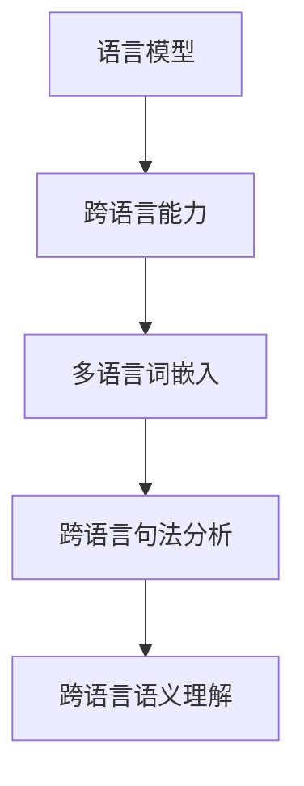
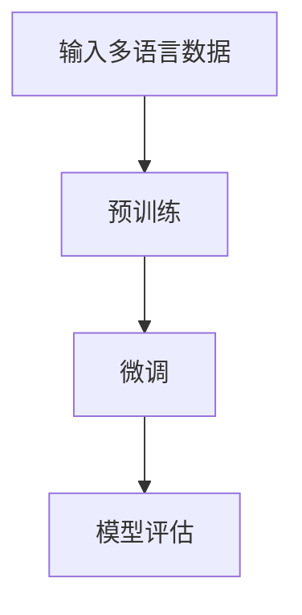
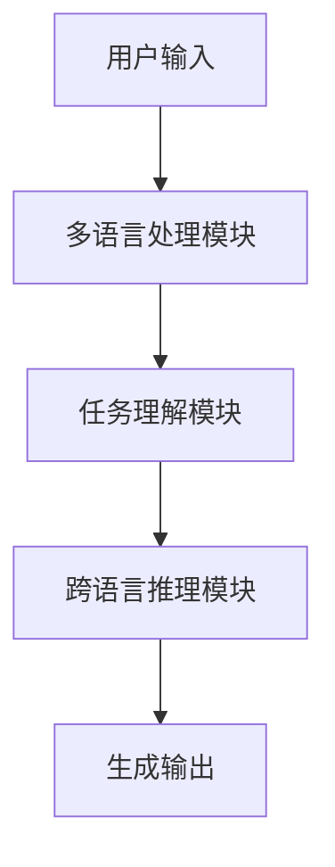
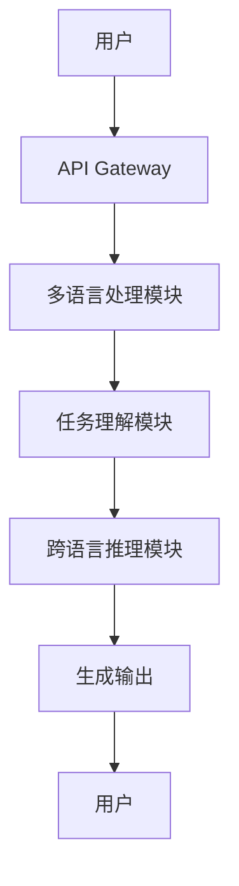

                 


# 构建跨语言理解的AI Agent系统

## 关键词：
- 跨语言理解
- AI Agent
- 多语言处理
- 人工智能
- 自然语言处理

## 摘要：
构建一个能够理解多种语言的AI Agent系统，是当前人工智能领域的重要挑战之一。随着全球化的发展，跨语言交流的需求日益增长，传统的单语言AI Agent已无法满足实际应用的需求。本文将从跨语言理解的核心概念、算法原理、系统架构到项目实战，全面解析如何构建一个高效、准确的跨语言AI Agent系统。通过详细的技术分析和实际案例，帮助读者理解跨语言AI Agent的核心原理和实现方法，为实际应用提供理论和实践指导。

---

# 第一部分：背景与核心概念

## 第1章：背景介绍与问题定义

### 1.1 多语言处理的挑战与机遇
随着全球化进程的加速，跨语言交流成为日常工作中不可或缺的一部分。然而，现有的AI系统大多基于单一语言设计，无法满足跨语言环境下的多样化需求。跨语言理解技术的出现，为解决这一问题提供了新的可能性。

#### 1.1.1 跨语言理解的核心问题
- 多语言数据的处理难度：不同语言的语法、语义差异较大，如何统一处理是关键。
- 跨语言模型的训练挑战：需要在多语言数据上进行预训练，同时保持各语言的独立性。
- 跨语言推理的复杂性：如何在不同语言之间建立关联，实现跨语言推理。

#### 1.1.2 跨语言理解的意义
- 提高AI系统的通用性：能够理解并处理多种语言，增强系统的适用性。
- 降低开发成本：通过跨语言模型，减少重复开发多语言系统的资源投入。
- 提升用户体验：用户可以使用母语与AI系统交互，提高使用便捷性。

#### 1.1.3 跨语言AI Agent的应用场景
- 跨语言客服系统：支持多种语言的客户咨询与服务。
- 跨语言信息检索：帮助用户快速找到所需信息，无论信息来源语言。
- 跨语言对话系统：实现多语言环境下的人机自然对话。

### 1.2 跨语言理解与AI Agent的结合
#### 1.2.1 跨语言理解的定义
跨语言理解是指AI系统能够理解、处理和生成多种语言文本的能力，包括翻译、问答、文本摘要等功能。

#### 1.2.2 AI Agent的基本概念
AI Agent是一种智能体，能够感知环境、执行任务并做出决策。AI Agent的核心能力包括感知、推理、规划和执行。

#### 1.2.3 跨语言AI Agent的独特性
- 能够理解并处理多种语言的输入。
- 具备跨语言推理能力，能够跨越语言障碍进行信息处理。
- 支持多语言环境下的交互与任务执行。

## 第2章：核心概念与联系

### 2.1 跨语言理解的核心概念
#### 2.1.1 語言模型的跨语言能力
语言模型的跨语言能力是指模型能够理解并生成多种语言文本的能力。这需要模型在多语言数据上进行预训练，以捕捉不同语言之间的共性和差异。

#### 2.1.2 跨语言词嵌入
跨语言词嵌入是一种将不同语言的词汇映射到同一向量空间的技术。通过这种方式，可以实现跨语言词汇的对齐与比较。

#### 2.1.3 跨语言句法与语义分析
跨语言句法分析是指在不同语言中进行语法结构的分析，而跨语言语义分析则是指在不同语言中进行语义理解。

### 2.2 跨语言理解与AI Agent的关系
#### 2.2.1 跨语言理解如何赋能AI Agent
- 提供多语言支持：AI Agent可以理解并处理多种语言的输入。
- 跨语言推理：AI Agent能够在不同语言之间进行信息推理，提升任务执行能力。
- 跨语言交互：AI Agent可以与用户进行多语言对话，提供更广泛的交互体验。

#### 2.2.2 AI Agent如何提升跨语言能力
- 通过多语言预训练提升模型的跨语言理解能力。
- 利用跨语言词嵌入技术实现多语言词汇的对齐与映射。
- 借助跨语言句法与语义分析技术，提升模型的多语言处理能力。

#### 2.2.3 跨语言理解与AI Agent的协同进化
跨语言理解技术的进步推动了AI Agent能力的提升，而AI Agent的应用需求也反向推动了跨语言理解技术的发展。

### 2.3 跨语言理解的核心要素对比
#### 2.3.1 語言模型的参数对比
| 参数 | 单语言模型 | 多语言模型 |
|------|------------|------------|
| 参数量 | 较少       | 较多       |
| 训练数据 | 单一语言   | 多种语言   |
| 性能 | 高          | 中等       |

#### 2.3.2 跨语言与单语言模型的性能对比
| 任务 | 单语言模型 | 多语言模型 |
|------|------------|------------|
| 翻译 | 高          | 中等       |
| 问答 | 高          | 中等       |
| 情感分析 | 高          | 中等       |

#### 2.3.3 跨语言理解的准确率与效率对比
| 指标 | 单语言模型 | 多语言模型 |
|------|------------|------------|
| 准确率 | 高          | 中等       |
| 效率 | 高          | 中等       |

### 2.4 跨语言理解的ER实体关系图


## 2.5 本章小结
本章详细介绍了跨语言理解的核心概念及其与AI Agent的关系，通过对比分析和ER实体关系图，帮助读者理解跨语言理解在AI Agent系统中的重要性。

---

# 第三部分：算法原理与实现

## 第3章：跨语言理解的算法原理与实现

### 3.1 跨语言理解的主流算法
#### 3.1.1 跨语言BERT模型
跨语言BERT模型是一种基于多语言预训练的模型，能够同时理解多种语言的文本。其核心思想是在多语言数据上进行预训练，提取语言之间的共性特征。

#### 3.1.2 XLM-R: 多语言模型
XLM-R是一种基于Transformer的多语言模型，能够在多种语言之间进行有效的文本表示。其核心优势在于能够同时处理多种语言，且不需要额外的微调。

#### 3.1.3 mBART: 跨语言生成模型
mBART是一种基于BART的多语言生成模型，能够实现跨语言的文本生成任务，如翻译、文本摘要等。

### 3.2 跨语言模型的训练流程
#### 3.2.1 多语言数据的预处理
- 数据清洗：去除噪音数据，保留高质量的多语言文本。
- 数据对齐：将不同语言的文本进行对齐，便于模型训练。
- 数据分割：将数据划分为训练集、验证集和测试集。

#### 3.2.2 模型的预训练
- 语言模型预训练：在多语言数据上进行语言模型的预训练，提取语言特征。
- 任务特定的微调：根据具体任务需求，对模型进行微调，优化任务性能。

#### 3.2.3 模型的评估与优化
- 模型评估：使用多语言基准测试集评估模型的性能。
- 参数调整：根据评估结果，调整模型的超参数，优化模型性能。

### 3.3 跨语言模型的数学模型
#### 3.3.1 語言模型的损失函数
语言模型的损失函数通常采用交叉熵损失函数，其数学表达式为：
$$
\mathcal{L} = -\frac{1}{N}\sum_{i=1}^{N} \sum_{j=1}^{M} y_{i,j} \log p(x_i, y_{i,j})
$$
其中，\( y_{i,j} \) 是第 \( i \) 个样本中第 \( j \) 个词的标签，\( p(x_i, y_{i,j}) \) 是模型预测的概率。

#### 3.3.2 转换层的数学公式
在跨语言模型中，通常需要将不同语言的词汇映射到同一向量空间。转换层的数学公式如下：
$$
f(x_i) = Wx_i + b
$$
其中，\( W \) 是转换矩阵，\( b \) 是偏置项。

### 3.4 跨语言模型的代码实现
#### 3.4.1 安装依赖
```bash
pip install transformers
```

#### 3.4.2 加载模型
```python
from transformers import AutoTokenizer, AutoModelForMaskedLM

tokenizer = AutoTokenizer.from_pretrained('facebook/xlm-r-large')
model = AutoModelForMaskedLM.from_pretrained('facebook/xlm-r-large')
```

#### 3.4.3 模型推理
```python
inputs = "Hello, how are you?"
inputs = tokenizer(inputs, return_tensors='np')
outputs = model(**inputs)
```

### 3.5 跨语言模型的流程图


## 3.6 本章小结
本章详细介绍了跨语言理解的主流算法及其实现原理，通过数学公式和代码示例，帮助读者理解跨语言模型的训练与推理过程。

---

# 第四部分：系统分析与架构设计

## 第4章：跨语言AI Agent的系统分析与架构设计

### 4.1 系统功能设计
#### 4.1.1 功能模块划分
- 多语言处理模块：负责接收和处理多语言输入。
- 任务理解模块：对输入文本进行语义理解。
- 跨语言推理模块：进行跨语言推理，生成输出结果。
- 交互模块：与用户进行多语言交互。

#### 4.1.2 系统功能流程


### 4.2 系统架构设计
#### 4.2.1 微服务架构
- 服务划分：将系统划分为多个微服务，如NLP服务、推理服务等。
- 服务交互：通过API接口进行服务之间的交互。

#### 4.2.2 系统架构图


### 4.3 接口设计
#### 4.3.1 API接口定义
- 输入接口：接收多语言文本输入。
- 输出接口：返回处理结果。

#### 4.3.2 接口交互流程


### 4.4 系统交互流程
#### 4.4.1 用户输入
- 用户通过界面向系统输入多语言文本。
- 系统接收输入并进行处理。

#### 4.4.2 系统输出
- 系统根据输入生成输出结果。
- 用户接收输出并进行反馈。

### 4.5 本章小结
本章详细分析了跨语言AI Agent的系统功能与架构设计，通过微服务架构和接口设计，确保系统的高效性和可扩展性。

---

# 第五部分：项目实战

## 第5章：跨语言AI Agent的项目实战

### 5.1 项目环境安装
```bash
pip install transformers
pip install fastapi
pip install uvicorn
```

### 5.2 系统核心实现
#### 5.2.1 多语言处理模块
```python
from transformers import AutoTokenizer, AutoModelForMaskedLM

tokenizer = AutoTokenizer.from_pretrained('facebook/xlm-r-large')
model = AutoModelForMaskedLM.from_pretrained('facebook/xlm-r-large')
```

#### 5.2.2 任务理解模块
```python
def understand_task(input_text):
    inputs = tokenizer(input_text, return_tensors='np')
    outputs = model(**inputs)
    return outputs.last_hidden_state
```

#### 5.2.3 跨语言推理模块
```python
def crosslingual_reasoning(context, question):
    inputs = tokenizer(context + question, return_tensors='np')
    outputs = model(**inputs)
    return outputs.last_hidden_state
```

### 5.3 代码应用解读
- 多语言处理模块：负责接收和处理多语言输入。
- 任务理解模块：对输入文本进行语义理解。
- 跨语言推理模块：进行跨语言推理，生成输出结果。

### 5.4 实际案例分析
#### 5.4.1 多语言对话系统
```python
def chat_with_agent():
    while True:
        input_text = input("User: ")
        if input_text == 'exit':
            break
        response = crosslingual_reasoning("对话系统", input_text)
        print(f"Agent: {response}")
```

#### 5.4.2 跨语言信息检索
```python
def crosslingual_search(query):
    results = []
    for lang in ['en', 'zh', 'es']:
        response = translate_and_search(query, lang)
        results.append(response)
    return results
```

### 5.5 项目小结
本章通过具体的项目实战，详细讲解了跨语言AI Agent系统的实现过程，从环境安装到代码实现，再到实际案例分析，帮助读者掌握跨语言AI Agent的开发技巧。

---

# 第六部分：最佳实践

## 第6章：最佳实践与总结

### 6.1 最佳实践
#### 6.1.1 小结
跨语言AI Agent系统的开发需要综合考虑算法、系统架构和项目实现等多个方面。

#### 6.1.2 注意事项
- 确保多语言数据的均衡性。
- 选择合适的跨语言模型。
- 优化系统的交互流程。

#### 6.1.3 拓展阅读
- 《多语言自然语言处理》
- 《AI Agent开发指南》

### 6.2 本章小结
本章总结了跨语言AI Agent系统的开发经验，提出了最佳实践建议，帮助读者在实际开发中少走弯路。

---

# 附录

## 附录A：相关工具与库
- Transformers库：https://huggingface.co/transformers
- FastAPI框架：https://fastapi.tiangolo.com/

## 附录B：参考文献
- BERT: Pre-training of Deep Bidirectional Transformers for Language Understanding
- XLM-R: Cross-Lingual Language Model
- mBART: Multilingual BART

---

以上是《构建跨语言理解的AI Agent系统》的技术博客文章的详细大纲和内容。

