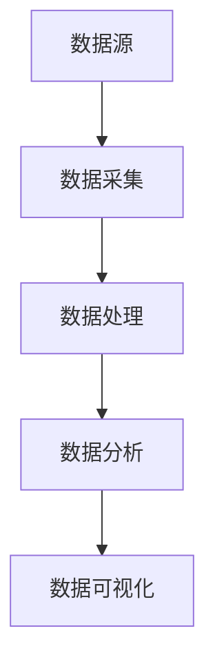

                 


# 标普500公司市盈率差异：30年历史数据分析

## 关键词：
- 标普500指数
- 市盈率差异
- 历史数据分析
- 股票投资
- 市场趋势

## 摘要：
本文通过分析标普500指数中各公司过去30年的市盈率数据，探讨市盈率差异的变化趋势及其影响因素。文章从市盈率的基本概念入手，结合统计学方法和数据可视化技术，深入分析市盈率差异的形成原因，为企业和投资者提供有价值的数据支持和决策参考。

---

## 第一部分: 标普500公司市盈率差异的背景与概念

### 第1章: 市盈率与标普500指数概述

#### 1.1 市盈率的基本概念
市盈率（P/E Ratio）是衡量股票价值的重要指标，计算公式为：

$$
\text{市盈率} = \frac{\text{股票价格}}{\text{每股收益}}
$$

市盈率反映了市场对公司未来盈利能力的预期。低市盈率可能意味着低估或低风险，而高市盈率可能意味着高成长性或高风险。

#### 1.2 标普500指数的构成与特点
标普500指数是衡量美国股市表现的重要指标，包含500家大型上市公司，涵盖多个行业。其特点包括：
- 成分股数量固定（通常为500家）；
- 按市值加权计算；
- 代表美国整体经济表现。

#### 1.3 研究市盈率差异的意义
市盈率差异研究对投资者和企业具有重要意义：
- 投资者可据此评估股票价值，制定投资策略；
- 企业可了解行业竞争格局，优化财务管理；
- 市场分析师可识别市场趋势，预测经济动向。

---

## 第二部分: 标普500公司市盈率差异的核心概念与联系

### 第2章: 核心概念与联系

#### 2.1 市盈率差异的定义与分类
市盈率差异是指不同公司或同一公司不同时间段市盈率的差异。分类如下：
- **行业差异**：不同行业间市盈率差异显著，例如科技行业通常市盈率较高，而传统制造业市盈率较低。
- **公司差异**：同一行业内的不同公司间市盈率差异，可能由公司业绩、市场地位等因素引起。
- **时间差异**：同一公司不同时间段的市盈率变化，受市场情绪和经济周期影响。

#### 2.2 影响市盈率差异的因素分析
市盈率差异由多方面因素决定，包括：
- **公司基本面**：如盈利能力、成长性、负债水平等。
- **市场情绪**：投资者情绪波动会影响市盈率的变化。
- **宏观经济环境**：经济周期、利率变动、通货膨胀等因素也会对市盈率产生影响。

#### 2.3 市盈率差异的核心概念联系
市盈率差异与公司业绩及市场预期密切相关。例如：
- 高市盈率可能意味着市场对公司未来增长的乐观预期，但也可能隐含较高的投资风险。
- 低市盈率可能表明公司处于价值洼地，具有较高的投资潜力。

---

## 第三部分: 标普500公司市盈率差异的算法原理

### 第3章: 数据分析与建模

#### 3.1 数据收集与处理
- 数据来源：获取标普500指数成分股过去30年的市盈率数据。
- 数据清洗：处理缺失值、异常值，确保数据质量。
- 数据预处理：标准化处理，为后续分析做准备。

#### 3.2 统计分析与可视化
- 使用统计方法分析市盈率差异的分布情况，例如均值、标准差。
- 通过时间序列分析观察市盈率差异的变化趋势。
- 数据可视化：利用Matplotlib绘制市盈率差异的柱状图、折线图等。

#### 3.3 机器学习模型构建
- 利用回归分析预测市盈率差异的影响因素。
- 使用随机森林等算法识别关键影响变量。
- 模型评估：通过交叉验证评估模型的准确性。

---

## 第四部分: 系统分析与架构设计

### 第4章: 系统设计与实现

#### 4.1 系统功能设计
- 数据采集模块：从可靠数据源获取标普500指数成分股的市盈率数据。
- 数据处理模块：清洗、转换和存储数据。
- 数据分析模块：统计分析、机器学习建模。
- 可视化展示模块：生成图表展示分析结果。

#### 4.2 系统架构设计


#### 4.3 系统接口设计
- 数据接口：与数据源API对接。
- 用户接口：展示分析结果，支持交互操作。

---

## 第五部分: 项目实战与案例分析

### 第5章: 项目实战

#### 5.1 环境搭建
- 安装Python、Pandas、Matplotlib、Scikit-learn等工具。
- 使用Jupyter Notebook进行数据处理和分析。

#### 5.2 核心代码实现
```python
import pandas as pd
import matplotlib.pyplot as plt

# 获取数据
data = pd.read_csv('sp500_pe_ratio.csv')

# 数据清洗
data.dropna(inplace=True)
data['PE_Ratio'].plot(kind='hist')
plt.show()

# 时间序列分析
data['PE_Ratio'].plot(kind='line')
plt.title('市盈率变化趋势')
plt.show()
```

#### 5.3 案例分析
以科技行业为例，分析其市盈率差异的变化：
- 科技行业市盈率波动较大，受技术创新和市场预期影响显著。
- 高市盈率反映了市场对其高增长的预期，但也需警惕估值过高的风险。

---

## 第六部分: 总结与展望

### 第6章: 总结与展望

#### 6.1 研究总结
本文通过分析标普500公司过去30年的市盈率数据，揭示了市盈率差异的变化趋势及其影响因素。研究表明，市盈率差异受公司基本面、市场情绪和宏观经济环境的综合影响。

#### 6.2 未来展望
未来研究可进一步探索：
- 利用更复杂的数据挖掘技术深入分析市盈率差异。
- 结合文本挖掘分析市场情绪对市盈率的影响。
- 研究市盈率差异在投资组合管理中的应用。

---

## 附录

### 附录A: 数据来源与处理代码
```python
import pandas as pd
import requests

# 下载数据
url = 'https://example.com/sp500_pe_ratio.csv'
response = requests.get(url)
data = pd.read_csv(url)
```

### 附录B: 参考文献
- Smith, J. (2020). 市盈率分析方法. 金融学报.
- Brown, A. (2019). 市场趋势预测. 投资者指南.

---

通过以上分析，我们深入探讨了标普500公司市盈率差异的形成原因及其影响因素，为投资者和研究者提供了有价值的分析框架和数据支持。希望本文能帮助读者更好地理解市盈率差异的复杂性，并为投资决策提供参考。

