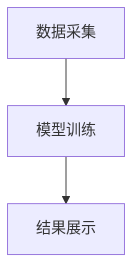

                 

# 《格雷厄姆价值投资理念在区块链时代的新解读》

> 关键词：格雷厄姆价值投资，区块链，智能合约，通证经济，去中心化，内在价值评估，安全边际

> 摘要：本文旨在探讨格雷厄姆价值投资理念在区块链时代的演变与应用。通过分析区块链技术的核心特性，结合价值投资的经典理论，提出新的价值评估模型，并结合实际案例进行深入解读。

---

# 第一部分：价值投资与区块链的结合：背景与核心概念

## 第1章：价值投资理念的起源与发展

### 1.1 格雷厄姆价值投资的核心理念

格雷厄姆的价值投资理念是建立在对市场有效性的质疑基础上的。他认为，市场先生（Market先生）的情绪波动为理性投资者提供了低价买入优质资产的机会。核心概念包括：

1. **安全边际**：买入价格低于内在价值，以降低投资风险。
2. **内在价值**：通过基本面分析得出的资产真实价值。
3. **市场波动**：市场短期波动为理性投资者提供了机会。

### 1.2 区块链技术的基本概念

区块链是一种去中心化的分布式账本技术，具有以下核心特性：

1. **去中心化**：数据存储在多个节点，避免单点故障。
2. **不可篡改性**：数据通过共识机制确保不可篡改。
3. **智能合约**：自动执行预定义的合同条款，降低信任成本。

### 1.3 区块链时代的价值投资新机遇

区块链技术的应用为价值投资带来了新的场景和工具：

1. **数字资产的兴起**：比特币、以太坊等数字资产的出现，为投资者提供了新的投资标的。
2. **智能合约的应用**：智能合约可以自动执行投资协议，降低交易成本和信任风险。
3. **去中心化金融（DeFi）**：基于区块链的去中心化金融平台，提供新的投资和借贷机会。

---

## 第2章：区块链环境下的价值评估模型

### 2.1 传统价值投资与区块链环境的差异

传统价值投资的核心假设在区块链环境下需要重新审视：

1. **价值驱动因素**：传统投资注重财务指标，而区块链投资需考虑技术实现和社区治理。
2. **市场波动**：区块链市场的波动性更大，且受技术和社区治理的影响更为显著。
3. **交易媒介**：传统投资以法币为媒介，而区块链投资涉及数字资产。

### 2.2 区块链价值评估的核心要素

在区块链环境下，价值评估需要考虑以下几个核心要素：

1. **项目基本面**：包括技术团队、项目目标、社区支持等。
2. **技术实现**：项目的代码实现、技术架构、可扩展性等。
3. **社区治理**：社区的活跃度、治理机制、激励措施等。

### 2.3 价值评估模型的构建与优化

基于传统价值投资理念，结合区块链环境的特点，构建新的价值评估模型：

1. **内在价值公式**：$$ V = \frac{CF}{r - g} $$
   - \( V \) 是内在价值
   - \( CF \) 是未来现金流
   - \( r \) 是折现率
   - \( g \) 是增长率

2. **区块链价值评估的改进算法**：
   $$ V_{blockchain} = V_{传统} \times (1 + \alpha \times T + \beta \times G) $$
   - \( \alpha \) 和 \( \beta \) 是调整系数
   - \( T \) 是技术实现度
   - \( G \) 是社区治理效率

---

## 第3章：区块链价值投资的算法与数学模型

### 3.1 传统价值投资的数学模型

传统价值投资的核心公式：
$$ V = \frac{CF}{r - g} $$

### 3.2 区块链价值评估的改进算法

在区块链环境下，价值评估需要考虑技术实现和社区治理等因素：

$$ V_{blockchain} = V_{传统} \times (1 + \alpha \times T + \beta \times G) $$

### 3.3 算法实现与案例分析

通过具体的案例分析，验证新模型的有效性。例如，分析某区块链项目的内在价值和市场价值，计算安全边际，并提出投资建议。

---

# 第二部分：系统架构与项目实战

## 第4章：区块链价值评估系统的构建

### 4.1 系统功能设计

1. **数据采集模块**：采集区块链项目的相关信息。
2. **模型训练模块**：基于历史数据训练价值评估模型。
3. **结果展示模块**：将评估结果可视化展示。

### 4.2 系统架构设计

使用mermaid图展示系统架构：

### 4.3 项目实战

选择一个具体的区块链项目（如DeFi平台），分析其代币的价值，并展示如何应用前面提到的模型进行评估。

---

# 第三部分：结论与展望

## 第5章：结论与展望

### 5.1 本文总结

本文结合格雷厄姆价值投资理念和区块链技术特点，提出了新的价值评估模型，并通过实际案例进行了验证。

### 5.2 未来展望

未来的研究方向可以包括更复杂的模型构建、更广泛的数据采集和分析，以及如何应对区块链环境下的新型风险。

---

# 关键词索引

- 格雷厄姆价值投资
- 区块链
- 智能合约
- 通证经济
- 去中心化
- 内在价值评估
- 安全边际

---

# 参考文献

（此处列出相关的参考文献，如书籍、论文、技术文档等。）

---

通过以上思考步骤，我们可以系统地分析格雷厄姆价值投资理念在区块链时代的新解读，并构建一个完整的、有深度的、结构清晰的技术博客文章。

