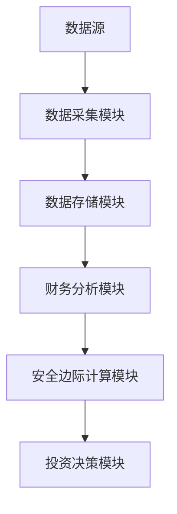

                 


# 《格雷厄姆价值投资理念在当代市场的应用》

> 关键词：价值投资，格雷厄姆，内在价值，安全边际，投资策略，市场分析

> 摘要：本文系统地分析了格雷厄姆价值投资理念的核心思想及其在当代市场中的应用。通过对内在价值、安全边际等核心概念的深入探讨，结合数学模型和系统架构的设计，展示了如何将格雷厄姆的投资理念转化为可操作的投资策略。文章还通过实际案例分析，详细讲解了如何在现代市场中应用这些理念，并给出了最佳实践的建议。

---

## 第一部分：格雷厄姆价值投资理念的背景与基础

### 第1章：价值投资的基本概念

#### 1.1 投资学的基本概念
- 什么是投资？
- 资产的分类与特性
- 投资目标与风险收益平衡

#### 1.2 格雷厄姆的价值投资理念
- 格雷厄姆的生平与贡献
- 价值投资的定义与核心思想
- 格雷厄姆的投资哲学

#### 1.3 价值投资的核心原则
- 购买便宜的资产
- 长期投资与复利效应
- 风险控制与安全边际
- 资产配置与分散投资

---

### 第2章：格雷厄姆价值投资理念的数学模型

#### 2.1 内在价值的计算公式
- 内在价值的定义
- 格雷厄姆的内在价值计算公式
$$ V = \frac{E}{(1 + r)^n} $$
其中，\( E \) 是企业的未来现金流，\( r \) 是贴现率，\( n \) 是时间跨度。

#### 2.2 安全边际的计算方法
- 安全边际的定义
- 安全边际的计算公式
$$ \text{安全边际} = \text{内在价值} - \text{市场价格} $$

#### 2.3 价值投资的数学模型
- 资产评估模型
- 资产组合优化模型
- 风险与收益的平衡模型

---

### 第3章：格雷厄姆价值投资理念的系统分析

#### 3.1 价值投资系统的功能模块
- 数据采集模块
- 数据存储模块
- 财务分析模块
- 安全边际计算模块
- 投资决策模块

#### 3.2 价值投资系统的架构设计
- 系统架构图


#### 3.3 价值投资系统的交互流程
- 用户输入投资目标
- 系统进行数据采集与分析
- 计算安全边际并生成投资建议
- 输出投资报告

---

## 第二部分：格雷厄姆价值投资理念的当代应用

### 第4章：格雷厄姆价值投资理念的项目实战

#### 4.1 环境安装与配置
- Python环境的安装
- 数据分析库的安装（如Pandas、NumPy）

#### 4.2 核心代码实现
- 数据采集与处理
```python
import pandas as pd
data = pd.read_csv('stock_data.csv')
# 计算内在价值和安全边际
intrinsic_value = data['E'] / (1 + data['r'])**data['n']
safety_margin = intrinsic_value - data['price']
```

#### 4.3 案例分析与解读
- 某上市公司的财务数据分析
- 内在价值与安全边际的计算
- 投资决策与策略优化

---

### 第5章：格雷厄姆价值投资理念的最佳实践

#### 5.1 小结与总结
- 格雷厄姆价值投资理念的核心思想
- 内在价值与安全边际的重要性
- 长期投资与复利效应的实践意义

#### 5.2 投资注意事项
- 避免情绪化投资
- 风险控制与资产配置
- 定期复盘与策略调整

#### 5.3 拓展阅读与学习资源
- 推荐书籍与文献
- 在线课程与投资论坛
- 实战训练与案例分析

---

## 第三部分：结论与展望

### 6.1 结论
- 格雷厄姆价值投资理念的现代意义
- 数学模型与系统架构的应用价值
- 项目实战的经验总结

### 6.2 展望
- 人工智能在价值投资中的应用
- 大数据分析在投资决策中的潜力
- 未来投资策略的发展方向

---

通过以上目录结构，我们可以系统地了解格雷厄姆价值投资理念在当代市场中的应用，从理论到实践，从数学模型到系统架构，再到实际案例分析，全面而深入地探讨了这一投资理念的现代价值与实践意义。

