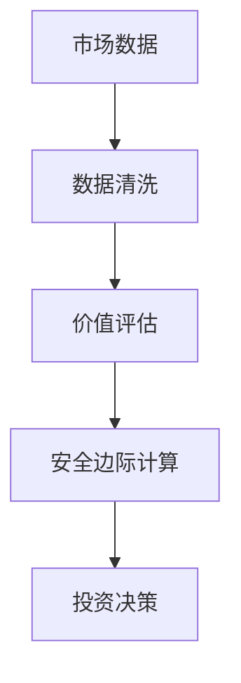
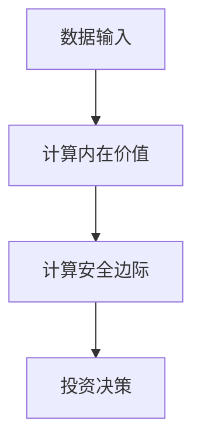
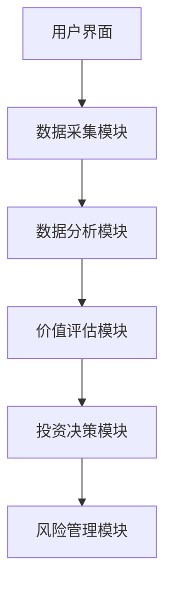

                 


# 《格雷厄姆价值投资理念在虚拟经济时代的新解读》

## 关键词：格雷厄姆价值投资，虚拟经济，数字经济，投资策略，安全边际，内在价值

## 摘要：本文将从技术视角重新解读格雷厄姆的价值投资理念，探讨其在虚拟经济时代的适用性与创新。通过结合数字经济的特点，分析传统投资理念与现代虚拟经济的融合，构建基于数据驱动的虚拟经济投资框架，提出安全边际与内在价值的新计算方法，并通过实际案例验证其有效性。

---

## 第一章：价值投资理念的背景与核心概念

### 1.1 格雷厄姆价值投资的起源与核心思想

格雷厄姆是价值投资的鼻祖，其核心思想在于寻找市场价格低于其内在价值的资产进行投资。以下是其主要理念的总结：

- **安全边际**：买入价格低于内在价值的资产，以降低风险。
- **内在价值**：资产在未来现金流的现值。
- **市场先生**：市场价格波动反映了市场情绪，而非理性。

### 1.2 虚拟经济时代的特点与挑战

虚拟经济是以数字化资产为核心，其特点包括：

- **去中心化**：区块链技术的应用使得虚拟资产的发行和交易脱离传统金融机构。
- **高波动性**：虚拟资产价格波动远高于传统资产。
- **数据驱动**：虚拟经济高度依赖数据和算法。

### 1.3 价值投资理念在虚拟经济中的适用性

虚拟经济的特殊性为价值投资带来了新的挑战，但也提供了新的机遇：

- **数据量大**：虚拟经济中数据丰富，但需要有效的处理方法。
- **算法驱动**：需要结合算法交易和量化分析。
- **去中心化**：需要重新定义内在价值和安全边际。

---

## 第二章：格雷厄姆价值投资的核心理念与数学模型

### 2.1 核心概念对比表格

| 概念       | 传统经济       | 虚拟经济       |
|------------|----------------|----------------|
| 资产类型   | 实体资产       | 数字资产       |
| 安全边际   | 价格折扣      | 数字折扣       |
| 市场波动   | 较低           | 极高           |

### 2.2 格雷厄姆价值投资的数学模型

#### 2.2.1 内在价值计算公式

$$ V = \frac{E}{1 + r} $$

其中，V为内在价值，E为未来现金流，r为折现率。

#### 2.2.2 安全边际计算公式

$$ \text{安全边际} = \text{市场价格} \times \text{安全边际系数} $$

### 2.3 系统架构与流程图

以下为价值投资的系统架构图：



---

## 第三章：格雷厄姆价值投资在虚拟经济中的应用框架

### 3.1 虚拟经济中的价值投资框架

#### 3.1.1 数据驱动的投资策略

- 数据采集：虚拟经济中的价格、交易量等数据。
- 数据清洗：去除噪声数据。
- 数据分析：利用算法计算内在价值和安全边际。

#### 3.1.2 算法驱动的模型

以下为价值投资算法流程图：



#### 3.1.3 案例分析

假设某虚拟货币的未来现金流为 $100，折现率为 $0.10，则其内在价值为：

$$ V = \frac{100}{1 + 0.10} = 90.91 $$

若市场价格为 $80，则安全边际为：

$$ \text{安全边际} = 80 \times 1.2 = 96 $$

由于市场价格低于安全边际，适合买入。

---

## 第四章：系统架构与实现

### 4.1 系统架构设计

以下为系统架构图：



### 4.2 核心实现

#### 4.2.1 数据采集模块

```python
import requests

def get_market_data():
    response = requests.get("https://api.example.com/data")
    return response.json()
```

#### 4.2.2 价值评估模块

```python
def calculate_intrinsic_value(future_cash_flows, discount_rate):
    return sum(fcf / (1 + discount_rate)**i for i, fcf in enumerate(future_cash_flows))
```

#### 4.2.3 投资决策模块

```python
def make_investment_decision(price, intrinsic_value, margin_of_safety):
    if price < intrinsic_value * margin_of_safety:
        return "Buy"
    else:
        return "Hold"
```

---

## 第五章：案例分析与实战

### 5.1 案例分析

以比特币为例：

- 未来现金流假设为 $1000。
- 折现率为 $0.10。
- 内在价值为 $90.91。
- 市场价格为 $80。
- 安全边际系数为 $1.2。

由于市场价格 $80 < 内在价值 $90.91，且安全边际 $96 > 市场价格，建议买入。

### 5.2 投资策略的动态调整

在虚拟经济中，市场波动剧烈，需要动态调整投资策略：

- 定期重新计算内在价值和安全边际。
- 根据市场变化调整安全边际系数。

---

## 第六章：总结与展望

### 6.1 总结

格雷厄姆的价值投资理念在虚拟经济时代依然适用，但需要结合数据驱动的方法和算法模型进行创新。通过安全边际和内在价值的重新定义，可以在虚拟经济中找到投资机会。

### 6.2 展望

未来，随着技术的发展，价值投资将更加依赖于数据和算法。投资者需要结合虚拟经济的特点，不断创新投资策略，以应对市场的不确定性。

---

## 小结

本文从技术视角重新解读了格雷厄姆的价值投资理念，并探讨了其在虚拟经济中的应用。通过数学模型、系统架构和案例分析，展示了如何在虚拟经济中实现安全边际与内在价值的计算，为投资者提供了新的思路和方法。

