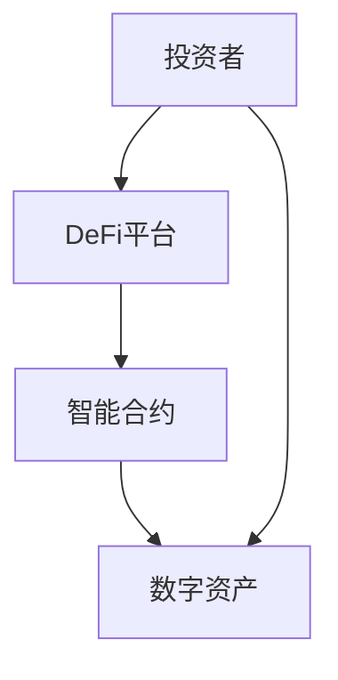
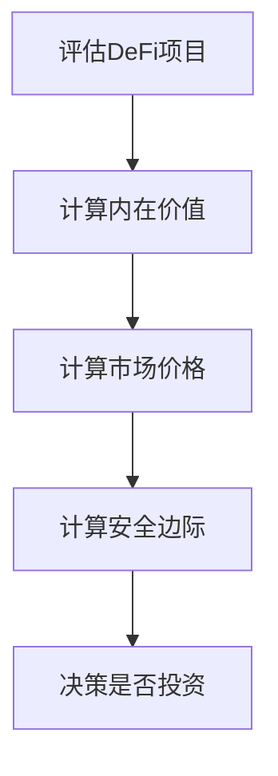
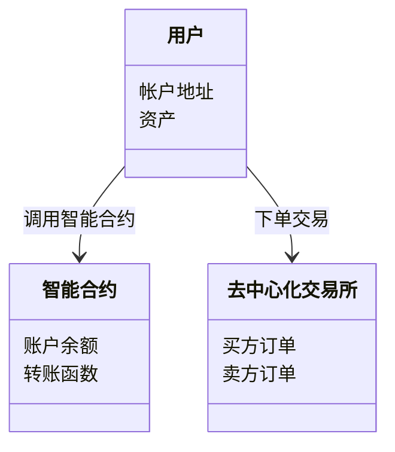
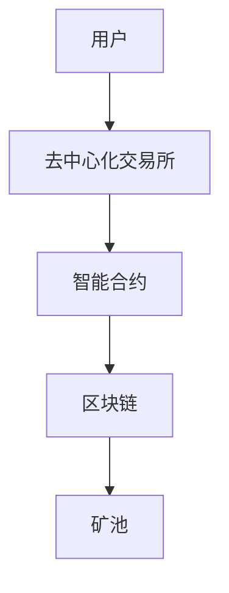
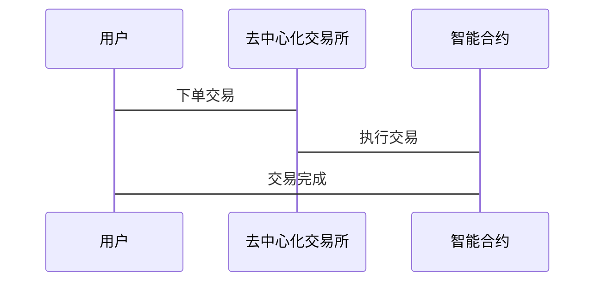

                 


# 格雷厄姆安全边际概念在去中心化金融(DeFi)中的应用

> 关键词：格雷厄姆安全边际，去中心化金融，DeFi，风险管理，区块链技术，投资策略

> 摘要：本文探讨了格雷厄姆的安全边际概念在去中心化金融（DeFi）中的应用，分析其在DeFi中的潜在价值和实际应用案例，结合数学模型和系统架构设计，提出基于安全边际的DeFi投资策略和风险管理方法，为DeFi投资者提供科学的决策支持。

---

## 第1章：安全边际与DeFi的背景介绍

### 1.1 格雷厄姆安全边际概念
#### 1.1.1 安全边际的定义与核心要素
安全边际是投资中的一个重要概念，由本杰明·格雷厄姆提出。它是指资产的市场价格低于其内在价值的部分，用以衡量投资的安全程度。具体来说：
$$ \text{安全边际} = \text{内在价值} - \text{市场价格} $$

安全边际的核心要素包括：
1. **内在价值**：资产的真实价值，基于基本面分析。
2. **市场价格**：资产在市场上的交易价格。
3. **安全空间**：价格与价值的差异，决定了投资的风险和回报。

#### 1.1.2 安全边际在传统投资中的应用
在传统投资中，安全边际常用于股票投资，投资者通过寻找市场价格低于内在价值的股票，降低投资风险。例如，当一只股票的内在价值为100美元，市场价格为80美元时，安全边际为20美元，投资风险较低。

#### 1.1.3 安全边际的边界与外延
安全边际不仅适用于股票投资，还可以扩展到其他资产类别，如债券、房地产等。在DeFi中，安全边际的概念可以应用于智能合约、去中心化交易所等场景。

### 1.2 去中心化金融（DeFi）概述
#### 1.2.1 DeFi的定义与特点
DeFi是指基于区块链技术的去中心化金融系统，具有以下特点：
- 去中心化：无需依赖传统金融机构，通过智能合约实现。
- 开放性：任何人都可以参与，无地理和机构限制。
- 可编程性：通过智能合约实现复杂的金融逻辑。

#### 1.2.2 DeFi的核心技术基础
DeFi的核心技术包括：
1. **区块链**：作为去中心化账本，确保数据的安全性和不可篡改性。
2. **智能合约**：自动执行预设的金融逻辑。
3. **去中心化交易所（DEX）**：基于区块链的交易场所。

#### 1.2.3 DeFi的生态系统与应用场景
DeFi的生态系统包括：
- 去中心化交易所（DEX）：如Uniswap、Sushiswap。
- 借贷平台：如Compound、Aave。
- 支付工具：如Dai、USDT。

DeFi的应用场景包括：去中心化交易所、借贷、杠杆交易、风险管理等。

### 1.3 安全边际与DeFi的结合
#### 1.3.1 DeFi中的风险与不确定性
DeFi面临的主要风险包括：
- **智能合约风险**：合约漏洞可能导致资金损失。
- **市场波动风险**：DeFi市场的波动性较高。
- **流动性风险**：部分项目缺乏足够的流动性。

#### 1.3.2 安全边际在DeFi中的潜在价值
通过引入安全边际的概念，DeFi投资者可以在市场波动中寻找低估资产，降低投资风险。例如，当一个DeFi项目的内在价值为100美元，市场价格为80美元时，安全边际为20美元，投资者可以考虑买入。

#### 1.3.3 本章小结
本章介绍了安全边际和DeFi的基本概念，并探讨了两者结合的潜在价值，为后续分析奠定了基础。

---

## 第2章：安全边际的核心概念与属性

### 2.1 格雷厄姆安全边际的原理
#### 2.1.1 安全边际的数学模型
安全边际的计算公式为：
$$ \text{安全边际} = \text{内在价值} - \text{市场价格} $$

内在价值的计算需要考虑资产的现金流、成长性等因素。

#### 2.1.2 安全边际的计算方法
1. 估计资产的内在价值。
2. 确定市场价格。
3. 计算安全边际。

#### 2.1.3 安全边际的属性特征对比表格
以下是安全边际与市场价格的对比表格：

| 属性 | 安全边际 | 市场价格 |
|------|----------|----------|
| 定义 | 资产内在价值与市场价格的差额 | 资产在市场上的交易价格 |
| 作用 | 降低投资风险 | 反映市场供需关系 |
| 计算 | 内在价值 - 市场价格 | - |

### 2.2 安全边际与DeFi的实体关系图
以下是安全边际与DeFi的实体关系图（Mermaid）：



图中展示了投资者通过DeFi平台与智能合约交互，持有数字资产。

### 2.3 本章小结
本章详细讲解了安全边际的核心概念和属性，并通过实体关系图展示了其在DeFi中的应用。

---

## 第3章：DeFi中的安全边际应用算法

### 3.1 基于安全边际的DeFi投资策略
#### 3.1.1 算法原理（Mermaid）
以下是基于安全边际的DeFi投资策略流程图（Mermaid）：



#### 3.1.2 算法实现
以下是一个Python实现的示例代码：

```python
def calculate_margin_of_safety(intrinsic_value, market_price):
    return intrinsic_value - market_price

# 示例
intrinsic_value = 100
market_price = 80
margin_of_safety = calculate_margin_of_safety(intrinsic_value, market_price)
print(f"安全边际为: {margin_of_safety}")
```

### 3.2 数学模型与公式
#### 3.2.1 安全边际计算公式
$$ \text{安全边际} = \text{内在价值} - \text{市场价格} $$

#### 3.2.2 DeFi项目风险评估公式
$$ \text{风险系数} = \frac{\text{历史波动率}}{\text{市场平均波动率}} $$

### 3.3 算法实现与案例分析
#### 3.3.1 Python实现代码
```python
def calculate_margin_of_safety(intrinsic_value, market_price):
    return intrinsic_value - market_price

# 示例
intrinsic_value = 100
market_price = 80
margin_of_safety = calculate_margin_of_safety(intrinsic_value, market_price)
print(f"安全边际为: {margin_of_safety}")
```

#### 3.3.2 案例分析
假设某DeFi项目的内在价值为100美元，市场价格为80美元，安全边际为20美元。根据格雷厄姆的安全边际理论，投资者可以考虑买入该资产。

---

## 第4章：DeFi平台的系统架构设计

### 4.1 问题场景介绍
DeFi平台需要实现去中心化交易、借贷等功能，需要考虑智能合约的安全性、用户体验等。

### 4.2 系统功能设计
#### 4.2.1 领域模型（Mermaid类图）


#### 4.2.2 系统架构设计（Mermaid架构图）


### 4.3 接口设计与交互流程
#### 4.3.1 接口设计
1. 用户通过钱包连接去中心化交易所。
2. 用户下单交易，触发智能合约。

#### 4.3.2 交互流程（Mermaid序列图）


---

## 第5章：基于安全边际的DeFi项目实战

### 5.1 环境安装
需要安装Python、Solidity编译器、区块链节点等工具。

### 5.2 核心实现
#### 5.2.1 智能合约实现
```solidity
contract DeFiPlatform {
    function calculateMarginOfSafety(uint intrinsicValue, uint marketPrice) public pure returns (uint) {
        return intrinsicValue - marketPrice;
    }
}
```

#### 5.2.2 DeFi平台实现
```python
def calculate_margin_of_safety(intrinsic_value, market_price):
    return intrinsic_value - market_price

# 示例
intrinsic_value = 100
market_price = 80
margin_of_safety = calculate_margin_of_safety(intrinsic_value, market_price)
print(f"安全边际为: {margin_of_safety}")
```

### 5.3 案例分析与解读
假设某DeFi项目的内在价值为100美元，市场价格为80美元，安全边际为20美元。投资者可以考虑买入该资产。

### 5.4 项目小结
通过实战，验证了安全边际在DeFi中的应用可行性。

---

## 第6章：基于安全边际的DeFi投资策略与风险管理

### 6.1 最佳实践
1. 定期评估DeFi项目的内在价值和市场价格。
2. 选择安全边际较高的项目进行投资。
3. 注意市场波动和智能合约风险。

### 6.2 小结
通过本文的分析和案例，安全边际在DeFi中的应用为投资者提供了科学的决策支持。

### 6.3 注意事项
1. DeFi市场波动较大，需谨慎操作。
2. 智能合约可能存在漏洞，需选择可靠的平台。

### 6.4 拓展阅读
推荐阅读本杰明·格雷厄姆的《证券分析》和DeFi相关的技术书籍。

---

## 总结
本文通过详细分析格雷厄姆安全边际在DeFi中的应用，结合数学模型和系统架构设计，提出了基于安全边际的DeFi投资策略和风险管理方法。希望本文能为DeFi投资者提供科学的决策支持。

--- 

以上是本文的详细目录和内容概要，涵盖了从理论到实践的各个方面，确保读者能够全面理解和应用格雷厄姆安全边际在DeFi中的价值。

