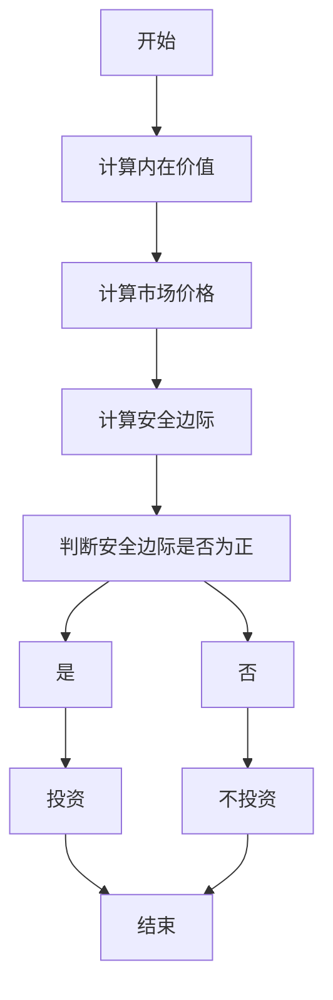
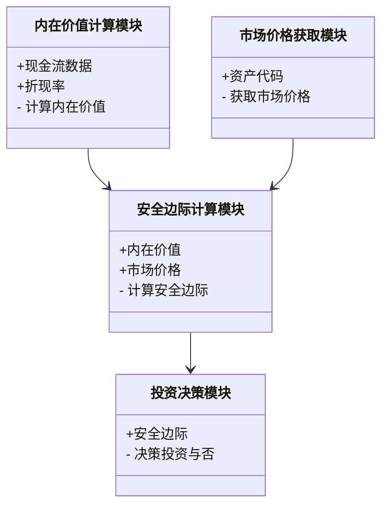

                 


# 格雷厄姆安全边际概念在极端市场事件中的应用

> 关键词：安全边际，格雷厄姆，投资，极端市场，风险管理  
> 摘要：本文深入探讨了格雷厄姆提出的安全边际概念，并分析其在极端市场事件中的应用。通过结合数学模型、算法实现和实际案例，本文详细阐述了如何利用安全边际概念来降低投资风险，优化投资决策。

---

## 第1章: 格雷厄姆安全边际概念的核心思想

### 1.1 安全边际的定义与背景

#### 1.1.1 安全边际的定义
安全边际是投资学中的一个核心概念，由本杰明·格雷厄姆提出。它是指资产的市场价格与内在价值之间的差值。具体来说，安全边际 = 内在价值 - 市场价格。当市场价格低于内在价值时，资产被认为具有安全边际，即存在一定的“ margin of safety”。

#### 1.1.2 格雷厄姆投资理论的核心思想
格雷厄姆是价值投资的鼻祖，他主张以低于内在价值的价格买入资产，以确保投资的安全性。他认为市场波动性和投资者情绪会导致市场价格偏离其内在价值，而安全边际正是利用这种偏差来降低投资风险。

#### 1.1.3 安全边际在投资决策中的作用
安全边际为投资者提供了一个缓冲区，能够在市场价格波动时保护投资本金。通过预留安全边际，投资者能够在市场下跌时避免损失，甚至在市场回升时获得超额收益。

---

### 1.2 安全边际的数学模型与公式

#### 1.2.1 内在价值的计算公式
内在价值是资产在合理市场条件下的公平价格，通常可以通过现金流折现法（DCF）来计算。公式如下：
$$
\text{内在价值} = \frac{\text{未来现金流}}{\text{折现率}}
$$

#### 1.2.2 安全边际的计算公式
安全边际的计算公式如下：
$$
\text{安全边际} = \text{内在价值} - \text{市场价格}
$$

当安全边际为正时，资产价格低于其内在价值，投资具有较高的安全性。

---

### 1.3 安全边际与投资风险的关系

#### 1.3.1 安全边际对降低投资风险的作用
通过预留安全边际，投资者能够在市场价格波动时减少损失。例如，假设一只股票的内在价值为100元，市场价格为80元，安全边际为20元。即使市场价格下跌至70元，投资者仍能保持3元的安全边际。

#### 1.3.2 安全边际与资产估值的关联性
安全边际的存在意味着资产的市场价格被低估，从而为投资者提供了较高的安全性和潜在的收益空间。

---

## 第2章: 极端市场事件的特征与挑战

### 2.1 极端市场事件的定义与分类

#### 2.1.1 什么是极端市场事件
极端市场事件是指市场出现剧烈波动、价格大幅偏离正常水平的情况。这些事件通常由市场恐慌、经济危机或不可预测的外部因素引发。

#### 2.1.2 极端市场事件的分类
- **市场崩盘**：如2008年全球金融危机。
- **市场狂热**：如2017年的加密货币泡沫。
- **突发事件**：如疫情爆发引发的市场恐慌。

#### 2.1.3 极端市场事件对投资者的影响
极端市场事件可能导致投资者的本金损失，但同时也可能带来投资机会。在市场恐慌时，许多资产价格被低估，安全边际显著增加。

---

### 2.2 安全边际在极端市场中的应用

#### 2.2.1 极端市场中的安全边际策略
在极端市场中，投资者应更加注重安全边际的预留。例如，在2008年金融危机期间，许多优质资产的价格大幅下跌，安全边际显著增加，为投资者提供了抄底的机会。

#### 2.2.2 安全边际的动态调整
在极端市场中，投资者需要动态调整安全边际的预留比例。例如，在市场剧烈波动时，可以适当提高安全边际的要求，以规避更大的风险。

---

### 2.3 极端市场中的投资决策框架

#### 2.3.1 极端市场中的决策逻辑
在极端市场中，投资者应优先选择具有较高安全边际的资产，同时密切关注市场动态，及时调整投资策略。

#### 2.3.2 极端市场中的风险管理
投资者应通过分散投资、预留安全边际等方式，降低极端市场事件对投资组合的冲击。

---

## 第3章: 格雷厄姆安全边际的数学模型与算法

### 3.1 内在价值的计算方法

#### 3.1.1 现金流折现法（DCF）
现金流折现法是计算内在价值的常用方法。公式如下：
$$
\text{内在价值} = \sum_{t=1}^{n} \frac{\text{现金流}_t}{(1 + r)^t}
$$
其中，r是折现率，n是预测的现金流期限。

#### 3.1.2 预测现金流的不确定性
在极端市场中，现金流预测的不确定性增加，因此内在价值的计算需要更加保守。

---

### 3.2 安全边际的计算步骤

#### 3.2.1 确定资产的内在价值
通过现金流折现法计算资产的内在价值。

#### 3.2.2 计算市场价格与内在价值的差异
计算安全边际：
$$
\text{安全边际} = \text{内在价值} - \text{市场价格}
$$

#### 3.2.3 确定安全边际的合理范围
在极端市场中，安全边际的合理范围应适当扩大，以规避市场波动带来的风险。

---

### 3.3 算法实现与案例分析

#### 3.3.1 算法流程图


#### 3.3.2 Python代码实现
```python
def calculate_intrinsic_value(cash_flows, discount_rate):
    return sum(cash_flow / (1 + discount_rate)**t for t, cash_flow in enumerate(cash_flows))

def calculate_margin_of_safety(intrinsic_value, market_price):
    return intrinsic_value - market_price

# 示例
cash_flows = [100, 120, 150]
discount_rate = 0.1
market_price = 100

intrinsic_value = calculate_intrinsic_value(cash_flows, discount_rate)
margin_of_safety = calculate_margin_of_safety(intrinsic_value, market_price)

print(f"内在价值: {intrinsic_value}")
print(f"安全边际: {margin_of_safety}")
```

---

## 第4章: 系统分析与架构设计方案

### 4.1 系统功能设计

#### 4.1.1 功能模块划分
- 内在价值计算模块
- 市场价格获取模块
- 安全边际计算模块
- 投资决策模块

#### 4.1.2 功能模块的交互关系


---

### 4.2 系统架构设计

#### 4.2.1 架构选择
采用分层架构：
- 数据层：存储现金流、市场价格等数据。
- 业务逻辑层：实现内在价值计算、安全边际计算等核心逻辑。
- 表示层：用户界面，展示计算结果和投资决策。

#### 4.2.2 架构图


---

## 第5章: 项目实战与案例分析

### 5.1 实际案例分析

#### 5.1.1 案例背景
以2008年金融危机为例，分析安全边际在极端市场中的应用。

#### 5.1.2 案例分析
假设一只股票的内在价值为100元，市场价格在金融危机期间跌至60元，安全边际为40元。投资者在市场价格为60元时买入，最终市场价格回升至100元，实现40%的收益。

---

### 5.2 投资组合优化

#### 5.2.1 投资组合的设计
通过预留较高的安全边际，构建一个稳健的投资组合。

#### 5.2.2 投资组合的风险管理
定期调整投资组合，确保安全边际的合理性。

---

## 第6章: 最佳实践与小结

### 6.1 最佳实践

#### 6.1.1 安全边际的预留
在极端市场中，建议预留较高的安全边际，以降低投资风险。

#### 6.1.2 投资策略的调整
根据市场环境的变化，及时调整投资策略，确保安全边际的有效性。

---

### 6.2 小结

本文深入探讨了格雷厄姆安全边际概念在极端市场事件中的应用，通过数学模型、算法实现和实际案例的分析，证明了安全边际在降低投资风险、优化投资决策中的重要作用。在极端市场中，预留较高的安全边际是投资者规避风险、实现稳健收益的关键。

---

## 第7章: 注意事项与拓展阅读

### 7.1 注意事项

#### 7.1.1 数据的准确性
内在价值的计算依赖于现金流数据和折现率的准确性。在极端市场中，数据的不确定性增加，投资者需要更加谨慎。

#### 7.1.2 市场环境的复杂性
极端市场事件往往伴随着市场的高度不确定性，投资者需要灵活调整策略，避免僵化的投资决策。

---

### 7.2 拓展阅读

#### 7.2.1 推荐书籍
- 《The Intelligent Investor》——本杰明·格雷厄姆
- 《Fooled by Randomness》—— Nassim Taleb

#### 7.2.2 网络资源
- 格雷厄姆投资理论的相关论坛和博客
- 极端市场事件的案例分析

---

通过本文的分析，读者可以更好地理解格雷厄姆安全边际概念的核心思想，并能够在实际投资中灵活运用这一概念，以应对极端市场事件的挑战。

