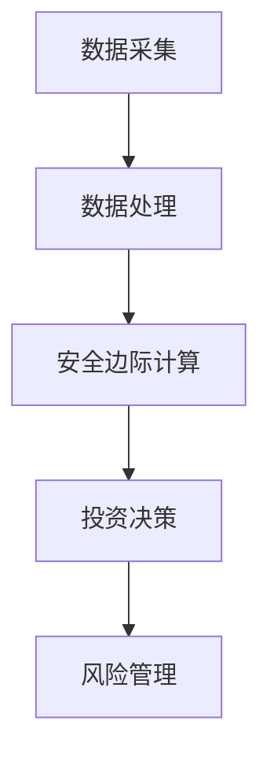

                 


# 格雷厄姆安全边际概念在高波动性市场中的应用

> **关键词**：格雷厄姆、安全边际、高波动性市场、投资风险管理、价值投资策略

> **摘要**：本文深入探讨了格雷厄姆的安全边际概念及其在高波动性市场中的应用。通过分析安全边际的计算方法、投资策略、系统架构设计以及项目实战，展示了如何在高波动性市场中利用安全边际进行风险管理，确保投资的稳健性。文章结合理论与实践，为投资者提供了一套系统化的安全边际应用方案，帮助他们在复杂多变的市场环境中做出明智的投资决策。

---

## 第一部分: 格雷厄姆安全边际概念的基本理论

### 第1章: 安全边际的基本概念

#### 1.1 格雷厄姆投资理论概述

##### 1.1.1 投资学派的起源与发展
投资学作为一门学科，其发展历程可以追溯到18世纪的古典经济学。然而，现代投资学的形成始于20世纪初，特别是1929年经济大萧条后，投资者开始寻求更稳健的投资策略。格雷厄姆的投资理论正是在这一背景下诞生的，他主张以安全边际为核心，通过基本面分析来寻找被低估的投资标的。

##### 1.1.2 格雷厄姆的价值投资理念
格雷厄姆的价值投资理念强调买入低于内在价值的资产。他认为，市场价格往往偏离内在价值，而这种偏离为理性投资者提供了获利的机会。通过深入分析企业的财务状况、行业地位和未来前景，投资者可以找到具有安全边际的标的。

##### 1.1.3 安全边际概念的提出与意义
安全边际是格雷厄姆理论的核心，它是指内在价值与市场价格之间的差额。这个差额为投资者提供了保护，使其在市场价格波动时能够避免损失。安全边际的存在意味着投资者在买入时有额外的“缓冲”，即使市场出现短期波动，也能确保投资的安全性。

#### 1.2 安全边际的定义与属性

##### 1.2.1 安全边际的定义
安全边际（Safety Margin）是指资产的内在价值与市场价格之间的差额。公式表示为：
$$ \text{安全边际} = \text{内在价值} - \text{市场价格} $$

##### 1.2.2 安全边际的属性特征对比表格
以下表格对比了安全边际与其他投资概念的关键差异：

| 属性             | 安全边际          | 市场价格         | 内在价值       |
|------------------|-------------------|-----------------|----------------|
| 定义             | 两者的差额        | 当前交易价格     | 理论上的公平价  |
| 作用             | 提供风险缓冲       | 反映市场情绪     | 体现资产真实价值|
| 计算复杂度       | 较高              | 较低             | 较高            |

##### 1.2.3 安全边际与投资风险的关系
安全边际的存在能够降低投资风险。当市场价格低于内在价值时，投资者的风险承受能力增强，即使市场出现波动，也能在一定程度上避免损失。

#### 1.3 安全边际的核心要素

##### 1.3.1 核心概念原理
安全边际的原理在于通过低估价格买入资产，从而在市场波动时获得超额收益。这种策略强调的是长期稳定回报，而非短期收益的最大化。

##### 1.3.2 核心要素组成
以下是安全边际的核心要素组成：

1. **内在价值**：资产的真实价值，基于基本面分析得出。
2. **市场价格**：资产在市场上的当前价格。
3. **安全边际宽度**：内在价值与市场价格的差额。

##### 1.3.3 安全边际的ER实体关系图
以下是一个简单的ER图，展示了安全边际的核心要素：


---

### 第2章: 高波动性市场的特性与挑战

#### 2.1 高波动性市场的定义与特征

##### 2.1.1 市场波动性的定义
市场波动性是指市场价格在短时间内剧烈波动的程度。高波动性市场通常表现为价格的大幅波动，无论是上涨还是下跌。

##### 2.1.2 高波动性市场的特征
高波动性市场的特征包括：

1. **价格波动剧烈**：短时间内价格可能大幅波动。
2. **市场情绪不稳定**：投资者情绪容易受到市场波动的影响。
3. **信息不对称加剧**：市场参与者之间信息不透明，影响价格的合理反映。

##### 2.1.3 高波动性市场对投资者的影响
在高波动性市场中，投资者面临更大的风险和不确定性。价格波动可能导致投资组合的价值急剧下降，同时也会带来更多的机会。

#### 2.2 高波动性市场中的投资风险

##### 2.2.1 市场风险的来源
市场风险主要来源于市场价格的波动。在高波动性市场中，这种风险尤为显著，可能导致投资者的损失。

##### 2.2.2 非系统性风险的特征
非系统性风险是指与特定资产或行业相关的风险。在高波动性市场中，这种风险可能通过资产的相关性传导到整个市场。

##### 2.2.3 风险与收益的权衡
高风险通常伴随着高收益。然而，在高波动性市场中，投资者需要权衡风险与收益，以确保投资决策的合理性。

#### 2.3 高波动性市场中的安全边际应用

##### 2.3.1 安全边际在高波动性市场中的作用
安全边际在高波动性市场中能够提供额外的保护，帮助投资者在价格波动中避免损失。

##### 2.3.2 高波动性市场中安全边际的计算方法
在高波动性市场中，安全边际的计算需要考虑价格波动的幅度和频率。以下是一个简化的方法：

1. **计算内在价值**：基于基本面分析。
2. **确定市场价格**：观察当前市场价格。
3. **计算安全边际**：$$ \text{安全边际} = \text{内在价值} - \text{市场价格} $$

##### 2.3.3 安全边际在投资决策中的应用
投资者可以通过安全边际来选择具有足够保护空间的资产，从而在高波动性市场中实现稳健投资。

---

## 第三部分: 安全边际的计算与评估

### 第3章: 安全边际的数学模型与公式

#### 3.1 安全边际的计算公式

##### 3.1.1 安全边际的计算公式推导
安全边际的计算公式可以从内在价值和市场价格的关系中推导得出。

##### 3.1.2 安全边际的数学表达式
$$ \text{安全边际} = \frac{\text{内在价值} - \text{市场价格}}{\text{市场价格}} $$

##### 3.1.3 安全边际的百分比表示
$$ \text{安全边际百分比} = \left( \frac{\text{内在价值} - \text{市场价格}}{\text{内在价值}} \right) \times 100\% $$

#### 3.2 安全边际的评估方法

##### 3.2.1 相对安全边际的计算
相对安全边际是通过比较内在价值与市场价格的比率来评估。

##### 3.2.2 绝对安全边际的计算
绝对安全边际是内在价值与市场价格的差额。

##### 3.2.3 安全边际的有效性评估
评估安全边际的有效性需要考虑市场环境、资产特性和投资者的风险承受能力。

#### 3.3 安全边际的案例分析

##### 3.3.1 案例一：股票投资中的安全边际计算
假设某股票的内在价值为100元，市场价格为80元，则安全边际为20元，安全边际百分比为25%。

##### 3.3.2 案例二：债券投资中的安全边际应用
假设某债券的内在价值为90元，市场价格为85元，则安全边际为5元，安全边际百分比为5.56%。

---

## 第四部分: 投资策略与风险管理

### 第4章: 投资策略与风险管理

#### 4.1 投资策略的制定

##### 4.1.1 格雷厄姆投资策略的核心要素
格雷厄姆的投资策略强调买入低估资产，持有至内在价值实现。

##### 4.1.2 投资组合的构建
投资者应根据自身风险承受能力和市场环境，构建多元化投资组合。

##### 4.1.3 安全边际在投资组合中的作用
安全边际能够降低投资组合的整体风险，提高投资的稳定性。

#### 4.2 风险管理的策略

##### 4.2.1 风险控制的重要性
在高波动性市场中，有效的风险管理是确保投资收益的关键。

##### 4.2.2 安全边际与风险管理的结合
通过合理配置资产的安全边际，投资者可以在市场波动中保持稳健。

##### 4.2.3 风险与收益的平衡
投资者需要在风险与收益之间找到平衡点，以实现长期稳健的投资回报。

---

## 第五部分: 系统分析与架构设计

### 第5章: 系统分析与架构设计

#### 5.1 系统分析

##### 5.1.1 高波动性市场的系统分析
高波动性市场中，系统分析可以帮助投资者更好地理解市场的波动规律。

##### 5.1.2 安全边际的系统分析
通过系统分析，投资者可以更好地评估安全边际的有效性。

##### 5.1.3 投资策略的系统化
系统化投资策略能够帮助投资者在高波动性市场中做出更科学的决策。

#### 5.2 系统架构设计

##### 5.2.1 系统架构设计的核心要素
系统架构设计需要考虑数据采集、分析处理、投资决策和风险管理等模块。

##### 5.2.2 系统架构的模块化设计
以下是一个简化的系统架构模块化设计：



##### 5.2.3 系统架构的优化
通过模块化设计，系统架构能够更好地适应高波动性市场的变化。

---

## 第六部分: 项目实战

### 第6章: 项目实战

#### 6.1 项目环境安装

##### 6.1.1 开发环境的选择
建议使用Python和相关库（如Pandas、NumPy）进行数据分析。

##### 6.1.2 项目依赖的安装
安装必要的库：
```bash
pip install pandas numpy matplotlib
```

#### 6.2 系统核心实现

##### 6.2.1 安全边际计算模块的实现
```python
import pandas as pd

def calculate_margin(intrinsic_value, market_price):
    return intrinsic_value - market_price
```

##### 6.2.2 数据分析模块的实现
```python
def analyze_data(data):
    data['安全边际'] = data['内在价值'] - data['市场价格']
    return data
```

##### 6.2.3 可视化模块的实现
```python
import matplotlib.pyplot as plt

def visualize_margin(data):
    plt.plot(data['时间'], data['安全边际'])
    plt.xlabel('时间')
    plt.ylabel('安全边际')
    plt.show()
```

#### 6.3 案例分析

##### 6.3.1 案例一：股票投资分析
```python
data = pd.DataFrame({
    '时间': [1, 2, 3, 4],
    '内在价值': [100, 110, 90, 120],
    '市场价格': [80, 90, 85, 100]
})

data['安全边际'] = data['内在价值'] - data['市场价格']
print(data)
```

##### 6.3.2 案例二：债券投资分析
```python
data = pd.DataFrame({
    '时间': [1, 2, 3, 4],
    '内在价值': [95, 100, 98, 102],
    '市场价格': [90, 95, 92, 100]
})

data['安全边际'] = data['内在价值'] - data['市场价格']
print(data)
```

#### 6.4 项目总结

##### 6.4.1 项目成果
通过项目实战，投资者可以更好地理解和应用安全边际的概念。

##### 6.4.2 项目经验
项目中需要注意数据的准确性和模型的适用性。

##### 6.4.3 项目优化
未来可以进一步优化算法，提高计算效率。

---

## 第七部分: 最佳实践、小结与展望

### 第7章: 最佳实践与小结

#### 7.1 最佳实践

##### 7.1.1 安全边际的持续监控
投资者需要定期监控安全边际的变化，及时调整投资策略。

##### 7.1.2 风险管理的持续优化
通过不断优化风险管理策略，投资者可以更好地应对市场波动。

##### 7.1.3 知识的持续学习
投资者需要不断学习和更新知识，以适应市场的变化。

#### 7.2 小结

本文深入探讨了格雷厄姆安全边际概念在高波动性市场中的应用，通过理论分析和项目实战，展示了如何利用安全边际进行投资决策和风险管理。

#### 7.3 展望

未来，随着市场的进一步发展，安全边际的应用将更加广泛和深入。投资者需要不断学习和实践，以更好地应对市场的挑战。

---

### **附录**

#### 附录A: 常用公式汇总
- 安全边际计算公式：
$$ \text{安全边际} = \text{内在价值} - \text{市场价格} $$

#### 附录B: 数据分析代码示例
```python
import pandas as pd
import numpy as np

# 示例数据
data = pd.DataFrame({
    '资产': ['股票A', '股票B', '债券C'],
    '内在价值': [150, 200, 120],
    '市场价格': [120, 180, 110]
})

# 计算安全边际
data['安全边际'] = data['内在价值'] - data['市场价格']

print(data)
```

#### 附录C: 参考文献
1. 格雷厄姆, B. (1949). *The Intelligent Investor*. 
2. 布鲁克林, R. (2010). *Investing in a Time of Market Volatility*. 

---

### **结语**

通过本文的深入探讨，读者可以更好地理解格雷厄姆安全边际概念在高波动性市场中的应用。无论是从理论分析还是项目实战，安全边际都为投资者提供了一种稳健的投资策略，帮助他们在复杂多变的市场环境中实现长期稳定的收益。希望本文的内容能够为投资者提供有价值的参考和启发。

