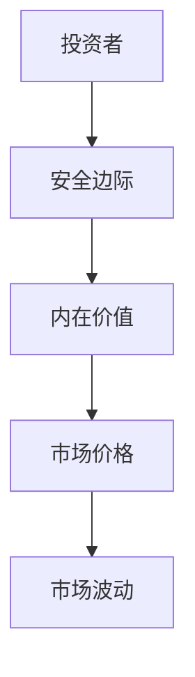
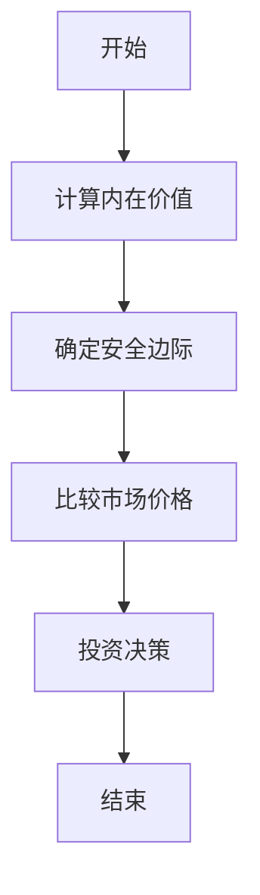
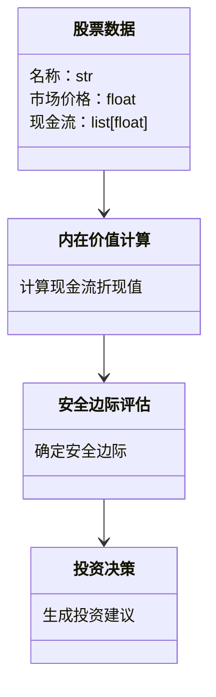
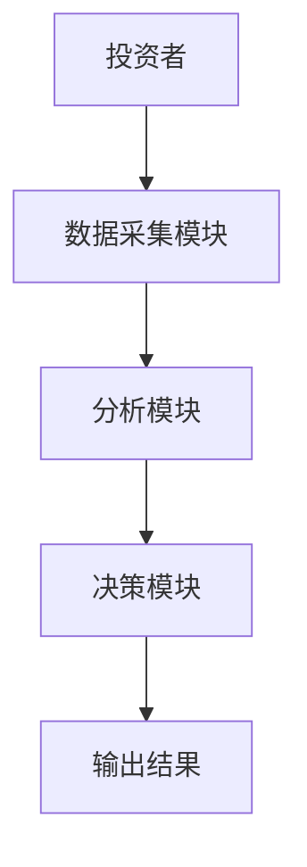
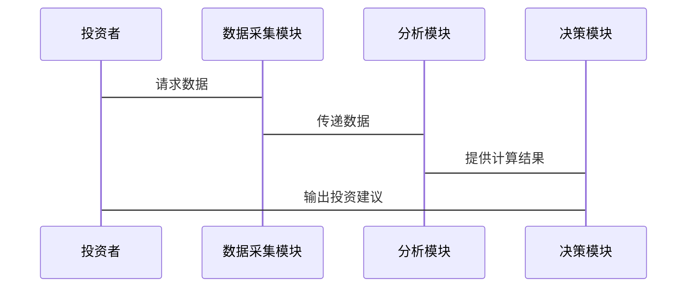

                 


# 格雷厄姆特价股票投资策略解析

## 关键词：价值投资，格雷厄姆，特价股票，内在价值，安全边际

## 摘要：本文详细解析了格雷厄姆的价值投资策略，重点介绍了如何识别和投资于特价股票。通过分析内在价值、安全边际等核心概念，结合定量分析和系统设计，提供实际案例和最佳实践，帮助投资者理解和应用这一策略。

---

# 第一部分: 格雷厄姆价值投资背景介绍

## 第1章: 格雷厄姆价值投资概述

### 1.1 价值投资的基本概念

#### 1.1.1 投资的定义与分类
投资是将资金投入实体或金融资产，以期获得未来收益的行为。根据风险和收益的不同，投资可分为股票、债券、房地产等多种类型。

#### 1.1.2 价值投资的核心理念
价值投资是一种基于对公司内在价值分析的投资策略，强调以低于内在价值的价格买入优质资产。其核心理念是“买便宜货”，即关注市场价格与内在价值的差异。

#### 1.1.3 格雷厄姆投资理论的起源与发展
本杰明·格雷厄姆是价值投资之父，他的理论在20世纪30年代形成，并在《证券分析》和《 Intelligent Investor》中详细阐述。格雷厄姆的投资理念强调安全性和长期稳健回报，为后来的价值投资奠定了基础。

### 1.2 格雷厄姆投资策略的核心要素

#### 1.2.1 安全边际的概念与作用
安全边际是指买入价格与内在价值之间的差距，确保即使出现估值错误或市场波动，投资者仍能获得正收益。安全边际越高，投资风险越小。

#### 1.2.2 内在价值的计算方法
内在价值是通过分析公司的财务状况、盈利能力、行业地位等因素，预测其未来现金流，折现至当前价值。常用的方法包括DCF（现金流折现法）和市盈率、市净率等指标分析。

#### 1.2.3 风险控制的原则
格雷厄姆强调分散投资和避免过度集中。通过投资多个具有安全边际的股票，降低单一投资的风险。

### 1.3 特价股票的定义与特征

#### 1.3.1 特价股票的定义
特价股票是指市场价格显著低于其内在价值的股票。这类股票通常被市场低估，具有较大的上涨潜力。

#### 1.3.2 特价股票的市场特征
- 低估值：市盈率、市净率等指标远低于行业平均水平。
- 高分红：公司可能因股价低估而进行高分红，吸引投资者。
- 弱势行业：在市场低迷时期，某些行业的股票可能被低估。

#### 1.3.3 特价股票与非特价股票的对比分析
| 指标       | 特价股票                | 非特价股票              |
|------------|------------------------|-------------------------|
| 市盈率     | 低于行业平均            | 接近或高于行业平均      |
| 股价稳定性 | 波动较大，可能被忽视    | 波动较小，被市场关注     |
| 投资风险   | 较低，上涨潜力大        | 较高，受市场情绪影响较大 |

### 1.4 本章小结
本章介绍了格雷厄姆价值投资的基本概念、核心要素以及特价股票的定义和特征。理解这些内容是后续分析的基础。

---

## 第2章: 格雷厄姆投资策略的核心概念与联系

### 2.1 核心概念原理

#### 2.1.1 安全边际的数学模型
安全边际 = 内在价值 × 折扣率 - 市场价格  
其中，折扣率通常为50%或更低，确保即使内在价值估算有误，仍能获得正收益。

#### 2.1.2 内在价值的计算公式
$$
\text{内在价值} = \sum_{t=1}^{n} \frac{\text{现金流}_t}{(1 + r)^t}
$$  
其中，r为折现率，现金流为公司未来产生的现金流。

#### 2.1.3 市场波动性原理
市场价格围绕内在价值波动，投资者应利用市场的非理性波动，寻找被低估的股票。

### 2.2 核心概念属性特征对比表格
| 概念         | 安全边际 | 内在价值 | 市场波动 |
|--------------|----------|----------|----------|
| 定义         | 投资的安全空间 | 股票的真实价值 | 市场价格的波动 |
| 计算公式     | 购买价格 ≤ 内在价值 × 折扣率 | 现金流折现法 | 市场价格围绕内在价值波动 |
| 作用         | 降低投资风险 | 指导买入价格 | 提供投资机会 |

### 2.3 ER实体关系图


### 2.4 本章小结
本章通过数学模型和对比分析，阐述了安全边际、内在价值和市场波动之间的关系，为后续策略分析奠定了基础。

---

## 第3章: 格雷厄姆投资策略的算法原理

### 3.1 格雷厄姆投资模型的算法流程


### 3.2 定量分析与数学模型

#### 3.2.1 格雷厄姆的估值模型
$$
\text{安全边际} = \text{内在价值} \times (1 - \text{折扣率})
$$  
例如，假设内在价值为100，折扣率为50%，则安全边际为50。当市场价格低于50时，具备投资价值。

#### 3.2.2 内在价值计算的Python代码示例
```python
def calculate_intrinsic_value(cash_flows, discount_rate):
    return sum(cash_flow / (1 + discount_rate) ** t for t, cash_flow in enumerate(cash_flows))

cash_flows = [10, 12, 15, 20]  # 假设未来四年的现金流
discount_rate = 0.10
iv = calculate_intrinsic_value(cash_flows, discount_rate)
print(f"内在价值: {iv:.2f}")
```

#### 3.2.3 安全边际的应用
通过比较市场价格与安全边际，判断是否具备投资价值。例如，若计算的安全边际为50，市场价格为45，则具备投资价值。

### 3.3 本章小结
本章通过算法流程和数学模型，详细讲解了格雷厄姆投资策略的定量分析方法，为实际应用提供了理论支持。

---

## 第4章: 格雷厄姆投资策略的系统分析与架构设计

### 4.1 系统分析

#### 4.1.1 投资者需求分析
投资者需要一个系统化的工具，帮助筛选特价股票，评估内在价值，并制定投资策略。

#### 4.1.2 系统功能设计
- 数据采集模块：获取股票数据。
- 分析模块：计算内在价值、安全边际。
- 决策模块：生成投资建议。

#### 4.1.3 领域模型类图


### 4.2 系统架构设计

#### 4.2.1 架构图


### 4.3 系统接口设计

#### 4.3.1 数据接口
- 输入：股票名称、财务数据。
- 输出：内在价值、安全边际。

#### 4.3.2 用户接口
- 输入：筛选条件。
- 输出：投资建议。

### 4.4 系统交互序列图


### 4.5 本章小结
本章通过系统分析和架构设计，展示了如何构建一个高效的投资决策系统，帮助投资者自动化执行格雷厄姆策略。

---

## 第5章: 格雷厄姆投资策略的项目实战

### 5.1 环境安装

#### 5.1.1 工具安装
- Python 3.8+
- Jupyter Notebook
- pandas、numpy库

#### 5.1.2 数据获取
从Yahoo Finance获取股票数据，例如AAPL。

### 5.2 核心实现源代码

#### 5.2.1 数据处理代码
```python
import pandas as pd
import numpy as np

# 获取股票数据
def get_stock_data(ticker):
    data = pd.read_csv(f'data/{ticker}.csv')
    return data

# 计算现金流折现
def discounted_cash_flow(cash_flows, discount_rate):
    return sum(flow / (1 + discount_rate) ** i for i, flow in enumerate(cash_flows))

# 示例计算
ticker = 'AAPL'
data = get_stock_data(ticker)
discount_rate = 0.10
cash_flows = data['现金流'].values[:4]
iv = discounted_cash_flow(cash_flows, discount_rate)
print(f"{ticker}的内在价值: {iv:.2f}")
```

#### 5.2.2 安全边际计算代码
```python
def calculate_margin_of_safety(iv, price):
    mos = iv * 0.5 - price
    return mos

price = data['收盘价'].values[0]
mos = calculate_margin_of_safety(iv, price)
print(f"{ticker}的安全边际: {mos:.2f}")
```

### 5.3 实际案例分析

#### 5.3.1 案例选择
以苹果公司为例，假设其未来四年的现金流分别为100、120、140、160亿美元，折现率为10%。

#### 5.3.2 计算内在价值
$$
\text{内在价值} = \frac{100}{1.1} + \frac{120}{1.1^2} + \frac{140}{1.1^3} + \frac{160}{1.1^4} ≈ 374.56 \text{亿美元}
$$

#### 5.3.3 安全边际计算
假设当前股价为300美元，内在价值为400美元，则安全边际为（400 × 0.5） - 300 = 200 - 300 = -100，表示当前股价偏高，不具备投资价值。

### 5.4 本章小结
本章通过实际案例，展示了如何应用格雷厄姆策略进行投资分析，帮助投资者在实际操作中应用理论知识。

---

## 第6章: 格雷厄姆投资策略的最佳实践

### 6.1 小结
格雷厄姆的投资策略强调安全边际和内在价值，帮助投资者识别特价股票，实现长期稳健收益。

### 6.2 注意事项
- 避免情绪化投资，坚持价值分析。
- 定期评估投资组合，调整持仓。
- 保持分散投资，降低风险。

### 6.3 拓展阅读
建议阅读《 Intelligent Investor》和相关学术论文，深入理解价值投资理论。

---

## 结语
通过本文的详细解析，读者可以全面了解格雷厄姆的价值投资策略，并将其应用于实际投资中。遵循这些原则，投资者能够在复杂多变的市场中找到优质资产，实现长期稳健的投资回报。

---

## 致谢
感谢读者的耐心阅读，希望本文对您的投资决策有所帮助。如需进一步探讨，欢迎留言交流。

