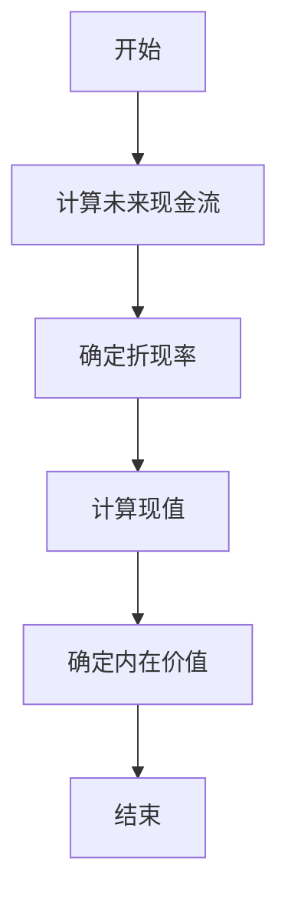
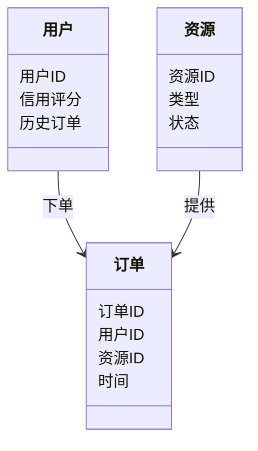

                 


# 格雷厄姆特价股票理论在共享经济产业中的应用

## 关键词：
格雷厄姆，特价股票，价值投资，共享经济，内在价值，安全边际，定价策略

## 摘要：
本文探讨了格雷厄姆的价值投资理论如何应用于共享经济产业。通过分析安全边际和内在价值等核心概念，结合共享经济的商业模式，提出优化定价策略的方法，以实现资产的有效管理和风险控制。文章结合实际案例，展示了理论在实践中的应用，并提出了未来的发展方向。

---

## 第1章：格雷厄姆特价股票理论概述

### 1.1 格雷厄姆特价股票理论的核心概念
- **价值投资**：寻找市场价格低于内在价值的股票，长期持有。
- **内在价值**：企业未来现金流的现值，是投资决策的基础。
- **安全边际**：市场价格与内在价值的差距，提供风险缓冲。

### 1.2 共享经济的基本概念
- **共享经济**：通过技术平台，将闲置资源进行共享，提高资源利用率。
- **主要模式**：P2P平台、B2C平台、B2B平台。
- **现状与趋势**：普及迅速，涉及交通、住宿、办公等领域。

### 1.3 结合点与优势
- **定价策略优化**：基于供需波动和资源特性，制定动态价格。
- **资产优化配置**：通过价值评估，合理分配资源。
- **风险控制**：利用安全边际，降低市场波动带来的影响。

---

## 第2章：核心概念与联系

### 2.1 核心概念对比分析
- **安全边际**：保护投资者免受价格波动影响，增强投资信心。
- **内在价值评估**：资源定价的科学依据，确保定价合理性。
- **投资组合管理**：优化资源配置，提高整体收益。

#### 2.1.1 安全边际与风险控制
- **案例分析**：某共享办公空间的安全边际计算，确保在价格波动中保持盈利。

### 2.2 ER实体关系图
```mermaid
erDiagram
    user {
        类别 用户ID
        用户名
        联系方式
    }
    resource {
        资源ID
        类型
        状态
    }
    order {
        订单ID
        用户ID
        资源ID
        订单时间
    }
    user --> order : 下单
    resource --> order : 提供资源
```

---

## 第3章：算法原理讲解

### 3.1 格雷厄姆理论的算法实现

#### 3.1.1 内在价值评估算法


#### 3.1.2 安全边际计算代码
```python
def calculate_intrinsic_value(cash_flows, discount_rate):
    present_value = sum(cash_flow / (1 + discount_rate)**i for i, cash_flow in enumerate(cash_flows))
    return present_value

def calculate_margin_of_safety(price, intrinsic_value):
    return intrinsic_value - price
```

---

## 第4章：系统分析与架构设计

### 4.1 问题场景介绍
- **定价问题**：动态定价策略的制定。
- **资源分配**：如何优化资源分配，提高利用率。

### 4.2 系统功能设计
- **领域模型Mermaid类图**


### 4.3 架构设计


---

## 第5章：项目实战

### 5.1 案例分析：滴滴出行的定价策略
- **动态定价模型**：基于供需和时间因素调整价格。
- **优化建议**：利用安全边际，降低价格波动带来的风险。

---

## 第6章：总结与展望

### 6.1 小结
- 格雷厄姆理论为共享经济提供了科学的定价和风险管理方法。
- 技术实现方面，算法和系统设计是关键。

### 6.2 未来展望
- **技术发展**：AI和大数据在价值评估中的应用。
- **商业模式创新**：结合区块链技术，提升透明度和信任度。

---

## 最佳实践 Tips

- **数据驱动决策**：依赖准确的数据进行价值评估和定价。
- **持续优化**：根据市场反馈，不断调整模型参数。
- **风险管理**：定期评估安全边际，确保投资稳健。

---

通过本文的分析，格雷厄姆的理论为共享经济的定价和资源管理提供了新的视角。未来，随着技术的进步，这种结合将更加深入，推动共享经济的持续发展。

