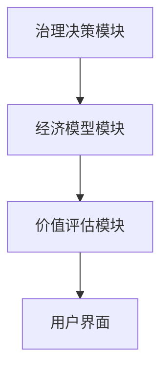

                 


# 格雷厄姆特价股票理论在去中心化自治组织(DAO)时代的新思考

> 关键词：格雷厄姆投资理论、去中心化自治组织、价值评估、治理机制、区块链技术

> 摘要：本文探讨了格雷厄姆的投资理论在去中心化自治组织（DAO）环境下的新应用，分析了DAO的治理结构、经济模型以及如何通过格雷厄姆的安全边际和价值投资原则来优化DAO的治理和投资策略。文章结合了实际案例和数学模型，详细阐述了在DAO时代如何运用格雷厄姆理论进行有效的价值评估和投资决策。

---

## 第1章：背景介绍

### 1.1 格雷厄姆投资理论概述

格雷厄姆的投资理论是价值投资的基石，强调以安全边际为核心，寻找被市场低估的投资标的。其核心思想包括：

1. **安全边际**：买入价格低于内在价值，以降低投资风险。
2. **价值评估**：通过基本面分析确定企业的内在价值。
3. **防御性投资**：避免高风险投资，追求长期稳定的收益。

### 1.2 去中心化自治组织（DAO）概述

DAO是基于区块链技术的去中心化组织，通过智能合约实现自治治理。其特点包括：

1. **去中心化**：决策权分散在社区成员手中。
2. **透明性**：所有交易和决策记录在区块链上，公开透明。
3. **抗审查性**：无法被单点控制或审查。

### 1.3 格雷厄姆理论与DAO的结合背景

随着区块链技术的发展，DAO逐渐成为新的组织形式，其治理和经济模型需要借鉴传统投资理论进行优化。格雷厄姆的理论为DAO的价值评估和风险管理提供了新的视角。

---

## 第2章：DAO的核心概念与结构

### 2.1 DAO的治理机制

DAO的治理机制是其运作的核心，主要包括：

1. **投票机制**：通过代币持有者的投票进行决策。
2. **治理角色**：分为提案者、执行者和监督者。
3. **激励机制**：通过代币奖励激励参与者。

### 2.2 DAO的经济模型

DAO的经济模型通常包括：

1. **代币发行**：通过ICO或社区贡献分配代币。
2. **代币经济**：代币的价值与DAO的治理和经济活动紧密相关。
3. **激励机制**：通过代币奖励激励社区参与。

### 2.3 格雷厄姆理论与DAO的结合

格雷厄姆的理论在DAO中的应用主要体现在：

1. **价值评估**：通过格雷厄姆的内在价值公式评估DAO的代币价值。
2. **风险管理**：利用安全边际的概念降低投资风险。
3. **长期投资**：鼓励长期持有，避免短期波动。

---

## 第3章：格雷厄姆理论在DAO中的应用

### 3.1 格雷厄姆的安全边际在DAO中的应用

安全边际是格雷厄姆理论的核心，其在DAO中的应用包括：

1. **价格与价值的对比**：通过比较代币的价格和内在价值，寻找低估的标的。
2. **风险管理**：通过设定安全边际，降低投资风险。
3. **市场波动应对**：在市场波动中，安全边际提供了缓冲空间。

### 3.2 格雷厄姆的价值评估在DAO中的应用

格雷厄姆的价值评估方法在DAO中可以用于：

1. **代币估值**：通过基本面分析评估代币的内在价值。
2. **项目选择**：筛选具有长期增长潜力的DAO项目。
3. **投资决策**：基于价值评估制定投资策略。

### 3.3 格雷厄姆的防御性投资在DAO中的应用

防御性投资在DAO中的应用包括：

1. **低风险投资**：选择具有稳定收益的DAO项目。
2. **分散投资**：通过投资多个DAO项目分散风险。
3. **长期持有**：避免短期波动，追求长期收益。

---

## 第4章：数学模型与算法

### 4.1 格雷厄姆内在价值公式

格雷厄姆的内在价值公式为：

$$
\text{内在价值} = \frac{\text{净利润} \times (5 + P)}{P}
$$

其中，P为市盈率，净利润为企业净利润。

### 4.2 DAO代币估值模型

基于格雷厄姆理论的DAO代币估值模型如下：

$$
\text{代币价值} = \frac{\text{DAO总收入} \times (5 + \text{市盈率})}{\text{总代币数}}
$$

### 4.3 安全边际计算

安全边际的计算公式为：

$$
\text{安全边际} = \text{内在价值} - \text{市场价格}
$$

---

## 第5章：系统架构与实现

### 5.1 系统架构设计

DAO治理系统的架构如下：



### 5.2 治理协议的设计

治理协议的设计包括提案提交、投票通过、执行和监督四个阶段：

1. **提案提交**：提案者提交治理提案。
2. **投票通过**：代币持有者投票决定是否通过提案。
3. **执行**：通过的提案由智能合约自动执行。
4. **监督**：监督者确保提案执行符合预期。

### 5.3 系统接口设计

系统接口设计包括：

1. 提案提交接口：允许提案者提交治理提案。
2. 投票接口：代币持有者进行投票。
3. 执行接口：自动执行通过的提案。
4. 监督接口：监督者监控提案执行情况。

---

## 第6章：项目实战与案例分析

### 6.1 项目环境安装

安装必要的工具和库：

1. 区块链开发环境（如Solidity、Web3.js）。
2. 智能合约编译工具（如Remix）。
3. 区块链测试网络（如Ropsten）。

### 6.2 核心实现代码

以下是一个简单的DAO治理智能合约示例：

```solidity
// SPDX-License-Identifier: MIT
pragma solidity ^0.8.0;

contract DAO {
    mapping(address => uint) public balances;
    uint public totalSupply;
    uint public pricePerUnit;

    function mint(address recipient, uint amount) public {
        balances[recipient] += amount;
        totalSupply += amount;
    }

    function burn(address recipient, uint amount) public {
        balances[recipient] -= amount;
        totalSupply -= amount;
    }

    function getPrice() public view returns (uint) {
        return pricePerUnit;
    }
}
```

### 6.3 实际案例分析

以一个DAO项目为例，分析其治理结构和代币经济：

1. **治理结构**：采用代币持有者投票制，提案通过需要超过60%的投票支持。
2. **经济模型**：代币总量固定，每年释放一定比例的代币用于激励。
3. **价值评估**：通过格雷厄姆公式评估代币的内在价值，寻找低估的标的。

---

## 第7章：总结与展望

### 7.1 总结

本文探讨了格雷厄姆投资理论在DAO环境下的新应用，分析了DAO的治理结构、经济模型，并提出了基于格雷厄姆理论的价值评估和投资策略。通过实际案例和数学模型的分析，展示了如何在DAO时代优化投资决策。

### 7.2 展望

未来的研究方向包括：

1. **模型优化**：进一步完善DAO的价值评估模型。
2. **技术创新**：探索新的区块链技术在DAO治理中的应用。
3. **实践应用**：将格雷厄姆理论应用到更多实际DAO项目中。

---

通过以上思考过程，我们可以系统地构建出这本书的目录大纲，确保内容全面、结构清晰，满足用户的需求。

