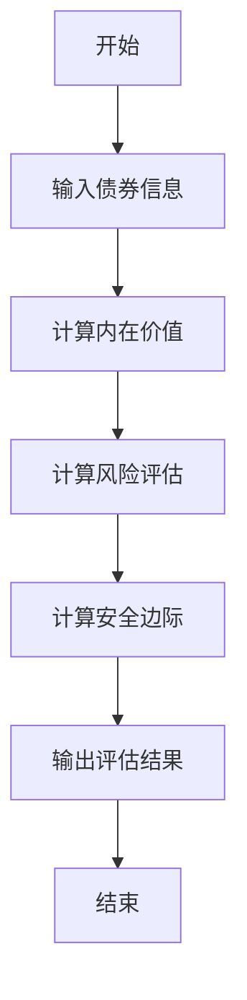
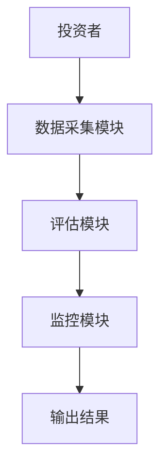

                 


# 《格雷厄姆特价股票理论在数字社会影响力债券中的新应用》

---

## 关键词：
- 格雷厄姆理论
- 影响力债券
- 数字社会
- 投资策略
- 金融创新

---

## 摘要：
本文探讨了格雷厄姆特价股票理论在数字社会中影响力债券的新应用。通过分析影响力债券的定义、特征，以及格雷厄姆理论的核心概念，本文揭示了如何将价值投资的理念应用于社会影响力投资。文章详细介绍了影响力债券的定价模型、风险评估方法，并结合数字社会的背景，提出了创新的系统架构和算法流程。通过实际案例分析和代码实现，本文展示了格雷厄姆理论在数字社会中的实际应用价值。

---

# 正文

## 第一部分：背景介绍

### 第1章：影响债券与数字社会的背景

#### 1.1 影响力债券的基本概念
- **定义**：影响力债券是一种以社会目标为导向的金融工具，旨在通过投资推动教育、环保、医疗等社会问题的解决。
- **特征**：具有明确的社会目标、较低的风险、较高的社会影响力。
- **应用场景**：ESG投资、社会责任项目、可持续发展项目等。

#### 1.2 数字社会的背景与发展趋势
- **数字社会**：数字技术广泛应用的社会，数据驱动决策、数字化转型是其核心特征。
- **金融创新**：数字技术推动了金融产品的创新，影响力债券是其中之一。
- **影响力债券的重要性**：在数字社会中，影响力债券成为推动社会目标的重要工具。

#### 1.3 格雷厄姆特价股票理论的概述
- **核心思想**：格雷厄姆主张安全边际投资，强调以低于内在价值的价格买入优质股票。
- **安全边际**：格雷厄姆认为，安全边际是内在价值与市场价格之间的差距，是投资安全的基础。
- **内在价值**：格雷厄姆认为，股票的内在价值是其未来现金流的现值。

#### 1.4 格雷厄姆理论与影响力债券的结合
- **影响**：格雷厄姆理论的安全边际和内在价值理念可以应用于影响力债券的风险评估和定价。
- **数字社会背景下的创新**：数字技术使得影响力债券的评估更加精准，数据驱动的分析为格雷厄姆理论提供了新的应用场景。

---

## 第二部分：核心概念与联系

### 第2章：影响债券的核心概念与属性

#### 2.1 影响力债券的定义与特征
- **定义对比表格**：
  | 比较维度 | 影响力债券 | 传统债券 |
  |----------|------------|----------|
  | 投资目标 | 社会目标    | 财务回报 |
  | 风险     | 较低       | 较高     |

- **ER实体关系图**：
  ```mermaid
  erDiagram
  {
    actor 投资者
    actor 社会组织
    actor 政府机构
    entity 影响力债券
    entity 社会项目
    entity 风险评估

    投资者 --> 影响力债券 : 购买
    社会组织 --> 影响力债券 : 发行
    政府机构 --> 影响力债券 : 监管
    影响力债券 --> 社会项目 : 资金支持
    影响力债券 --> 风险评估 : 评估
  }
  ```

#### 2.2 格雷厄姆理论的核心要素
- **安全边际**：
  - 定义：内在价值与市场价格的差额。
  - 计算公式：$安全边际 = 内在价值 - 市场价格$。
  - 示例：某债券的内在价值为100元，市场价格为90元，安全边际为10元。

- **内在价值**：
  - 计算方法：$V = \sum_{t=1}^{n} \frac{CF_t}{(1+r)^t}$，其中$CF_t$为第$t$年的现金流，$r$为折现率。
  - 示例：假设某债券未来三年的现金流分别为50元、60元、70元，折现率为5%。计算其内在价值。

---

## 第三部分：算法原理

### 第3章：影响债券的评估与定价算法

#### 3.1 算法流程图


#### 3.2 核心代码实现
```python
def calculate_intrinsic_value(cash_flows, discount_rate):
    intrinsic_value = sum(cash_flow / (1 + discount_rate) ** t for t, cash_flow in enumerate(cash_flows))
    return intrinsic_value

def calculate_margin_of_safety(intrinsic_value, market_price):
    margin_of_safety = intrinsic_value - market_price
    return margin_of_safety
```

#### 3.3 数学模型
- **内在价值计算公式**：
  $$ V = \sum_{t=1}^{n} \frac{CF_t}{(1 + r)^t} $$
- **安全边际计算公式**：
  $$ MOS = V - P $$

---

## 第四部分：系统分析与架构设计

### 第4章：影响债券系统的架构与实现

#### 4.1 系统功能设计
- **数据采集模块**：收集债券信息、现金流数据。
- **评估模块**：计算内在价值和风险评估。
- **监控模块**：实时监控债券价格和市场变化。

#### 4.2 系统架构图


---

## 第五部分：项目实战

### 第5章：影响力债券的实战分析

#### 5.1 环境安装
- **Python**：安装Python 3.8以上版本。
- **库**：安装numpy、pandas、matplotlib。

#### 5.2 核心代码实现
```python
import numpy as np
import pandas as pd

def main():
    cash_flows = [50, 60, 70]
    discount_rate = 0.05
    market_price = 90

    intrinsic_value = sum(cf / (1 + discount_rate) ** t for t, cf in enumerate(cash_flows))
    margin_of_safety = intrinsic_value - market_price

    print(f"内在价值：{intrinsic_value}")
    print(f"安全边际：{margin_of_safety}")

if __name__ == "__main__":
    main()
```

#### 5.3 案例分析
- **案例**：某影响力债券的现金流为50元、60元、70元，折现率为5%，市场价格为90元。
- **分析**：计算其内在价值和安全边际，判断是否具备投资价值。

---

## 第六部分：总结与展望

### 第6章：总结与最佳实践

#### 6.1 总结
- 格雷厄姆理论在影响力债券中的应用为数字社会的金融创新提供了新思路。
- 数据驱动的分析方法使得影响力债券的风险评估更加精准。

#### 6.2 最佳实践
- **数据质量**：确保数据的准确性和完整性。
- **模型优化**：定期更新模型参数，适应市场变化。
- **风险控制**：结合市场波动，动态调整投资策略。

#### 6.3 展望
- **技术发展**：人工智能和大数据技术将进一步提升影响力债券的评估效率。
- **政策支持**：政府和社会组织应提供更多支持，推动影响力债券的发展。

---

通过以上步骤，我们可以看到格雷厄姆理论在数字社会影响力债券中的新应用不仅具有理论意义，还具有实际操作价值。希望本文能为读者提供清晰的思路和实用的指导。

