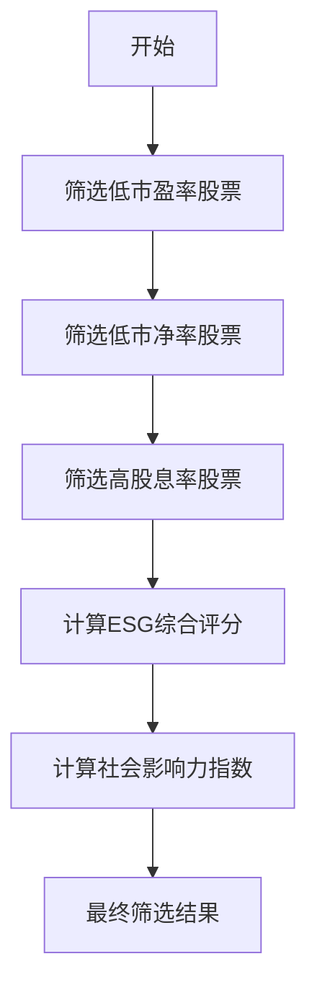

                 


# 格雷厄姆特价股票理论在数字社会影响力投资中的新应用

> **关键词**：格雷厄姆、价值投资、影响力投资、数字社会、ESG、股票筛选、投资策略  
> **摘要**：本文探讨了本杰明·格雷厄姆的价值投资理论在数字社会中的新应用，特别是如何将其与影响力投资相结合。通过分析数字社会的特点、影响力投资的核心概念以及格雷厄姆理论的数学模型，本文提出了一种新的股票筛选方法，旨在在追求财务回报的同时，实现社会影响力最大化。

---

## 第1章：背景介绍

### 1.1 格雷厄姆投资理论的起源
格雷厄姆是价值投资的鼻祖，其理论的核心在于寻找市场价格低于内在价值的股票，即“特价”股票。他认为，市场先生的情绪波动为投资者提供了廉价买入优质资产的机会。格雷厄姆的理论强调基本面分析，重点关注市盈率（P/E）、市净率（P/B）和股息率等指标。

### 1.2 数字社会与影响力投资的背景
数字社会是指以数字技术为核心驱动力的社会形态，其特点是信息化、网络化和智能化。在数字社会中，影响力投资逐渐成为一种重要的投资方式，投资者不仅关注财务回报，还关注企业对社会、环境和治理（ESG）的影响。

### 1.3 格雷厄姆理论与数字社会的结合
数字社会为格雷厄姆理论提供了新的应用场景。通过数字化工具，投资者可以更高效地筛选符合影响力的“特价”股票。同时，影响力投资的兴起也为格雷厄姆理论注入了新的活力。

---

## 第2章：核心概念与联系

### 2.1 格雷厄姆理论的核心要素
格雷厄姆理论的核心要素包括：
1. **低市盈率（P/E）**：市盈率越低，意味着股票的市场价格相对于盈利水平越低，投资价值越大。
2. **低市净率（P/B）**：市净率越低，意味着股票的市场价格相对于账面价值越低，投资价值越大。
3. **高股息率**：股息率越高，意味着公司回报股东的能力越强。

### 2.2 影响力投资的核心要素
影响力投资的核心要素包括：
1. **环境、社会和治理（ESG）指标**：包括碳排放、员工待遇、公司治理透明度等。
2. **社会影响力评估标准**：包括企业对社会问题（如教育、医疗、环保）的贡献程度。
3. **影响力量化方法**：通过指标体系将社会影响力转化为可量化的数据。

### 2.3 格雷厄姆理论与影响力投资的结合
结合格雷厄姆理论和影响力投资的核心要素，可以构建一个综合评估模型，既考虑股票的估值指标，又考虑企业的社会影响力。

---

## 第3章：算法原理与数学模型

### 3.1 格雷厄姆理论的数学模型
格雷厄姆理论的核心指标可以用以下公式表示：
1. 市盈率（P/E）：
$$ P/E = \frac{\text{股票价格}}{\text{每股盈利}} $$
2. 市净率（P/B）：
$$ P/B = \frac{\text{股票价格}}{\text{每股净资产}} $$
3. 股息率：
$$ \text{股息率} = \frac{\text{每股股息}}{\text{股票价格}} $$

### 3.2 影响力投资的数学模型
影响力投资的量化可以通过以下公式实现：
1. ESG综合评分：
$$ ESG\ \text{评分} = \alpha \cdot E + \beta \cdot S + \gamma \cdot G $$
其中，E、S、G分别为环境、社会和治理指标的评分，$\alpha$、$\beta$、$\gamma$为权重系数。
2. 社会影响力指数：
$$ \text{社会影响力指数} = \sum_{i=1}^{n} w_i \cdot I_i $$
其中，$w_i$为第$i$个影响力的权重，$I_i$为对应的影响力指标。

### 3.3 综合筛选模型
结合格雷厄姆理论和影响力投资的综合筛选模型如下：
1. 筛选标准：
   - 市盈率（P/E）低于行业平均水平。
   - 市净率（P/B）低于行业平均水平。
   - 股息率高于行业平均水平。
   - ESG综合评分高于行业平均水平。
   - 社会影响力指数排名靠前。
2. 筛选流程（使用Mermaid流程图表示）：



---

## 第4章：系统分析与架构设计

### 4.1 系统功能设计
影响力投资评估系统需要实现以下功能：
1. 数据采集：获取股票的基本面数据和ESG数据。
2. 指标计算：计算市盈率、市净率、股息率等指标。
3. 综合评估：结合格雷厄姆理论和影响力投资模型，计算综合评分。
4. 结果展示：以可视化方式呈现筛选结果。

### 4.2 系统架构设计
使用Mermaid架构图表示系统架构：


### 4.3 系统接口设计
系统接口设计如下：
1. 数据接口：从数据源获取股票数据。
2. 计算接口：调用数学模型计算综合评分。
3. 展示接口：将结果以图表形式展示。

---

## 第5章：项目实战

### 5.1 环境安装
需要安装以下工具：
1. Python 3.x
2. NumPy 和 Pandas 库
3. Matplotlib 或 Seaborn 绘图库

### 5.2 核心实现代码
以下是一个Python实现的股票筛选代码示例：

```python
import pandas as pd
import numpy as np

# 数据加载
df = pd.read_csv('stock_data.csv')

# 格雷厄姆筛选条件
def graham_screen(df):
    # 计算市盈率和市净率
    df['P/E'] = df['Price'] / df['Earnings']
    df['P/B'] = df['Price'] / df['Book Value']
    df['Dividend Yield'] = df['Dividend'] / df['Price']
    
    # 筛选条件
    mask = (df['P/E'] < df['P/E'].mean()) & \
           (df['P/B'] < df['P/B'].mean()) & \
           (df['Dividend Yield'] > df['Dividend Yield'].mean())
    return df[mask]

# 影响力评估
def影响力评分(df):
    # 计算ESG评分
    df['ESG Score'] = 0.4 * df['E'] + 0.3 * df['S'] + 0.3 * df['G']
    # 计算社会影响力指数
    df['Social Impact Index'] = 0.2 * df['E'] + 0.3 * df['S'] + 0.5 * df['G']
    return df

# 筛选结果
selected_stocks = graham_screen(df)
selected_stocks = 影响力评分(selected_stocks)
print(selected_stocks.head())
```

### 5.3 案例分析
以某科技公司为例，假设其数据如下：

| 股票代码 | Price | Earnings | Book Value | Dividend | E | S | G |
|----------|-------|----------|------------|----------|---|---|---|
| ABC      | 50    | 10       | 30         | 2        | 80| 70| 90|

通过代码计算：
- P/E = 50 / 10 = 5
- P/B = 50 / 30 ≈ 1.67
- Dividend Yield = 2 / 50 = 4%
- ESG Score = 0.4*80 + 0.3*70 + 0.3*90 = 79
- Social Impact Index = 0.2*80 + 0.3*70 + 0.5*90 = 81

该股票符合筛选条件，最终被选中。

---

## 第6章：小结与注意事项

### 6.1 小结
本文通过分析格雷厄姆理论和影响力投资的核心要素，提出了一种新的股票筛选方法。该方法结合了传统估值指标和现代影响力指标，为投资者提供了更全面的投资策略。

### 6.2 注意事项
1. 数据质量：确保数据来源可靠，避免因数据错误导致筛选结果偏差。
2. 模型调整：根据市场变化和企业实际情况，动态调整筛选模型的参数。
3. 风险管理：即使筛选出优质股票，也需注意分散投资，降低风险。

### 6.3 最佳实践
- 定期更新模型，适应市场变化。
- 结合技术分析，进一步优化投资策略。
- 关注企业的长期影响力，而不仅仅是短期财务表现。

---

## 第7章：拓展阅读

建议进一步阅读以下内容：
1. 格雷厄姆的经典著作《证券分析》。
2. 环境、社会和治理（ESG）相关报告。
3. 数字社会与影响力投资的最新研究成果。

---

通过本文的分析和实践，读者可以更好地理解格雷厄姆理论在数字社会影响力投资中的新应用，并将其应用于实际投资中。

