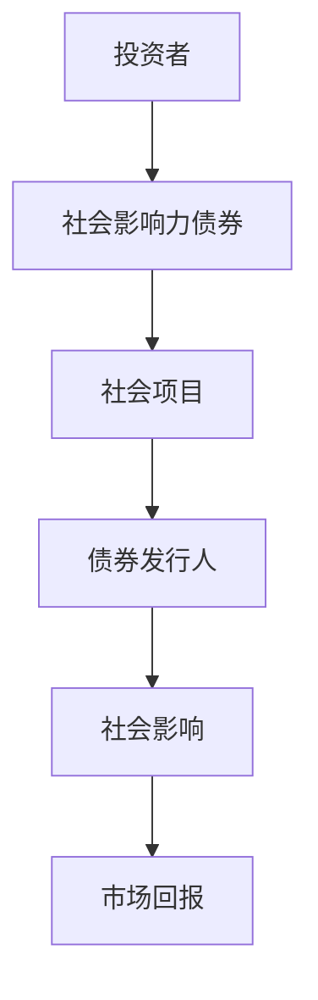
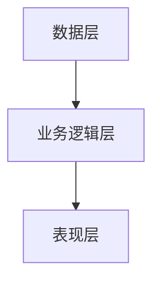

                 


# 格雷厄姆特价股票理论在社会影响力债券中的新应用

## 关键词：格雷厄姆理论，社会影响力债券，价值投资，金融创新，影响力投资

## 摘要：本文探讨了将格雷厄姆的价值投资理论应用于社会影响力债券的创新方法。通过分析社会影响力债券的特性，结合格雷厄姆理论的核心原理，构建了新的评估模型，并通过实际案例验证了其可行性。

---

# 第一部分: 格雷厄姆特价股票理论与社会影响力债券的背景介绍

## 第1章: 格雷厄姆投资理论的核心概念

### 1.1 价值投资的基本原理
价值投资是一种以低于内在价值的价格购买优质资产的投资策略。格雷厄姆在其著作《证券分析》中提出，内在价值是决定股票长期价值的关键因素。他强调安全边际的重要性，即购买价格应低于内在价值，以降低风险。

### 1.2 特价股票的定义与特征
格雷厄姆将特价股票定义为市场价格低于其内在价值的股票。其特征包括低市盈率、低市净率和高股息率等，这些指标帮助投资者识别被市场低估的股票。

### 1.3 格雷厄姆投资策略的历史演变
格雷厄姆的投资策略从早期的“捡烟蒂”方法逐渐演变为更加系统化和数学化的分析。他的理论对巴菲特等投资者产生了深远影响，成为价值投资的基石。

## 第2章: 社会影响力债券的基本概念

### 2.1 社会影响力债券的定义
社会影响力债券是一种将社会影响与金融回报相结合的投资工具。债券发行人通过投资项目产生社会效益，投资者通过购买债券获得财务回报。

### 2.2 社会影响力债券与传统债券的区别
与传统债券相比，社会影响力债券强调社会影响的量化评估，如减少碳排放、提高教育水平等。其回报不仅包括财务收益，还包括社会效益的提升。

### 2.3 社会影响力债券的市场现状
随着ESG投资的兴起，社会影响力债券在金融市场中的份额逐年增长。投资者越来越关注社会影响力债券带来的双重回报。

## 第3章: 格雷厄姆理论与社会影响力债券的结合背景

### 3.1 当前金融市场的发展趋势
全球金融市场正向多元化和可持续方向发展，投资者更倾向于选择具有社会价值的投资项目。

### 3.2 社会影响力投资的兴起
社会影响力投资成为全球关注的焦点，投资者希望通过投资实现社会价值和财务回报的双重目标。

### 3.3 格雷厄姆理论在新领域的应用潜力
格雷厄姆的价值投资理论以其科学性和实用性，为社会影响力债券的评估提供了新的思路。

---

# 第二部分: 核心概念与联系

## 第4章: 核心概念的原理分析

### 4.1 格雷厄姆理论的核心原理
格雷厄姆的内在价值公式是其理论的核心，公式为：
$$
内在价值 = \frac{每股收益 \times (1 + 增长率)}{贴现率 - 增长率}
$$

### 4.2 社会影响力债券的属性特征对比
通过对比分析发现，社会影响力债券在风险和收益方面具有独特性，适合长期价值投资者。

### 4.3 实体关系图
以下是格雷厄姆理论与社会影响力债券的实体关系图：


---

# 第三部分: 格雷厄姆理论在社会影响力债券中的算法原理

## 第5章: 格雷厄姆价值评估模型

### 5.1 格雷厄姆模型的数学公式
格雷厄姆模型通过以下公式计算内在价值：
$$
内在价值 = \frac{每股收益 \times (1 + 增长率)}{贴现率 - 增长率}
$$

### 5.2 案例分析
以某社会影响力债券为例，假设每股收益为10元，增长率2%，贴现率为10%，计算其内在价值：
$$
内在价值 = \frac{10 \times (1 + 0.02)}{0.10 - 0.02} = 102.04元
$$

---

# 第四部分: 系统分析与架构设计方案

## 第6章: 项目介绍

### 6.1 项目背景
本项目旨在将格雷厄姆理论应用于社会影响力债券的评估，构建一个量化模型。

## 第7章: 系统功能设计

### 7.1 数据采集模块
负责收集债券发行人、项目和社会影响数据。

### 7.2 数据处理模块
对数据进行清洗和预处理，确保模型输入的准确性。

### 7.3 数据分析模块
应用格雷厄姆模型进行内在价值评估。

### 7.4 数据展示模块
以可视化形式呈现评估结果。

## 第8章: 系统架构设计

### 8.1 分层架构图


## 第9章: 接口设计

### 9.1 接口描述
定义数据接口，确保各模块之间的通信。

---

# 第五部分: 项目实战

## 第10章: 环境安装

### 10.1 Python环境安装
安装Python和必要的库，如pandas和numpy。

## 第11章: 核心代码实现

### 11.1 代码实现
以下是核心代码示例：
```python
import pandas as pd

def calculate_intrinsic_value(eps, growth_rate, discount_rate):
    return (eps * (1 + growth_rate)) / (discount_rate - growth_rate)

# 示例数据
eps = 10
growth_rate = 0.02
discount_rate = 0.10

intrinsic_value = calculate_intrinsic_value(eps, growth_rate, discount_rate)
print(f"内在价值为：{intrinsic_value}元")
```

## 第12章: 案例分析

### 12.1 案例背景
分析某社会影响力债券的投资价值。

### 12.2 分析结果
通过模型计算得出该债券的内在价值，为投资者提供决策依据。

---

# 第六部分: 总结与展望

## 第13章: 总结

### 13.1 核心内容回顾
总结格雷厄姆理论在社会影响力债券中的应用，强调其创新性和实用性。

## 第14章: 展望

### 14.1 未来发展方向
探讨该理论在其他金融领域的应用潜力，以及技术的进一步优化。

---

# 第七部分: 最佳实践与注意事项

## 第15章: 最佳实践 tips

### 15.1 选择优质债券的建议
建议投资者关注债券发行人的社会影响力和财务健康状况。

## 第16章: 注意事项

### 16.1 模型的局限性
指出模型假设的局限性，提醒投资者注意市场波动和政策风险。

## 第17章: 拓展阅读

### 17.1 推荐书籍
推荐相关书籍和论文，帮助读者深入学习。

---

通过以上步骤，我们系统地将格雷厄姆理论应用于社会影响力债券的评估，为投资者提供了新的思路和方法。这一创新不仅丰富了价值投资的理论体系，也为社会影响力投资的实践提供了科学依据。

