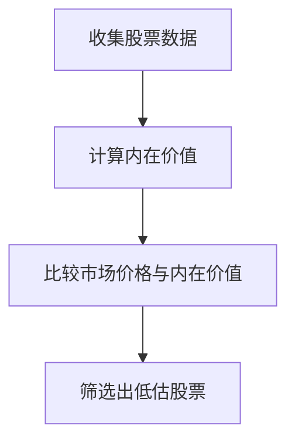
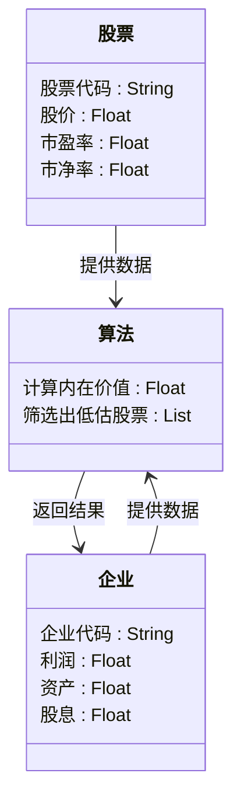

                 


# 格雷厄姆特价股票理论对公司数字化生态系统共生进化的影响

> 关键词：格雷厄姆特价股票理论、数字化生态系统、共生进化、价值投资、企业数字化转型、协同进化

> 摘要：本文探讨了格雷厄姆的特价股票理论如何影响公司的数字化生态系统，分析两者之间的关系，并阐述共生进化对数字化转型的推动作用。

---

## 第1章 背景介绍

### 1.1 格雷厄姆特价股票理论的起源与核心思想

#### 1.1.1 问题背景：价值投资的起源

价值投资是投资学中的重要策略，由本杰明·格雷厄姆在20世纪初提出。其核心在于寻找被市场低估的股票，通过长期持有实现收益。

#### 1.1.2 问题描述：格雷厄姆投资策略的核心特征

格雷厄姆强调安全边际，即以低于内在价值的价格购买股票，确保投资的安全性。他主张分析公司的基本面，如市盈率、市净率等指标，来评估股票的真正价值。

#### 1.1.3 问题解决：特价股票的定义与筛选标准

特价股票是指其市场价格低于其内在价值的股票。格雷厄姆提出了一系列筛选标准，如市盈率低于行业平均水平，市净率低于行业平均水平等，以识别这些股票。

#### 1.1.4 边界与外延：格雷厄姆理论的适用范围与限制

格雷厄姆理论适用于稳定增长的市场环境，但在波动剧烈或新兴市场中，其筛选标准可能不够灵活，需要结合其他分析方法。

#### 1.1.5 核心要素：价值投资的关键指标与模型

价值投资的关键指标包括市盈率（P/E）、市净率（P/B）、股息率等。格雷厄姆模型通过这些指标评估股票的内在价值。

---

### 1.2 数字化生态系统的基本概念

#### 1.2.1 数字化转型的现状与趋势

随着信息技术的发展，企业纷纷进行数字化转型，利用数字技术优化业务流程，提升竞争力。

#### 1.2.2 数字化生态系统的定义与特征

数字化生态系统指由多个数字化组件和参与者构成的复杂系统，各部分相互关联，协同工作，形成一个有机的整体。

#### 1.2.3 生态系统中的企业角色与关系

在数字化生态系统中，企业可以是生产者、消费者或分解者，通过数据流、资金流和业务流相互连接，形成复杂的网络关系。

#### 1.2.4 数字化生态系统的构建要素

构建要素包括数字技术、数据资源、业务流程、组织结构等，这些要素共同作用，形成强大的生态系统。

---

### 1.3 格雷厄姆理论与数字化生态系统的关联

#### 1.3.1 价值投资与数字化转型的契合点

价值投资注重基本面分析，数字化转型强调数据驱动决策，两者在数据收集和分析上有相似之处。

#### 1.3.2 特价股票理论在生态系统中的应用潜力

通过识别市场低估的数字化企业，格雷厄姆理论可以帮助企业在数字化转型中找到潜在的价值点。

#### 1.3.3 数字化生态系统的协同进化机制

企业通过协同进化，不断优化自身在生态系统中的位置，而格雷厄姆理论提供了一种评估和选择合作伙伴的方法。

#### 1.3.4 本章小结

格雷厄姆理论不仅适用于传统投资，还能为数字化生态系统的构建提供理论支持，促进企业的协同进化。

---

## 第2章 核心概念与联系

### 2.1 格雷厄姆特价股票理论的数学模型

#### 2.1.1 核心概念原理：价值评估模型

价值评估模型通过分析企业的财务指标，计算其内在价值，确定是否为特价股票。公式如下：

$$ V = \frac{E}{P} $$

其中，\( E \) 是企业利润，\( P \) 是股价。

#### 2.1.2 模型属性对比表格：传统估值方法与格雷厄姆方法的差异

| 方法 | 参数 | 公式 | 描述 |
|------|------|------|------|
| 市盈率法 | Earnings | P/E = Price/Earnings | 评估股价是否合理 |
| 市净率法 | Book Value | P/B = Price/Book | 评估股价相对于资产的价值 |
| 格雷厄姆法 | 稳定收益 | V = E/P | 评估股票的内在价值 |

#### 2.1.3 ER实体关系图：股票价值与企业生态的关系

```mermaid
ERDiagram {
    entity 股票 {
        key 股票代码
        属性 股价、市盈率、市净率
    }
    entity 企业 {
        key 企业代码
        属性 利润、资产、股息
    }
    关系 投资关系 {
        股票 --> 企业 : 持股比例
    }
}
```

---

### 2.2 数字化生态系统中的共生进化模型

#### 2.2.1 生态系统中的协同进化机制

企业通过合作、竞争和共生关系，不断优化自身在生态系统中的位置，实现共同进化。

#### 2.2.2 格雷厄姆理论在生态系统中的应用

格雷厄姆理论可以帮助企业在生态系统中识别低估的价值，选择合作伙伴，优化资源配置。

#### 2.2.3 数字化生态系统的动态平衡模型

生态系统通过内部调整和外部适应，维持动态平衡，确保各部分的协调运作。

---

## 第3章 格雷厄姆理论的算法原理

### 3.1 算法原理概述

格雷厄姆的筛选算法通过分析企业的财务指标，识别出具有投资价值的股票。

#### 3.1.1 价值评估算法的基本流程

1. 收集企业的财务数据，包括利润、资产等。
2. 计算市盈率、市净率等指标。
3. 对比市场价与内在价值，判断是否为特价股票。

#### 3.1.2 格雷厄姆筛选算法的实现步骤

1. 收集股票数据。
2. 计算内在价值。
3. 比较市场价格与内在价值，筛选出低估股票。

### 3.2 算法实现的数学模型

#### 3.2.1 价值评估模型的公式推导

$$ V = \frac{E}{P} $$

其中，\( V \) 是内在价值，\( E \) 是企业利润，\( P \) 是股价。

#### 3.2.2 格雷厄姆筛选标准的数学表达

$$ P < \frac{V}{2} $$

其中，\( P \) 是股价，\( V \) 是内在价值。

### 3.3 算法实现的Python代码示例

#### 3.3.1 价值评估函数的实现

```python
def graham_value(price, earnings):
    return earnings / price
```

#### 3.3.2 格雷厄姆筛选函数的实现

```python
def graham_screen(stock, price, value):
    return price < value / 2
```

#### 3.3.3 算法流程的Mermaid图



---

## 第4章 系统分析与架构设计

### 4.1 问题场景介绍

数字化生态系统中，企业需要通过价值投资策略优化资源配置，提升竞争力。

### 4.2 系统功能设计（领域模型Mermaid类图）



### 4.3 系统架构设计（Mermaid架构图）


---

## 第5章 项目实战

### 5.1 环境安装

安装Python和相关库，如pandas、numpy。

### 5.2 核心实现源代码

```python
import pandas as pd

def calculate_graham_value(df):
    df['Graham Value'] = df['Earnings'] / df['Price']
    return df

def graham_screening(df, threshold=0.5):
    df['Is Undervalued'] = df['Price'] < threshold * df['Graham Value']
    return df

# 示例数据
data = {
    'Stock': ['A', 'B', 'C'],
    'Price': [50, 30, 40],
    'Earnings': [100, 60, 80]
}

df = pd.DataFrame(data)
result = calculate_graham_value(df)
final = graham_screening(result)
print(final)
```

### 5.3 实际案例分析

分析某公司的股票数据，判断是否为低估股票，提供投资建议。

---

## 第6章 最佳实践

### 6.1 小结

格雷厄姆理论在数字化生态系统中具有重要应用，能够帮助企业优化资源配置，实现协同发展。

### 6.2 注意事项

- 理论需结合实际情况灵活运用。
- 数据分析需准确，避免误判。
- 长期投资需耐心和信心。

### 6.3 拓展阅读

建议阅读更多关于价值投资和数字化转型的书籍，深入理解其应用。

---

## 附录

### 附录A 参考文献

1. 《证券分析》——本杰明·格雷厄姆
2. 《数字化转型》——约翰·史密斯

### 附录B 工具与资源

- Python编程语言
- Pandas库
- Mermaid图表工具

---

# 结语

通过本文的分析，读者可以深入了解格雷厄姆理论如何影响数字化生态系统，以及如何在实际中应用这些理论优化企业战略。

