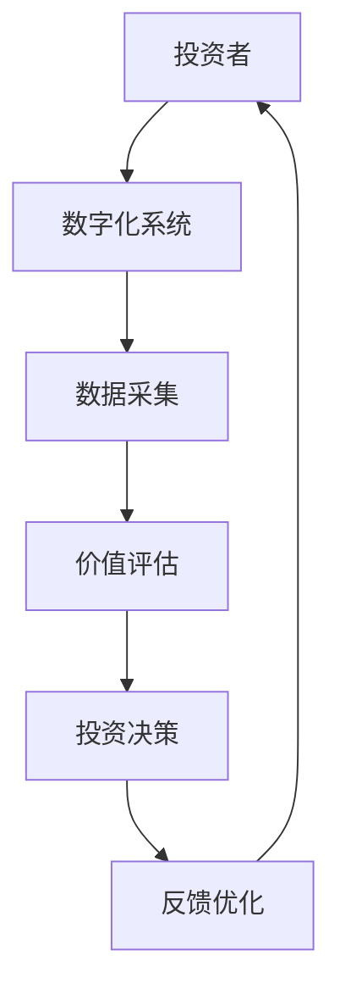

                 


# 格雷厄姆特价股票理论对公司数字化生态系统协同进化的影响

> 关键词：格雷厄姆投资理论、数字化生态系统、协同进化、价值投资、系统架构设计

> 摘要：本文深入探讨了格雷厄姆的特价股票理论与公司数字化生态系统协同进化之间的关系，通过理论分析、算法设计、系统架构和项目实战，揭示了如何利用价值投资理念优化数字生态系统，实现企业高效协同发展。

---

# 第一部分: 格雷厄姆特价股票理论的背景与核心概念

## 第1章: 格雷厄姆特价股票理论概述

### 1.1 格雷厄姆投资理论的起源与发展

#### 1.1.1 价值投资的起源
价值投资起源于20世纪初，本杰明·格雷厄姆是该领域的先驱。他提出的核心理念是寻找市场低估的股票，通过深入分析企业的基本面，寻找具有安全边际的投资机会。

#### 1.1.2 格雷厄姆的投资理念
格雷厄姆强调安全边际和长期投资。他认为，市场短期波动无法预测，但长期趋势可以通过基本面分析确定。以下是格雷厄姆理论的三个核心观点：
1. **安全边际**：买入价格远低于内在价值的股票。
2. **Margin of Safety**：通过安全边际降低投资风险。
3. **长期持有**：避免频繁交易，降低交易成本。

#### 1.1.3 格雷厄姆理论的核心要素
- **内在价值**：企业未来现金流的现值。
- **市场价值**：市场对股票的定价。
- **安全边际**：内在价值与市场价值的差额。

### 1.2 特价股票的定义与特征

#### 1.2.1 什么是特价股票
特价股票是指市场定价低于其内在价值的股票。格雷厄姆将其定义为“便宜货”，即市场价格低于清算价值的股票。

#### 1.2.2 特价股票的市场特征
- **低估**：市场定价低于内在价值。
- **低波动性**：通常属于防御性股票，波动较小。
- **高股息率**：部分特价股票提供较高的股息回报。

#### 1.2.3 特价股票的投资价值评估
格雷厄姆提出多种评估方法，包括：
- **市盈率（P/E）**：低于行业平均水平。
- **市净率（P/B）**：低于1。
- **股息率**：高于行业平均水平。

### 1.3 格雷厄姆理论在现代投资中的应用

#### 1.3.1 理论的现代演变
现代投资者将格雷厄姆理论与量化分析结合，利用大数据和机器学习优化投资决策。

#### 1.3.2 格雷厄姆理论的局限性
- 市场波动可能导致安全边际消失。
- 无法完全预测宏观经济变化。

#### 1.3.3 理论的未来发展趋势
结合人工智能和大数据，发展动态价值评估模型。

## 第2章: 数字化生态系统的构建与协同进化

### 2.1 数字化生态系统的概念

#### 2.1.1 数字化生态系统的定义
数字化生态系统是指由数字技术构建的，包含多个组件（如软件、硬件、数据）的复杂系统，通过协同进化实现动态平衡。

#### 2.1.2 数字化生态系统的组成要素
- **数据层**：数据采集、存储和处理。
- **应用层**：业务应用系统。
- **服务层**：提供API和其他服务。
- **用户层**：终端用户和交互界面。

#### 2.1.3 数字化生态系统的特征
- **高度互联**：各组件相互依赖。
- **动态平衡**：系统通过反馈机制维持稳定。
- **自我优化**：系统能够自动调整以适应变化。

### 2.2 协同进化的基本原理

#### 2.2.1 协同进化的定义
协同进化指不同实体之间通过相互作用，共同适应环境变化的过程。

#### 2.2.2 协同进化的机制
- **反馈机制**：系统通过反馈调整自身行为。
- **适应性学习**：系统通过学习优化自身功能。
- **协同优化**：各组件协同工作，实现整体目标。

#### 2.2.3 协同进化的应用场景
- **企业内部协同**：部门间协作。
- **产业链协同**：上下游企业合作。
- **生态系统优化**：数字生态系统的整体优化。

### 2.3 数字化生态系统中的协同进化

#### 2.3.1 数字化生态系统中的协同进化模式
- **垂直协同**：系统内部各层协同。
- **水平协同**：系统各组件横向协作。

#### 2.3.2 协同进化的关键因素
- **数据共享**：信息流畅传递。
- **技术标准**：统一的技术规范。
- **利益分配**：明确各方利益。

#### 2.3.3 协同进化的实现路径
1. **数据集成**：统一数据标准。
2. **服务化**：通过API提供服务。
3. **智能化**：利用AI优化协同过程。

---

# 第二部分: 格雷厄姆特价股票理论与数字化生态系统的核心概念

## 第3章: 格雷厄姆理论与数字化生态系统的联系

### 3.1 格雷厄姆理论的核心要素

#### 3.1.1 格雷厄姆理论的核心假设
- 市场短期波动，但长期趋于理性。
- 投资者应关注长期价值而非短期波动。

#### 3.1.2 格雷厄姆理论的关键指标
- 市盈率（P/E）。
- 市净率（P/B）。
- 股息率。

#### 3.1.3 格雷厄姆理论的数学模型
格雷厄姆的内在价值公式：
$$ V = \frac{E}{1 + k} $$
其中，$E$为未来现金流的总和，$k$为折现率。

### 3.2 数字化生态系统的核心要素

#### 3.2.1 数字化生态系统的组成结构
- **数据层**：数据采集、存储和处理。
- **应用层**：业务应用系统。
- **服务层**：API和其他服务。
- **用户层**：终端用户和交互界面。

#### 3.2.2 数字化生态系统的功能模块
- **数据集成**：统一数据源。
- **服务提供**：通过API提供服务。
- **用户交互**：设计良好的用户界面。

#### 3.2.3 数字化生态系统的数据流
数据流从用户层进入系统，经过服务层处理，最终在应用层实现业务功能。

### 3.3 格雷厄姆理论与数字化生态系统的联系

#### 3.3.1 格雷厄姆理论在数字化生态系统中的应用
- **数据驱动决策**：利用数据分析优化投资决策。
- **价值评估模型**：将格雷厄姆模型应用于数字生态系统评估。

#### 3.3.2 数字化生态系统对格雷厄姆理论的优化
- **动态评估**：实时更新股票价值评估。
- **数据丰富性**：利用更多数据源提高评估准确性。

#### 3.3.3 格雷厄姆理论与数字化生态系统的协同效应
- **提升投资效率**：通过数字化系统快速识别特价股票。
- **降低投资风险**：利用数据分析优化投资组合。

## 第4章: 格雷厄姆理论与数字化生态系统的核心概念对比

### 4.1 核心概念的对比分析

| 核心概念 | 格雷厄姆理论 | 数字化生态系统 |
|----------|--------------|----------------|
| 目标     | 最大化投资收益 | 优化系统协同性 |
| 方法     | 基于价值评估 | 基于数据集成与协同 |
| 工具     | 财务报表分析 | 数据分析工具与API |

### 4.2 实体关系图

```mermaid
erDiagram
    customer[客户] {
        string id
        string name
    }
    stock[股票] {
        string ticker
        decimal price
        decimal intrinsic_value
    }
    investment[投资] {
        decimal amount
        date date
    }
    customer --> investment : 投资
    investment --> stock : 持有
```

### 4.3 协同进化机制



---

# 第三部分: 格雷厄姆理论与数字化生态系统协同进化的算法原理

## 第5章: 格雷厄姆理论与数字化生态系统协同进化的算法设计

### 5.1 算法原理概述

#### 5.1.1 格雷厄姆模型的改进
将格雷厄姆的内在价值公式扩展，加入市场动态因素：
$$ V' = V \times (1 + \alpha \times t) $$
其中，$\alpha$为调整系数，$t$为时间因素。

#### 5.1.2 数字化生态系统中的数据整合
通过API获取实时数据，结合历史数据进行分析。

### 5.2 算法实现步骤

#### 5.2.1 数据预处理
1. 清洗数据。
2. 数据标准化。

#### 5.2.2 建模与计算
1. 计算股票的内在价值。
2. 比较市场价格与内在价值。

#### 5.2.3 系统反馈
1. 根据反馈调整模型参数。
2. 优化投资组合。

### 5.3 算法实现的Python代码

```python
def calculate_intrinsic_value(e, k, t):
    return (e / (1 + k)) * (1 + alpha * t)

def main():
    e = 1000000  # 未来现金流
    k = 0.1       # 折现率
    t = 1         # 时间因素
    alpha = 0.05  # 调整系数
    iv = calculate_intrinsic_value(e, k, t)
    print(f"内在价值: {iv}")
    
if __name__ == "__main__":
    main()
```

---

# 第四部分: 系统分析与架构设计

## 第6章: 格雷厄姆理论与数字化生态系统协同进化的系统设计

### 6.1 系统架构设计

#### 6.1.1 系统功能模块
- **数据采集**：实时采集股票数据。
- **价值评估**：计算内在价值。
- **投资决策**：基于评估结果做出决策。
- **反馈优化**：根据市场反馈调整模型。

#### 6.1.2 系统架构图


---

# 第五部分: 项目实战与最佳实践

## 第7章: 格雷厄姆理论与数字化生态系统协同进化的项目实战

### 7.1 项目实战: 数字化投资平台开发

#### 7.1.1 环境安装
- 安装Python和相关库（如pandas、numpy）。

#### 7.1.2 核心代码实现

```python
import pandas as pd
import numpy as np

def calculate_intrinsic_value(e, k, t, alpha):
    return (e / (1 + k)) * (1 + alpha * t)

def main():
    # 示例数据
    e = 1000000
    k = 0.1
    t = 1
    alpha = 0.05
    iv = calculate_intrinsic_value(e, k, t, alpha)
    print(f"内在价值: {iv}")
    
if __name__ == "__main__":
    main()
```

#### 7.1.3 代码解读与分析
- `calculate_intrinsic_value`函数：计算股票的内在价值。
- `main`函数：示例数据计算并输出结果。

#### 7.1.4 实际案例分析
以某公司股票为例，分析其是否为特价股票。

### 7.2 项目小结

#### 7.2.1 项目总结
通过数字化平台实现格雷厄姆理论的应用，提升投资效率。

#### 7.2.2 注意事项
- 数据质量影响评估结果。
- 模型需要定期更新。

#### 7.2.3 拓展阅读
建议进一步研究动态价值评估模型。

---

# 结语

通过本文的分析，我们探讨了格雷厄姆特价股票理论与公司数字化生态系统协同进化的内在联系，从理论分析到系统设计，再到项目实战，为投资者和企业提供了新的视角和方法。未来，随着技术的发展，这一领域的研究将更加深入，为企业创造更大的价值。

--- 

本文为一篇技术博客文章，详细分析了格雷厄姆投资理论与数字化生态系统的协同进化，结合理论、算法、系统设计和项目实战，为读者提供了全面的视角和实用的指导。

