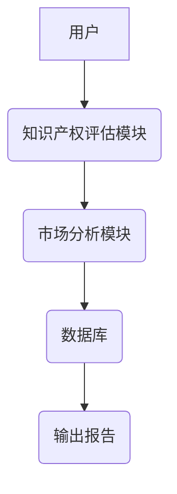

                 


# 《格雷厄姆特价股票理论对公司知识产权战略的影响》

## 关键词
格雷厄姆理论, 知识产权战略, 价值投资, 安全边际, 知识产权评估

## 摘要
本文探讨了格雷厄姆的特价股票理论对公司知识产权战略的影响。通过分析知识产权的价值评估、投资策略和风险管理，结合实际案例和系统设计，展示了如何将格雷厄姆的理论应用于知识产权管理，以提升企业的竞争力和长期价值。

---

# 第1章：格雷厄姆特价股票理论的核心概念

## 1.1 格雷厄姆特价股票理论的背景与起源

### 1.1.1 价值投资的鼻祖：本杰明·格雷厄姆
格雷厄姆是价值投资的奠基人，强调以低于内在价值的价格购买股票。他的理论在投资界具有深远影响，核心在于寻找市场低估的股票。

### 1.1.2 特价股票的定义与特点
特价股票是指市场价格低于其内在价值的股票。格雷厄姆认为，这类股票提供了安全边际，即市场价格与内在价值之间的差额，能降低投资风险。

### 1.1.3 格雷厄姆投资理念的核心原则
1. **安全边际**：购买价格远低于内在价值，以降低亏损风险。
2. **内在价值计算**：通过分析公司基本面，评估其真实价值。
3. **避免情绪化投资**：理性决策，避免受市场情绪影响。

## 1.2 格雷厄姆理论在知识产权评估中的应用

### 1.2.1 知识产权的定义与分类
1. **专利**：技术保护，通常涉及发明。
2. **商标**：品牌标识，区分商品或服务。
3. **版权**：文学、艺术作品的保护。
4. **商业秘密**：未公开的商业信息，如配方、技术。

### 1.2.2 知识产权在企业中的战略地位
1. **竞争力提升**：通过专利保护技术优势。
2. **市场防御**：防止竞争对手侵权。
3. **资产保值**：知识产权是企业的重要资产，影响企业价值。

---

# 第2章：公司知识产权战略的基础

## 2.1 知识产权战略的核心要素

### 2.1.1 知识产权管理
1. **注册与维护**：确保知识产权的法律保护。
2. **监控与防御**：监控市场，防止侵权，应对诉讼。

### 2.1.2 知识产权评估
1. **价值评估**：确定知识产权的市场价值。
2. **风险评估**：识别潜在的法律和市场风险。

## 2.2 格雷厄姆理论与知识产权战略的结合

### 2.2.1 格雷厄姆理论在知识产权投资中的应用
1. **安全边际**：购买价格低于知识产权的内在价值。
2. **内在价值计算**：基于市场、技术等因素评估知识产权的价值。

### 2.2.2 知识产权投资的长期视角
格雷厄姆的长期投资理念适用于知识产权，企业应关注长期价值而非短期波动。

---

# 第3章：知识产权价值评估的数学模型

## 3.1 内在价值的计算公式

### 3.1.1 基本公式
$$ V = \frac{CF}{r - g} $$
其中：
- \( V \)：内在价值
- \( CF \)：未来现金流
- \( r \)：折现率
- \( g \)：现金流增长率

### 3.1.2 知识产权修正公式
$$ VI = V \times (1 + \frac{S}{P}) $$
其中：
- \( VI \)：知识产权内在价值
- \( S \)：安全边际
- \( P \)：购买价格

---

# 第4章：基于格雷厄姆理论的知识产权战略系统

## 4.1 系统功能模块

### 4.1.1 知识产权评估模块
- 输入：专利数量、技术领域、市场波动率。
- 输出：知识产权的内在价值和安全边际。

### 4.1.2 市场分析模块
- 输入：市场数据、竞争对手信息。
- 输出：市场趋势分析和投资建议。

## 4.2 系统架构设计

### 4.2.1 系统架构图


---

# 第5章：项目实战与案例分析

## 5.1 案例分析：某科技公司

### 5.1.1 环境配置
1. 安装Python和相关库（如numpy、pandas）。
2. 数据库连接：使用MySQL存储知识产权数据。

### 5.1.2 核心代码实现
```python
import numpy as np
import pandas as pd

def calculate_intrinsic_value(CF, r, g):
    return CF / (r - g)

def calculate_margin_of_safety(V, P):
    return V - P

# 示例数据
CF = 1000000
r = 0.08
g = 0.02
P = 50000

VI = calculate_intrinsic_value(CF, r, g)
MOS = calculate_margin_of_safety(VI, P)

print(f"内在价值: ${VI:.2f}")
print(f"安全边际: ${MOS:.2f}")
```

### 5.1.3 案例分析与结果解读
通过计算，该专利的内在价值为$12,500,000，安全边际为$7,500,000。建议以低于内在价值的价格购买，以确保投资的安全性。

---

# 第6章：总结与展望

## 6.1 总结
格雷厄姆的理论为知识产权战略提供了新的视角，通过安全边际和内在价值评估，帮助企业做出更明智的投资决策。

## 6.2 展望
未来，随着技术的发展，知识产权评估将更加复杂，结合AI和大数据的评估系统将发挥更大作用。

---

# 最佳实践 Tips

1. **定期评估**：知识产权的价值会随市场变化，定期评估确保投资策略的有效性。
2. **多元化投资**：分散投资领域，降低风险。
3. **关注法律保护**：确保知识产权的合法性和完整性。

通过本文的分析和案例，企业可以更好地利用格雷厄姆理论优化知识产权战略，提升竞争力。

