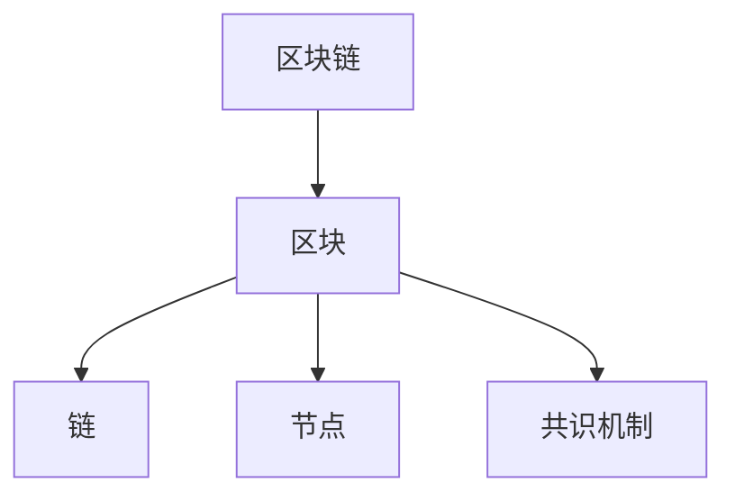

                 

# 格雷厄姆特价股票理论对行为经济学的Web3.0补充

> 关键词：格雷厄姆投资理论、行为经济学、Web3.0、区块链、DeFi、NFT

> 摘要：本文探讨了格雷厄姆特价股票理论在行为经济学领域的应用，并结合Web3.0技术，分析了如何通过区块链、智能合约和去中心化金融（DeFi）等手段，补充和扩展传统的价值投资策略。文章结合数学模型、实际案例和系统架构设计，深入分析了Web3.0环境下行为经济学的新趋势，为投资者提供了新的视角和工具。

---

## 第1章: 格雷厄姆特价股票理论概述

### 1.1 格雷厄姆投资理论的核心概念

#### 1.1.1 价值投资的定义与原则

价值投资是一种以企业内在价值为基础的投资策略，主张以低于内在价值的价格购买优质资产。格雷厄姆在他的著作《聪明的投资者》中提出，投资者应关注企业的基本面，而非市场的短期波动。其核心原则包括：

1. **安全边际**：买入价格低于估算的内在价值，以降低风险。
2. **长期视角**：关注企业的长期盈利能力，而非短期股价波动。
3. **分散投资**：通过多样化投资降低风险。

#### 1.1.2 特价股票的定义与特征

特价股票是指市场价格低于其内在价值的股票。其特征包括：

- **低市盈率（P/E）**：市盈率低于行业平均水平。
- **低市净率（P/B）**：市净率低于行业平均水平。
- **高股息率**：股息收益率较高。

#### 1.1.3 格雷厄姆投资策略的历史发展

格雷厄姆的投资策略起源于20世纪30年代，至今仍在全球范围内被广泛采用。其核心是通过基本面分析和安全边际原则，寻找被市场低估的股票。

---

### 1.2 格雷厄姆特价股票理论的数学模型

#### 1.2.1 价值评估的公式推导

格雷厄姆的内在价值计算方法基于现金流折现模型（DCF）。公式如下：

$$
\text{内在价值} = \frac{\text{预期现金流}}{折现率}
$$

#### 1.2.2 现金流折现模型（DCF）的详细讲解

DCF模型是评估企业内在价值的核心工具。其步骤包括：

1. **预测未来现金流**：基于企业的历史数据和行业趋势，预测未来5-10年的自由现金流。
2. **选择合适的折现率**：通常使用加权平均资本成本（WACC）。
3. **计算终值**：假设企业在稳定状态下现金流不再增长，终值为：

$$
\text{终值} = \text{最后一年现金流} \times \frac{1}{(1 + r)^n}
$$

4. **计算总价值**：将每年的现金流折现并累加，减去终值的现值。

#### 1.2.3 格雷厄姆安全边际的计算方法

安全边际是买入价格与内在价值之间的差距。公式为：

$$
\text{安全边际} = \text{内在价值} - \text{市场价格}
$$

---

## 第2章: 行为经济学基础

### 2.1 行为经济学的核心概念

#### 2.1.1 人类决策的偏差与错误

人类决策中常见的偏差包括：

1. **确认偏差**：倾向于寻找支持已有观点的信息。
2. **损失厌恶**：对损失的敏感度高于收益。
3. **从众心理**：跟随大多数人做出决策。

#### 2.1.2 传统金融模型的局限性

传统金融模型基于理性人假设，忽视了人类行为的复杂性。例如，有效市场假说（EMH）认为市场价格反映所有信息，但现实中市场经常出现非理性波动。

#### 2.1.3 行为经济学与投资决策的关系

行为经济学揭示了投资者的非理性行为如何影响市场定价和投资决策。例如，投资者在市场下跌时更倾向于卖出，导致抛售压力。

---

### 2.2 行为经济学与投资决策的数学模型

#### 2.2.1 基于 prospect theory 的决策权重函数

Kahneman和Tversky提出的风险权重函数为：

$$
w(p) = \begin{cases}
p & \text{如果 } p \geq 0.5 \\
\alpha (1 - p) & \text{如果 } p < 0.5
\end{cases}
$$

其中，$\alpha$是风险厌恶系数。

#### 2.2.2 有限理性与启发式决策的数学框架

启发式决策是一种简化决策过程的方法，例如：

- **代表性启发式**：基于样本与总体的相似性做出判断。
- **可用性启发式**：基于信息的可获得性做出判断。

#### 2.2.3 行为偏差对资产定价的影响

行为偏差可能导致资产价格偏离其内在价值。例如，过度交易和从众心理可能导致市场泡沫。

---

## 第3章: Web3.0技术基础

### 3.1 区块链技术的核心原理

#### 3.1.1 区块链的定义与技术架构

区块链是一种分布式账本技术，由区块、链、节点和共识机制组成。其技术架构如下：

#### 3.1.2 分布式账本的实现机制

分布式账本通过去中心化的方式记录交易，确保数据的安全性和不可篡改性。其主要实现机制包括：

- **共识机制**：如PoW（工作量证明）、PoS（权益证明）。
- **区块结构**：每个区块包含交易数据和哈希指针。

#### 3.1.3 智能合约的工作原理

智能合约是基于区块链的自动执行程序，其工作原理如下：

1. **编写合约**：使用Solidity等编程语言编写智能合约。
2. **部署合约**：将合约部署到区块链网络。
3. **触发执行**：当满足特定条件时，合约自动执行。

---

### 3.2 去中心化金融（DeFi）的概述

#### 3.2.1 DeFi的定义与主要特点

DeFi是基于区块链的去中心化金融系统，其主要特点包括：

- **去中心化**：无须依赖传统金融机构。
- **透明性**：所有交易记录在区块链上，可供公开查询。
- **可编程性**：通过智能合约实现自动化交易。

#### 3.2.2 去中心化交易所的运作模式

去中心化交易所（DEX）通过智能合约实现点对点交易，其运作模式如下：

1. **用户存入资金**：用户将资产存入智能合约。
2. **订单匹配**：智能合约自动匹配买卖订单。
3. **交易执行**：智能合约执行交易，并将资产转移至用户钱包。

#### 3.2.3 DeFi协议的安全性分析

DeFi协议的安全性依赖于智能合约的正确性和区块链网络的稳定性。常见的安全风险包括：

- **智能合约漏洞**：可能导致资金损失。
- **操作风险**：如闪电贷攻击。

---

## 第4章: 行为经济学与Web3.0的结合

### 4.1 Web3.0对行为经济学的影响

#### 4.1.1 区块链技术如何改变投资行为

区块链技术通过提供透明和不可篡改的记录，增强了投资者的信任，减少了信息不对称。

#### 4.1.2 DeFi中的行为偏差与投资决策

DeFi市场中的行为偏差与传统金融市场相似，但去中心化特性可能加剧某些偏差，如从众心理。

#### 4.1.3 NFT对投资心理的影响

NFT的稀缺性和独特性可能影响投资者的心理预期，从而影响市场定价。

---

### 4.2 Web3.0环境下的行为经济学模型

#### 4.2.1 基于区块链的激励机制

区块链技术可以通过代币激励机制，改变投资者的行为。例如，通过奖励机制鼓励长期投资。

#### 4.2.2 去中心化决策的数学模型

去中心化决策模型可以通过分布式系统实现，其数学模型如下：

$$
\text{集体决策} = \sum_{i=1}^{n} \text{个体决策}_i
$$

其中，$n$是参与决策的个体数量。

#### 4.2.3 NFT市场中的行为分析

NFT市场中的行为分析可以通过大数据技术，识别市场趋势和投资者心理。

---

## 第5章: Web3.0技术对格雷厄姆理论的补充

### 5.1 智能合约的应用

智能合约可以自动执行格雷厄姆的安全边际策略。例如，当股价低于内在价值时，智能合约自动执行买入指令。

### 5.2 分布式账本的优势

分布式账本可以实时更新企业的财务数据，帮助投资者更准确地评估内在价值。

### 5.3 NFT的潜力

NFT可以用于表示企业的部分股权，实现更加灵活的资产配置。

---

## 第6章: 实际案例分析

### 6.1 DeFi与格雷厄姆策略的结合

通过DeFi平台，投资者可以利用杠杆资金，以更低的价格买入优质资产。

### 6.2 NFT在投资组合中的应用

NFT可以作为多样化投资的一部分，降低整体风险。

---

## 第7章: 挑战与未来展望

### 7.1 技术挑战

- **可扩展性**：区块链的处理能力有限。
- **安全性**：智能合约可能存在漏洞。

### 7.2 行为经济学的未来研究方向

- **人工智能与行为经济学的结合**：通过AI技术分析投资者行为。
- **实时数据处理**：利用大数据技术实时分析市场趋势。

---

## 第8章: 总结与展望

### 8.1 总结

本文探讨了格雷厄姆特价股票理论在行为经济学领域的应用，并结合Web3.0技术，分析了如何通过区块链、智能合约和DeFi等手段，补充和扩展传统的价值投资策略。

### 8.2 最佳实践 tips

- **技术方面**：投资者应关注DeFi平台的安全性和智能合约的透明度。
- **行为方面**：投资者应克服心理偏差，坚持长期投资策略。

### 8.3 展望

未来，随着Web3.0技术的不断发展，行为经济学与投资策略的结合将更加紧密，为投资者提供更强大的工具和方法。

---

通过本文的分析，投资者可以更好地理解如何利用Web3.0技术提升投资决策的科学性和有效性。

