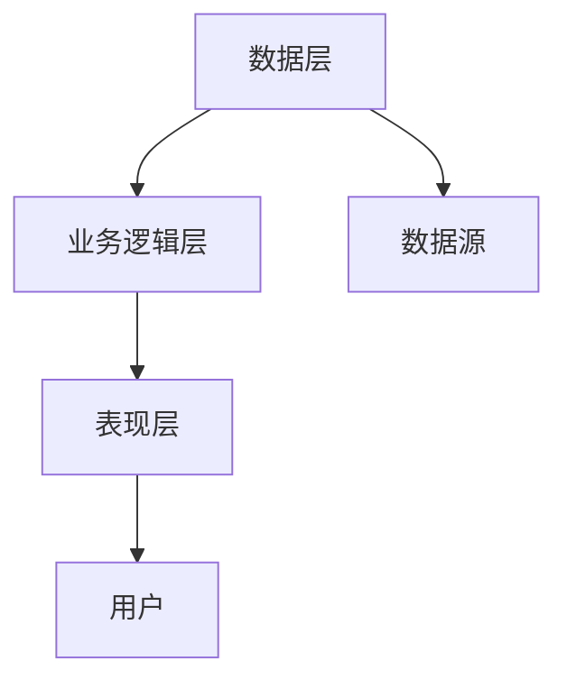
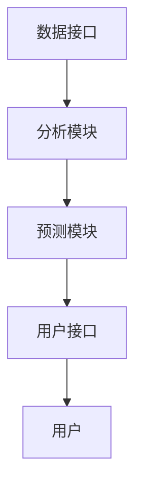
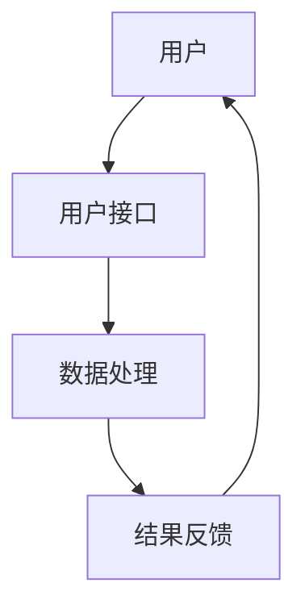

                 


# 格雷厄姆特价股票理论对行为经济学的Web4.0补充

## 关键词：格雷厄姆、行为经济学、Web4.0、投资策略、数字化工具

## 摘要：本文结合格雷厄姆的特价股票理论与行为经济学，探讨Web4.0时代下投资者行为的变化及其对投资策略的影响。通过分析投资者心理、数字化工具的应用以及Web4.0环境下金融信息传播的特点，提出行为经济学视角下的Web4.0投资策略，并基于此构建了一个智能化的投资决策支持系统。本文还探讨了系统设计的实现细节，包括系统功能设计、架构设计和交互设计，并通过实际案例分析展示了系统的应用价值。

---

## 第1章: 格雷厄姆特价股票理论与行为经济学的背景介绍

### 1.1 格雷厄姆投资理论概述

格雷厄姆是价值投资理论的奠基人，其核心理念是寻找市场价格低于其内在价值的股票进行投资。他强调安全边际的重要性，即买入价格与内在价值的差距越大，投资风险越小。格雷厄姆的理论为投资者提供了在市场恐慌时寻找廉价股票的方法，但在实际操作中，投资者的心理偏差和情绪波动可能会影响其判断。

#### 格雷厄姆投资理论的核心概念
- **价值投资**：买入股票的价格低于其内在价值。
- **安全边际**：买入价格与内在价值之间的差距。
- **特价股票**：市场价格远低于内在价值的股票。

### 1.2 行为经济学的基本原理

行为经济学研究人类决策中的认知偏差和情绪因素对经济行为的影响。传统经济学假设人类是理性的，但行为经济学指出，人类决策往往受到心理偏差的影响，导致非理性行为。

#### 行为经济学的核心观点
- **认知偏差**：人们在决策时会受到各种心理偏差的影响，如确认偏差、损失厌恶等。
- **社会性决策**：投资者的行为会受到周围环境和他人行为的影响。

### 1.3 Web4.0时代的投资环境

Web4.0时代强调智能化、个性化和去中心化的互联网，投资者可以通过数字化工具获取实时信息、分析数据并进行交易。

#### Web4.0对投资行为的影响
- **信息传播**：社交媒体和在线平台加速了信息的传播和扩散。
- **互动性**：投资者可以实时互动，获取反馈，影响市场情绪。
- **数据驱动决策**：大数据和人工智能技术为投资者提供了更精准的分析工具。

---

## 第2章: 格雷厄姆特价股票理论与行为经济学的联系

### 2.1 格雷厄姆理论中的行为经济学视角

格雷厄姆的理论虽然基于理性分析，但在实际应用中，投资者的心理偏差可能会影响其对价值的判断。

#### 行为偏差对价值投资策略的影响
- **过度自信**：投资者可能高估自己的分析能力，导致错误决策。
- **从众心理**：投资者可能因为市场情绪而跟随大多数人，忽略独立分析。

### 2.2 行为经济学对格雷厄姆理论的补充

行为经济学为格雷厄姆的理论提供了更全面的解释，尤其是在投资者心理和市场情绪方面。

#### 行为经济学对价值投资策略的完善
- **情绪周期**：投资者在市场波动中的情绪变化可以被建模和预测。
- **认知偏差的修正**：通过行为分析，投资者可以更好地识别和克服心理偏差。

---

## 第3章: Web4.0时代下行为经济学的应用

### 3.1 Web4.0与金融市场的互动

Web4.0时代，投资者的行为受到数字化工具和社交网络的影响。

#### 数字化工具对投资者行为的影响
- **实时数据分析**：投资者可以实时跟踪市场动态，做出快速决策。
- **社交网络**：投资者通过社交网络分享信息，影响市场情绪。

### 3.2 Web4.0时代下投资者行为的分析

在Web4.0环境下，投资者的行为表现出新的特征。

#### 数字化环境下投资者决策的特点
- **数据依赖性**：投资者依赖数据分析而非直觉。
- **互动性**：投资者与市场之间的互动更加频繁和即时。

---

## 第4章: 格雷厄姆特价股票理论的Web4.0补充

### 4.1 Web4.0时代下特价股票理论的新发展

数字化工具为格雷厄姆的理论提供了新的应用场景。

#### 数字化工具对价值评估的影响
- **大数据分析**：利用大数据技术更精准地评估股票价值。
- **人工智能辅助**：AI可以帮助识别市场中的特价股票。

### 4.2 行为经济学视角下的Web4.0投资策略

结合行为经济学和Web4.0技术，提出更有效的投资策略。

#### 行为经济学对Web4.0投资策略的指导
- **情绪预测**：通过分析社交媒体数据预测市场情绪。
- **个性化投资建议**：根据投资者的心理特征提供定制化建议。

---

## 第5章: 基于Web4.0的行为经济学投资决策支持系统

### 5.1 系统功能设计

系统功能包括数据采集、分析、预测和交互。

#### 系统功能模块
- **数据采集**：收集市场数据和社交媒体信息。
- **分析模块**：利用大数据和AI分析数据。
- **预测模块**：预测市场情绪和股票价值。
- **交互模块**：提供个性化投资建议。

### 5.2 系统架构设计

系统架构采用分层设计，包括数据层、业务逻辑层和表现层。

#### 系统架构图（Mermaid）


### 5.3 系统接口设计

系统接口包括数据接口和用户接口。

#### 系统接口图（Mermaid）


### 5.4 系统交互设计

系统交互流程包括用户请求、数据处理和结果反馈。

#### 系统交互流程图（Mermaid）


---

## 第6章: 项目实战

### 6.1 环境安装

需要安装Python、大数据分析工具和AI框架。

#### 安装命令
```bash
pip install numpy pandas scikit-learn
```

### 6.2 核心代码实现

以下是一个基于Python的情绪分析代码。

#### Python代码实现
```python
import pandas as pd
from sklearn.feature_extraction.text import TfidfVectorizer
from sklearn.naive_bayes import MultinomialNB

# 加载数据
data = pd.read_csv('market_comments.csv')

# 特征提取
vectorizer = TfidfVectorizer()
X = vectorizer.fit_transform(data['comment'])

# 模型训练
model = MultinomialNB()
model.fit(X, data['sentiment'])

# 预测
new_comment = "市场表现不佳，但公司基本面良好"
new_X = vectorizer.transform([new_comment])
prediction = model.predict(new_X)
print(prediction)
```

### 6.3 案例分析

通过分析社交媒体上的市场评论，预测市场情绪并辅助投资决策。

#### 案例分析
假设我们收集了某段时间内的市场评论数据，通过上述代码进行情绪分析，结果显示市场情绪偏向乐观，但部分投资者表现出过度自信。结合格雷厄姆的理论，我们可以识别出一些被低估的股票，作为投资标的。

---

## 第7章: 总结与展望

### 7.1 总结

本文结合格雷厄姆的特价股票理论与行为经济学，提出了Web4.0时代下的投资策略。通过数字化工具和行为分析，投资者可以更好地识别特价股票，克服心理偏差，做出更明智的投资决策。

### 7.2 展望

未来的研究可以进一步探索Web4.0时代下投资者行为的新特征，并开发更智能的投资决策支持系统。

---

## 最佳实践 Tips

- 在进行投资决策时，结合格雷厄姆的理论和行为经济学的分析，可以更全面地评估市场风险。
- 使用Web4.0工具进行数据收集和分析，能够提高投资决策的效率和准确性。
- 定期回顾投资策略，根据市场变化和投资者心理进行调整。

