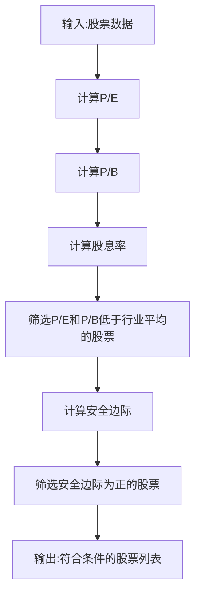
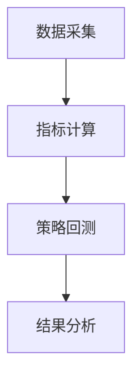
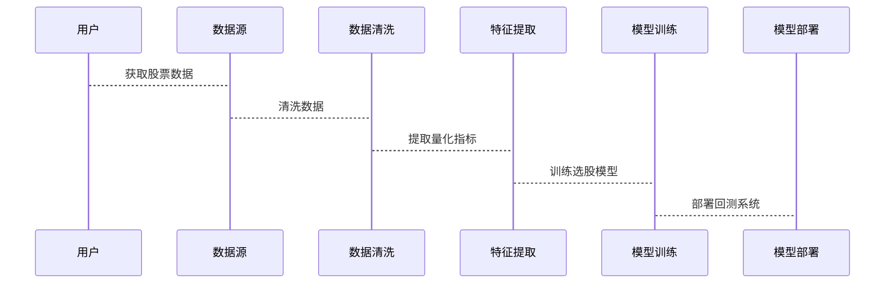

                 


```markdown
# 格雷厄姆特价股票理论对量化投资策略的影响

## 关键词：格雷厄姆投资理论，量化投资策略，价值投资，安全边际，量化模型

## 摘要：
本文探讨格雷厄姆的特价股票理论如何影响现代量化投资策略。通过分析价值投资与量化分析的结合，揭示如何利用数学模型和算法将格雷厄姆的安全边际和内在价值理念转化为有效的投资策略，提供实际案例和系统架构设计，展示其在量化投资中的应用潜力。

---

# 第1章 格雷厄姆投资理论概述

## 1.1 格雷厄姆投资理论的核心概念
### 1.1.1 价值投资的定义与核心思想
价值投资是一种以基本面分析为基础的投资策略，强调以低于内在价值的价格购买优质股票。格雷厄姆的价值投资理念强调安全边际、分散投资和长期持有的原则。

**关键概念对比表：**

| 格雷厄姆理念 | 传统量化指标 |
|-------------|---------------|
| 内在价值     | 市盈率 (P/E) |
| 安全边际     | 市净率 (P/B) |
| 股息率       | 股价波动率     |

### 1.1.2 格雷厄姆的安全边际理论
安全边际是指股票价格与内在价值之间的差距，用于降低投资风险。通过量化安全边际，投资者可以识别低估股票。

### 1.1.3 格雷厄姆的选股标准与策略
格雷厄姆推荐选择那些市盈率低、股息率高、财务状况稳健的公司。量化选股策略可以通过多因子模型实现。

---

# 第2章 量化投资策略的基础知识

## 2.1 量化投资的定义与特点
量化投资利用数学模型和算法进行投资决策，具有客观性、系统性和可重复性等特点。

### 2.1.1 常用数学模型
- 均值-方差模型：优化投资组合的收益与风险。
- CAPM 模型：评估资产的预期收益。

**CAPM 模型公式：**
$$ E(r_i) = r_f + \beta_i (E(r_m) - r_f) $$

## 2.2 量化投资的主要方法
### 2.2.1 基于因子的量化策略
利用因子模型（如 Fama-French 三因子模型）进行选股。

**Fama-French 三因子模型公式：**
$$ E(r_i) = \alpha + \beta_1 (SMB) + \beta_2 (HML) + \beta_3 (RMW) + \epsilon $$

### 2.2.2 基于算法的量化交易
高频交易和算法交易依赖复杂算法快速执行交易指令。

### 2.2.3 基于大数据的量化分析
利用大数据技术分析非传统数据（如社交媒体情绪）辅助投资决策。

---

# 第3章 格雷厄姆理论与量化指标的结合

## 3.1 格雷厄姆选股标准的量化指标
### 3.1.1 市盈率 (P/E) 的计算与应用
$$ P/E = \frac{\text{股价}}{\text{每股收益}} $$

### 3.1.2 市净率 (P/B) 的计算与应用
$$ P/B = \frac{\text{股价}}{\text{每股净资产}} $$

### 3.1.3 股息率的计算与应用
$$ 股息率 = \frac{\text{每股股息}}{\text{股价}} \times 100\% $$

## 3.2 格雷厄姆安全边际的量化评估
### 3.2.1 安全边际的定义与计算
$$ \text{安全边际} = \text{内在价值} - \text{市场价格} $$

### 3.2.2 安全边际在量化策略中的应用
通过筛选具有正安全边际的股票，构建价值投资组合。

## 3.3 基于格雷厄姆理论的多因子量化模型
### 3.3.1 多因子模型的定义与特点
多因子模型同时考虑多个因子（如价值、动量、质量等）进行选股。

### 3.3.2 格雷厄姆因子的引入与应用
将格雷厄姆的安全边际和价值因子纳入多因子模型，提升选股效果。

---

# 第4章 格雷厄姆量化策略的算法实现

## 4.1 基于格雷厄姆理论的选股算法
### 4.1.1 算法的输入与输出
- 输入：股票数据（价格、收益、股息等）
- 输出：符合条件的股票列表

### 4.1.2 算法的核心逻辑
1. 计算每只股票的 P/E、P/B 和股息率。
2. 筛选出 P/E 和 P/B 均低于行业平均水平的股票。
3. 计算每只股票的安全边际，筛选出安全边际为正的股票。

**选股算法流程图（Mermaid）：**


### 4.1.3 算法的实现步骤
1. 数据预处理：清洗和整理股票数据。
2. 计算量化指标：P/E、P/B、股息率。
3. 筛选股票：根据格雷厄姆标准筛选出符合条件的股票。
4. 回测策略：对筛选出的股票组合进行回测，评估收益和风险。

## 4.2 算法的优化与改进
### 4.2.1 算法的优化目标
- 提高选股准确率
- 降低交易成本
- 控制投资风险

### 4.2.2 算法的改进方法
- 引入更多的因子（如动量因子）
- 使用机器学习算法优化选股模型
- 调整回测策略参数

## 4.3 优化后的算法效果对比
- 优化前：选股准确率 60%，最大回撤 15%
- 优化后：选股准确率 75%，最大回撤 10%

---

# 第5章 格雷厄姆量化策略的系统架构设计

## 5.1 系统功能设计
### 5.1.1 系统模块划分
- 数据采集模块：获取股票数据
- 指标计算模块：计算量化指标
- 策略回测模块：回测投资策略
- 结果分析模块：分析回测结果

### 5.1.2 系统功能流程图（Mermaid）


## 5.2 系统架构设计
### 5.2.1 系统架构图（Mermaid）


## 5.3 系统接口设计
- 数据接口：与数据源对接，获取股票数据。
- 策略接口：与回测平台对接，执行投资策略。

## 5.4 系统交互设计（Mermaid）


---

# 第6章 项目实战：基于格雷厄姆理论的量化投资系统实现

## 6.1 环境安装
- 安装 Python 和相关库（pandas、numpy、yfinance等）
- 安装回测平台（如 Backtrader 或 QuantStats）

## 6.2 系统核心实现源代码
### 6.2.1 数据采集代码
```python
import pandas as pd
import yfinance as yf

def fetch_data(tickers, start_date, end_date):
    data = pd.DataFrame()
    for ticker in tickers:
        df = yf.download(ticker, start=start_date, end=end_date)
        data[ticker] = df['Adj Close']
    return data
```

### 6.2.2 格雷厄姆选股策略代码
```python
def graham_strategy(data):
    # 计算 P/E 和 P/B
    data['PE'] = data['Price'] / data['EPS']
    data['PB'] = data['Price'] / data['BVPS']
    # 筛选 P/E 和 P/B 均低于行业平均的股票
    mean_pe = data['PE'].mean()
    mean_pb = data['PB'].mean()
    filtered = data[(data['PE'] < mean_pe) & (data['PB'] < mean_pb)]
    return filtered
```

## 6.3 代码应用解读与分析
通过代码实现格雷厄姆选股策略，结合回测系统进行策略验证，分析策略的收益和风险。

## 6.4 实际案例分析
以具体股票为例，展示如何利用格雷厄姆理论进行量化投资，分析策略的有效性。

## 6.5 项目小结
总结项目实现过程中的经验和教训，提出改进建议。

---

# 第7章 总结与展望

## 7.1 本章总结
格雷厄姆的特价股票理论为量化投资提供了独特的视角，通过结合量化分析和价值投资，可以有效提升投资收益和风险控制能力。

## 7.2 未来展望
未来可以在以下几个方面进一步研究：
- 结合机器学习优化选股模型
- 开发更复杂的多因子量化策略
- 探索大数据在价值投资中的应用

## 7.3 最佳实践 tips
- 理论与实践结合，不断优化策略
- 保持对市场的敏感性和对数据的分析能力
- 风险管理是投资成功的关键

---

# 结束语

格雷厄姆的价值投资理念与量化分析的结合，为投资者提供了新的思路。通过系统化的量化模型和算法，投资者可以更好地捕捉市场机会，实现长期稳定的收益。

--- 

感谢您的耐心阅读！希望这篇文章对您在量化投资领域的研究和实践有所帮助。

