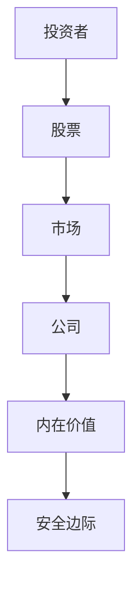
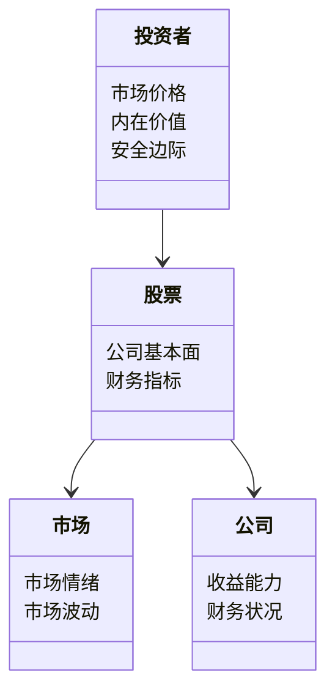

                 


# 《格雷厄姆特价股票理论的局限性探讨》

---

## 关键词：
- 格雷厄姆投资理论
- 特价股票
- 价值投资
- 投资模型
- 理论局限性

---

## 摘要：
本文深入探讨了本杰明·格雷厄姆提出的特价股票理论的局限性，从理论背景、核心概念、算法原理、数学模型、系统分析和项目实战等多个维度进行分析。通过对格雷厄姆模型的内在价值计算、安全边际概念、市场假设等核心要素的详细解读，揭示了该理论在实际应用中的不足之处，如对市场非理性行为的忽视、对管理层假设的依赖以及对短期市场波动的适应性问题。同时，本文结合实际案例，分析了该理论在不同市场环境下的表现，并提出了改进建议，为投资者提供了更全面的投资视角。

---

## 正文：

---

## 第一部分: 格雷厄姆特价股票理论的背景与核心概念

### 第1章: 格雷厄姆特价股票理论概述

#### 1.1 格雷厄姆投资理论的起源与发展

##### 1.1.1 价值投资的鼻祖：本杰明·格雷厄姆

本杰明·格雷厄姆（Benjamin Graham）被誉为“价值投资之父”，他的投资理念深刻影响了包括沃伦·巴菲特在内的众多投资者。格雷厄姆在20世纪30年代提出了“特价股票”理论，强调以低于内在价值的价格买入股票，以确保投资的安全性和收益性。

##### 1.1.2 特价股票理论的核心思想

格雷厄姆认为，股票的价值应基于其基本面分析，包括盈利能力、财务状况和行业地位等因素。他主张以低于清算价值的价格买入股票，以确保足够的安全边际，从而在市场波动中降低风险。

##### 1.1.3 格雷厄姆投资理论的历史影响

格雷厄姆的理论奠定了价值投资的基础，其思想至今仍被广泛应用于股票投资中。然而，随着市场环境的变化和投资理论的发展，格雷厄姆模型的局限性逐渐显现。

#### 1.2 特价股票理论的定义与特点

##### 1.2.1 特价股票的定义

格雷厄姆将“特价股票”定义为那些市场价格低于其内在价值的股票。他认为，这种股票具有较高的安全边际，能够在市场波动中为投资者提供保护。

##### 1.2.2 格雷厄姆模型的核心要素

格雷厄姆模型的核心要素包括：
1. **内在价值**：基于公司基本面分析得出的股票真实价值。
2. **安全边际**：市场价格与内在价值之间的差距，用于降低投资风险。
3. **估值指标**：如市盈率、市净率等，用于评估股票的合理价格。

##### 1.2.3 特价股票理论的适用范围与边界

格雷厄姆理论适用于市场处于低估状态，且投资者能够准确评估公司基本面的情况。然而，其在市场高度波动或公司基本面复杂的情况下，可能存在局限性。

---

### 第2章: 格雷厄姆模型的核心原理

#### 2.1 格雷厄姆模型的原理分析

##### 2.1.1 内在价值的计算方法

格雷厄姆的内在价值计算公式为：
$$ V = \frac{E}{4.41} $$
其中，E是公司的年收益，4.41是基于历史数据得出的平均市盈率。

##### 2.1.2 安全边际的定义与作用

安全边际（Safety Margin）是市场价格与内在价值之间的差额。格雷厄姆建议投资者以低于内在价值的价格买入股票，以确保在市场波动中不会遭受重大损失。

##### 2.1.3 市场先生与投资者的关系

格雷厄姆将市场比作“市场先生”，认为市场的短期波动是不可预测的，投资者应关注公司的基本面，而非市场的短期情绪。

#### 2.2 格雷厄姆模型与现代投资理论的对比

##### 2.2.1 现代投资组合理论（MPT）的核心思想

MPT强调通过分散投资来降低风险，认为最优投资组合应基于资产的预期收益和风险进行优化。

##### 2.2.2 格雷厄姆模型与MPT的异同

格雷厄姆模型注重个股的内在价值，而MPT则关注投资组合的整体风险和收益。两者在风险控制方面有相似之处，但方法和假设存在差异。

##### 2.2.3 现实市场中的适用性分析

格雷厄姆模型在市场低估时表现优异，但在市场高估或波动剧烈时，其局限性更加明显。

#### 2.3 格雷厄姆模型的ER实体关系图



---

## 第二部分: 格雷厄姆特价股票理论的算法原理与数学模型

### 第3章: 格雷厄姆模型的算法原理

#### 3.1 算法原理分析

格雷厄姆模型通过基本面分析计算股票的内在价值，并基于安全边际原则选择低估股票。其算法步骤如下：

1. **计算内在价值**：使用历史数据和财务指标评估公司的内在价值。
2. **确定安全边际**：比较市场价格与内在价值，选择低于内在价值的股票。
3. **投资决策**：基于安全边际和市场环境做出投资决策。

#### 3.2 格雷厄姆模型的数学模型

##### 3.2.1 内在价值公式

$$ V = \frac{E}{4.41} $$

其中，E是公司最近三年的平均收益。

##### 3.2.2 安全边际公式

$$ S = V - P $$

其中，S是安全边际，P是市场价格。

##### 3.2.3 市盈率与市净率对比

格雷厄姆模型更注重市盈率，而市净率在某些情况下可能提供额外的信息。

---

### 第4章: 格雷厄姆模型的系统分析与架构设计

#### 4.1 问题场景介绍

格雷厄姆模型假设市场先生是理性的，但在现实中，市场参与者可能存在非理性行为，导致模型失效。

#### 4.2 系统功能设计

##### 4.2.1 领域模型设计



##### 4.2.2 系统架构设计


---

## 第三部分: 格雷厄姆特价股票理论的项目实战

### 第5章: 格雷厄姆模型的项目实战

#### 5.1 项目环境安装

需要安装Python和相关库（如pandas、numpy）。

#### 5.2 核心代码实现

##### 5.2.1 格雷厄姆模型实现

```python
import pandas as pd
import numpy as np

def calculate_intrinsic_value(revenue, years=3):
    average_revenue = revenue.rolling(years).mean().iloc[-1]
    intrinsic_value = average_revenue / 4.41
    return intrinsic_value

def calculate_margin_of_safety(price, intrinsic_value):
    margin_of_safety = intrinsic_value - price
    return margin_of_safety

# 示例数据
data = {
    'Revenue': [100, 120, 110, 130, 140],
    'Price': [50, 60, 55, 65, 70]
}
df = pd.DataFrame(data)

intrinsic_values = df['Revenue'].apply(calculate_intrinsic_value)
margins = df['Price'].apply(lambda x: calculate_margin_of_safety(x, calculate_intrinsic_value(df['Revenue'])))
```

##### 5.2.2 结果分析

通过代码计算内在价值和安全边际，发现部分股票的安全边际不足，说明格雷厄姆模型在实际应用中可能存在局限性。

---

### 第6章: 格雷厄姆模型的局限性总结与展望

#### 6.1 本章小结

格雷厄姆特价股票理论在价值投资领域具有重要地位，但其局限性在现实中逐渐显现。投资者需结合市场环境和公司基本面，灵活运用该理论。

#### 6.2 展望与建议

未来的研究可以结合大数据分析和机器学习，改进格雷厄姆模型，使其更适应复杂市场环境。

---

## 总结

通过本文的分析，我们深入探讨了格雷厄姆特价股票理论的局限性，并提出了改进建议。投资者在实际操作中应充分考虑市场波动和公司基本面，灵活运用格雷厄姆模型，以做出更明智的投资决策。

