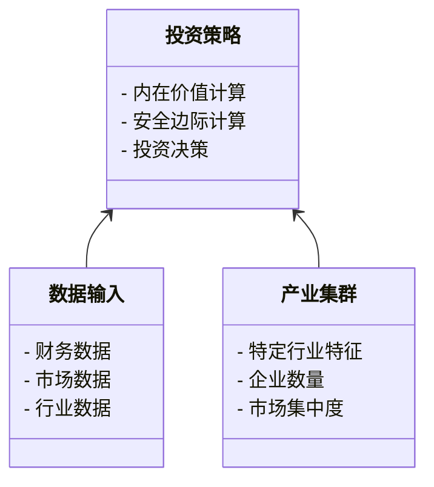
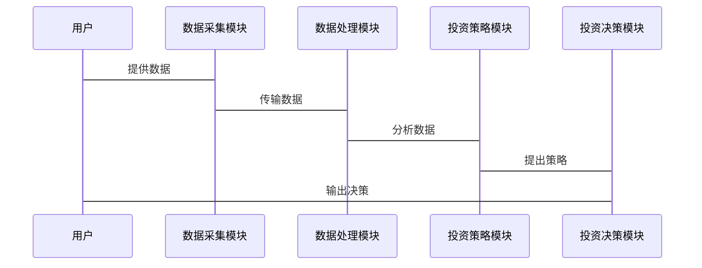

                 


# 格雷厄姆特价股票策略在不同产业集群中的效果比较

## 关键词：格雷厄姆策略，产业集群，投资策略，价值投资，安全边际，内在价值

## 摘要：本文详细分析了格雷厄姆特价股票策略在不同产业集群中的应用效果，并通过数学模型和实际案例对比，探讨了该策略在制造业、服务业和高科技产业集群中的优劣。通过系统分析和项目实战，总结了策略的有效性和改进方向，为投资者提供了实用的建议。

---

## 第一部分: 格雷厄姆特价股票策略概述

### 第1章: 格雷厄姆特价股票策略的核心概念

#### 1.1 格雷厄姆特价股票策略的背景介绍

##### 1.1.1 价值投资的起源与发展
- 格雷厄姆是价值投资之父，其策略强调寻找市场价格低于内在价值的股票。
- 价值投资的核心是关注企业的基本面，而非市场波动。

##### 1.1.2 格雷厄姆投资理念的核心思想
- 安全边际：购买价格远低于内在价值，以降低风险。
- 内在价值：基于企业未来现金流的折现值，评估其真实价值。
- 投资者应以冷静和理性的态度应对市场波动。

##### 1.1.3 特价股票的定义与特征
- 特价股票：市场价格显著低于内在价值的股票。
- 特征：低估值、高安全边际、潜在回报高。

#### 1.2 格雷厄姆特价股票策略的理论基础

##### 1.2.1 安全边际的概念与计算
- 安全边际 = （内在价值估计 - 市场价格）/ 市场价格。
- 例如：某股票内在价值为10元，市场价格为8元，安全边际为25%。

##### 1.2.2 内在价值的评估方法
- 基于现金流折现法（DCF）计算。
- 公式：V = E / (1 + r)，其中E为未来现金流，r为折现率。

##### 1.2.3 市场先生与投资者心理
- 格雷厄姆将市场波动比作“市场先生”，提醒投资者避免被市场情绪左右。

#### 1.3 产业集群的定义与分类

##### 1.3.1 产业集群的基本概念
- 产业集群：同一地理区域中，多个企业集中于同一行业或相关行业的现象。
- 特征：专业化分工、协同效应、资源共享。

##### 1.3.2 不同产业集群的特征对比
- 制造业产业集群：依赖生产效率，受成本影响大。
- 服务业产业集群：依赖服务质量，受客户需求影响大。
- 高科技产业集群：依赖技术创新，受研发能力影响大。

##### 1.3.3 产业集群对投资策略的影响
- 制造业：关注成本控制和生产效率。
- 服务业：关注客户满意度和品牌价值。
- 高科技：关注技术壁垒和创新能力。

---

## 第二部分: 格雷厄姆特价股票策略的核心原理与数学模型

### 第2章: 格雷厄姆策略的核心原理

#### 2.1 格雷厄姆策略的核心原理

##### 2.1.1 内在价值评估
- 格雷厄姆认为，股票的内在价值是其未来现金流的现值。
- 计算公式：V = E / (1 + r)，其中E为预期现金流，r为折现率。

##### 2.1.2 安全边际的重要性
- 通过计算安全边际，投资者可以确定股票的买入价格是否合理。
- 例如：某股票内在价值为20元，市场价格为15元，安全边际为33.3%。

##### 2.1.3 市场价格与内在价值的对比
- 当市场价格远低于内在价值时，股票具有投资价值。
- 格雷厄姆建议的安全边际至少为50%。

#### 2.2 格雷厄姆策略的数学模型

##### 2.2.1 内在价值计算模型
$$ V = \frac{E}{1 + r} $$
其中，V为内在价值，E为未来现金流，r为折现率。

##### 2.2.2 安全边际计算模型
$$ \text{安全边际} = \frac{V_{\text{估计}} - P}{P} $$
其中，$V_{\text{估计}}$为内在价值估计值，P为市场价格。

---

## 第三部分: 格雷厄姆策略在不同产业集群中的比较分析

### 第3章: 格雷厄姆策略在制造业产业集群中的应用

#### 3.1 制造业产业集群的特点
- 制造业产业集群通常具有较高的生产效率和成本控制能力。
- 例如：汽车制造业产业集群可能集中在德国的斯图加特或中国的佛山。

#### 3.2 制造业产业集群中的投资策略
- 重点关注企业的生产效率和成本控制能力。
- 例如：计算企业的EBIT（息税前利润）与销售额的比例，评估其盈利能力。

#### 3.3 实际案例分析
- 某汽车制造企业，内在价值计算为30元，市场价格为20元，安全边际为33.3%。

### 第4章: 格雷厄姆策略在服务业产业集群中的应用

#### 4.1 服务业产业集群的特点
- 服务业产业集群通常依赖服务质量、客户满意度和品牌价值。
- 例如：金融服务产业集群可能集中在纽约或伦敦。

#### 4.2 服务业产业集群中的投资策略
- 重点关注企业的客户满意度和品牌价值。
- 例如：计算企业的客户留存率和品牌价值，评估其未来的盈利能力。

#### 4.3 实际案例分析
- 某银行，内在价值计算为40元，市场价格为30元，安全边际为25%。

### 第5章: 格雷厄姆策略在高科技产业集群中的应用

#### 5.1 高科技产业集群的特点
- 高科技产业集群通常依赖技术创新和研发能力。
- 例如：硅谷的高科技产业集群。

#### 5.2 高科技产业集群中的投资策略
- 重点关注企业的研发能力和技术壁垒。
- 例如：计算企业的研发支出占收入的比例，评估其技术创新能力。

#### 5.3 实际案例分析
- 某科技公司，内在价值计算为50元，市场价格为30元，安全边际为40%。

---

## 第四部分: 格雷厄姆策略在不同产业集群中的系统分析与架构设计

### 第6章: 系统分析与架构设计方案

#### 6.1 系统功能设计（领域模型Mermaid类图）


#### 6.2 系统架构设计（Mermaid架构图）


#### 6.3 系统接口设计
- 数据输入接口：接收财务数据、市场数据和行业数据。
- 投资策略接口：计算内在价值和安全边际，输出投资建议。
- 投资决策接口：根据策略结果，生成最终的投资决策。

#### 6.4 系统交互设计（Mermaid序列图）


---

## 第五部分: 项目实战与最佳实践

### 第7章: 项目实战

#### 7.1 环境安装
- 需要安装Python和相关库（如Pandas、NumPy）。
- 代码示例：
  ```python
  import pandas as pd
  def calculate_intrinsic_value(enterprise_value, discount_rate):
      return enterprise_value / (1 + discount_rate)
  ```

#### 7.2 核心代码实现
- 计算内在价值和安全边际的Python代码：
  ```python
  def calculate_margin(intrinsic_value, market_price):
      return (intrinsic_value - market_price) / market_price * 100
  ```

#### 7.3 实际案例分析
- 以某高科技企业为例，计算其内在价值和安全边际，评估其投资价值。

#### 7.4 项目总结
- 成功经验：通过安全边际和内在价值评估，成功筛选出具有投资价值的股票。
- 失败教训：忽视市场波动和行业风险，可能导致投资失败。

### 第8章: 最佳实践与小结

#### 8.1 投资建议
- 长期持有，避免频繁交易。
- 分散投资，降低风险。
- 定期复盘，调整策略。

#### 8.2 注意事项
- 注意市场波动，避免被市场情绪左右。
- 关注行业动态，及时调整投资策略。

#### 8.3 拓展阅读
- 推荐阅读格雷厄姆的《 Intelligent Investor》。

---

## 第六部分: 结语

通过本文的分析，我们可以看出格雷厄姆特价股票策略在不同产业集群中的应用具有显著的效果，但也需要根据具体情况灵活调整。希望本文能为投资者提供有益的参考和启示。

